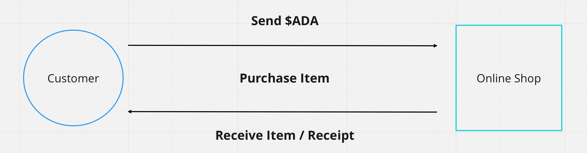
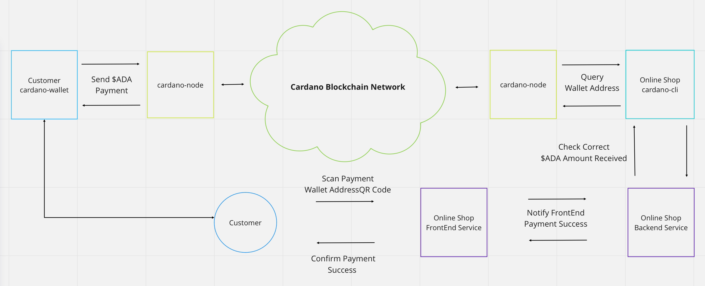

---
id: listening-for-payments-cli
title: Listening for ada payments using cardano-cli
sidebar_label: Receiving payments (cardano-cli)
description: How to listen for ada Payments with the cardano-cli.
image: ./img/og-developer-portal.png
--- 
import Tabs from '@theme/Tabs';
import TabItem from '@theme/TabItem';

## Overview

:::note
This guide assumes that you have basic understanding of `cardano-cli`, how to use it and that you have installed it into your system. Otherwise we recommend reading [Installing cardano-node](/docs/get-started/installing-cardano-node), [Running cardano-node](/docs/get-started/running-cardano) and [Exploring Cardano Wallets](/docs/integrate-cardano/creating-wallet-faucet) guides first.

This guide also assumes that you have `cardano-node` running in the background and connected to the `testnet` network.
:::

## Use case

There are many possible reasons why you would want to have the functionality of listening for `ada` payments, but a very obvious use case would be for something like an **online shop** or a **payment gateway** that uses `ada` tokens as the currency.



## Technical flow

To understand how something like this could work in a technical point of view, let's take a look at the following diagram:



So let's imagine a very basic scenario where a **customer** is browsing an online shop. Once the user has choosen and added all the items into the **shopping cart**. The next step would then be to checkout and pay for the items, Of course we will be using **Cardano** for that!

The **front-end** application would then request for a **wallet address** from the backend service and render a QR code to the **customer** to be scanned via a **Cardano wallet**. The backend service would then know that it has to query the **wallet address** using `cardano-cli` with a certain time interval to confirm and alert the **front-end** application that the payment has completed succesfully.

In the meantime the transaction is then being processed and settled within the **Cardano** network. We can see in the diagram above that both parties are ultimately connected to the network via the `cardano-node` software component.

## Time to code

Now let's get our hands dirty and see how we can implement something like this in actual code.

:::note
In this section, We will use the path `$HOME/receive-ada-sample` to store all the related files as an example, please replace it with the directory you have choosen to store the files.
All the code examples in this article assumes that you will save all the source-code-files under the root of this directory.
:::

### Generate keys and request tAda

First, lets create a directory to store our sample project:

```bash
mkdir -p $HOME/receive-ada-sample/keys
```

Next, we generate our **payment key-pair** using `cardano-cli`:

```bash
cardano-cli address key-gen \
--verification-key-file $HOME/receive-ada-sample/keys/payment.vkey \
--signing-key-file $HOME/receive-ada-sample/keys/payment.skey
```

Since we now have our **payment key-pair**, the next step would be to generate a **wallet address** for the `testnet` network like so:

```bash
cardano-cli address build \
--payment-verification-key-file $HOME/receive-ada-sample/keys/payment.vkey \
--out-file $HOME/receive-ada-sample/keys/payment.addr \
--testnet-magic 1097911063
```

Your directory structure should now look like this:

```bash
$HOME/receive-ada-sample/receive-ada-sample
└── keys
    ├── payment.addr
    ├── payment.skey
    └── payment.vkey
```

Now using your **programming language** of choice we create our first few lines of code!

### Initial variables

First we will set the initial variables that we will be using as explained below:

<Tabs
  defaultValue="js"
  groupId="language"
  values={[
    {label: 'JavaScript', value: 'js'},
    {label: 'Typescript', value: 'ts'},
    {label: 'Python', value: 'py'},
    {label: 'C#', value: 'cs'}
  ]}>

  <TabItem value="js">

```js title="checkPayment.js"
import * as fs from 'fs';
// Please add this dependency using npm install node-cmd
import cmd from 'node-cmd';

// Path to the cardano-cli binary or use the global one
const CARDANO_CLI_PATH = "cardano-cli";
// The `testnet` identifier number
const CARDANO_NETWORK_MAGIC = 1097911063;
// The directory where we store our payment keys
// assuming our current directory context is $HOME/receive-ada-sample
const CARDANO_KEYS_DIR = "keys";
// The total payment we expect in lovelace unit
const TOTAL_EXPECTED_LOVELACE = 1000000;
```

  </TabItem>
  <TabItem value="ts">

```ts title="checkPayment.ts"
import * as fs from 'fs';
// Please add this dependency using npm install node-cmd but there is no @type definition for it
const cmd: any = require('node-cmd');

// Path to the cardano-cli binary or use the global one
const CARDANO_CLI_PATH: string = "cardano-cli";
// The `testnet` identifier number
const CARDANO_NETWORK_MAGIC: number = 1097911063;
// The directory where we store our payment keys
// assuming our current directory context is $HOME/receive-ada-sample/receive-ada-sample
const CARDANO_KEYS_DIR: string = "keys";
// The total payment we expect in lovelace unit
const TOTAL_EXPECTED_LOVELACE: number = 1000000;
```

  </TabItem>
  <TabItem value="py">

```python title="checkPayment.py"
import os
import subprocess

# Path to the cardano-cli binary or use the global one
CARDANO_CLI_PATH = "cardano-cli"
# The `testnet` identifier number
CARDANO_NETWORK_MAGIC = 1097911063
# The directory where we store our payment keys
# assuming our current directory context is $HOME/receive-ada-sample
CARDANO_KEYS_DIR = "keys"
# The total payment we expect in lovelace unit
TOTAL_EXPECTED_LOVELACE = 1000000
```

  </TabItem>
  <TabItem value="cs">

```csharp title="Program.cs"
using System.Linq;
using SimpleExec; // `dotnet add package SimpleExec --version 7.0.0`

// Path to the cardano-cli binary or use the global one
const string CARDANO_CLI_PATH = "cardano-cli";
// The `testnet` identifier number
const int CARDANO_NETWORK_MAGIC = 1097911063;
// The directory where we store our payment keys
// assuming our current directory context is $HOME/user/receive-ada-sample
const string CARDANO_KEYS_DIR = "keys";
// The total payment we expect in lovelace unit
const long TOTAL_EXPECTED_LOVELACE = 1000000;
```

  </TabItem>
</Tabs>

### Read wallet address value

Next, we get the string value of the **wallet address** from the `payment.addr` file that we generated awhile ago. Add the following lines to your code:

<Tabs
  defaultValue="js"
  groupId="language"
  values={[
    {label: 'JavaScript', value: 'js'},
    {label: 'Typescript', value: 'ts'},
    {label: 'Python', value: 'py'},
    {label: 'C#', value: 'cs'}
  ]}>

  <TabItem value="js">

```js title="checkPayment.js"
// Read wallet address value from payment.addr file
const walletAddress = fs.readFileSync(`${CARDANO_KEYS_DIR}/payment.addr`).toString();
```

  </TabItem>
  <TabItem value="ts">

```ts title="checkPayment.ts"
// Read wallet address string value from payment.addr file
const walletAddress: string = fs.readFileSync(`${CARDANO_KEYS_DIR}/payment.addr`).toString();
```

  </TabItem>
  <TabItem value="py">

```python title="checkPayment.py"
# Read wallet address value from payment.addr file
with open(os.path.join(CARDANO_KEYS_DIR, "payment.addr"), 'r') as file:
    walletAddress = file.read()
```

  </TabItem>
  <TabItem value="cs">

```csharp title="Program.cs"
// Read wallet address value from payment.addr file
var walletAddress = await System.IO.File.ReadAllTextAsync($"{CARDANO_KEYS_DIR}/payment1.addr");
```

  </TabItem>
</Tabs>

### Query UTxO

Then we execute `cardano-cli` programatically and telling it to query the **UTxO** for the **wallet address** that we have generated with our keys and save the `stdout` result to our `rawUtxoTable` variable.

<Tabs
  defaultValue="js"
  groupId="language"
  values={[
    {label: 'JavaScript', value: 'js'},
    {label: 'Typescript', value: 'ts'},
    {label: 'Python', value: 'py'},
    {label: 'C#', value: 'cs'}
  ]}>

  <TabItem value="js">

```js title="checkPayment.js"
// We use the node-cmd npm library to execute shell commands and read the output data
const rawUtxoTable = cmd.runSync([
    CARDANO_CLI_PATH,
    "query", "utxo",
    "--testnet-magic", CARDANO_NETWORK_MAGIC,
    "--address", walletAddress
].join(" "));
```

  </TabItem>
  <TabItem value="ts">

```ts title="checkPayment.ts"
// We use the node-cmd npm library to execute shell commands and read the output data
const rawUtxoTable: any = cmd.runSync([
    CARDANO_CLI_PATH,
    "query", "utxo",
    "--testnet-magic", CARDANO_NETWORK_MAGIC,
    "--address", walletAddress
].join(" "));
```

  </TabItem>
  <TabItem value="py">

```python title="checkPayment.py"
# We tell python to execute cardano-cli shell command to query the UTXO and read the output data
rawUtxoTable = subprocess.check_output([
    CARDANO_CLI_PATH,
    'query', 'utxo',
    '--testnet-magic', str(CARDANO_NETWORK_MAGIC),
    '--address', walletAddress])
```

  </TabItem>
  <TabItem value="cs">

```csharp title="Program.cs"
// We use the SimpleExec dotnet library to execute shell commands and read the output data
var rawUtxoTable = await Command.ReadAsync(CARDANO_CLI_PATH, string.Join(" ",
    "query", "utxo",
    "--testnet-magic", CARDANO_NETWORK_MAGIC,
    "--address", walletAddress
), noEcho: true);
```

  </TabItem>
</Tabs>

### Process UTxO table

Once we have access to the **UTXO** table string, we will then parse it and compute the total lovelace that the wallet currently has.

<Tabs
  defaultValue="js"
  groupId="language"
  values={[
    {label: 'JavaScript', value: 'js'},
    {label: 'Typescript', value: 'ts'},
    {label: 'Python', value: 'py'},
    {label: 'C#', value: 'cs'}
  ]}>

  <TabItem value="js">

```js title="checkPayment.js"
// Calculate total lovelace of the UTXO(s) inside the wallet address
const utxoTableRows = rawUtxoTable.data.trim().split('\n');
let totalLovelaceRecv = 0;
let isPaymentComplete = false;

for (let x = 2; x < utxoTableRows.length; x++) {
    const cells = utxoTableRows[x].split(" ").filter(i => i);
    totalLovelaceRecv += parseInt(cells[2]);
}
```

  </TabItem>
  <TabItem value="ts">

```ts title="checkPayment.ts"
// Calculate total lovelace of the UTXO(s) inside the wallet address
const utxoTableRows: string[] = rawUtxoTable.data.trim().split('\n');
let totalLovelaceRecv: number = 0;
let isPaymentComplete: boolean = false;

for (let x = 2; x < utxoTableRows.length; x++) {
    const cells = utxoTableRows[x].split(" ").filter((i: string) => i);
    totalLovelaceRecv += parseInt(cells[2]);
}
```

  </TabItem>
  <TabItem value="py">

```python title="checkPayment.py"
# Calculate total lovelace of the UTXO(s) inside the wallet address
utxoTableRows = rawUtxoTable.strip().splitlines()
totalLovelaceRecv = 0
isPaymentComplete = False

for x in range(2, len(utxoTableRows)):
    cells = utxoTableRows[x].split()
    totalLovelaceRecv +=  int(cells[2])
```

  </TabItem>
  <TabItem value="cs">

```csharp title="Program.cs"
// Calculate total lovelace of the UTXO(s) inside the wallet address
var utxoTableRows = rawUtxoTable.Trim().Split("\n");
var totalLovelaceRecv = 0L;
var isPaymentComplete = false;

foreach(var row in utxoTableRows.Skip(2)){
    var cells = row.Split(" ").Where(c => c.Trim() != string.Empty);
    totalLovelaceRecv +=  long.Parse(cells.ElementAt(2));
}
```

  </TabItem>
</Tabs>

### Determine if payment is succesful

Once we have the total lovelace amount, we will then determine using our code if a specific payment is a success, ultimately sending or shipping the item if it is indeed succesful. In our example, we expect that the payment is equal to `1,000,000 lovelace` that we defined in our `TOTAL_EXPECTED_LOVELACE` constant variable.

<Tabs
  defaultValue="js"
  groupId="language"
  values={[
    {label: 'JavaScript', value: 'js'},
    {label: 'Typescript', value: 'ts'},
    {label: 'Python', value: 'py'},
    {label: 'C#', value: 'cs'}
  ]}>

  <TabItem value="js">

```js title="checkPayment.js"
// Determine if the total lovelace received is more than or equal to
// the total expected lovelace and displaying the results.
isPaymentComplete = totalLovelaceRecv >= TOTAL_EXPECTED_LOVELACE;

console.log(`Total Received: ${totalLovelaceRecv} LOVELACE`);
console.log(`Expected Payment: ${TOTAL_EXPECTED_LOVELACE} LOVELACE`);
console.log(`Payment Complete: ${(isPaymentComplete ? "✅" : "❌")}`);
```

  </TabItem>
  <TabItem value="ts">

```ts title="checkPayment.ts"
// Determine if the total lovelace received is more than or equal to
// the total expected lovelace and displaying the results.
isPaymentComplete = totalLovelaceRecv >= TOTAL_EXPECTED_LOVELACE;

console.log(`Total Received: ${totalLovelaceRecv} LOVELACE`);
console.log(`Expected Payment: ${TOTAL_EXPECTED_LOVELACE} LOVELACE`);
console.log(`Payment Complete: ${(isPaymentComplete ? "✅" : "❌")}`);
```

  </TabItem>
  <TabItem value="py">

```python title="checkPayment.py"
# Determine if the total lovelace received is more than or equal to
# the total expected lovelace and displaying the results.
isPaymentComplete = totalLovelaceRecv >= TOTAL_EXPECTED_LOVELACE

print("Total Received: %s LOVELACE" % totalLovelaceRecv)
print("Expected Payment: %s LOVELACE" % TOTAL_EXPECTED_LOVELACE)
print("Payment Complete: %s" % {True: "✅", False: "❌"} [isPaymentComplete])
```

  </TabItem>
  <TabItem value="cs">

```csharp title="Program.cs"
// Determine if the total lovelace received is more than or equal to
// the total expected lovelace and displaying the results.
isPaymentComplete = totalLovelaceRecv >= TOTAL_EXPECTED_LOVELACE;

System.Console.WriteLine($"Total Received: {totalLovelaceRecv} LOVELACE");
System.Console.WriteLine($"Expected Payment: {TOTAL_EXPECTED_LOVELACE} LOVELACE");
System.Console.WriteLine($"Payment Complete: {(isPaymentComplete ? "✅":"❌")}");
```

  </TabItem>
</Tabs>

## Running and testing

Our final code should look something like this:

<Tabs
  defaultValue="js"
  groupId="language"
  values={[
    {label: 'JavaScript', value: 'js'},
    {label: 'Typescript', value: 'ts'},
    {label: 'Python', value: 'py'},
    {label: 'C#', value: 'cs'}
  ]}>
  <TabItem value="js">

```js title="checkPayment.js"
import * as fs from 'fs';
// Please add this dependency using npm install node-cmd
import cmd from 'node-cmd';

// Path to the cardano-cli binary or use the global one
const CARDANO_CLI_PATH = "cardano-cli";
// The `testnet` identifier number
const CARDANO_NETWORK_MAGIC = 1097911063;
// The directory where we store our payment keys
// assuming our current directory context is $HOME/receive-ada-sample/receive-ada-sample
const CARDANO_KEYS_DIR = "keys";
// The imaginary total payment we expect in lovelace unit
const TOTAL_EXPECTED_LOVELACE = 1000000;

// Read wallet address string value from payment.addr file
const walletAddress = fs.readFileSync(`${CARDANO_KEYS_DIR}/payment.addr`).toString();

// We use the node-cmd npm library to execute shell commands and read the output data
const rawUtxoTable = cmd.runSync([
    CARDANO_CLI_PATH,
    "query", "utxo",
    "--testnet-magic", CARDANO_NETWORK_MAGIC,
    "--address", walletAddress
].join(" "));

// Calculate total lovelace of the UTXO(s) inside the wallet address
const utxoTableRows = rawUtxoTable.data.trim().split('\n');
let totalLovelaceRecv = 0;
let isPaymentComplete = false;

for(let x = 2; x < utxoTableRows.length; x++) {
    const cells = utxoTableRows[x].split(" ").filter(i => i);
    totalLovelaceRecv += parseInt(cells[2]);
}

// Determine if the total lovelace received is more than or equal to
// the total expected lovelace and displaying the results.
isPaymentComplete = totalLovelaceRecv >= TOTAL_EXPECTED_LOVELACE;

console.log(`Total Received: ${totalLovelaceRecv} LOVELACE`);
console.log(`Expected Payment: ${TOTAL_EXPECTED_LOVELACE} LOVELACE`);
console.log(`Payment Complete: ${(isPaymentComplete ? "✅" : "❌")}`);
```

  </TabItem>
  <TabItem value="ts">

```ts title="checkPayment.ts"
import * as fs from 'fs';
// Please add this dependency using npm install node-cmd but there is no @type definition for it
const cmd: any = require('node-cmd');

// Path to the cardano-cli binary or use the global one
const CARDANO_CLI_PATH: string = "cardano-cli";
// The `testnet` identifier number
const CARDANO_NETWORK_MAGIC: number = 1097911063;
// The directory where we store our payment keys
// assuming our current directory context is $HOME/receive-ada-sample/receive-ada-sample
const CARDANO_KEYS_DIR: string = "keys";
// The imaginary total payment we expect in lovelace unit
const TOTAL_EXPECTED_LOVELACE: number = 1000000;

// Read wallet address string value from payment.addr file
const walletAddress: string = fs.readFileSync(`${CARDANO_KEYS_DIR}/payment.addr`).toString();

// We use the node-cmd npm library to execute shell commands and read the output data
const rawUtxoTable: any = cmd.runSync([
    CARDANO_CLI_PATH,
    "query", "utxo",
    "--testnet-magic", CARDANO_NETWORK_MAGIC,
    "--address", walletAddress
].join(" "));

// Calculate total lovelace of the UTXO(s) inside the wallet address
const utxoTableRows: string[] = rawUtxoTable.data.trim().split('\n');
let totalLovelaceRecv: number = 0;
let isPaymentComplete: boolean = false;

for (let x = 2; x < utxoTableRows.length; x++) {
    const cells = utxoTableRows[x].split(" ").filter((i: string) => i);
    totalLovelaceRecv += parseInt(cells[2]);
}

// Determine if the total lovelace received is more than or equal to
// the total expected lovelace and displaying the results.
isPaymentComplete = totalLovelaceRecv >= TOTAL_EXPECTED_LOVELACE;

console.log(`Total Received: ${totalLovelaceRecv} LOVELACE`);
console.log(`Expected Payment: ${TOTAL_EXPECTED_LOVELACE} LOVELACE`);
console.log(`Payment Complete: ${(isPaymentComplete ? "✅" : "❌")}`);
```

  </TabItem>
  <TabItem value="cs">

```csharp title="Program.cs"
using System;
using System.IO;
using System.Linq;

// Install using command `dotnet add package SimpleExec --version 7.0.0`
using SimpleExec;

// Path to the cardano-cli binary or use the global one
const string CARDANO_CLI_PATH = "cardano-cli";
// The `testnet` identifier number
const int CARDANO_NETWORK_MAGIC = 1097911063;
// The directory where we store our payment keys
// assuming our current directory context is $HOME/receive-ada-sample
const string CARDANO_KEYS_DIR = "keys";
// The total payment we expect in lovelace unit
const long TOTAL_EXPECTED_LOVELACE = 1000000;

// Read wallet address string value from payment.addr file
var walletAddress = await File.ReadAllTextAsync(Path.Combine(CARDANO_KEYS_DIR, "payment.addr"));

// We use the SimpleExec library to execute cardano-cli shell command to query the wallet UTXO and read the output data
var rawUtxoTable = await Command.ReadAsync(CARDANO_CLI_PATH, string.Join(" ",
    "query", "utxo",
    "--testnet-magic", CARDANO_NETWORK_MAGIC,
    "--address", walletAddress
), noEcho: true);

// Calculate total lovelace of the UTXO(s) inside the wallet address
var utxoTableRows = rawUtxoTable.Trim().Split("\n");
var totalLovelaceRecv = 0L;
var isPaymentComplete = false;

foreach(var row in utxoTableRows.Skip(2)){
    var cells = row.Split(" ").Where(c => c.Trim() != string.Empty);
    totalLovelaceRecv +=  long.Parse(cells.ElementAt(2));
}

// Determine if the total lovelace received is more than or equal to
// the total expected lovelace and displaying the results.
isPaymentComplete = totalLovelaceRecv >= TOTAL_EXPECTED_LOVELACE;

Console.WriteLine($"Total Received: {totalLovelaceRecv} LOVELACE");
Console.WriteLine($"Expected Payment: {TOTAL_EXPECTED_LOVELACE} LOVELACE");
Console.WriteLine($"Payment Complete: {(isPaymentComplete ? "✅":"❌")}");
```

  </TabItem>
  <TabItem value="py">

```python title="checkPayment.py"
import os
import subprocess

# Path to the cardano-cli binary or use the global one
CARDANO_CLI_PATH = "cardano-cli"
# The `testnet` identifier number
CARDANO_NETWORK_MAGIC = 1097911063
# The directory where we store our payment keys
# assuming our current directory context is $HOME/receive-ada-sample
CARDANO_KEYS_DIR = "keys"
# The total payment we expect in lovelace unit
TOTAL_EXPECTED_LOVELACE = 1000000

# Read wallet address value from payment.addr file
with open(os.path.join(CARDANO_KEYS_DIR, "payment.addr"), 'r') as file:
    walletAddress = file.read()

# We tell python to execute cardano-cli shell command to query the UTXO and read the output data
rawUtxoTable = subprocess.check_output([
    CARDANO_CLI_PATH,
    'query', 'utxo',
    '--testnet-magic', str(CARDANO_NETWORK_MAGIC),
    '--address', walletAddress])

# Calculate total lovelace of the UTXO(s) inside the wallet address
utxoTableRows = rawUtxoTable.strip().splitlines()
totalLovelaceRecv = 0
isPaymentComplete = False

for x in range(2, len(utxoTableRows)):
    cells = utxoTableRows[x].split()
    totalLovelaceRecv +=  int(cells[2])

# Determine if the total lovelace received is more than or equal to
# the total expected lovelace and displaying the results.
isPaymentComplete = totalLovelaceRecv >= TOTAL_EXPECTED_LOVELACE

print("Total Received: %s LOVELACE" % totalLovelaceRecv)
print("Expected Payment: %s LOVELACE" % TOTAL_EXPECTED_LOVELACE)
print("Payment Complete: %s" % {True: "✅", False: "❌"} [isPaymentComplete])
```

  </TabItem>
</Tabs>

Your project directory should look something like this:

<Tabs
  defaultValue="js"
  groupId="language"
  values={[
    {label: 'JavaScript', value: 'js'},
    {label: 'Typescript', value: 'ts'},
    {label: 'Python', value: 'py'},
    {label: 'C#', value: 'cs'}
  ]}>
  <TabItem value="js">

```bash
# Excluding node_modules directory

$HOME/receive-ada-sample/receive-ada-sample
├── checkPayment.js
├── keys
│   ├── payment.addr
│   ├── payment.skey
│   └── payment.vkey
├── package-lock.json
└── package.json

1 directories, 6 files
```

  </TabItem>
  <TabItem value="ts">

```bash
# Excluding node_modules directory

$HOME/receive-ada-sample/receive-ada-sample
├── checkPayment.ts
├── keys
│   ├── payment.addr
│   ├── payment.skey
│   └── payment.vkey
├── package-lock.json
└── package.json

1 directories, 6 files
```

  </TabItem>
  <TabItem value="cs">

```bash
# Excluding bin and obj directories

$HOME/receive-ada-sample/receive-ada-sample
├── Program.cs
├── dotnet.csproj
├── keys
│   ├── payment.addr
│   ├── payment.skey
│   └── payment.vkey

1 directories, 5 files
```

  </TabItem>
  <TabItem value="py">

```bash
$HOME/receive-ada-sample/receive-ada-sample
├── checkPayment.py
└── keys
    ├── payment.addr
    ├── payment.skey
    └── payment.vkey

1 directory, 4 files
```

  </TabItem>
</Tabs>

Now we are ready to test 🚀, running the code should give us the following result:

<Tabs
  defaultValue="js"
  groupId="language"
  values={[
    {label: 'JavaScript', value: 'js'},
    {label: 'Typescript', value: 'ts'},
    {label: 'Python', value: 'py'},
    {label: 'C#', value: 'cs'}
  ]}>
  <TabItem value="js">

```bash
❯ node checkPayment.js
Total Received: 0 LOVELACE
Expected Payment: 1000000 LOVELACE
Payment Complete: ❌
```

  </TabItem>
  <TabItem value="ts">

```bash
❯ ts-node checkPayment.ts
Total Received: 0 LOVELACE
Expected Payment: 1000000 LOVELACE
Payment Complete: ❌
```

  </TabItem>
  <TabItem value="cs">

```bash
❯ dotnet run
Total Received: 0 LOVELACE
Expected Payment: 1000000 LOVELACE
Payment Complete: ❌
```

  </TabItem>
  <TabItem value="py">

```bash
❯ python checkPayment.py 
Total Received: 0 LOVELACE
Expected Payment: 1000000 LOVELACE
Payment Complete: ❌
```

  </TabItem>
</Tabs>

The code is telling us that our current wallet has received a total of `0 lovelace` and it expected `1,000,000 lovelace`, therefore it concluded that the payment is not complete.

## Complete the payment

What we can do to simulate a succesful payment is to send atleast `1,000,000 lovelace` into the **wallet address** that we have just generated for this project. We can get the **wallet address** by reading the contents of the `payment.addr` file like so:

```bash
cat $HOME/receive-ada-sample/receive-ada-sample/keys/payment.addr
```

You should see the **wallet address** value:

```bash
addr_test1vpfkp665a6wn7nxvjql5vdn5g5a94tc22njf4lf98afk6tgnz5ge4
```

Now simply send atleast `1,000,000 lovelace` to this **wallet address** or request some `test ada` funds from the [Cardano Testnet Faucet](../integrate-cardano/testnet-faucet). Once complete, we can now run the code again and we should see a succesful result this time.

<Tabs
  defaultValue="js"
  groupId="language"
  values={[
    {label: 'JavaScript', value: 'js'},
    {label: 'Typescript', value: 'ts'},
    {label: 'Python', value: 'py'},
    {label: 'C#', value: 'cs'}
  ]}>
  <TabItem value="js">

```bash
❯ node checkPayment.js
Total Received: 1000000000 LOVELACE
Expected Payment: 1000000 LOVELACE
Payment Complete: ✅
```

  </TabItem>
  <TabItem value="ts">

```bash
❯ ts-node checkPayment.ts
Total Received: 1000000000 LOVELACE
Expected Payment: 1000000 LOVELACE
Payment Complete: ✅
```

  </TabItem>
  <TabItem value="cs">

```bash
❯ dotnet run
Total Received: 1000000000 LOVELACE
Expected Payment: 1000000 LOVELACE
Payment Complete: ✅
```

  </TabItem>
  <TabItem value="py">

```py
❯ python checkPayment.py 
Total Received: 1000000000 LOVELACE
Expected Payment: 1000000 LOVELACE
Payment Complete: ✅
```

  </TabItem>
</Tabs>

:::note

It might take 20 seconds or more for the transaction to propagate within the network depending on the network health, so you will have to be patient.

:::

Congratulations, you are now able to detect succesful **Cardano** payments programatically. This should help you bring integrations to your existing or new upcoming applications. 🎉🎉🎉
