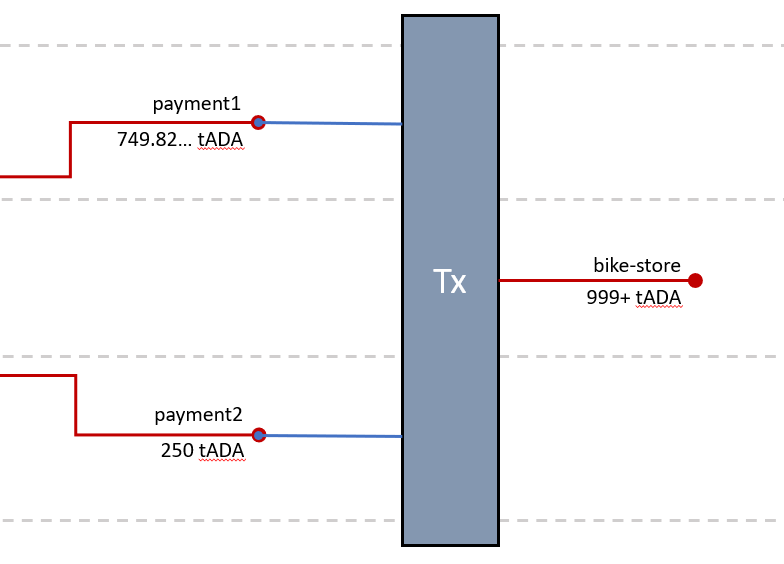

import Tabs from '@theme/Tabs';
import TabItem from '@theme/TabItem';

## Overview

:::note

This guide assumes that you have completed the [Exploring Cardano Wallets](/docs/integrate-cardano/creating-wallet-faucet) guide. You will need one UTxO sitting at each of the wallets (`payment1.addr` and `payment2.addr`) to complete this guide.

This guide also assumes that you have `cardano-node` running in the background and connected to the `testnet` network.

:::

### Recap

Let's recap what we did so far. Our goal in the [previous guide](/docs/integrate-cardano/creating-wallet-faucet) was to draw `1000 tADA` from the testnet faucet and send `250 tAda` from **payment1** to **payment2**.

Make sure we are in the correct folder.

```bash
$ pwd
$HOME/cardano
```

<Tabs
  defaultValue="query"
  groupId="step"
  values={[
    {label: 'Query UTxO', value: 'query'},
    {label: 'Calculate fees', value: 'calc'},
    {label: 'Build Tx', value: 'build'},
    {label: 'Sign & Submit Tx', value: 'sign'},
    {label: 'Verify Tx', value: 'verify'}
  ]}>

  <TabItem value="query">

We drew `1000 tAda` from the Testnet Faucet into our **payment1** wallet.

```bash
$ cardano-cli query utxo \
--testnet-magic 1097911063 \
--address $(cat keys/payment1.addr)
                           TxHash                                 TxIx        Amount
--------------------------------------------------------------------------------------
264c0aa805652e3607c5ea2b1e8a9f3bf9c3bc8d4d938e1a9035f352083ba703     0        1000000000 lovelace
```

  </TabItem>
  <TabItem value="calc">

We used `protocol-parameters` to draft our transaction and calculated the expected fee.

```bash
$ cardano-cli query protocol-parameters \
--testnet-magic 1097911063 \
--out-file protocol.json
```

```bash
$ cardano-cli transaction build-raw \
--tx-in 264c0aa805652e3607c5ea2b1e8a9f3bf9c3bc8d4d938e1a9035f352083ba703#0 \
--tx-out $(cat keys/payment2.addr)+0 \
--tx-out $(cat keys/payment1.addr)+0 \
--fee 0 \
--out-file tx.draft
```

```bash {8}
$ cardano-cli transaction calculate-min-fee \
--tx-body-file tx.draft \
--tx-in-count 1 \
--tx-out-count 2 \
--witness-count 1 \
--testnet-magic 1097911063 \
--protocol-params-file protocol.json
174169 Lovelace
```

  </TabItem>
  <TabItem value="build">

From the expected fee of `174169 Lovelace`, we were able to calculate the outputs and build our transaction.

```bash {3,4,5}
cardano-cli transaction build-raw \
--tx-in 264c0aa805652e3607c5ea2b1e8a9f3bf9c3bc8d4d938e1a9035f352083ba703#0 \
--tx-out $(cat keys/payment2.addr)+250000000 \
--tx-out $(cat keys/payment1.addr)+749825831 \
--fee 174169 \
--out-file tx.draft
```

:::note

Your fees might have been different hence you would have different amounts.

:::

  </TabItem>
  <TabItem value="sign">

We used `payment1.skey` to sign our transaction and submitted it to the blockchain.

```bash {3,10}
cardano-cli transaction sign \
--tx-body-file tx.draft \
--signing-key-file keys/payment1.skey \
--testnet-magic 1097911063 \
--out-file tx.signed

cardano-cli transaction submit \
--tx-file cardano/tx.signed \
--testnet-magic 1097911063
Transaction successfully submitted.
```

  </TabItem>
  <TabItem value="verify">

Finally we verified the transaction by querying the **payment1** and **payment2** wallets.

```bash
$ cardano-cli query utxo \
--testnet-magic 1097911063 \
--address $(cat keys/payment1.addr)
                           TxHash                                 TxIx        Amount
--------------------------------------------------------------------------------------
b73b7503576412219241731230b5b7dd3b64eed62ccfc3ce69eb86822f1db251     1        749825831 lovelace
```

```bash
$ cardano-cli query utxo \
--testnet-magic 1097911063 \
--address $(cat payment2.addr)
                           TxHash                                 TxIx        Amount
--------------------------------------------------------------------------------------
b73b7503576412219241731230b5b7dd3b64eed62ccfc3ce69eb86822f1db251     0        250000000 lovelace
```

  </TabItem>
</Tabs>

We currently have `749.825831 tAda` in our **payment1** wallet and `250 tAda` in our **payment2** wallet.

Let's see how we can spend it all at once!

## Use case

There are many possible reasons why you would want to have multiple wallets sending their ada in a single transaction. One is, you own two wallets (**payment1** and **payment2**) and you want to spend it on something that...

* costs more than you have in any of your two wallets,
* but **both amounts combined** would cover the costs.

Let's say you are at the **bike store** and you see a nice bike with a price tag of `1100 tAda` on it. You only have `999 tAda` (plus change) left.

The bike store owner - *a devious blockchain enthusiast* - is willing to give you a 10% discount, if you manage to **pay him in a single transaction**

> *There has to be no change, buddy!*  --Bike Store Owner

So we need to make sure to spend all our `tAda` from our two wallets in a single transaction.

:::note

He can easily verify if we spent all our money by checking if the transaction has more than one output.

There are ways to optimize the amount you spend. We will leave this for you to figure out yourself.

:::

## Technical Flow

This scenario is pretty straight forward and looks like this.



As you can see in the diagram above, we will build and submit a **multi-witness transaction**, having *two inputs* and *one output*.

:::note

We can't do this with `cardano-wallet`, or any other wallet like Daedalus or Yoroi because we will need both `signing-keys` from **payment1** and **payment2** to sign the transaction.

:::

## Time to code

:::note

As mentioned above, this guide assumes you completed the [Exploring Cardano Wallets](/docs/integrate-cardano/creating-wallet-faucet) guide.<br />
We also assume you paid `174169 Lovelace` in transaction fees and that your current balances are:

* **payment1**: `749825831 Lovelace`
* **payment2**: `250000000 Lovelace`

:::

### Create a store-owner wallet

If you don't already have a third wallet to use for this guide, let's create one where we can transfer all our funds to.

Make sure you are inside the `keys` directory like so: `cd $HOME/cardano/keys`

Generate a **payment key-pair** using `cardano-cli`:

```bash
cardano-cli address key-gen \
--verification-key-file $HOME/cardano/keys/store-owner.vkey \
--signing-key-file $HOME/cardano/keys/store-owner.skey
```

Then generate a **wallet address** for the `testnet` network:

```bash
cardano-cli address build \
--payment-verification-key-file $HOME/cardano/keys/store-owner.vkey \
--out-file $HOME/cardano/keys/store-owner.addr \
--testnet-magic 1097911063
```

Check your `keys` directory. It should look something like this:

```bash
$HOME/cardano/keys/
├── payment1.addr
├── payment1.skey
├── payment1.vkey
├── payment2.addr
├── payment2.skey
├── payment2.vkey
├── store-owner.addr
├── store-owner.skey
└── store-owner.vkey

0 directories, 9 files
```

### Calculate the transaction fee

Lets create a directory to store our transactions for this guide and enter it:

```bash
mkdir -p $HOME/cardano/multi-witness-sample && cd $_;
```

We want to send **all our tAda** sitting at the two UTxO we verified [before](#recap) and send it to the `store-owner.addr`. That means we will have **two inputs**.

What about the outputs? Well, the *devious store-owner* wants us to spend it all, so there will be **one output to the store-owner** and **zero outputs to us**. Remember? *"...no change, buddy!"*

Lets build that transaction.

```bash
cardano-cli transaction build-raw \
--tx-in b73b7503576412219241731230b5b7dd3b64eed62ccfc3ce69eb86822f1db251#0 \
--tx-in b73b7503576412219241731230b5b7dd3b64eed62ccfc3ce69eb86822f1db251#1 \
--tx-out $(cat ../keys/store-owner.addr)+0 \
--fee 0 \
--out-file tx2.draft
```

The last thing we need to do is to calculate the fees for `tx2.draft`. Notice the `--tx-in-count` and `--witness-count`.

```bash {3,4,5,8}
cardano-cli transaction calculate-min-fee \
--tx-body-file tx2.draft \
--tx-in-count 2 \
--tx-out-count 1 \
--witness-count 2 \
--testnet-magic 1097911063 \
--protocol-params-file ../protocol.json 
179581 Lovelace
```

We can calculate the amount the **store-owner** will receive, if both UTxO are spent during the transaction:

```text
  749825831 (payment1)
+ 250000000 (payment2)
  ---------
  999825831
-    179581 (fee)
  ---------
  999646250 (store-owner)
  =========
```

### Build, sign and submit transaction

We know the *output amount* as well as the *fee*. We can finally build, sign and submit our `tx2.draft` transaction.

We have to use `payment1.skey` and `payment2.skey` to sign our transaction.

```bash {10,11,18}
cardano-cli transaction build-raw \
--tx-in b73b7503576412219241731230b5b7dd3b64eed62ccfc3ce69eb86822f1db251#0 \
--tx-in b73b7503576412219241731230b5b7dd3b64eed62ccfc3ce69eb86822f1db251#1 \
--tx-out $(cat ../keys/store-owner.addr)+999646250 \
--fee 179581 \
--out-file tx2.draft 

cardano-cli transaction sign \
--tx-body-file tx2.draft \
--signing-key-file ../keys/payment1.skey \
--signing-key-file ../keys/payment2.skey \
--testnet-magic 1097911063 \
--out-file tx2.signed

cardano-cli transaction submit \
--tx-file tx2.signed \
--testnet-magic 1097911063
Transaction successfully submitted
```

### Verify multi-witness transactions

The devious store-owner will now verify that everything went according to his plan.

```bash
cardano-cli query utxo \
--testnet-magic 1097911063 \
--address $(cat $HOME/cardano/keys/store-owner.addr)
                           TxHash                                 TxIx        Amount
--------------------------------------------------------------------------------------
258abd628eef7d6ff0f7b4e6866b4f7c21065f4d6b5e49b51e2ac4ff035ad06f     0        999646250 lovelace
```

Verify [258abd628eef7d6ff0f7b4e6866b4f7c21065f4d6b5e49b51e2ac4ff035ad06f](https://explorer.cardano-testnet.iohkdev.io/en/transaction?id=258abd628eef7d6ff0f7b4e6866b4f7c21065f4d6b5e49b51e2ac4ff035ad06f) on the cardano testnet explorer

:::tip Success!

He can see that the transaction has one output to his wallet. No other outputs, hence you must have spent all of your `tAda`.

:::

Congratulations, you are now able to submit **multi-witness transactions on Cardano**. This should help you bring integrations to your existing or new upcoming applications. 🎉🎉🎉

<!-- ## Compare fees

We had to pay `179581 Lovelace` to get all of our funds from A+B to C. Let's compare with the fees we would have payed had we used two transactions.

For that we draft two transactions

```sh
cardano-cli transaction build-raw \
--tx-in 258abd628eef7d6ff0f7b4e6866b4f7c21065f4d6b5e49b51e2ac4ff035ad06f#0 \
--tx-out $(cat $HOME/cardano/keys/payment1.addr)+0 \
--fee 0 \
--out-file $HOME/cardano/multi-witness-sample/tx-single1.draft

cardano-cli transaction build-raw \
--tx-in 258abd628eef7d6ff0f7b4e6866b4f7c21065f4d6b5e49b51e2ac4ff035ad06f#0 \
--tx-out $(cat $HOME/cardano/keys/payment2.addr)+0 \
--fee 0 \
--out-file $HOME/cardano/multi-witness-sample/tx-single2.draft
```

And invoke the calculate-min-fees endpoint on `cardano-cli` for both of them:

```bash {8,17}
cardano-cli transaction calculate-min-fee \
--tx-body-file $HOME/cardano/multi-witness-sample/tx-single1.draft \
--tx-in-count 1 \
--tx-out-count 1 \
--witness-count 1 \
--testnet-magic 1097911063 \
--protocol-params-file $HOME/cardano/protocol.json 
169857 Lovelace

cardano-cli transaction calculate-min-fee \
--tx-body-file $HOME/cardano/multi-witness-sample/tx-single2.draft \
--tx-in-count 1 \
--tx-out-count 1 \
--witness-count 1 \
--testnet-magic 1097911063 \
--protocol-params-file $HOME/cardano/protocol.json 
169857 Lovelace
```

We would have to have payed `329714 Lovelace`. Another good reason not to use two transactions. -->
