## What are Oracles?

Oracles connect blockchains with external data sources, bridging the gap between on-chain smart contracts and off-chain information. They fetch, verify, and deliver real-world data to smart contracts in a format they can use.

The name comes from ancient oracles who delivered messages from the gods to mortals. Modern blockchain oracles bring real-world information from APIs, websites, and datasets onto the blockchain where smart contracts can access it.

Blockchains are deterministic systems where they can only see data within their own ledger. Oracles solve this limitation by bringing external data on-chain.

## Why Oracles Matter

Smart contracts execute conditional logic: when event X happens, trigger action Y. Their code runs on a decentralized network, producing the same result every time. This "trustless" quality comes from cryptographic proofs and distributed consensus and no need for a trusted third party.

But here's the catch: smart contracts need real-world data as inputs. A DeFi protocol needs current prices. An insurance contract needs weather data. A prediction market needs event outcomes. This data must be trustworthy because smart contract execution has real economic consequences, and blockchain transactions can't be reversed.

Common oracle use cases:

- **Price Feeds**: Exchange rate changes trigger trades, liquidations, or limit orders in DeFi protocols
- **Real-World Events**: Weather data triggers crop insurance payouts; flight delays trigger travel insurance claims
- **Sports & Betting**: Game scores trigger payouts in prediction markets
- **Cross-Chain Data**: Bridge contracts need information from other blockchains
- **Supply Chain & IoT**: Tracking requires sensor data, GPS coordinates, shipment verification

## The Oracle Problem

The "oracle problem" refers to a fundamental challenge: how can smart contracts trust external data to be authentic and accurate?

DeFi alone is critically dependent on oracle-provided data. But there are many opportunities for false data to slip into the collection, validation, and publication pipeline. This creates a lucrative attack vector, bad actors can trigger large payouts from smart contracts by feeding them false information.

### Key Challenges

**Single Point of Failure**: An oracle that pulls from just one data source creates a critical vulnerability. If that source is hacked or malfunctions, every smart contract using that oracle is affected.

**Man-in-the-Middle Attacks**: Data can be intercepted and modified between the source and the blockchain. Preventing this remains challenging.

**Lack of Transparency**: Some oracles don't show how they collect and validate data. You see a price appear on-chain, but have no way to verify where it came from or how it was validated.

**Consensus vs. Authenticity**: Decentralized oracle pools might achieve consensus, all nodes agree on the data but that doesn't guarantee the underlying data source is authentic or accurate. Agreement on bad data is still bad data.

## Oracles on Cardano's eUTXO Model

Cardano's Extended UTXO (eUTXO) model offers unique advantages for oracle implementations. A functional oracle system on Cardano requires three components: diverse data sources, a computation platform to validate accuracy, and network participants to transfer data on-chain.

### Reference Inputs

The Vasil hard fork introduced reference inputs, UTXOs that transactions can read without consuming them. This eliminates a major bottleneck for oracles:

### Multi-Oracle Validation

Smart contracts can reference UTXOs from multiple oracle providers simultaneously, performing on-chain reconciliation. The script reads values from different oracles and verifies they fall within an acceptable deviation threshold:

```mermaid
graph LR
    A[Smart Contract] -->|Ref| B[Oracle A<br/>$0.505]
    A -->|Ref| C[Oracle B<br/>$0.502]
    A -->|Ref| D[Oracle C<br/>$0.498]

    B & C & D --> E[Validation Script]
    E --> F{Within ±2%?}
    F -->|Yes| G[Execute]
    F -->|No| H[Reject]

    style B fill:#0033AD,stroke:#0033AD,stroke-width:2px,color:#fff
    style C fill:#0033AD,stroke:#0033AD,stroke-width:2px,color:#fff
    style D fill:#0033AD,stroke:#0033AD,stroke-width:2px,color:#fff
```

This on-chain check provides a trustless, programmatic guarantee against single oracle network failure or attack. Even if one oracle is compromised, the deviation check catches the problem.

## Publication Models

Oracles use different publication models depending on the use case:

### Push Model

Data is published continuously at regular intervals. Smart contracts read whatever's most recent. Updates happen:

- At fixed intervals (e.g., every 5 minutes, hourly)
- When data deviates beyond a threshold from the last publication
- Or both, regular updates plus deviation triggers

### Pull Model

Data is fetched only when requested. A smart contract or user asks for data, and the oracle responds (just-in-time delivery).

## Security Considerations

Oracle security matters because smart contracts depend on accurate external data. Here's how oracles protect against bad data:

### Data Source Diversity

Multiple independent data sources verify accuracy and reduce vulnerability. If one source is compromised or fails, others catch the problem. Aggregating diverse sources helps identify outliers and produces more reliable values.

### Decentralized Validation

Multiple independent validator nodes collect and verify data before publication. This reduces single points of failure and makes it harder for attackers to manipulate feeds they'd need to compromise multiple nodes.

### Cryptographic Verification

Oracles use cryptographic signatures, tokens, or NFTs to prove data authenticity. Smart contracts verify these proofs before accepting oracle data as valid input.

### Transparency and Auditability

Audit trails document how data was collected, validated, and published. This transparency lets you verify oracle operations and hold providers accountable.

### Outlier Detection

Statistical methods identify and exclude anomalous data that deviates significantly from expected ranges, preventing manipulation or errors from affecting outputs.

## Choosing an Oracle Provider

Consider these factors when selecting an oracle for your Cardano application:

- What sources does the oracle use? How reliable are they?
- Does the publication model match your needs?
- How distributed is the oracle network?
- Can you audit the data collection and validation process?
- How hard is it to integrate?
- What are the fees for consuming oracle data?

---

## Example Oracle Providers

import DocCardList from '@theme/DocCardList';

<DocCardList />
