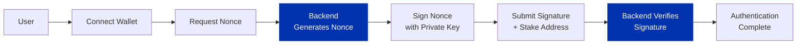

Wallet-based authentication lets users prove they own a Cardano wallet by cryptographically signing a message. This approach provides passwordless authentication using blockchain identity, which is more secure than traditional password-based systems.

## How It Works

The authentication process uses message signing as described in [CIP-8](https://cips.cardano.org/cip/CIP-0008) with [CIP-30](https://cips.cardano.org/cip/CIP-0030)-compatible wallets:

1. **User connects wallet** - The application requests access to the user's wallet
2. **Backend generates nonce** - A unique random string is created for this authentication attempt
3. **User signs nonce** - The wallet prompts the user to sign the nonce with their private key
4. **Backend verifies signature** - The signature is cryptographically verified to prove wallet ownership

The backend generates a unique random string (called a **nonce**, or "number used once") for each authentication attempt. This nonce is critical for security because it prevents replay attacks where someone tries to reuse an old signature. The user's wallet signs this nonce with their private key, and the backend verifies the signature to prove wallet ownership. Because only the private key holder can create a valid signature, this proves the user controls that wallet. Any tampering with the message invalidates the signature completely.

You'll typically use the staking address (also called reward address) as the user's identifier in your application. Unlike payment addresses which can change frequently, the staking address remains constant for a wallet. This means you can reliably track users across sessions even if they generate new payment addresses. The staking address can be derived from any payment address in the wallet, making it easy to obtain.

:::warning
Never accept the same nonce twice. After each verification attempt, you must rotate the nonce to maintain security.
:::

## Use Cases

There are many scenarios where wallet-based authentication is useful. You can use it for passwordless login where wallet ownership serves as the user's identity. It's also commonly used for whitelist verification, where you need to confirm users own specific wallet or stake addresses before granting access.

Token-gated content is another popular use case. Restrict access to holders of specific native tokens, such as providing exclusive content to NFT holders. You might also use it to authenticate wallet owners when they claim token rewards, or to verify user approval for off-chain actions like in-game trading.

