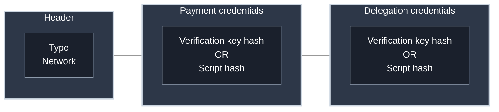

Understanding addresses is fundamental to Cardano development. Before you can understand how transactions move value or how the EUTXO model works, you need to know where value lives.

## Address Structure

A Cardano address consists of 2 or 3 parts:


**Header**: Describes the address type and network (mainnet or testnet). The network discriminant prevents sending mainnet funds to testnet addresses.

**Payment credentials**: Defines spending conditions - who can spend funds at this address.

**Delegation credentials** (optional): Controls stake delegation and reward withdrawals.

Addresses are encoded using Bech32 with human-readable prefixes: `addr` (mainnet), `addr_test` (testnet), `stake` (rewards).

**Example addresses:**

- `addr1vpu5vlrf4xkxv2qpwngf6cjhtw542ayty80v8dyr49rf5eg0yu80w`
- `stake1vpu5vlrf4xkxv2qpwngf6cjhtw542ayty80v8dyr49rf5egfu2p0u`

<iframe width="100%" height="325" src="https://www.youtube-nocookie.com/embed/NjPf_b9UQNs" frameborder="0" allow="accelerometer; autoplay; clipboard-write; encrypted-media; gyroscope; picture-in-picture fullscreen"></iframe>

## Address Types

### Base Addresses

Payment credentials + delegation credentials. **Most common address type.** Standard wallets and dApps with staking support use base addresses, which enable delegation to pools and earning rewards.

### Enterprise Addresses

Payment credentials only - no delegation credentials. Exchanges holding customer funds and organizations that want to demonstrate non-exercise of stake rights use enterprise addresses to explicitly opt out of staking.

## Payment Credentials

Payment credentials define spending conditions and come in two forms:

**Verification Key Hash**: Blake2b-224 hash of an Ed25519 public key. Regular wallets like Lace, Eternl, and Yoroi use this type. To spend funds, you must provide the public key and a signature of the transaction.

**Script Hash**: Blake2b-224 hash of a Plutus or native script. Smart contracts, DEX liquidity pools, and escrow services use script hashes to lock funds programmatically. To spend funds, you must provide the script source and satisfy its validation logic. Scripts are predicates that return True or False - all scripts in a transaction must return True for the transaction to be valid.

:::tip For Builders
When minting tokens or building smart contracts, you'll work with **script addresses**, addresses where the payment credential is a script hash rather than a key hash. Your validator script's hash becomes the address where users lock funds.
:::

### Key Hashes vs Public Keys

**Important**: Addresses contain **hashes** of public keys, not the public keys themselves. You cannot retrieve a public key solely from an address.

When spending from an address, you must provide:

1. The actual public key (revealed for the first time)
2. A signature proving you control the corresponding private key
3. The network validates the public key hashes to the credential in the address

This design provides an additional layer of security - public keys remain hidden until funds are spent.

## Delegation Credentials

Delegation credentials control two operations:

1. **Publishing delegation certificates** - Delegate your stake to a stake pool
2. **Withdrawing rewards** - Claim staking rewards earned from delegation

Like payment credentials, delegation credentials come in two forms: verification key hash or script hash.

**Key insight**: When you delegate, funds remain at your payment address under your control. The delegation credentials only control which pool receives your stake and when you withdraw rewards.

### Privacy Considerations

Multiple payment addresses using the same delegation credentials are publicly linked because the stake key hash appears in all addresses.

```
Address 1: addr1q[payment_hash_1][stake_hash_shared]...
Address 2: addr1q[payment_hash_2][stake_hash_shared]...
Address 3: addr1q[payment_hash_3][stake_hash_shared]...
```

Anyone can see these addresses share the same stake key, linking them together on-chain.

**Privacy strategies:**

- **Accept the linking**: Most users delegate all addresses to one stake key (standard wallet behavior)
- **Forgo staking**: Use enterprise addresses with no delegation credentials (unlinked but no rewards)
- **Multiple stake keys**: Create separate stake keys per address (complex, multiple registrations, impractical)

For most applications, stake key linking is acceptable. Only privacy-critical applications need to consider alternatives.

## Putting It Together

Now that you understand address types and credentials, here's the complete structure:



**Payment credentials** are used for spending funds at the address.

**Delegation credentials** are used for publishing delegation certificates and withdrawing staking rewards.

## Resources

Tools for inspecting and decoding addresses:

- **[cardano-address](https://github.com/IntersectMBO/cardano-addresses)**: Inspect address components, extract key hashes
- **[bech32](https://github.com/input-output-hk/bech32)**: Decode bech32 encoding to hex
- **[cardano-cli](/docs/get-started/infrastructure/cardano-cli/basic-operations/get-started)**: Generate keys, hash keys, and verify they match address credentials

**Technical Reference**: [CIP-19: Cardano Addresses](https://cips.cardano.org/cip/CIP-19)
