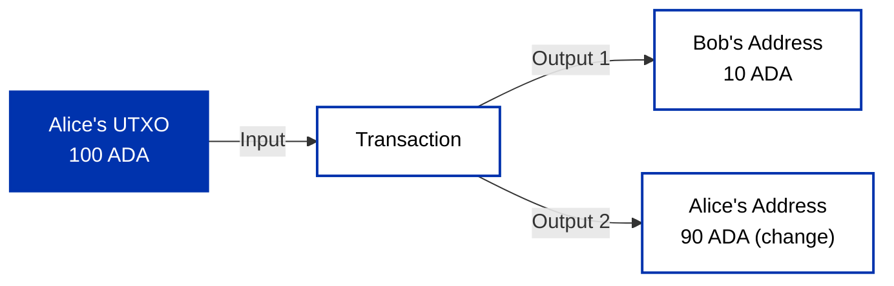
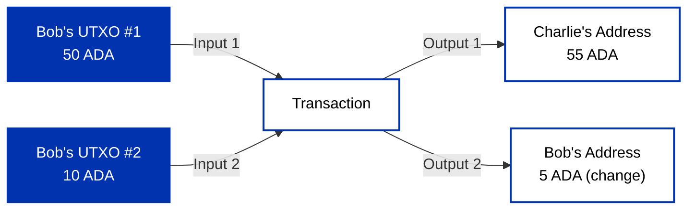

Cardano uses the Extended UTXO (EUTXO) model to support multi-assets and smart contracts while maintaining UTXO's core advantages over account-based blockchains.

:::note Quick Summary
Cardano tracks value as discrete "coins" (UTXOs) rather than account balances. Each transaction consumes existing UTXOs and creates new ones. Smart contracts validate whether a UTXO can be spent, but cannot initiate actions themselves. This model makes transactions deterministic, you know exactly what will happen before you submit a transaction.
:::

## Why Accounting Models Matter

Blockchains solve **decentralized consensus** - multiple parties with conflicting interests agreeing on transaction history without central authority. This consensus challenge drives two fundamentally different approaches to representing value: account-based and UTXO-based models.

## Account-Based Model

Ethereum and similar blockchains use an **account-based model** where each address maintains a balance that increases and decreases with transactions. When you send 10 ETH, the system updates both account balances simultaneously.

This mirrors traditional banking but transactions are **stateful** - they depend on and modify global state. A transaction's validity can change based on other transactions processed before it, creating unpredictability between creation and execution.

*Cardano's EUTXO model represents assets as a directed graph of unspent outputs, while account-based blockchains maintain a database of account balances that update with each state transition.*

## Understanding the UTXO Foundation

UTXOs work like physical cash. Your wallet balance is the sum of all unspent outputs from previous transactions. Assets move through a directed graph where transactions consume UTXOs and create new ones.

**Transaction outputs** include an address (spending conditions) and a value (assets). Each output has a unique identifier: transaction hash + output position.

**Transaction inputs** reference previous outputs by this identifier. Spending requires witnesses (signatures or script validations) that satisfy spending conditions.

UTXOs must be consumed completely - all-or-nothing like cash bills you can't split. This creates "change" outputs sent back to yourself.

*A transaction consumes existing UTXOs as inputs and creates new UTXOs as outputs. The consumed UTXOs are removed from the UTXO set, while the new outputs become available for future transactions.*

## Your First UTXO Transaction

### Example: Alice Sends Bob 10 ADA

Let's make this concrete. Say Alice has a single UTXO worth 100 ADA and wants to send Bob 10 ADA.

Alice's transaction must:

1. **Consume** her entire 100 ADA UTXO as input (all-or-nothing)
2. **Create** two new outputs:
   - 10 ADA to Bob's address
   - 90 ADA back to Alice's address as "change"

After this transaction executes, the UTXO set contains:

- Alice: 90 ADA (new UTXO)
- Bob: 10 ADA (new UTXO)
- Alice's original 100 ADA UTXO: **spent** (removed from UTXO set forever)

### Combining Multiple UTXOs

Now suppose Bob has two UTXOs (his original 50 ADA plus the 10 ADA from Alice) and wants to send Charlie 55 ADA. Neither UTXO alone is sufficient.

Bob's transaction must:

1. **Consume** both his 50 ADA and 10 ADA UTXOs as inputs
2. **Create** two new outputs:
   - 55 ADA to Charlie's address
   - 5 ADA back to Bob's address as change

This demonstrates how UTXOs can be combined to meet transaction requirements, with any remainder returned as change.

## Atomic Transactions and Genesis Bootstrap

Transactions are atomic operations - either all changes are applied successfully, or none are applied at all. This all-or-nothing approach ensures consistency and prevents partial state updates that could corrupt the ledger.

This creates an interesting bootstrapping question: if inputs reference previous outputs, where do the first outputs come from? The answer is the **genesis configuration** - an initial agreed-upon state that creates the first UTXOs without requiring inputs.

## UTXO Set Management

Every node maintains a complete record of all currently unspent transaction outputs (UTXOs), called the UTXO set or chainstate. This is stored locally and updated with each new block. Your wallet balance is the sum of all UTXOs you control, and wallet software manages these UTXOs to construct new transactions.

## Cardano's EUTXO Innovation

EUTXO extends the basic UTXO model in two critical ways:

1. Instead of restricting addresses to simple public key signatures, EUTXO allows addresses to contain complex logic in the form of scripts that determine spending conditions.

2. Outputs can carry arbitrary data (datum) in addition to addresses and values, enabling scripts to maintain and access local state of a UTxO.

The EUTXO model combines:

- **Validator Scripts**: Define arbitrary validation logic for different conditions like spending, minting, withdrawing etc.
- **Datums**: Data stored/attached to outputs (UTxO) to carry state
- **Redeemers**: User-supplied arguments passed to scripts during validation
- **Context**: Transaction information available to scripts during validation

:::tip Understanding Validators
To understand how smart contracts (validators) work on the EUTXO model and how these components interact, see the [Smart Contracts Overview](/docs/build/smart-contracts/overview).
:::

<iframe width="100%" height="325" src="https://www.youtube-nocookie.com/embed/bfofA4MM0QE" frameborder="0" allow="accelerometer; autoplay; clipboard-write; encrypted-media; gyroscope; picture-in-picture fullscreen"></iframe>

:::info
Deep dive into [Cardano's EUTXO accounting model here](https://ucarecdn.com/3da33f2f-73ac-4c9b-844b-f215dcce0628/EUTXOhandbook_for_EC.pdf).
:::

### Smart Contract Validation: Bitcoin vs Ethereum vs Cardano

The scope of information available to validator scripts (smart contracts) fundamentally differs across blockchain models:

**Bitcoin (UTXO)**: Scripts can only see the redeemer (the signature/unlocking data). This makes validation simple and secure but severely limits smart contract capabilities and hence it only supports "dumb contracts."

**Ethereum (Account-Based)**: Scripts can see and modify the entire blockchain state. This unlimited access enables powerful contracts but introduces security complexity and unpredictability.

**Cardano (EUTXO)**: Scripts can see all inputs and outputs of the specific transaction, plus contextual information from the transaction itself but not arbitrary global state. This middle ground has been mathematically researched and developed to provide equivalent computational power similar to the account model while maintaining stronger security guarantees.

Plutus scripts are **pure functions**: given identical inputs (datum, redeemer, script context), they always produce identical outputs. This purity enables:

**Mathematical Security Proofs**: You can prove a script is secure by analyzing the transaction inputs alone, not the entire unpredictable blockchain state. The limited scope makes comprehensive security analysis tractable.

**Fail-Fast Validation**: If a transaction references an already-spent input, validation fails immediately off-chain before reaching the network, costing you nothing. The script's deterministic nature allows complete local validation.

**No Partial Failures**: Unlike account-based systems where a transaction can fail mid-execution (after consuming gas fees), EUTXO transactions are validated atomically. Either all conditions are met and the transaction succeeds, or it fails completely without cost.

## eUTxO Advantages for Developers

**Parallelization**: Transactions can be processed in parallel as long as they don't consume the same inputs, offering superior scalability. The level of concurrency is limited only by the degree of contention for shared UTXOs.

**Local State**: Unlike account-based models where every transaction affects global state, EUTXO validation occurs locally, preventing many classes of errors and attacks.

**Predictable Fees**: Transaction costs can be calculated precisely off-chain before submission. Cardano's fees are deterministic and fixed at transaction creation time, no surprises from network congestion or gas price spikes. Critically, if a transaction is invalid (e.g., an input was already spent), it fails validation off-chain before submission, costing you nothing. This contrasts sharply with account-based models where you pay fees even for failed transactions, and gas costs fluctuate unpredictably based on network activity.

**Deterministic Validation**: UTXO transactions are **stateless**, they explicitly include all inputs and outputs within the transaction itself. Validity depends solely on the transaction and its referenced UTXOs, not on external blockchain state that might change. This means if the UTXOs are unspent when your transaction is validated, it is guaranteed to succeed. The transaction's effect is fully determined at creation time. By contrast, account-based transactions are **stateful**, they depend on current account balances that can change between transaction creation and execution. A stateful transaction might fail mid-execution even if it appeared valid when created, and you still pay fees for the failed attempt.

**Zero-Knowledge Proof Compatibility**: EUTXO's deterministic nature makes it ideal for zero-knowledge scaling solutions. Since transaction outcomes are deterministic and predictable, you can execute complex computations off-chain and generate proofs against known state. The proof can then be verified on-chain without re-executing the computation. This contrasts with account-based models where global state changes unpredictably, making it difficult to construct valid ZK proofs since the state may change between proof generation and verification.

**Privacy Oriented**: The UTXO model naturally encourages privacy-preserving behavior. Best practice is to generate a new address for each incoming transaction, including change addresses. Since your balance is distributed across discrete UTXOs at different addresses rather than consolidated in a single account, it becomes significantly harder to link multiple transactions to a single owner. Account-based models inherently encourage address reuse the account itself links all transactions together, making transaction history trivially traceable to one entity.

## TPS vs. eUTxO

Which is better, high transactions per second or eUTxO?
<iframe width="100%" height="325" src="https://www.youtube-nocookie.com/embed/wDmLVMmevNQ" frameborder="0" allow="accelerometer; autoplay; clipboard-write; encrypted-media; gyroscope; picture-in-picture fullscreen"></iframe>

## Developer Considerations

The UTXO model's graph structure is fundamentally different from the account-based model. As a result, **design patterns that work for DApps on account-based blockchains do not translate directly to Cardano**. New design patterns are utilized because the underlying representation of data is different.

### Concurrency and State Management

To maximize parallelism and scaling benefits, developers must architect DApps using multiple UTXOs rather than relying on single shared state. This fundamental shift requires:

### Multiple UTXOs Design

Smart contracts should split their on-chain state across many UTXOs rather than concentrating it in a single location. This increases concurrency by allowing multiple users to interact with different parts of the contract simultaneously.

### Avoiding Contention

Since each UTXO can only be spent once, multiple users trying to access the same UTXO would create contention just like the account-based system on Ethereum and the UTxO model would lose its meaning. Proper design distributes interactions across different UTXOs to minimize this bottleneck.

### Parallelization Strategy

By splitting logic across different branches, applications can achieve greater parallelism. This approach is similar to how Bitcoin services split wallets into sub-wallets for better performance.

The key insight is that **single on-chain state patterns from account-based systems will not achieve concurrency on Cardano**. Instead, developers embrace the EUTXO model's strengths by designing for distributed state and parallel execution from the ground up.

---

## Next Steps

- Learn about [Transactions](transactions) and how they consume and create UTXOs
- Understand [Transaction Fees](fees) and how costs are calculated
- Ready to build? See [Smart Contracts Overview](/docs/build/smart-contracts/overview) or [Minting Native Assets](/docs/build/native-tokens/minting)
