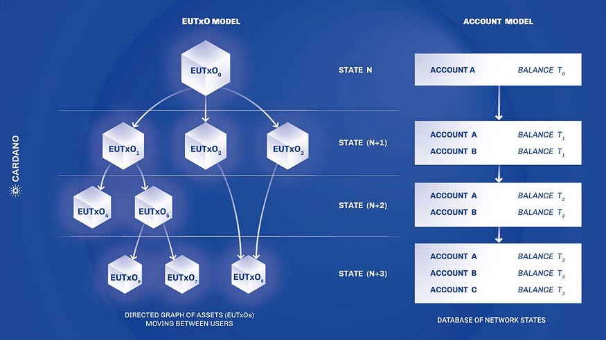
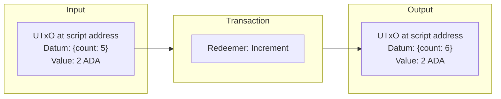
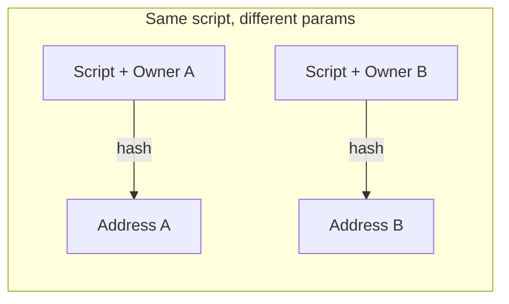
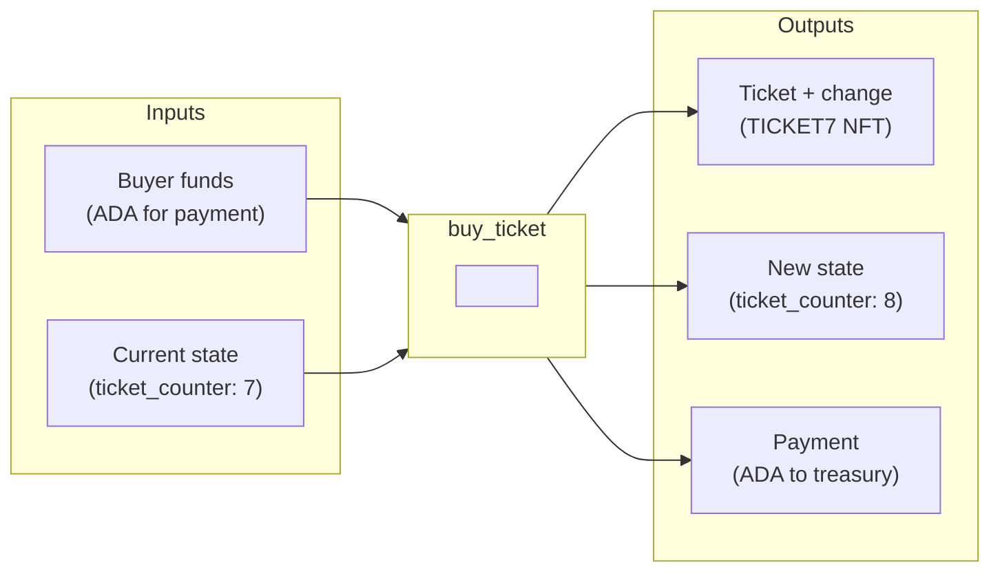
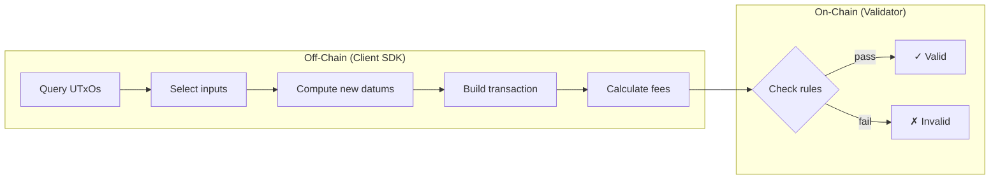
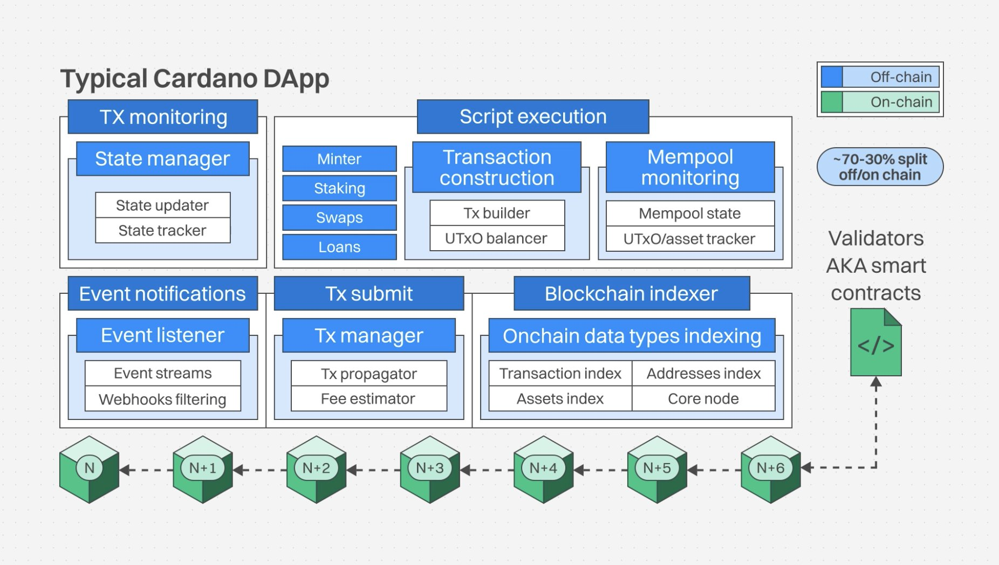
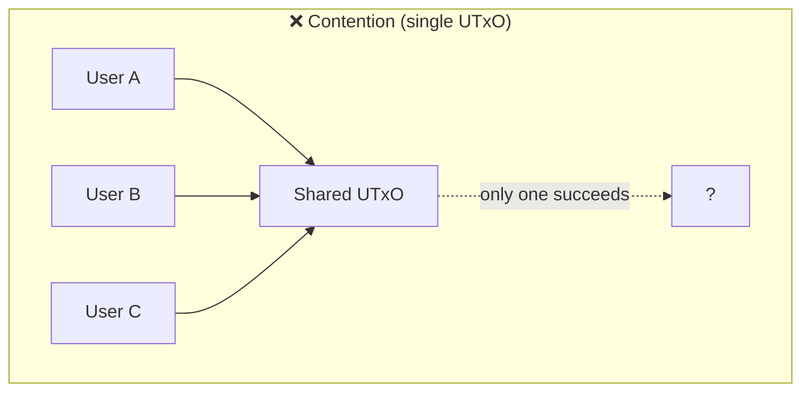
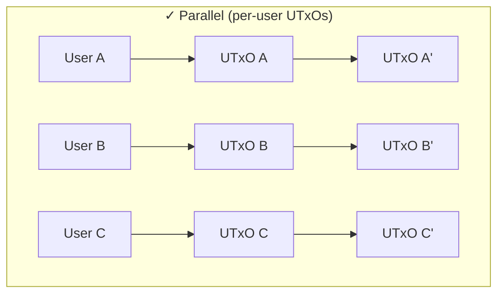
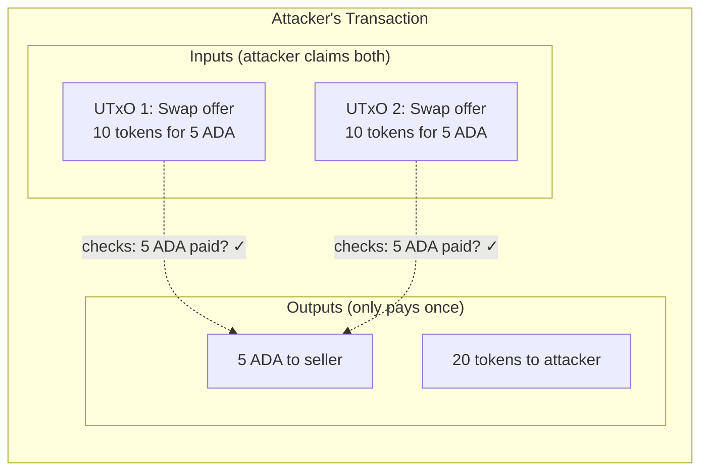

This guide covers the key differences between Ethereum and Cardano development. Coming from Ethereum, Cardano will look and feel different: different account model, different smart contract paradigm, different tooling. By the end, you'll understand how to translate your Ethereum knowledge to Cardano and have clear next steps for building.

## What Makes Cardano Different from Ethereum?

### Account Model

When developing on Cardano, the most significant difference you will encounter is the account model design. Understanding why Cardano's model was designed differently helps make sense of everything else.

Unlike Ethereum, Cardano is designed around the **[Extended UTxO (eUTxO) model](/docs/learn/core-concepts/eutxo)** rather than an account-based model. On Ethereum, each address maintains a balance stored in global state. Transactions update these balances directly, and smart contracts hold and modify their own storage.



On Cardano, there is no global mutable contract storage like on Ethereum. Instead, both value and application state are carried in discrete Unspent Transaction Outputs (UTxOs). While the ledger itself maintains global state (such as the UTxO set, protocol parameters, and staking state), smart contracts do not read from or write to shared storage. Everything a validator is allowed to reason about must be provided explicitly by the transaction through its inputs and outputs.

A helpful mental model is to think of UTxOs like physical bills rather than a single bank balance. Your wallet doesn’t hold “100 ADA” as one number; it holds individual UTxOs whose values sum to your balance. When you spend, you consume entire UTxOs and create new ones as outputs. For example, if you have a single 100 ADA UTxO and want to send 10 ADA, the transaction consumes the 100 ADA UTxO and creates two new ones: one with 10 ADA for the recipient and one with 90 ADA as change.

Smart contracts on Cardano follow the same model. Validators (Cardano's term for smart contracts) have no internal, mutable storage. There is no state living inside a contract. Instead, application state lives in **datums**, which are arbitrary data attached to UTxOs, similar to a struct stored alongside the UTxO's value. A validator's job is not to update state, but to check that a transaction correctly transforms one set of UTxOs (and their datums) into the next.

### Counter Example

To make the contrast concrete, let's look at a counter implemented in Solidity on Ethereum and the same counter implemented in [Aiken](/docs/build/smart-contracts/languages/aiken/overview) on Cardano.

#### Ethereum Counter Smart Contract

```js
contract Counter {
    uint256 private count;

    function increment() public {
        count += 1;
    }

    function decrement() public {
        count -= 1;
    }

    function getCount() public view returns (uint256) {
        return count;
    }
}
```

In Solidity, `count` is stored directly in the contract's storage and modified in place. The contract itself owns this state. When `increment()` or `decrement()` is called, the contract executes code that mutates its internal storage as part of transaction execution.

#### Cardano Counter in Aiken

On Cardano, the mental model is fundamentally different. There is no contract-owned storage that gets updated by executing code. Instead, state (the counter value) lives in a datum attached to a UTxO. The validator does not perform the state change; it only validates that a proposed state transition encoded in the transaction is correct.

In other words:

- Off-chain code constructs a transaction describing the desired state change
- On-chain code (the validator) verifies that the transaction follows the rules

First, we define the shape of the state we want to track. This is the datum attached to the UTxO holding the counter value:

```aiken
pub type CounterDatum {
  count: Int,
}
```

We define the set of actions (similar to endpoints of the spending smart contract we will write later). This intent is provided to the validator via a **redeemer**, which is data supplied by whoever builds the transaction, telling the validator which action to perform:

```aiken
pub type CounterAction {
  Increment
  Decrement
}
```

Building a counter on Cardano means designing valid state transitions. You construct a transaction with the correct inputs (the UTxO holding current state) and outputs (a new UTxO with updated state) that satisfy the validator's rules. When someone wants to increment the counter, they build a transaction that consumes the current state and produces the new state:



The transaction:

1. Supplies a redeemer specifying the desired action (Increment or Decrement)
2. Spends the UTxO containing the current counter value in its datum (input)
3. Creates a new UTxO at the same address with the updated datum (output)

:::note Helper functions
The validator below uses helper functions like `find_continuing_output` and `get_datum`. These are not built into Aiken, but are common patterns you implement or import from [utility libraries](/docs/build/smart-contracts/languages/aiken/overview#common-utilitieshelpers).
:::

Here's the validator:

```aiken
validator counter_validator {
  spend(
    datum_opt: Option<CounterDatum>,
    redeemer: CounterAction,
    _input: OutputReference,
    tx: Transaction,
  ) {

    // --- Input state (current counter) ---
    // The state lives in the datum of the UTxO being spent.
    expect Some(input_datum) = datum_opt

    // --- Transition Logic ---
    // The redeemer tells the validator which state transition logic to apply.
    when redeemer is {
      Increment -> {
        // --- Output state (next counter) ---
        // A valid state transition must produce a continuing output UTxO at the same smart contract address.
        // That output carries the next state in its datum.
        expect Some(output) = find_continuing_output(tx)
        expect output_datum: CounterDatum = get_datum(output)

        // --- Transition rule ---
        // The datum attached to the output UTxO must contain the next correct state of the counter.
        output_datum.count == input_datum.count + 1
      }

      Decrement -> {
        expect Some(output) = find_continuing_output(tx)
        expect output_datum: CounterDatum = get_datum(output)
        output_datum.count == input_datum.count - 1
      }
    }
  }

  else(_) {
    // Non-spending purpose (e.g., minting) is not supported by this validator.
    fail
  }
}
```

To explore more real-world smart contracts written in Aiken, see the [Example Contracts](/docs/build/smart-contracts/example-contracts).

## How Do Transactions Work on Cardano?

With the model clear, let's look at how transactions actually work.

A Cardano transaction transforms UTxOs: it spends existing ones and creates new ones.


The key components:

- **Inputs**: UTxOs being spent
- **Outputs**: New UTxOs being created, each with an address, value, and optionally a datum attached to it
- **Signatures**: Authorize spending by verifying that the transaction is signed by the required keys to spend the input UTxOs
- **Redeemers**: Data passed to validators when spending UTxOs locked at validator script addresses
- **Validity interval**: A time window when the transaction is valid
- **Mint/burn**: Token operations, if any

The validity interval deserves special attention. On Ethereum, smart contracts can read block.timestamp during execution. Cardano validators do not have access to a notion of “current time.” Instead, time-based constraints are enforced using the transaction’s declared validity interval.

Every transaction specifies a lower and/or upper bound on when it may be included. The ledger rejects transactions outside this window before any scripts run. Validators can then rely on the declared bounds themselves.

```mermaid
gantt
    dateFormat X
    axisFormat %s
    section Validity
    Before valid     :done, 0, 1
    Valid window     :active, 1, 3
    After valid      :done, 3, 4
```



To enforce "action X only after date Y," store Y in the datum and check that the transaction's lower bound ≥ Y.

Another significant difference from Ethereum is composition. On Ethereum, a transaction has a single entry point and composition is typically expressed through internal contract calls (routers, aggregators, multicalls). On Cardano, a single transaction can spend from multiple script addresses and mint tokens under multiple policies. Each validator runs independently; all must pass, and the entire transaction succeeds or fails atomically. No router contracts are required.

In the UTxO model, the [transaction](/docs/learn/core-concepts/transactions) itself is the **local state**. Every input, every output, every signature, every piece of data the validator needs is contained within the transaction. There's no querying external state and as a result there are no surprises from concurrent modifications. When a validator runs, it receives this complete local state as context. For example, the transaction's `extra_signatories` field lists every verification key hash that signed it. The validator can inspect all inputs being spent, all outputs being created, and all metadata attached. Given the same transaction inputs and outputs, a validator will always produce the same result because everything it needs is self-contained.

## How Do Fees Work on Cardano?

Cardano uses a deterministic fee model. Fees are calculated using a fixed formula based on transaction size (a × tx_size + b) and, for smart contract transactions, known execution budgets (CPU and memory units). Fees are fully calculable before submission, with no gas price auctions or bidding.

One important detail: every UTxO must contain a minimum amount of ADA (called **minUTxO**). This prevents dust attacks and ensures UTxOs are economically meaningful. The minimum depends on the UTxO's size, so more data in the datum means more ADA required. Client SDKs handle this automatically when building transactions.

## Common Patterns

For a deeper dive into how smart contracts work on Cardano, see the [Smart Contracts overview](/docs/build/smart-contracts/overview). Below are common patterns you'll encounter when building validators.

### Adding Authorization: The `onlyOwner` Pattern

Let's extend our counter example to require owner authorization. On Ethereum, you'd use a modifier:

```js
address public owner;

modifier onlyOwner() {
    require(msg.sender == owner, "Not owner");
    _;
}

function increment() public onlyOwner {
    count += 1;
}
```

On Cardano, we would check if the defined owner signed the transaction. The `key_signed` [helper function](/docs/build/smart-contracts/languages/aiken/overview#common-utilitieshelpers) checks whether a specific key hash appears in `tx.extra_signatories`, the list of keys that signed this transaction:

```aiken
validator counter_with_owner(owner: VerificationKeyHash) {
  spend(
    datum_opt: Option<CounterDatum>,
    redeemer: CounterAction,
    _input: OutputReference,
    tx: Transaction,
  ) {
    expect Some(input_datum) = datum_opt

    // Check if owner signed
    let is_owner_signed = key_signed(tx.extra_signatories, owner)

    when redeemer is {
      Increment -> {
        expect Some(output) = find_continuing_output(tx)
        expect output_datum: CounterDatum = get_datum(output)

        // Check if the owner signed the transaction and the counter was incremented correctly
        // If both conditions are true, the transaction is allowed.
        is_owner_signed && (input_datum.count + 1 == output_datum.count)
      }
      Decrement -> {
        // Similar logic for decrementing.
      }
    }
  }
```

The `owner` parameter is baked into the script at compile time. Different owners produce different script hashes, meaning different addresses:

```aiken
validator counter_with_owner(owner: VerificationKeyHash) { 
```

This is Cardano's equivalent of Solidity's constructor arguments, but with an important difference: the parameter is compiled directly into the script bytecode. Even if two contracts have identical logic, compiling with different `owner` verification keys produces different bytecode:



Since the script address is derived by hashing this bytecode, each owner gets their own unique address. This means each owner's counter state lives in UTxOs at a completely separate address, providing isolation between different instances of the same contract logic.

### Adding Time Locks

What if we want the counter to only work before a certain deadline? On Ethereum, you'd check `block.timestamp`. On Cardano, we use validity intervals. Here's a more complete example based on our vesting contract pattern:

```aiken
pub type CounterDatum {
  count: Int,
  owner: ByteArray,
  deadline: Int,  // POSIX timestamp in milliseconds
}

validator timed_counter {
  spend(
    datum_opt: Option<CounterDatum>,
    _redeemer: Data,
    _input: OutputReference,
    tx: Transaction,
  ) {
    expect Some(datum) = datum_opt

    let is_owner_signed = key_signed(tx.extra_signatories, datum.owner)
    let is_not_expired = valid_before(tx.validity_range, datum.deadline)

    is_owner_signed && is_not_expired
  }

  else(_) {
    fail
  }
}
```

The `valid_before` function checks that the transaction's validity interval ends before the deadline.

## Native Tokens vs ERC-20/721

On Ethereum, tokens are smart contracts. Creating an ERC-20 means deploying a contract, and every transfer is a contract call that costs gas. The `approve` + `transferFrom` pattern is necessary for dApps to spend your tokens.

On Cardano, [native tokens](/docs/learn/core-concepts/assets) are built into the ledger itself. Remember that UTxOs are the fundamental unit that all network logic applies to. Each UTxO can carry multiple values: ADA plus any number of [native tokens](/docs/build/native-tokens/overview). When you spend a UTxO, you're moving all the value it contains in one atomic operation. This means transferring tokens is no different from transferring ADA. There's no `approve` pattern, no separate contract calls, no extra gas. A single transaction can move ADA and dozens of different tokens across multiple UTxOs, all with the same predictable fee.

### Native Scripts

For simple minting rules, you don't need to write any smart contract code. Cardano has **native scripts**, a minimal scripting language built into the ledger with six simple constructors: `sig` (require signature), `all` (all conditions), `any` (any condition), `atLeast` (n-of-m), `before` (time lock), and `after` (time lock).

For example, to create a token that requires your signature and can only be minted before a deadline:

```typescript
const nativeScript: NativeScript = {
  type: "all",
  scripts: [
    { type: "before", slot: "99999999" },
    { type: "sig", keyHash: yourPubKeyHash },
  ],
};
```

The ledger validates these rules directly. This covers most basic token use cases: single-owner minting, multisig minting, time-locked minting.

### Validators

When you need complex business logic like conditional minting based on other UTxOs, oracle data, or custom validation, you write a minting policy smart contract:

```aiken
validator my_token(owner: VerificationKeyHash) {
  mint(_redeemer: Data, _policy_id: PolicyId, tx: Transaction) {
    key_signed(tx.extra_signatories, owner)
  }

  else(_) {
    fail
  }
}
```

This gives you full programmability by allowing you to check transaction inputs/outputs, reference other UTxOs, and enforce arbitrary conditions. Native tokens work just like ADA in transactions. The only difference is that minting and burning require a policy.

## Putting It Together: A Ticketing System

Let's see how these concepts combine in a real use case. This ticketing system is used for a conference registration. It issues unique NFT tickets where each purchase increments a counter and mints a token named `TICKET0`, `TICKET1`, and so on.

### Transaction Structure

Here's what a ticket purchase transaction looks like:



The transaction spends two UTxOs as inputs: the buyer's funds (from their wallet) and the current protocol state (sitting at the script address with `ticket_counter: 7` in its datum). It creates three new UTxOs as outputs: the minted ticket plus change goes back to the buyer's wallet, the updated state (with `ticket_counter: 8`) returns to the script address to continue the protocol, and the payment goes to the treasury (organizers) address. Everything happens atomically. If any part fails, nothing happens.

First, the types. We define an `AssetClass` to identify tokens, datums for state, and redeemers for actions:

```aiken
use cardano/assets.{AssetName, PolicyId}

pub type AssetClass {
  policy: PolicyId,
  name: AssetName,
}

pub type TicketerDatum {
  ticket_counter: Int,
}

pub type TicketerRedeemer {
  BuyTicket
}

pub type TicketPolicyRedeemer {
  MintTicket
  BurnTicket
}
```

Now the validator itself, which handles both spending (state updates) and minting (ticket creation):

```aiken
validator ticketer(
  admin_token: AssetClass,
  blind_price: Int,
  normal_price: Int,
  switch_slot: Int,
  treasury: Address,
  max_tickets: Int,
) {
  spend(datum: Option<TicketerDatum>, redeemer: TicketerRedeemer, utxo: OutputReference, tx: Transaction) {
    expect Some(datum) = datum
    let TicketerDatum { ticket_counter } = datum

    expect ticket_counter < max_tickets

    expect [ticketer_output] = list.filter(outputs, fn(o) { o.address == ticketer_input.output.address })

    expect ticketer_datum: TicketerDatum = ticketer_output.datum
    let must_update_datum = ticketer_datum.ticket_counter == ticket_counter + 1

    let current_price = if interval.is_entirely_before(tx.validity_range, switch_slot) {
      blind_price
    } else {
      normal_price
    }

    let must_pay_treasury = list.any(outputs, fn(o) {
      o.address == treasury && quantity_of(o.value, ada_policy_id, ada_asset_name) >= current_price
    })

    let ticket_name = concat("TICKET", from_string(string.from_int(ticket_counter)))
    let must_mint_ticket = tx.mint == from_asset(policy_id, ticket_name, 1)

    must_update_datum? && must_pay_treasury? && must_mint_ticket?
  }

  mint(redeemer: TicketPolicyRedeemer, policy_id: PolicyId, tx: Transaction) {
    when redeemer is {
      MintTicket -> {
        list.any(tx.inputs, fn(input) {
          input.output.address.payment_credential == Script(policy_id)
        })
      }
      BurnTicket -> {
        list.all(tokens(tx.mint, policy_id), fn(pair) { pair.2nd < 0 })
      }
    }
  }
}
```

Let's break down what's happening.

### Parameterized Scripts

```aiken
validator ticketer(
  admin_token: AssetClass,
  blind_price: Int,
  normal_price: Int,
  switch_slot: Int,
  treasury: Address,
  max_tickets: Int,
) {
```

Configuration is encoded as script [parameters](https://aiken-lang.org/language-tour/validators#parameters) (not stored in contract state (datum)). You can use parameter values as hardcoded constants for the validator. The validator is compiled as a parameterized script, and when parameters are applied off-chain, they become part of the resulting script bytes. Because the script hash is computed from those bytes, different parameters result in different script hashes and therefore different contract addresses.

### State Lives in Datums

```aiken
  spend(datum: Option<TicketerDatum>, redeemer: TicketerRedeemer, UTxO: OutputReference, tx: Transaction) {
    expect Some(datum) = datum
    let TicketerDatum { ticket_counter } = datum
```

The `ticket_counter` isn't stored in the contract. It's attached to the UTxO being spent. Each purchase consumes the old state UTxO and creates a new one with an incremented counter. The validator receives this state as input, not from internal storage.

```aiken
    expect ticketer_datum: TicketerDatum = ticketer_output.datum
    let must_update_datum = ticketer_datum.ticket_counter == ticket_counter + 1
```

The validator doesn't increment the counter. It checks that whoever built the transaction incremented it correctly. The off-chain code does the work; the on-chain code validates the result. If the output datum doesn't have exactly `ticket_counter + 1`, validation fails.

### Finding the Continuing Output

```aiken
    expect [ticketer_output] = list.filter(outputs, fn(o) { o.address == ticketer_input.output.address })
```

When a stateful contract updates, the new state must go back to the same script address. This line finds the output that "continues" the contract by filtering for outputs sent to the same address as the input. The `expect [ticketer_output]` pattern asserts there's exactly one such output. If zero or multiple outputs match, validation fails. This is how you ensure the protocol state isn't duplicated or lost.

### Verifying Payments

```aiken
    let must_pay_treasury = list.any(outputs, fn(o) {
      o.address == treasury && quantity_of(o.value, ada_policy_id, ada_asset_name) >= current_price
    })
```

The validator scans transaction outputs to verify payment. It checks that at least one output goes to the treasury address with the required ADA amount. This pattern of iterating outputs to find a matching address and minimum value is how you enforce payments on Cardano. The transaction builder decides which UTxOs to use and how to structure outputs; the validator just confirms the result meets requirements.

### Time via Validity Intervals

```aiken
    let current_price = if interval.is_entirely_before(tx.validity_range, switch_slot) {
      blind_price
    } else {
      normal_price
    }
```

The validator checks if the transaction's validity range falls before or after `switch_slot`. Early bird pricing is enforced by the ledger rejecting transactions submitted after the deadline, before the script even runs. The validator just needs to check which price tier applies.

### Multiple Validators in one transaction

```aiken
  mint(redeemer: TicketPolicyRedeemer, policy_id: PolicyId, tx: Transaction) {
    when redeemer is {
      MintTicket -> {
        list.any(tx.inputs, fn(input) {
          input.output.address.payment_credential == Script(policy_id)
        })
```

The `spend` validator handles state updates while the `mint` validator controls ticket creation. For minting, the validator just checks that the spend validator is also running in this transaction, which ensures state is properly updated. Both validators run independently; if either fails, the whole transaction is rejected atomically.

:::info How often do validators run?
Validators run **per script purpose**, not once per transaction:

- **Spending validators** run once for each script-locked input being spent
- **Minting policies** run once per policy ID (not per asset or per input)
- **Staking scripts** run once per certificate or withdrawal that requires a script

A single transaction can trigger multiple executions of the same spending validator (with different datums/redeemers), plus minting policy executions, plus staking scripts. This is a key difference from Ethereum, where one contract call means one execution.
:::

### Admin Token for Authentication

The `admin_token` parameter solves a Cardano-specific problem: anyone can create (send) UTxOs to any address. Without the admin token, an attacker could create fake state UTxOs with manipulated counters. Our validator checks that the state UTxO contains this unique token, identifying it as the legitimate protocol state rather than a random UTxO at the same address.

### Combining Validations

```aiken
    must_update_datum? && must_pay_treasury? && must_mint_ticket?
```

All conditions must pass for the transaction to succeed. Each check is a boolean, and the final expression combines them. The `?` suffix is Aiken syntax that traces the variable name on failure, useful for debugging which condition failed. This declarative style of building up named boolean checks and combining them at the end makes validators easier to read and audit.

This is what production Cardano development looks like: declarative transactions where you specify exactly what should happen, and validators that approve or reject based on whether you followed the rules.

## Developer Environment

Ready to start building? Here's the tooling landscape.

### Programming Languages

Ethereum developers primarily use Solidity. On Cardano, currently the [most popular language](https://cardano-foundation.github.io/state-of-the-developer-ecosystem/2025/#what-do-you-use-or-plan-to-use-for-writing-plutus-script-validators-smart-contracts) is **Aiken**: a purpose-built language with Rust-like syntax, strong static typing, and excellent tooling. Aiken compiles directly to UPLC (Untyped Plutus Core), Cardano's native bytecode.

Alternatives include [OpShin](/docs/build/smart-contracts/languages/opshin) (Python syntax), [Scalus](/docs/build/smart-contracts/languages/scalus) (Scala), [Pebble](https://pluts.harmoniclabs.tech/) (TypeScript DSL). See the [Smart Contracts overview](/docs/build/smart-contracts/overview) for the full list.

### Tools

| Ethereum | Cardano |
|----------|---------|
| Hardhat | [Aiken CLI](https://aiken-lang.org/installation-instructions) (`aiken build`, `aiken check`) |
| Remix | [Aiken Playground](https://play.aiken-lang.org) |
| Web3.js, ethers.js | [Client SDKs](/docs/get-started/client-sdks/overview) like **Mesh SDK** (TypeScript) |
| Ganache, Foundry | [Local development networks](/docs/get-started/infrastructure/api-providers/overview) like [Yaci DevKit](https://devkit.yaci.xyz/) |
| Infura, Alchemy | [API Providers](/docs/get-started/infrastructure/api-providers/overview) like [Blockfrost](https://blockfrost.dev/), [Maestro](https://www.gomaestro.org/), [Koios](https://koios.rest/) |
| Etherscan | [Explorers](https://explorer.cardano.org/) |
| MetaMask | [Wallets](https://cardano.org/apps/?tags=wallet) |

### Client SDKs

Client SDKs handle transaction building, wallet integration, UTxO selection, and fee calculation. They're equivalent to ethers.js or web3.js but for Cardano. See the full [Client SDKs documentation](/docs/get-started/client-sdks/overview) for detailed guides.

| Language | SDK |
|----------|-----|
| TypeScript | [Typescript SDKs](/docs/get-started/client-sdks/typescript/overview)|
| Python | [PyCardano](/docs/get-started/client-sdks/python/pycardano) |
| Rust | [Pallas](/docs/get-started/client-sdks/rust/pallas) |
| Go | [Apollo](/docs/get-started/client-sdks/go/apollo) |
| C# | [Chrysalis](/docs/get-started/client-sdks/csharp/chrysalis) |

### Development Workflow

1. Write validators in Aiken (`.ak` files)
2. Build with `aiken build`, which generates `plutus.json` (the "blueprint")
3. Test with `aiken check` (built-in test framework)
4. Import compiled scripts into your off-chain app
5. Deploy by sending UTxOs to the script address

Unlike Ethereum, scripts don't require deployment to exist. The script hash determines the address, and the same script always produces the same address. However, you can publish scripts on-chain as **reference scripts** (CIP-33) so transactions can reference them instead of including the full script code each time, reducing fees.

## What's Different with Smart Contract Development?

The examples showed *how* the models differ. Here's *why* those differences matter.

The eUTxO model offers strong guarantees, but those guarantees come with tradeoffs. Understanding these early helps avoid frustration when building more complex applications.

### Parallelization

Because application state is carried in UTxOs rather than shared contract storage, transactions that operate on different UTxOs can often be processed in parallel. There is no single mutable variable that all users must contend over. For example, if 100 users each control their own counter UTxO, all 100 can update their counters simultaneously without blocking one another.

### Deterministic Validation and No Reentrancy

Validators only inspect the transaction they validate: its inputs, outputs, datums, redeemers, signers, and validity range. They do not depend on execution order or shared mutable state, and always evaluate to true or false.

This deterministic model eliminates reentrancy-style vulnerabilities common in account-based systems. The classic reentrancy pattern, where a contract is re-entered mid-execution while mutating shared storage, does not apply. Each UTxO is consumed atomically, and validators cannot be re-invoked during execution. Because validator behavior is predictable from the transaction itself, contracts are easier to test and formally verify.

### More Off-chain Complexity

On Ethereum, much of the application logic lives inside the contract itself. On Cardano, the validator only verifies correctness of the state transition. The work of constructing the correct state transition happens off-chain. This is what Client SDKs handle:



But Client SDKs are just one piece of the puzzle. A typical Cardano dApp is not just a smart contract. It combines off-chain components like transaction construction, state management, and indexers with on-chain validators:



Off-chain components handle state tracking, transaction building, UTxO selection, mempool monitoring, and blockchain indexing. On-chain validators are lean and only verify that transactions follow the rules.

In practice, Cardano development intentionally shifts complexity from on-chain to off-chain correctness.

### State Management

There is no implicit “current state” stored in a contract. State must be modeled explicitly using UTxOs and datums. Patterns like counters, registries, or mappings require designing how state is split across UTxOs and how those UTxOs evolve over time. This makes state transitions explicit and auditable, but it can feel verbose compared to mutating a variable in contract storage on Ethereum.

### Concurrency Requires Design

The eUTxO model enables parallelism, but requires care to avoid contention. If many users need to update a single piece of state (for example, a single global counter), they will contend for the same UTxO:





Avoiding contention requires architectural patterns such as sharded state, per-user UTxOs, or batching. These are design decisions with their own tradeoffs.

### No Contract Calls

Ethereum contracts can call other contracts. Cardano validators do not call other validators. Instead, you compose multiple validations within a single transaction. All referenced validators run independently and must pass for the transaction to succeed.

### No Mapping Type

Ethereum's `mapping(address => uint)` has no direct equivalent. Instead, you use the UTxO pattern: create one UTxO per entry, with the datum containing the key and value. To look up an entry, query for UTxOs at the script address with matching key in datum. This is more parallelizable since multiple users can update their entries simultaneously without contention.

### Smart Contract Security

The eUTxO model has its own security considerations that differ from account-based systems. [Smart Contract Vulnerabilities](/docs/build/smart-contracts/advanced/security/overview) serves as a reference for common issues and mitigations.

**Example: Double Satisfaction**

Since validators run independently for each input and all see the same transaction outputs, a careless validator can be "satisfied" multiple times by the same output:



Both validators ask "is there an output paying 5 ADA to the seller?" Both see the same output and pass. The attacker claims 20 tokens but only pays 5 ADA instead of 10. The fix is tagging outputs uniquely so each validator looks for its specific output.

This is just one of many eUTxO-specific patterns. The documentation covers these vulnerabilities, and you can practice exploiting them in the [Cardano CTF](/docs/build/smart-contracts/advanced/security/ctf).

## Quick Reference: Ethereum to Cardano

| Ethereum | Cardano |
|----------|---------|
| Contract storage | **Datum** (optional data attached to UTxOs) |
| Function parameters | **Redeemer** (user-provided action data) |
| `msg.sender` | Check `tx.extra_signatories` |
| `msg.value` | Examine input/output values explicitly |
| `require(condition)` | Aiken's `expect` assertions |
| `modifier onlyOwner` | `key_signed(signers, owner)` |
| `mapping(addr => uint)` | One UTxO per entry (datum holds the value) |
| `constructor` | Parameterized script (baked in at compile time) |
| Events | Transaction metadata or off-chain indexing |
| View functions | Query UTxOs directly via API |
| ABI | **[Blueprint](https://cips.cardano.org/cip/CIP-0057)** (`plutus.json`) |

## Next Steps

1. **Learn Aiken**: Start with [aiken-lang.org](https://aiken-lang.org) for the language guide and tutorials. Check out the [Aiken Standard Library](https://aiken-lang.github.io/stdlib/) for more to help you build your validator.
2. **Hands-on Lessons**: Work through [Smart Contract Lessons](/docs/smart-contracts/lessons/) for practical insights
3. **Set Up Off-chain**: Use [Client SDKs](/docs/get-started/client-sdks/overview) for transaction building
4. **Get Test ADA**: Use the [testnet faucet](https://docs.cardano.org/cardano-testnets/tools/faucet) to get tADA for [Preview or Preprod testnets](/docs/get-started/networks/testnets)
5. **Explore Core Concepts**: Read about the [eUTxO Model](/docs/learn/core-concepts/eutxo) for deeper understanding
6. **Join the Community**: Connect via the [Developer Community](/docs/community/cardano-developer-community)
