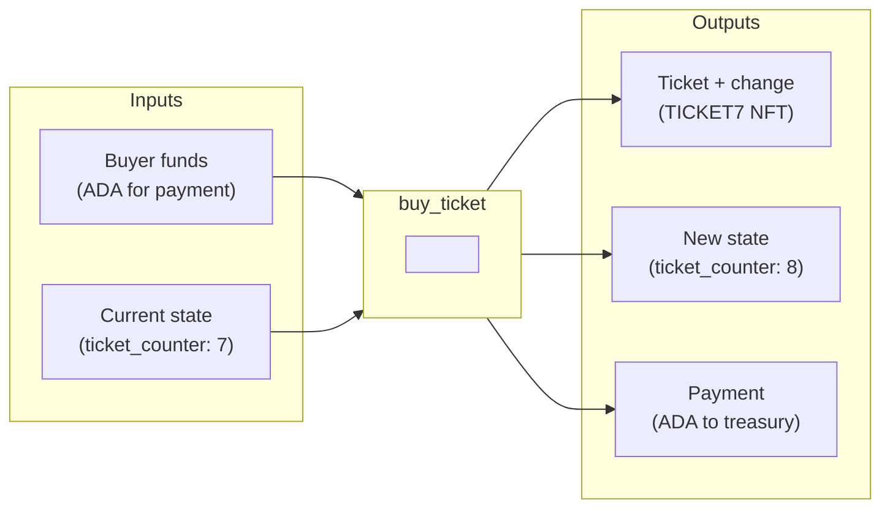

In this guide, we dive into the key differences between developing on Ethereum and Cardano, guiding you through how to build on Cardano. Coming from Ethereum, Cardano will look and feel different and have a distinct toolset to use as you develop. This guide will arm you with all the tools necessary to build on Cardano from an Ethereum background.

## What Makes Cardano Different from Ethereum?

### Account Model

When developing on Cardano, the most significant difference you will encounter is the account model design. Understanding why Cardano's model was designed differently helps make sense of everything else.

Unlike Ethereum, Cardano is designed around the **Extended UTXO (EUTXO) model** rather than an account-based model. On Ethereum, each address maintains a balance stored in global state. Transactions update these balances directly, and smart contracts hold and modify their own storage.

On Cardano, value exists as discrete **Unspent Transaction Outputs (UTXOs)**. Think of UTXOs like physical cash: you have specific bills and coins, not just a number in an account. When you spend, you consume entire UTXOs and create new ones as outputs. If you have a 100 ADA UTXO and want to send 10 ADA to someone, the transaction consumes your 100 ADA UTXO entirely and creates two new UTXOs: one with 10 ADA for the recipient and one with 90 ADA as your change.

Smart contracts on Cardano carry no state of their own and must have state passed to them. To illustrate this, let's look at two smart contracts for a counter: one in Solidity on Ethereum and one in Aiken on Cardano.

**Ethereum Counter Smart Contract**

```js
contract Counter {
    uint256 private count;

    function incrementCounter() public {
        count += 1;
    }

    function getCount() public view returns (uint256) {
        return count;
    }
}
```

In Solidity, `count` is stored directly in the contract's storage and modified in place. The contract maintains its own state.

**Cardano Counter in Aiken**

On Cardano, we need to think differently. The state (our count) lives in a **datum** attached to a UTXO, not inside the validator. The validator's job is to approve or reject a proposed state change, not to execute the change itself.

First, we define what our state looks like:

```aiken
pub type SpendingValidatorDatum {
  count: Int,
}
```

Then we define what actions a user can take:

```aiken
pub type MyRedeemer {
  ContinueCounting
  StopCounting
}
```

Now the validator. When someone wants to increment the counter, they build a transaction that:

1. Consumes the UTXO containing the current count
2. Creates a new UTXO with the updated count
3. The validator checks if this transformation is valid

```aiken
validator counter_validator {
  spend(
    datum_opt: Option<SpendingValidatorDatum>,
    redeemer: MyRedeemer,
    _input: OutputReference,
    tx: Transaction,
  ) {
    expect Some(input_datum) = datum_opt

    when redeemer is {
      ContinueCounting -> {
        // Find the output going back to this script
        expect Some(output) = find_continuing_output(tx)
        expect output_datum: SpendingValidatorDatum = get_datum(output)

        // Validate: new count must be old count + 1
        input_datum.count + 1 == output_datum.count
      }
      StopCounting -> {
        // Allow stopping without creating new output
        True
      }
    }
  }

  else(_) {
    fail
  }
}
```

The key differences:

- **No mutable state**: The validator doesn't store `count`. It validates that the transaction correctly updates it.
- **Datum**: State is attached to UTXOs, not stored in the contract.
- **Redeemer**: The user's intended action is passed as data with the transaction.
- **Validation, not execution**: The validator approves or rejects; it doesn't execute the increment itself.

### What Are the Benefits of the EUTXO Model?

The EUTXO model brings several advantages that become clear once you start building.

**Parallelization**: Transactions operating on different UTXOs can process in parallel. There's no global state contention like you'd find with a single counter contract on Ethereum being accessed by many users. If 100 users each have their own counter UTXO, all 100 can update simultaneously.

**Deterministic Validation**: You know exactly what will happen before submitting a transaction. The validator runs the same way locally as it does on-chain. If it passes locally, it passes on-chain.

**No Failed Transaction Fees**: If a transaction will fail validation, it fails off-chain before submission. You don't pay for failed transactions.

**Local Fee Markets**: High activity on one dApp doesn't spike fees for everyone else. If there's a hot NFT mint happening, users sending simple ADA transfers are unaffected and continue paying normal fees.

**No Reentrancy**: UTXOs are consumed atomically in a single transaction. The reentrancy attacks that have plagued Ethereum contracts are structurally impossible on Cardano.

## How Do Fees Work on Cardano?

Fees on Ethereum are calculated as Gas × Gas Price, making them variable and unpredictable. You don't know the exact cost until execution, and network congestion causes fee spikes. Even failed transactions cost you gas.

Cardano takes a different approach. Fees are calculated using a fixed formula based on transaction size: `a × tx_size + b`, where `a` and `b` are protocol parameters. This makes fees deterministic. You calculate the fee before submitting, and that's exactly what you pay. No gas price auctions, no surprises, no fee spikes during congestion.

Script execution costs are included in this base formula. There's also a per-execution cost for computational units, but it's still deterministic and calculable before submission.

One thing similar to Solana's rent model: every UTXO must contain a minimum amount of ADA to exist on-chain. This prevents ledger bloat from tiny spam UTXOs. The minimum depends on the UTXO's size (more tokens or larger datum means more ADA required). Unlike Solana's rent, this deposit isn't consumed over time; it stays with the UTXO until spent.

## How Do Transactions Work on Cardano?

A Cardano transaction consists of several parts:

- **Inputs**: UTXOs being consumed (must be unspent)
- **Outputs**: New UTXOs being created
- **Signatures**: Required to authorize spending
- **Validity interval**: A time window when the transaction is valid
- **Redeemers**: Data passed to validators
- **Mint/burn**: Token operations, if any

The validity interval deserves special attention. On Ethereum, smart contracts can call `block.timestamp` to get the current time. This would break determinism on Cardano since asking for "current time" at different moments gives different answers.

Cardano solves this with validity intervals. Every transaction declares a time window (lower and/or upper bound) during which it's valid. The ledger rejects transactions outside their window before any script runs. Your validator can then safely assume: "If I'm running, the current time is within the validity interval." To enforce "action X only after date Y," store date Y in the datum and check that the transaction's lower bound is greater than or equal to Y.

A significant difference from Ethereum is the number of operations in a single transaction. On Ethereum, you typically call one contract per transaction. On Cardano, you can spend from multiple script addresses, mint tokens from multiple policies, and do it all atomically in one transaction. Each validator runs independently, all must pass, and everything happens atomically. This enables powerful composition without needing router contracts.

## How Do Smart Contracts Work?

### Validators, Not Actors

This is the key mental model shift. On Ethereum, when you call `counter.increment()`, the contract executes code that modifies its storage. The contract is an actor that takes actions.

On Cardano, validators don't execute actions. They approve or reject proposed actions. You build a transaction that proposes consuming certain UTXOs and creating certain outputs. The validator examines this proposal and returns true or false. It cannot send tokens, call other validators, or modify state directly.

Think of it this way: On Ethereum, you tell the contract what to do. On Cardano, you do it yourself and the validator checks if you did it correctly.

### Adding Authorization: The `onlyOwner` Pattern

Let's extend our counter example to require owner authorization. On Ethereum, you'd use a modifier:

```solidity
address public owner;

modifier onlyOwner() {
    require(msg.sender == owner, "Not owner");
    _;
}

function increment() public onlyOwner {
    count += 1;
}
```

On Cardano, we check if the owner signed the transaction. Here's how that looks using the `key_signed` helper function:

```aiken
use cocktail.{key_signed}

validator counter_with_owner(owner: VerificationKeyHash) {
  spend(
    datum_opt: Option<SpendingValidatorDatum>,
    redeemer: MyRedeemer,
    _input: OutputReference,
    tx: Transaction,
  ) {
    expect Some(input_datum) = datum_opt

    // Check if owner signed
    let is_owner_signed = key_signed(tx.extra_signatories, owner)

    when redeemer is {
      ContinueCounting -> {
        expect Some(output) = find_continuing_output(tx)
        expect output_datum: SpendingValidatorDatum = get_datum(output)

        is_owner_signed? && (input_datum.count + 1 == output_datum.count)
      }
      StopCounting -> is_owner_signed?
    }
  }

  else(_) {
    fail
  }
}
```

The `owner` parameter is baked into the script at compile time. Different owners produce different script hashes, meaning different addresses.

### Adding Time Locks

What if we want the counter to only work before a certain deadline? On Ethereum, you'd check `block.timestamp`. On Cardano, we use validity intervals. Here's a more complete example based on our vesting contract pattern:

```aiken
use cocktail.{key_signed, valid_before}

pub type CounterDatum {
  count: Int,
  owner: ByteArray,
  deadline: Int,  // POSIX timestamp in milliseconds
}

validator timed_counter {
  spend(
    datum_opt: Option<CounterDatum>,
    _redeemer: Data,
    _input: OutputReference,
    tx: Transaction,
  ) {
    expect Some(datum) = datum_opt

    let is_owner_signed = key_signed(tx.extra_signatories, datum.owner)
    let is_not_expired = valid_before(tx.validity_range, datum.deadline)

    is_owner_signed? && is_not_expired?
  }

  else(_) {
    fail
  }
}
```

The `valid_before` function checks that the transaction's validity interval ends before the deadline. If someone tries to submit a transaction after the deadline, the ledger rejects it before the script even runs.

### Mapping Concepts

Here's how Ethereum concepts map to Cardano:

- **Contract storage** becomes **Datum** (data attached to UTXOs)
- **Function parameters** become **Redeemer** (user-provided action data)
- **`msg.sender`** becomes checking **`tx.extra_signatories`**
- **`msg.value`** becomes examining input/output values explicitly
- **`require(condition)`** becomes Aiken's **`expect`** or **`?`** assertions
- **`modifier onlyOwner`** becomes **`key_signed(signers, owner)`**
- **`mapping(addr => uint)`** becomes one UTXO per entry (datum holds the value)
- **`constructor`** becomes parameterized script (baked in at compile time)
- **Events** become transaction metadata or off-chain indexing
- **View functions** become querying UTXOs directly via API
- **ABI** becomes **Blueprint** (`plutus.json`, the compiled output with types)

## Native Tokens vs ERC-20/721

On Ethereum, tokens are smart contracts. Creating an ERC-20 requires deploying a contract (often 200-500 lines of Solidity), and every transfer is a contract call that costs gas. The `approve` + `transferFrom` pattern is necessary for dApps to spend your tokens.

On Cardano, tokens are native to the ledger. They exist at the same level as ADA, not as contract state. Transfers are native transactions with fixed fees, the same as sending ADA. Multiple different tokens can move in a single transaction. There's no `approve` pattern needed because dApps interact with tokens the same way they interact with ADA.

### Native Scripts: No Smart Contract Needed

For simple minting rules, you don't need to write any Plutus or Aiken code. Cardano has **native scripts**—a minimal scripting language built into the ledger with six simple constructors: `sig` (require signature), `all` (all conditions), `any` (any condition), `atLeast` (n-of-m), `before` (time lock), and `after` (time lock).

For example, to create a token that requires your signature and can only be minted before a deadline:

```typescript
const nativeScript: NativeScript = {
  type: "all",
  scripts: [
    { type: "before", slot: "99999999" },
    { type: "sig", keyHash: yourPubKeyHash },
  ],
};
```

That's it. No contract deployment, no bytecode. The ledger validates these rules directly. This covers most basic token use cases: single-owner minting, multisig minting, time-locked minting.

### Plutus Scripts: When You Need More

When you need complex business logic—conditional minting based on other UTXOs, oracle data, or custom validation—you write a minting policy in Aiken:

```aiken
validator my_token(owner: VerificationKeyHash) {
  mint(_redeemer: Data, _policy_id: PolicyId, tx: Transaction) {
    key_signed(tx.extra_signatories, owner)
  }

  else(_) {
    fail
  }
}
```

This gives you full programmability: check transaction inputs/outputs, reference other UTXOs, enforce arbitrary conditions. The token still appears in wallets as a native asset—the difference is only in how minting/burning is controlled.

## Putting It Together: A Ticketing System

Let's see how these concepts combine in a real protocol. This ticketing system was used for conference registration, issuing unique NFT tickets where each purchase increments a counter and mints a token named `TICKET0`, `TICKET1`, and so on.

### Transaction Anatomy

Here's what a ticket purchase transaction looks like:



Two inputs are consumed: the buyer's funds and the current protocol state. Three outputs are created: the ticket goes to the buyer, the updated state continues the protocol, and payment goes to the treasury. Everything happens atomically—if any part fails, nothing happens.

### The Validator

This validator handles both spending (state updates) and minting (ticket creation) in a single script. Here's the complete code:

```aiken
validator ticketer(
  admin_token: AssetClass,
  blind_price: Int,
  normal_price: Int,
  switch_slot: Int,
  treasury: Address,
  max_tickets: Int,
) {
  spend(datum: Option<TicketerDatum>, redeemer: TicketerRedeemer, utxo: OutputReference, tx: Transaction) {
    expect Some(datum) = datum
    let TicketerDatum { ticket_counter } = datum

    expect ticket_counter < max_tickets

    expect [ticketer_output] = list.filter(outputs, fn(o) { o.address == ticketer_input.output.address })

    expect ticketer_datum: TicketerDatum = ticketer_output.datum
    let must_update_datum = ticketer_datum.ticket_counter == ticket_counter + 1

    let current_price = if interval.is_entirely_before(tx.validity_range, switch_slot) {
      blind_price
    } else {
      normal_price
    }

    let must_pay_treasury = list.any(outputs, fn(o) {
      o.address == treasury && quantity_of(o.value, ada_policy_id, ada_asset_name) >= current_price
    })

    let ticket_name = concat("TICKET", from_string(string.from_int(ticket_counter)))
    let must_mint_ticket = tx.mint == from_asset(policy_id, ticket_name, 1)

    must_update_datum? && must_pay_treasury? && must_mint_ticket?
  }

  mint(redeemer: TicketPolicyRedeemer, policy_id: PolicyId, tx: Transaction) {
    when redeemer is {
      MintTicket -> {
        list.any(tx.inputs, fn(input) {
          input.output.address.payment_credential == Script(policy_id)
        })
      }
      BurnTicket -> {
        list.all(tokens(tx.mint, policy_id), fn(pair) { pair.2nd < 0 })
      }
    }
  }
}
```

Let's break down what's happening.

### Parameterized Scripts

```aiken {1-8}
validator ticketer(
  admin_token: AssetClass,
  blind_price: Int,
  normal_price: Int,
  switch_slot: Int,
  treasury: Address,
  max_tickets: Int,
) {
```

Configuration is baked into the script at compile time. `treasury`, `max_tickets`, and prices aren't stored in contract state—they're parameters. Different parameters produce different script hashes, meaning different addresses. There's no mutable storage to update later.

### State Lives in Datums

```aiken {2-3}
  spend(datum: Option<TicketerDatum>, redeemer: TicketerRedeemer, utxo: OutputReference, tx: Transaction) {
    expect Some(datum) = datum
    let TicketerDatum { ticket_counter } = datum
```

The `ticket_counter` isn't stored in the contract—it's attached to the UTXO being spent. Each purchase consumes the old state UTXO and creates a new one with an incremented counter. The validator receives this state as input, not from internal storage.

### Validators Approve, Don't Execute

```aiken {1-2}
    expect ticketer_datum: TicketerDatum = ticketer_output.datum
    let must_update_datum = ticketer_datum.ticket_counter == ticket_counter + 1
```

The validator doesn't increment the counter. It checks that whoever built the transaction incremented it correctly. The off-chain code does the work; the on-chain code validates the result. If the output datum doesn't have exactly `ticket_counter + 1`, validation fails.

### Time via Validity Intervals

```aiken {1-5}
    let current_price = if interval.is_entirely_before(tx.validity_range, switch_slot) {
      blind_price
    } else {
      normal_price
    }
```

Instead of calling `block.timestamp`, the validator checks if the transaction's validity range falls before or after `switch_slot`. Early bird pricing is enforced by the ledger rejecting transactions submitted after the deadline—before the script even runs. The validator just needs to check which price tier applies.

### Multiple Validators, One Transaction

```aiken {2-5}
  mint(redeemer: TicketPolicyRedeemer, policy_id: PolicyId, tx: Transaction) {
    when redeemer is {
      MintTicket -> {
        list.any(tx.inputs, fn(input) {
          input.output.address.payment_credential == Script(policy_id)
        })
```

The `spend` validator handles state updates while the `mint` validator controls ticket creation. For minting, the validator just checks that the spend validator is also running in this transaction—ensuring state is properly updated. Both validators run independently; if either fails, the whole transaction is rejected atomically.

### Admin Token for Authentication

The `admin_token` parameter solves a Cardano-specific problem: anyone can create UTXOs at any address. Without the admin token, an attacker could create fake state UTXOs with manipulated counters. The validator checks that the state UTXO contains this unique token, proving it's legitimate protocol state rather than a spoofed UTXO.

This is what production Cardano development looks like: declarative transactions where you specify exactly what should happen, and validators that approve or reject based on whether you followed the rules.

## Developer Environment

### Programming Languages

Ethereum developers primarily use Solidity. On Cardano, the most popular language is **Aiken**: a purpose-built language with Rust-like syntax, strong static typing, and excellent tooling. Aiken compiles directly to UPLC (Untyped Plutus Core), Cardano's native bytecode.

Alternatives exist too: **OpShin** offers Python-like syntax, **Plu-ts** is a TypeScript-embedded DSL, and **Scalus** uses Scala.

### Tools

| Ethereum | Cardano |
|----------|---------|
| Hardhat, Foundry | **Aiken CLI** (`aiken build`, `aiken check`) |
| Remix | **Aiken Playground** (play.aiken-lang.org) |
| Web3.js, ethers.js | [Client SDKs](/docs/get-started/client-sdks/overview) like **Mesh SDK** (TypeScript) |
| Ganache | [Local development networks](/docs/get-started/infrastructure/api-providers/overview) like [**Yaci DevKit**](https://devkit.yaci.xyz/) |
| Infura, Alchemy | [API Providers](/docs/get-started/infrastructure/api-providers/overview) like [Blockfrost](https://blockfrost.dev/), [Maestro](https://www.gomaestro.org/), [Koios](https://koios.rest/) |
| Etherscan | [Explorers](https://explorer.cardano.org/) |
| MetaMask | [Wallets](https://cardano.org/apps/?tags=wallet) |

### Client SDKs

| Language | SDK |
|----------|-----|
| TypeScript | **Mesh SDK**, Lucid Evolution |
| Python | PyCardano |
| Rust | Pallas |
| Go | go-cardano |
| C# | CardanoSharp |

### Development Workflow

1. Write validators in Aiken (`.ak` files)
2. Build with `aiken build`, which generates `plutus.json` (the "blueprint")
3. Test with `aiken check` (built-in test framework)
4. Import compiled scripts into your off-chain app
5. Deploy by sending UTXOs to the script address

There's no separate "deployment" transaction like Ethereum. The script hash determines the address. Same script always produces the same address.

## What's Different with Smart Contract Development?

### No Contract Calls

Ethereum contracts can call other contracts. Cardano validators cannot call other validators. Instead, you compose multiple validations in a single transaction.

On Ethereum, a swap might look like:

```solidity
function swap() {
    tokenA.transferFrom(msg.sender, address(this), amount);
    tokenB.transfer(msg.sender, otherAmount);
}
```

On Cardano, you build a transaction that spends from the TokenA script (validator A runs), spends from the TokenB script (validator B runs), and creates outputs distributing tokens correctly. Both validators independently verify their conditions. All run, all must pass, everything happens atomically.

### No Mapping Type

Ethereum's `mapping(address => uint)` has no direct equivalent. Instead, you use the UTXO pattern: create one UTXO per entry, with the datum containing the key and value. To look up an entry, query for UTXOs at the script address with matching key in datum. This is actually more parallelizable since multiple users can update their entries simultaneously without contention.

### Upgrades Work Differently

On Ethereum, proxy patterns enable upgrades while keeping the same address. On Cardano, the same code always produces the same script hash, which determines the address. Different code means different address.

For upgradeable patterns, you can use parameterized scripts (different parameters create different addresses), reference scripts (CIP-33, store script on-chain and reference it), or migration (move UTXOs from old script to new).

### Watch Out: Double Satisfaction

This is a Cardano-specific vulnerability with no Ethereum equivalent. Since validators run independently for each input, and all have access to the same transaction outputs, a careless validator can be "satisfied" multiple times by the same output.

Example: A swap validator requires "pay 5 ADA to the seller." If two UTXOs are locked at the same price, an attacker can pay 5 ADA once but claim both UTXOs. Each validator sees the payment and approves.

The solution is to tag outputs uniquely, using the input's output reference as a datum on the corresponding output so each validator looks for its specific tagged output.

## Next Steps

Ready to start building? Here's your path:

1. **Learn Aiken**: [aiken-lang.org](https://aiken-lang.org) has the complete language guide and tutorials
2. **Hands-on Lessons**: Work through our [Smart Contract Lessons](/docs/smart-contracts/lessons/) to build real projects
3. **Set Up Off-chain**: [Mesh SDK](/docs/get-started/client-sdks/typescript/mesh/overview) for transaction building
4. **Get Test ADA**: Deploy to [Preview or Preprod testnets](/docs/get-started/networks/testnets)
5. **Explore Core Concepts**: [EUTXO Model](/docs/learn/core-concepts/eutxo) for deeper understanding

### Community

- [Developer Community](/docs/community/cardano-developer-community) - Connect with the Cardano developer community
