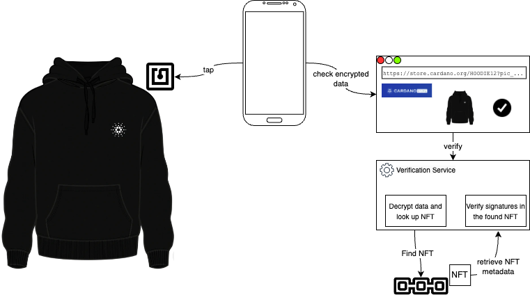

The recently opened [Cardano Store](https://store.cardano.org/) offers sustainably produced promotional items and innovative products. The latter category in particular offers blockchain enthusiasts products and product prototypes that connect the physical world with the virtual world using blockchain technology. The first product of that kind is the [POC Hoodie](https://store.cardano.org/products/hoodie), which is equipped with an NFC chip that can be used to verify the authenticity of the hoodie based on the unique possibilities of the Cardano blockchain. A similar approach was already used in summer 2023 with the [Lacrosse World Cup Jersey](https://cardanofoundation.org/en/news/technical-collaboration-with-epoch-sports-merchadise/) showcase. While the revised approach of the POC Hoodie offers some improvements, particularly in the area of security, it is not the end of the development process.

In the following, we briefly outline the background to the development of the POC Hoodies, provide an overview of the actual implementation and conclude with an outlook on future improvements. First, however, we will show how the hoodies work and how users can validate them.

## Proof of Concept Hoodies

For the owner of a POC Hoodie the verification process is as straightforward as tapping the NFC tag that’s knitted into the hoodie which redirects them to a website where the verification status is displayed.

Whereas this way of verification is convenient and easily accessible for also non tech savvy people, it relies on a centrally hosted website which essentially one has to trust when being provided with the information of the hoodie’s authenticity. However, if equipped with the right blockchain knowledge and access to tools like a Blockchain Explorer, users can perform further verifications independently from the output of the website by looking up the asset name returned within the URL string of the NFC chip and checking if the policy ID of the found NFT matches `e886a328333c28bf3e8fc527206b02dc9ff65fb04cf569ec71983330`.

What actually happens in the background when the user taps the NFC tag is that by tapping, the smart phone gets provided with a URL that contains encrypted data that identifies and allows the backend to verify the corresponding NFT on the Cardano blockchain. Following that URL the user ends up on the already mentioned website, which forwards the encrypted data to a validation service that is able to decrypt it and use the encoded information (namely the asset id) to look for a corresponding NFT on the Cardano blockchain. If it finds one, the [metadata of this NFT](https://beta.explorer.cardano.org/en/token/asset1mphtfzam7z23pkzqptpymha6qwm4j6w32275r9/metadata) is analysed and compared to the data stored on the NFC chip and thus verified. This verification is based on asymmetric key cryptography meaning a signature made during the minting process is verified with the key data sent within the encrypted data.

The data on the NFC chip is encrypted using symmetric encryption keys, which means there remains a shared secret between the Hoodie (more accurately the secret was available during the preparation of the NFC chip) and the validation service in the backend. Moreover, the NFC chip keeps track of a counter which is incremented with every readout/tapping of the tag and therefore allows the backend to check for so-called replay-attacks (as it can check if a given link has already been used).

The process is depicted in here:
 
 

:::tip

The process of flashing the NFC chips, which model we are using and some tools will be available here soon.

:::

All NFTs minted corresponding to the physical Hoodies can be found following this link to [pool.pm](https://pool.pm/policy/e886a328333c28bf3e8fc527206b02dc9ff65fb04cf569ec71983330) or looking for the policy ID `e886a328333c28bf3e8fc527206b02dc9ff65fb04cf569ec71983330` (the hash of the minting policy script) in any other suitable [Explorer](https://developers.cardano.org/showcase?tags=explorer).

## Future Work

The current solution is considered a POC because there are various areas of improvement left open. A major drawback is e.g. that the verification service itself is centrally hosted and the validation of the product’s authenticity cannot be completely done without that service. The NFTs bound to the Hoodies are based on the [CIP-25 NFT standard](https://github.com/cardano-foundation/CIPs/tree/master/CIP-0025) which lacks certain features of the more dynamic and versatile standard [CIP-68](https://github.com/cardano-foundation/CIPs/tree/master/CIP-0068). Defining a similar standard to [CIP-68](https://github.com/cardano-foundation/CIPs/tree/master/CIP-0068) that leverages the same mechanisms but applying it to the asset ownership transfer challenge will ensure a secure and trustless transfer of ownership of the digital asset that is tied to the physical good. In that case users can own a token in their wallet, that points to the smart contract responsible for managing the actual ownership and only if a corresponding inline datum storing the list of actual owners points back to the asset, the ownership is considered valid.

The biggest improvement though would be the use of even more sophisticated [NFC chips](https://www.azuki.com/updates/pbt) which allow for the signing of a presented payload leveraging asymmetric key cryptography which would enable a setup, where there is no shared secret between the customer owned physical goods and the centrally hosted backend. This solution would enable multi signature schemes when it comes to the transfer of ownership of the corresponding NFT.