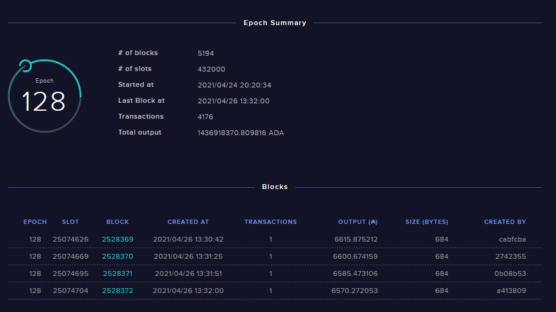
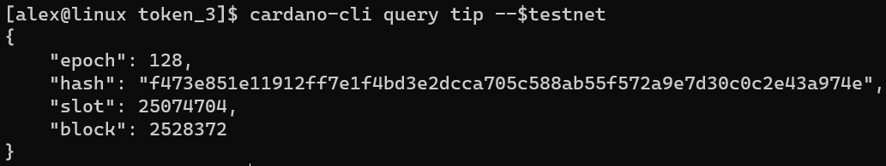
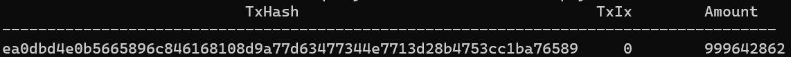
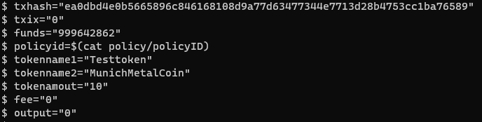
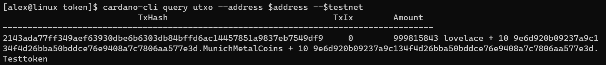
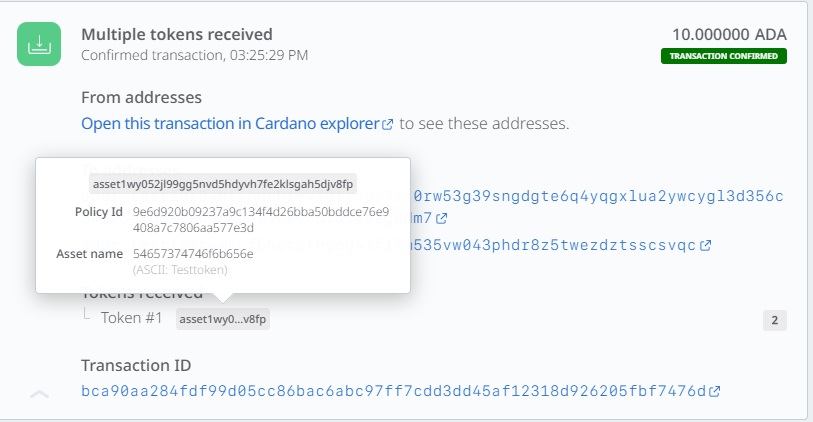
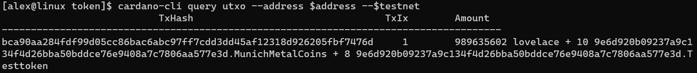
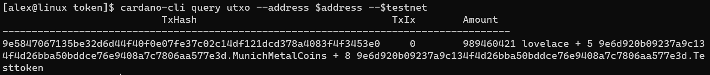

There are currently two ways to make your NFTs:

- For the not so tech-savvy through someone else. The [showcase section](../../showcase/?tags=nft) has a few services that offer this.
- For the more tech-savvy on a Cardano node. If you want to have full control over your tokens, you need to mint them **yourself**. And this is what this guide is all about.

Minting requires a certain amount of skill in navigating and working with Linux through the terminal as well as a running Cardano node.

We will not go into the details on how to spin up a Cardano node, but this is covered in the [integrate Cardano category](../cardano-integration/installing-cardano-node).

## Assumptions

Here are some assumptions we are going to make about you — the reader:

- You have a full node running in testnet. If you want to mint tokens in mainnet, substitute the $testnet variable with mainnet
- The Cardano node version for this test uses v1.26.1
- You have some knowledge in Linux as to navigation between directories, creating and editing files as well as setting and inspecting variables via Linux shell
- You have a user who has access to the cardano-cli command
- If you want to make NFTs and have an image linked, that image already needs to be uploaded somewhere (preferably IPFS), and you should have that hash available.

We always like to start by giving some orientation, so here’s an overview of what kind of files and folders we are going to create in the course of this guide:

```
├── burning.raw                    # Raw transaction to burn token
├── burning.signed                 # Signed transaction to burn token
├── matx.raw                       # Raw transaction to mint token
├── matx.signed                    # Signed transaction to mint token
├── metadata.json                  # Metadata to specify NFT attributes
├── payment.addr                   # Address to send / recieve
├── payment.skey                   # Payment signing key
├── payment.vkey                   # Payment verification key
├── policy                         # Folder which holds everything policywise
│   ├── policy.script              # Script to genereate the policyID
│   ├── policy.skey                # Policy signing key
│   ├── policy.vkey                # Policy verification key
│   └── policyID                   # File which holds the policy ID
└── protocol.json                  # Protocol parameters
```

## Prerequisites

Before we start, let’s set a variable to make readability a bit easier.

```shell
testnet="testnet-magic 1097911063"
```

This will be an ongoing theme in this tutorial. We sometimes will save outputs or strings into variables so we can reference them in a more readable way.

To work with the Cardano node, we also need to set a variable called `CARDANO_NODE_SOCKET_PATH`.

The path to the socket is always specified in the startup command of the node.

So either you know it by heart or you pull up your starting command / unit file for the node and check where the `.socket` file is located. You could, for example, start your node with the following command:

```shell {4}
/home/alex/.local/bin/cardano-node run \
 --topology config/testnet-topology.json \
 --database-path db \
 --socket-path /home/alex/TESTNET_NODE/socket/node.socket \
 --port 3001 \
 --config config/testnet-config.json
```

So we need to export this specific socket path (highlighted line) to the variable `CARDANO_NODE_SOCKET_PATH`.

```shell
export CARDANO_NODE_SOCKET_PATH="/home/alex/TESTNET_NODE/socket/node.socket"
```

You need to adjust the path on your setup and your socket path accordingly.

## Check node status

We also want to check if our node is up to date. To do that, we check the current epoch/block and compare it to the current value displayed in the [Cardano Explorer for the testnet](https://explorer.cardano-testnet.iohkdev.io).


_Current Block in Epoch 128 = 2528369_


_Query showing that node is not fully synced and a few blocks behind, but this should work nonetheless_

Another good way to quickly check your node is to issue the query tip for a couple of seconds and check if the slot is changing. Now we’re set up and good to go.

To keep a clean working environment, we create a new directory and change into it:

```shell
mkdir tokens
cd tokens
```

## Build the keys & address

First of all, we need to create a payment key set (verification and signing):

```shell
cardano-cli address key-gen --verification-key-file payment.vkey --signing-key-file payment.skey
```

Fuse them together to build an address to receive funds and send ada and tokens:

```shell
cardano-cli address build --payment-verification-key-file payment.vkey --out-file payment.addr --$testnet
```

Save address for later use in a variable called `address`:

```shell
address=$(cat payment.addr)
```

To mint tokens, we also need to have some ada.
In the testnet, you can request funds through [the faucet](https://developers.cardano.org/en/testnets/cardano/tools/faucet/).
Just enter the address we exported to our `address` variable and hit request.

```shell
echo $address
```

After a couple of seconds, you should have received the funds and can check those with:

```shell
cardano-cli query utxo --address $address --$testnet
```

To build a transaction and calculate the fees to mint the tokens, we need the current protocol parameters. Let’s query them and save them in a file called protocol.json to reference later on:

```shell
cardano-cli query protocol-parameters --$testnet --out-file protocol.json
```

Generate the policy
Policies are the defining factor under which tokens can be minted. Only those in possession of the policy keys can mint or burn tokens minted under this specific policy.

We’ll make a separate sub-director in our work directory to keep everything policy-wise separated and more organized:

```shell
mkdir policy
```

:::note
We don’t change into this directory, and everything is done from our working directory.
:::

First of all, we — again — need some key pairs:

```shell
cardano-cli address key-gen \
    --verification-key-file policy/policy.vkey \
    --signing-key-file policy/policy.skey
```

Create a `policy.script` file and fill it with an empty string:

```shell
touch policy/policy.script && echo "" > policy/policy.script
```

Use `echo`to populate the file:

```shell
echo "{" >> policy/policy.script
echo "  \"keyHash\": \"$(cardano-cli address key-hash --payment-verification-key-file policy/policy.vkey)\"," >> policy/policy.script
echo "  \"type\": \"sig\"" >> policy/policy.script
echo "}" >> policy/policy.script
```

:::note
the second echo uses a sub-shell command to generate the so-called key-hash.
:::

The end result is a simple script file that defines the policy verification key as a witness / to sign the minting transaction.

## Asset Minting

To mint the asset, we need to generate the policy ID from the script file we created.

```shell
cardano-cli transaction policyid --script-file ./policy/policy.script >> policy/policyID
```

The output gets saved to the file `policyID` as we need to reference it later on.
Additionally, we need some metadata to attach to the transaction. Metadata helps us to display things like image URIs and stuff that truly makes it an NFT. With this workaround, third party platforms like [pool.pm](https://pool.pm) can easily trace back to the last minting transaction, read the metadata and query images and attributes accordingly.

The one thing to keep in mind — the names, in our case `Testtoken` and `MunichMetalCoin`, are case sensitive and need to match the names in the minting transaction. We’ll leave the image property blank for now — if you want to attach an image, best practice suggests you paste in your ipfs:// hash.

Here’s an example of the metadata.json which we’ll use for this guide:

```json
{
  "721": {
    "please_insert_policyID_here": {
      "Testtoken": {
        "description": "This is just a testtoken",
        "name": "One of ten testtokens",
        "type": "",
        "id": 1,
        "name": "This is my first test token",
        "image": ""
      }
    },
    "please_insert_policyID_here": {
      "MunichMetalCoin": {
        "description": "One coin to rule them all",
        "name": "One of ten Munich Metal Coins",
        "type": "",
        "id": 1,
        "name": "This is my first test token",
        "image": ""
      }
    }
  }
}
```

Take note/copy the `policyID`:

```shell
cat policy/policyID
```

And create a new file called metadata.json with your favourite editor:

```shell
vi metadata.json
```

Paste in the json structure posted above and substitute the `please_insert_policyID_here` string with our previously made policy ID.

## Build the raw transaction to send to oneself

To mint the tokens, we will make a transaction using our previously generated and funded address.
Within this transaction, we will define a minting action and attach the metadata.json to it.
Therefore our attributes will be bound immutably to the minting action, making our token(s) a true NFT.

### A quick word about transactions in Cardano

Each transaction in Cardano requires the payment of a fee which — as of now — will mostly be determined by the size of what we want to transmit. The more bytes get sent, the higher the fee. That’s why making a transaction in Cardano is a three-way process.

1. First, we will build a transaction, resulting in a file. This will be the foundation of how the transaction fee will be calculated.
1. We use this `raw` file and our protocol parameters to calculate our fees.
1. Then, we need re-build the transaction, including the correct fee and the adjusted amount which we’re able to send. Since we send it to ourself, the output needs to be the amount of our fundings minus the calculated fee.

Another thing to keep in mind is the model of how transactions and “balances” are designed in Cardano. Each transaction has one (or multiple) inputs (the source of your funds, like which bill you’d like to use in your wallet to pay) and one or multiple outputs. In our minting example, the input and output will be our own address.

> In a way, the minting process is the same as taking a bill out of your wallet and changing it to coins and some tokens.

Later on, we will actually send some tokens to another wallet. In this transaction, we not only need to define the receiver of the tokens, we also need to specify what to do with the “leftovers”. Think of it like buying ice cream.

If you’d pay the ice cream man in ada, you’d not only need to determine how much you pay for your ice cream, you’d also need to determine how much you overpaid and will get back.

Before we start, we will need some setup to make the transaction building easier. Query the payment address and take note of the different values presented:

```shell
cardano-cli query utxo --address $address --$testnet
```

The output looks something like this (your TxHash, as well as funds, will vary):


We will store each of those values in a corresponding variable to make it easier to build and read our transactions.

```shell
txhash="insert your txhash here"
txix="insert your TxIx here"
funds="insert Amount here"
policyid=$(cat policy/policyID)
```

For our example, we will be making 10 `Testtoken` and 10 `MunichMetalCoins` for a total of 20 tokens. So we set those as variables as well:

```shell
tokenname1="Testtoken"
tokenname2="MunichMetalCoins"
tokenamount="10"
fee="0"
output="0"
```

After setting every variable, your terminal should look something like this:


Now we build the first transaction to calculate our fee and save it in a file called `matx.raw`.
Before we build the transaction, take a look at this overview. Here’s the syntax as to which parameters we define in our minting transaction:

- `fee`: The network fee we need to pay for our transaction. Fees will be calculated through the network parameters and depending on the size (in bytes) our transaction will have. The bigger the file size, the higher the fee.
- `tx-in`: The hash of our address we use as the input for the transaction. It needs sufficient funds.
  The syntax is: the hash, followed by a hashtag, followed by the value of TxIx of the corresponding hash.
  Because we saved those values in variables, we will reference the variables in our transaction to improve readability.
- `tx-out`: Here is where part one of the magic happens. We need to specify which address will receive our transaction. In our case, we send the tokens to our own address. The word for word syntax is (there are no spaces unless explicitly stated):
  - address hash
  - a plus sign
  - the output in Lovelace (ada) (output = input amount — fee)
  - a plus sign
  - quotation marks
  - the amount of the token
  - a blank/space
  - the policy id
  - a dot
  - the token name
  - (optional if you want multiple/different tokens: a blank, a plus, a blank, and start over at 6.)
  - quotation marks
- `mint`: Again, the same syntax as specified in — tx-out but without the address and output, therefore starting at 5. from the — tx-out parameters.
- `metadata-json-file`: The path to our `metadata.json`, which we will attach to our transaction.
- `out-file`: We save our transaction to a file which you can name however you want. Just be sure to reference the correct filename in upcoming commands. I chose to stick with the official docs and declared it as `matx.raw`.

So, with those parameters in mind, this is what our transaction build command looks like:

```shell
cardano-cli transaction build-raw \
 --fee $fee \
 --tx-in $txhash#$txix \
 --tx-out $address+$output+"$tokenamount $policyid.$tokenname1 + $tokenamount $policyid.$tokenname2" \
 --mint="$tokenamount $policyid.$tokenname1 + $tokenamount $policyid.$tokenname2" \
--metadata-json-file metadata.json  \
 --out-file matx.raw
```

Based on this `raw` transaction, we can calculate the minimum transaction fee and store it in the variable $fee. We get a bit fancy here and only store the value so we can use the variable for terminal-based calculations:

```shell
fee=$(cardano-cli transaction calculate-min-fee --tx-body-file matx.raw --tx-in-count 1 --tx-out-count 1 --witness-count 1 --$testnet --protocol-params-file protocol.json | cut -d " " -f1)
```

:::note
The input and the output of ada must be equal, or otherwise, the transaction will fail.
:::

To calculate the remaining output wee need to subtract the fee from our funds and save the result in our output variable:

```shell
output=$(expr $funds - $fee)
```

We now have every value we need, so we can re-build the transaction, ready to be signed. To re-build we just issue the same command again, the only difference being our variables now holding the correct values:

```shell
cardano-cli transaction build-raw \
--fee $fee  \
--tx-in $txhash#$txix  \
--tx-out $address+$output+"$tokenamount $policyid.$tokenname1 + $tokenamount $policyid.$tokenname2" \
--mint="$tokenamount $policyid.$tokenname1 + $tokenamount $policyid.$tokenname2" \
--metadata-json-file metadata.json  \
--out-file matx.raw
```

Transactions need to be signed to prove the authenticity and ownership of the policy key.

The sign command looks like this:

```shell
cardano-cli transaction sign  \
--signing-key-file payment.skey  \
--signing-key-file policy/policy.skey  \
--script-file policy/policy.script  \
--$testnet --tx-body-file matx.raw  \
--out-file matx.signed
```

:::note
The signed transaction will be saved in a new file called `matx.signed`.
:::

Ready, set, mint:

```shell
cardano-cli transaction submit --tx-file matx.signed --$testnet
```

Congratulations, we have now successfully minted our own token.
After a couple of seconds, we can check out the address:

```shell
cardano-cli query utxo --address $address --$testnet
```


_Check out our newly minted tokens in the `Amount` section._

## Registering the token to the registry

If you want to, you can now register your token in the [Cardano token registry](https://github.com/cardano-foundation/cardano-token-registry).

The goal is to offer an off-chain registry for token metadata and — in turn — mapping it to on-chain identifiers like the asset ID etc.
Check out our [wiki](https://github.com/cardano-foundation/cardano-token-registry/wiki) if you want to know more about token registration.

## Sending token to a wallet

Now that we have our tokens, we also want to send them to another address. For this guide, you can download the [Daedalus wallet for the testnet](https://developers.cardano.org/en/testnets/cardano/get-started/wallet/).

To send our tokens, we need to build another transaction. As with the minting process, we are going to assign a few variables for better readability:

```shell
fee="0"
reciever="Insert a Daedalus testnet wallet address here"
reciever_output="10000000"
txhash=""
txix=""
funds="Only the available Lovelace"
```

You should however, have still access to the other variables from the minting process. Please check if those variables are set:

```shell
echo Tokenname 1: $tokenname1
echo Tokenname 2: $tokenname2
echo Address: $address
echo Policy ID: $policyid
```

For our example, we will send 2 of our first tokens to the Daedalus address.
A few things worth pointing out:

- We are forced to send at least a minimum of 1 ADA (1,000,000 Lovelace) to the remote address. We can not send tokens only. So we need to factor this value into our output. We will reference the output value of the remote address with the variable `reciever_output`.
- Apart from the receiving address, we also need to set our own address as an additional output. Since we don’t want to send everything we have to the remote address, we’re going to use our own address to receive everything else coming from the input.
- Our own address, therefore, needs to receive our funds, subtracted by the transaction fee as well as the minimum of 1 ADA we need to send to the other address and all of the tokens the txhash currently holds subtracted by the tokens we send.

In our case we will send 2 of our first tokens to the remote address so we’re left with 8 as well as the additional 10 tokens from `raw`
Here’s what the `raw` transaction looks like:

```shell
cardano-cli transaction build-raw  \
--fee $fee  \
--tx-in $txhash#$txix  \
--tx-out $reciever+$reciever_output+"2 $policyid.$tokenname1"  \
--tx-out $address+$output+"8 $policyid.$tokenname1 + 10 $policyid.$tokenname2"  \
--out-file rec_matx.raw
```

### Calculate output to your own address

Again we are going to calculate the fee and save it in a variable:

```shell
fee=$(cardano-cli transaction calculate-min-fee \
--tx-body-file rec_matx.raw \
--tx-in-count 1 \
--tx-out-count 2 \
--witness-count 1 \
--testnet-magic 3 \
--protocol-params-file protocol.json) |  cut -d " " -f1)
```

As stated above, we need to calculate the leftovers which are going to get sent back to our address. The logic being:

> TxHash amount — fee — min send 10 ADA in Lovelace = the output for our own address

```shell
output=$(expr $funds - $fee - 10000000)
```

Let’s update the transaction:

´´´shell
cardano-cli transaction build-raw \
--fee $fee  \
--tx-in $txhash#$txix \
--tx-out $reciever+$reciever_output+"2 $policyid.$tokenname1" \
--tx-out $address+$output+"8 $policyid.$tokenname1 + 10 $policyid.$tokenname2" \
--out-file rec_matx.raw

````

Sign it:
```shell
cardano-cli transaction sign --signing-key-file payment.skey --$testnet --tx-body-file rec_matx.raw --out-file rec_matx.signed
````

Send it:

```shell
cardano-cli transaction submit --tx-file rec_matx.signed --$testnet
```

And after a couple of seconds, we should see our transaction including our asset in our Daedalus testnet wallet:



## How to burn tokens

For the last part of our token lifecycle, we will burn 5 of our newly made tokens and therefore destroying them permanently.
You won’t be surprised that this — again — will be done with a transaction.

If you’ve followed this guide up to this point, you should be familiar with the process, so let’s start over.

Set everything up and check our address:

```shell
cardano-cli query utxo --address $address --$testnet
```



:::note
Since we’ve already sent 2 tokens away, we’re left with 10 `MunichMetalCoins` and 8 Testtoken. So we need to adjust the amount of `Testtoken` we are going to send to 8.
:::

Let’s set our variables accordingly (if not already set). Variables like address and the token names should also be set:

```shell
txhash="insert your txhash here"
txix="insert your TxIx here"
funds="insert Amount only in here"
fee="0"
policyid=$(cat policy/policyID)
burnoutput="0"
```

Burning tokens is fairly straightforward. You will issue a new minting action, but this time with a negative input. This will essentially substract the amount of token:

```shell
cardano-cli transaction build-raw \
 --fee $burnfee \
 --tx-in $txhash#$txix \
 --tx-out $address+$burnoutput+"8 $policyid.$tokenname1 + 5 $policyid.$tokenname2"  \
 --mint="-5 $policyid.$tokenname2" \
 --out-file burning.raw
```

:::note
Since we already have multiple transactions files laying around, we give this transaction a better name and call it `burning.raw`.
We also need to specify the amount of tokens left after destroying.
The math is: the amount of input token — the amount of destroyed token = amount of output token
:::

As usual, we need to calculate the fee. To make a better differentiation we name the variable `burnfee`:

```shell
burnfee=$(cardano-cli transaction calculate-min-fee --tx-body-file burning.raw --tx-in-count 1 --tx-out-count 1 --witness-count 1 --$testnet --protocol-params-file protocol.json | cut -d " " -f1)
```

Get the correct lovelace output:

```shell
burnoutput=$(expr $funds - $burnfee)
```

Re build the transaction with the correct amounts:

```shell
cardano-cli transaction build-raw \
 --fee $burnfee \
 --tx-in $txhash#$txix \
 --tx-out $address+$burnoutput+"8 $policyid.$tokenname1 + 5 $policyid.$tokenname2"\
 --mint="-5 $policyid.$tokenname2" \
 --out-file burning.raw
```

Sign the transaction:

```shell
cardano-cli transaction sign  \
--signing-key-file payment.skey  \
--signing-key-file policy/policy.skey  \
--script-file policy/policy.script  \
--$testnet  \
--tx-body-file burning.raw  \
--out-file burning.signed
```

Send it:

```shell
cardano-cli transaction submit --tx-file burning.signed --$testnet
```

Check your address — you should now have 5 tokens less than before:

```shell
cardano-cli query utxo --address $address --$testnet
```

  
_New TxHash with only 5 `MunichMetalCoins` and 8 `Testtoken`_
