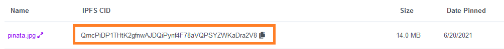
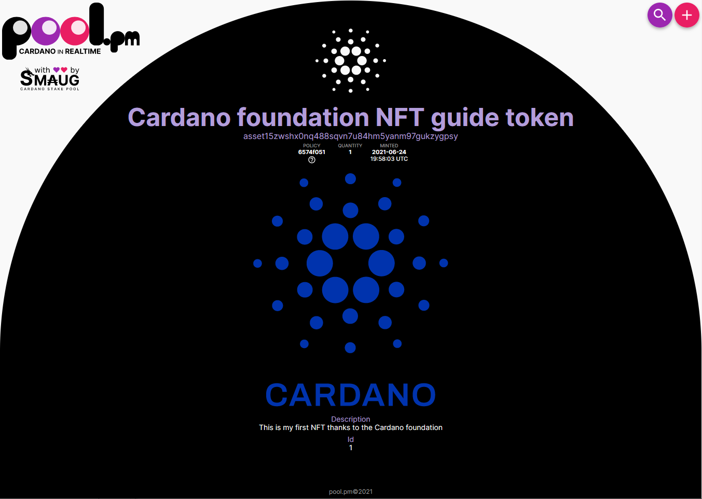

<iframe width="100%" height="325" src="https://www.youtube.com/embed/n5x9bvrOHW0" frameborder="0" allow="accelerometer; autoplay; clipboard-write; encrypted-media; gyroscope; picture-in-picture fullscreen"></iframe>

:::note
There are many ways to realize NFTs with Cardano. However, in this guide, we will concentrate on the most dominant way, to attach storage references of other services like [IPFS](https://ipfs.io/) to our tokens.
:::

## What's the difference?
What is the difference between native assets and NFTs?  
From a technical point of view, NFTs are the same as native assets. But some additional characteristics make a native asset truly an NFT:

1. As the name states - it must be 'non-fungible. This means you need to have unique identifiers or attributes attached to a token to make it distinguishable from others.
2. Most of the time, NFT's should live on the chain forever. Therefore we need some mechanism to ensure an NFT stays unique and can not be duplicated.

### The policyID
Native assets in Cardano feature the following characteristics:
1. An amount/value (how much are there?)
2. A name 
3. A unique `policyID`

Since asset names are not unique and can be easily duplicated, Cardano NFTs need to be identified by the `policyID`.  
This ID is unique and attached permanently to the asset.
The policy ID stems from a policy script that defines characteristics such as who can mint tokens and when those actions can be made.

Many NFT projects make the `policyID` under which the NFTs were minted publicly available, so anyone can differentiate fraudulent/duplicate NFTs from the original tokens.

Some services even offer to register your `policyID` to detect tokens that feature the same attributes as your token but were minted under a different policy.

### Metadata attributes

In addition to the unique `policyID` we can also attach metadata with various attributes to a transaction. 

Here is an example from [nft-maker.io](https://www.nft-maker.io/)

```json
{
  "721": {
    "{policy_id}": {
      "{policy_name}": {
        "name": "<required>",
        "description": "<optional>",
        "sha256": "<required>",
        "type": "<required>",
        "image": "<required>",
        "location": {
          "ipfs": "<required>",
          "https": "<optional>",
          "arweave": "<optional>"
        }
      }
    }
  }
}
```
Metadata helps us to display things like image URIs and stuff that truly makes it an NFT. With this workaround of attaching metadata, third-party platforms like [pool.pm](https://pool.pm/) can easily trace back to the last minting transaction, read the metadata, and query images and attributes accordingly.
The query would look something like this:

1. Get asset name and `policyID`.
2. Look up the latest minting transaction of this asset.
3. Check the metadata for label `721`.
4. Match the asset name and (in this case) the {policy_name}-entry.
5. Query the IPFS hash and all other attributes to the corresponding entry.


:::note
**There is currently no agreed standard as to how an NFT or the metadata is defined.**
However, there is a [Cardano Improvement Proposal](https://github.com/cardano-foundation/CIPs/pull/85) if you want to follow the discussion.
:::

### Time locking

Since NFTs are likely to be traded or sold, they should follow a more strict policy. Most of the time, a value is defined by the (artificial) scarcity of an asset.

You can regulate such factors with  [multi-signature scripts](https://github.com/input-output-hk/cardano-node/blob/c6b574229f76627a058a7e559599d2fc3f40575d/doc/reference/simple-scripts.md).

For this guide, we will choose the following constraints:

1. There should be only one defined signature allowed to mint (or burn) the NFT.
2. The signature will expire in **10000 slots** from now to leave the room if we screw something up.


## Prerequisites
Apart from the same requisites as on the [minting native assets](minting.md) guide, we will additionally need:

1. Obviously, what / how many NFTs you want to make.  
--> We are going to make only one NFT
2. An already populated `metadata.json`  
3. Know how your minting policy should look like.
--> Only one signature allowed (which we will create in this guide)  
--> No further minting or burning of the asset allowed after 10000 slots have passed since the transaction was made
4. Hash if uploaded image to IPFS  
--> We will use this [image](https://gateway.pinata.cloud/ipfs/QmRhTTbUrPYEw3mJGGhQqQST9k86v1DPBiTTWJGKDJsVFw)

:::note
We recommend upload images to IPFS as it is the most common decentralized storage service. There are alternatives, but IPFS has the biggest adoption in terms of how many NFTs got minted.
:::

## Setup
Since the creation of native assets is documented extensively in the [minting](minting.md) chapter, we won't go into much detail here.
Here's a little recap and needed setup

### Working directory
First of all, we are going to set up a new working directory and change into it.

```bash
mkdir nft
cd nft/
```

### Set variables
We will set important values in a more readable variable for better readability and debugging of failed transactions.

Since cardano-node version 1.31.0 the token name should be in hex format. We will set the variable $realtokenname (real name in utf-8) and then convert it to $tokenname (name in hex format). 
```bash
realtokenname="NFT1"
tokenname=$(echo -n $realtokenname | xxd -b -ps -c 80 | tr -d '\n')
tokenamount="1"
fee="0"
output="0"
ipfs_hash="please insert your ipfs hash here"
```
:::note
The IPFS hash is a key requirement and can be found once you upload your image to IPFS. Here's an example of how the IPFS looks like when an image is uploaded in [pinata](https://pinata.cloud/)

:::


### Generate keys and address

We will be generating new keys and a new payment address:

```bash
cardano-cli address key-gen --verification-key-file payment.vkey --signing-key-file payment.skey
```

Those two keys can now be used to generate an address.

```bash
cardano-cli address build --payment-verification-key-file payment.vkey --out-file payment.addr --mainnet
```

We will save our address hash in a variable called address.

```bash
address=$(cat payment.addr)
```

### Fund the address

Submitting transactions always require you to pay a fee. 
Sending native assets requires sending at least 1 ada.  
So make sure the address you are going to use as the input for the minting transaction has sufficient funds. 
For our example, the newly generated address was funded with 10 ada.

```bash
cardano-cli query utxo --address $address --mainnet
```

You should see something like this.
```bash
                           TxHash                                 TxIx        Amount
--------------------------------------------------------------------------------------
974e98c4529f8fc75fa8baf5618f7b5ade81aa9ed29ce33cd1c2f2e70838180e     0        10000000 lovelace
```
### Export protocol parameters

For our transaction calculations, we need some of the current protocol parameters. The parameters can be saved in a file called `protocol.json` with this command:

```bash
cardano-cli query protocol-parameters --mainnet --out-file protocol.json
```

### Creating the policyID
Just as in generating native assets, we will need to generate some policy-related files like key pairs and a policy script.

```bash
mkdir policy
```

:::note
We don’t change into this directory, and everything is done from our working directory.
:::

Generate a new set of key pairs:

```bash
cardano-cli address key-gen \
    --verification-key-file policy/policy.vkey \
    --signing-key-file policy/policy.skey
```

Instead of only defining a single signature (as we did in the native asset minting guide), our script file needs to implement the following characteristics (which we defined above):

1. Only one signature allowed
2. No further minting or burning of the asset allowed after 10000 slots have passed since the transaction was made

For this specific purpose `policy.script` file which will look like this:

```json
{
  "type": "all",
  "scripts":
  [
    {
      "type": "before",
      "slot": <insert slot here>
    },
    {
      "type": "sig",
      "keyHash": "insert keyHash here"
    }
  ]
}
```

As you can see, we need to adjust two values here, the `slot` number as well as the `keyHash`.

To set everything at once and copy and paste it, use this command(s):
**You need to have the `jq` installed to parse the tip correctly!**

```bash
echo "{" >> policy/policy.script
echo "  \"type\": \"all\"," >> policy/policy.script 
echo "  \"scripts\":" >> policy/policy.script 
echo "  [" >> policy/policy.script 
echo "   {" >> policy/policy.script 
echo "     \"type\": \"before\"," >> policy/policy.script 
echo "     \"slot\": $(expr $(cardano-cli query tip --mainnet | jq .slot?) + 10000)" >> policy/policy.script
echo "   }," >> policy/policy.script 
echo "   {" >> policy/policy.script
echo "     \"type\": \"sig\"," >> policy/policy.script 
echo "     \"keyHash\": \"$(cardano-cli address key-hash --payment-verification-key-file policy/policy.vkey)\"" >> policy/policy.script 
echo "   }" >> policy/policy.script
echo "  ]" >> policy/policy.script 
echo "}" >> policy/policy.script
```

**If this command is not working, please set the key hash and correct slot manually.**

To generate the `keyHash`, use the following command:
```bash
cardano-cli address key-hash --payment-verification-key-file policy/policy.vkey
```

To calculate the correct slot, query the current slot and add 10000 to it:
```bash
cardano-cli query tip --mainnet
```

Make a new file called policy.script in the policy folder 
```bash
touch policy/policy.script
```
Paste the JSON from above, populated with your `keyHash` and your `slot` number into it
```bash
nano policy/policy.script
```

:::note
Be aware the slot number is defined as an integer and therefore needs no double quotation marks, whereas the `keyHash` is defined as a string and needs to be wrapped in double quotation marks.
:::

Please take note of your slot number and save it in a variable.

```bash
slotnumber="Replace this with your slot number"
```

And save the location of the script file into a variable as well.

```bash
script="policy/policy.script"
```

The last step is to generate the policyID:

```bash
cardano-cli transaction policyid --script-file ./policy/policy.script > policy/policyID
```

### Metadata
Since we now have our policy as well as our `policyID` defined, we need to adjust our metadata information.

Here’s an example of the metadata.json which we’ll use for this guide:

```json
{
        "721": {
            "please_insert_policyID_here": {
              "NFT1": {
                "description": "This is my first NFT thanks to the Cardano foundation",
                "name": "Cardano foundation NFT guide token",
                "id": 1,
                "image": ""
              }
            }
        }
}
```

:::note
The third element in the hierarchy needs to have the same name as our NFT native asset.
:::

Save this file as `metadata.json`. 

If you want to generate it "on the fly," use the following commands:

```bash
echo "{" >> metadata.json
echo "  \"721\": {" >> metadata.json 
echo "    \"$(cat policy/policyID)\": {" >> metadata.json 
echo "      \"$(echo $realtokenname)\": {" >> metadata.json
echo "        \"description\": \"This is my first NFT thanks to the Cardano foundation\"," >> metadata.json
echo "        \"name\": \"Cardano foundation NFT guide token\"," >> metadata.json
echo "        \"id\": \"1\"," >> metadata.json
echo "        \"image\": \"ipfs://$(echo $ipfs_hash)\"" >> metadata.json
echo "      }" >> metadata.json
echo "    }" >> metadata.json 
echo "  }" >> metadata.json 
echo "}" >> metadata.json
```

:::note
Please make sure the image value / IPFS hash is set with the correct protocol pre-fix <i>ipfs://</i>  
(for example <i>"ipfs://QmRhTTbUrPYEw3mJGGhQqQST9k86v1DPBiTTWJGKDJsVFw"</i>)

:::
### Crafting the transaction

Let's begin building our transaction.
Before we start, we will again need some setup to make the transaction building easier.
Query your payment address and take note of the different values present.

```bash
cardano-cli query utxo --address $address --mainnet
```

Your output should look something like this (fictional example):

```bash
                           TxHash                                 TxIx        Amount
--------------------------------------------------------------------------------------
b35a4ba9ef3ce21adcd6879d08553642224304704d206c74d3ffb3e6eed3ca28     0        1000000000 lovelace
```

Since we need each of those values in our transaction, we will store them individually in a corresponding variable.

```bash
txhash="insert your txhash here"
txix="insert your TxIx here"
funds="insert Amount in lovelace here"
policyid=$(cat policy/policyID)
output=1400000
```

Here we are setting the `output` value to `1400000` Lovelace which is equivalent to `1.4` ADA. This amount is used because this is the minimum UTxO requirement.

If you're unsure, check if all of the other needed variables for the transaction are set:

```bash
echo $fee
echo $address
echo $output
echo $tokenamount
echo $policyid
echo $tokenname
echo $slotnumber
echo $script
```

If everything is set, run the following command:

```bash
cardano-cli transaction build \
--mainnet \
--alonzo-era \
--tx-in $txhash#$txix \
--tx-out $address+$output+"$tokenamount $policyid.$tokenname" \
--change-address $address \
--mint="$tokenamount $policyid.$tokenname" \
--minting-script-file $script \
--metadata-json-file metadata.json  \
--invalid-hereafter $slotnumber \
--witness-override 2 \
--out-file matx.raw
```

The above command may generate output as per below:

```bash
Minimum required UTxO: Lovelace 1448244
```

This means that we need to change the value of the `$output` variable to the given value.

```
output=1448244
```

Remember to use the value that you got in your own output.

If the minimum value was right then this command will generate `matx.raw` and will give output similar to:

```bash
Estimated transaction fee: Lovelace 176677
```

__NOTE__: Its possible that the Lovelace value for you is different.

Sign the transaction

```bash
cardano-cli transaction sign  \
--signing-key-file payment.skey  \
--signing-key-file policy/policy.skey  \
--mainnet --tx-body-file matx.raw  \
--out-file matx.signed
```

:::note
The signed transaction will be saved in a new file called <i>matx.signed</i> instead of <i>matx.raw</i>.
:::

Now we are going to submit the transaction, therefore minting our native assets:
```bash
cardano-cli transaction submit --tx-file matx.signed --mainnet
```

Congratulations, we have now successfully minted our own token.
After a couple of seconds, we can check the output address
```bash
cardano-cli query utxo --address $address --mainnet
```

and should see something like this:

### Displaying your NFT

One of the most adopted NFT browsers is [pool.pm](https://pool.pm/tokens).
Enter your address in the search bar, hit enter, and your NFT will be displayed with all its attributes and the corresponding image.





You can check it out yourself and see the NFT created for this tutorial [here](https://pool.pm/6574f051ee0c4cae35c0407b9e104ed8b3c9cab31dfb61308d69f33c.NFT1).


## Burn your token

If you messed something up and want to re-start, you can always burn your token if the slot defined in your policy script isn't over yet.
Assuming you have still every variable set, you need to re-set:

```bash
burnfee="0"
burnoutput="0"
txhash="Insert your utxo holding the NFT"
txix="Insert your txix"
burnoutput=1400000
```

Here we are setting the `output` value to `1400000` Lovelace which is equivalent to `1.4` ADA. This amount is used because this is the minimum UTxO requirement.

The transaction looks like this:

```bash
cardano-cli transaction build --mainnet --alonzo-era --tx-in $txhash#$txix --tx-out $address+$burnoutput --mint="-1 $policyid.$tokenname" --minting-script-file $script --change-address $address --invalid-hereafter $slot --witness-override 2 --out-file burning.raw
```

:::note
The minting parameter is now called with a negative value, therefore destroying one token.
:::


Sign the transaction.
```bash
cardano-cli transaction sign  --signing-key-file payment.skey  --signing-key-file policy/policy.skey --mainnet  --tx-body-file burning.raw --out-file burning.signed
```
Full send.
```bash
cardano-cli transaction submit --tx-file burning.signed --mainnet
```
