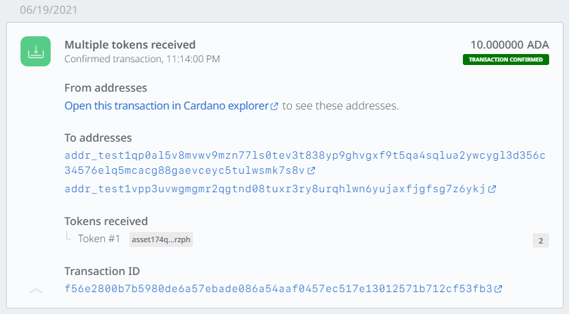

In this section, we will be minting native assets - **not NFTs**. 

It is strongly advised to work through this section to understand how transactions and minting works.  
Minting NFTs will follow the same process, with only a few tweaks. If you want to jump to NFTs, please visit [Minting NFTs](minting-nfts.md).

## Prerequisites

1. A running and synced Cardano node - accessible through the `cardano-cli` command. This guide is written with `cardano-cli` v 1.27.0. Some commands may be subject to change.
2. You have some knowledge in Linux as to navigation between directories, creating and editing files, and setting and inspecting variables via Linux shell.

## Overview
This tutorial will give you a copy & pastable walk through the complete token lifecycle:


These will be the steps we need to take to complete the whole lifecycle:

1. Set everything up
2. Build a new address and keys
3. Generate a minting policy
4. Draft a minting transaction
5. Calculate fees
6. Send the transaction and mint tokens (to ourselves)
7. Send the tokens to a Daedalus wallet 
8. Burn some token 

### Directory structure

We'll be working in a new directory. Here is an overview of every file we will be generating:

```
├── burning.raw                    # Raw transaction to burn token
├── burning.signed                 # Signed transaction to burn token
├── matx.raw                       # Raw transaction to mint token
├── matx.signed                    # Signed transaction to mint token
├── metadata.json                  # Metadata to specify NFT attributes
├── payment.addr                   # Address to send / receive 
├── payment.skey                   # Payment signing key
├── payment.vkey                   # Payment verification key
├── policy                         # Folder which holds everything policy-wise
│   ├── policy.script              # Script to genereate the policyID
│   ├── policy.skey                # Policy signing key
│   ├── policy.vkey                # Policy verification key
│   └── policyID                   # File which holds the policy ID
└── protocol.json                  # Protocol parameters
```

### Token architecture

Before minting native assets, you need to ask yourself at least those four questions:

1. What will be the name of my custom token(s)?
2. How many do I want to mint?
3. Will there be a time constraint for interaction (minting or burning token?)
4. Who should be able to mint them?

Number 1, 3, and 4 will be defined in a so-called monetary policy script, whereas the actual amount will only be defined on the minting transaction.

For this guide, we will use:

1. What will be the name of my custom token(s)?  
--> We are going to call `Testtoken` and `SecondTesttoken`
2. How many do I want to mint?  
--> 10000000 each (10M `Testtoken` and 10M `SecondTesttoken`)
3. Will there be a time constraint for interaction (minting or burning token?)  
---> No (we will, however, when making NFTs), we want to mint and burn them however we like.
4. Who should be able to mint them?  
--> only one signature (which we possess) should be able to sign the transaction and therefore be able to mint the token

## Setup
### Cardano node socket path
To work with the `cardano-cli` we need to export an environment variable called `CARDANO_NODE_SOCKET_PATH`. Please note that the variable name is all uppercase.
The variable needs to hold the absolute path to the socket file of your running Cardano node installation.

If you're unsure or do not know where to find your socket path, please check the command on how you start/run your Cardano node.  
For example - if you start your node with this command
```bash
$HOME/.local/bin/cardano-node run \
 --topology config/testnet-topology.json \
 --database-path db \
 --socket-path $HOME/TESTNET_NODE/socket/node.socket \
 --port 3001 \
 --config config/testnet-config.json
```
You need to set the variable to the corresponding path of the `--socket-path` parameter:

```bash
export CARDANO_NODE_SOCKET_PATH="$HOME/TESTNET_NODE/socket/node.socket"
```
You need to adjust the path on your setup and your socket path accordingly.

### Improve readability
Since we've already answered all of the questions above, we will set variables on our terminal/bash to make readability a bit easier.
We also will be using the testnet. The only difference between minting native assets in the mainnet will be that you need to substitute the network variable <i>testnet</i> with mainnet.
```bash
testnet="testnet-magic 1097911063"
tokenname1="Testtoken"
tokenname2="SecondTesttoken"
tokenamount="10000000"
output="0"
```

We will be using this technique of setting variables along the way to make it easier to follow along.

### Check your node status

We also want to check if our Node is up to date. To do that, we check the current epoch/block and compare it to the current value displayed in the [Cardano Explorer for the testnet](https://explorer.cardano-testnet.iohkdev.io/en).

```bash
cardano-cli query tip --$testnet
```

Should give you an output like this
```bash
{
    "epoch": 282,
    "hash": "82cfbbadaaec1a6204442b91de1535505b6482ae9858f3f0bd9c4bb9c8a2c12b",
    "slot": 36723570,
    "block": 6078639,
    "era": "Mary"
}
```

Epoch and slot number should match when being compared to the Cardano [Explorer for testnet](https://explorer.cardano-testnet.iohkdev.io/en)


### Set up your workspace

We will start with a clean slate. So let's make a new directory and navigate into it.
```bash
mkdir tokens
cd tokens/
```

### Generate keys and address

If you already have a payment address and keys and you want to use those, you can skip this step.  
If not - we need to generate those to submit transactions and to send and receive ada or native assets.

Payment verification and signing keys are the first keys we need to create.

```bash
cardano-cli address key-gen --verification-key-file payment.vkey --signing-key-file payment.skey
```

Those two keys can now be used to generate an address.

```bash
cardano-cli address build --payment-verification-key-file payment.vkey --out-file payment.addr --$testnet
```

We will save our address hash in a variable called `address`.

```bash
address=$(cat payment.addr)
```
### Fund the address

Submitting transactions always require you to pay a fee. Sending native assets requires also requires sending at least 1 ada.  
So make sure the address you are going to use as the input for the minting transaction has sufficient funds. 

For the **testnet**, you can request funds through the [testnet faucet](../integrate-cardano/testnet-faucet).

### Export protocol parameters

For our transaction calculations, we need some of the current protocol parameters. The parameters can be saved in a file called <i>protocol.json</i> with this command:

```bash
cardano-cli query protocol-parameters --$testnet --out-file protocol.json
```

## Minting native assets

### Generate the policy

Policies are the defining factor under which tokens can be minted. Only those in possession of the policy keys can mint or burn tokens minted under this specific policy.
We'll make a separate sub-directory in our work directory to keep everything policy-wise separated and more organized.
For further reading, please check [the official docs](https://docs.cardano.org/native-tokens/getting-started/#tokenmintingpolicies) or the [github page about multi-signature scripts](https://github.com/input-output-hk/cardano-node/blob/c6b574229f76627a058a7e559599d2fc3f40575d/doc/reference/simple-scripts.md).

```bash
mkdir policy
```

:::note 
We don't navigate into this directory, and everything is done from our working directory.
:::


First of all, we — again — need some key pairs:

```bash
cardano-cli address key-gen \
    --verification-key-file policy/policy.vkey \
    --signing-key-file policy/policy.skey
```

Create a `policy.script` file and fill it with an empty string.

```bash
touch policy/policy.script && echo "" > policy/policy.script
```

Use the `echo` command to populate the file:

```bash
echo "{" >> policy/policy.script 
echo "  \"keyHash\": \"$(cardano-cli address key-hash --payment-verification-key-file policy/policy.vkey)\"," >> policy/policy.script 
echo "  \"type\": \"sig\"" >> policy/policy.script 
echo "}" >> policy/policy.script
```

:::note 
The second echo uses a sub-shell command to generate the so-called key-hash. But, of course, you could also do that by hand.
:::

We now have a simple script file that defines the policy verification key as a witness to sign the minting transaction. There are no further constraints such as token locking or requiring specific signatures to successfully submit a transaction with this minting policy.

### Asset minting
To mint the native assets, we need to generate the policy ID from the script file we created.

```bash
cardano-cli transaction policyid --script-file ./policy/policy.script >> policy/policyID
```

The output gets saved to the file `policyID` as we need to reference it later on.

### Build the raw transaction to send to oneself
To mint the tokens, we will make a transaction using our previously generated and funded address.

#### A quick word about transactions in Cardano

Each transaction in Cardano requires the payment of a fee which — as of now — will mostly be determined by the size of what we want to transmit.
The more bytes get sent, the higher the fee.

That's why making a transaction in Cardano is a three-way process.

1. First, we will build a transaction, resulting in a file. This will be the foundation of how the transaction fee will be calculated. 
2. We use this `raw` file and our protocol parameters to calculate our fees
3. Then we need to re-build the transaction, including the correct fee and the adjusted amount we're able to send. Since we send it to ourselves, the output needs to be the amount of our fundings minus the calculated fee.

Another thing to keep in mind is the model of how transactions and "balances" are designed in Cardano.
Each transaction has one (or multiple) inputs (the source of your funds, like which bill you'd like to use in your wallet to pay) and one or multiple outputs.
In our minting example, the input and output will be the same - <b>our own address</b>.

Before we start, we will again need some setup to make the transaction building easier.
First, query your payment address and take note of the different values present.

```bash
cardano-cli query utxo --address $address --$testnet
```

Your output should look something like this (fictional example):

```bash
                           TxHash                                 TxIx        Amount
--------------------------------------------------------------------------------------
b35a4ba9ef3ce21adcd6879d08553642224304704d206c74d3ffb3e6eed3ca28     0        1000000000 lovelace
```

Since we need each of those values in our transaction, we will store them individually in a corresponding variable.

```bash
txhash="insert your txhash here"
txix="insert your TxIx here"
funds="insert Amount here"
policyid=$(cat policy/policyID)
```

For our fictional example, this would result in the following output - <b>please adjust your values accordingly</b>:

```bash
$ txhash="b35a4ba9ef3ce21adcd6879d08553642224304704d206c74d3ffb3e6eed3ca28"
$ txix="0"
$ funds="1000000000"
$ policyid=$(cat policy/policyID)
```
Also, transactions only used to calculate fees must still have a fee set, though it doesn't have to be exact.  The calculated fee will be included *the second time* this transaction is built (i.e. the transaction to sign and submit).  This first time, only the fee parameter *length* matters, so here we choose a maximum value ([note](https://github.com/cardano-foundation/developer-portal/pull/283#discussion_r705612888)): 

```bash
$ fee="300000"
```

Now we are ready to build the first transaction to calculate our fee and save it in a file called <i>matx.raw</i>.
We will reference the variables in our transaction to improve readability because we saved almost all of the needed values in variables.
This is what our transaction looks like:
```bash
cardano-cli transaction build-raw \
 --fee $fee \
 --tx-in $txhash#$txix \
 --tx-out $address+$output+"$tokenamount $policyid.$tokenname1 + $tokenamount $policyid.$tokenname2" \
 --mint="$tokenamount $policyid.$tokenname1 + $tokenamount $policyid.$tokenname2" \
 --minting-script-file policy/policy.script \
 --out-file matx.raw
```
#### Syntax breakdown 
Here's a breakdown of the syntax as to which parameters we define in our minting transaction:
```bash
--fee: $fee
```
The network fee we need to pay for our transaction. Fees will be calculated through the network parameters and depending on the size (in bytes) our transaction will have. The bigger the file size, the higher the fee.

```bash
--tx-in $txhash#$txix \
```
The hash of our address we use as the input for the transaction needs sufficient funds.
So the syntax is: the hash, followed by a hashtag, followed by the value of TxIx of the corresponding hash.

```bash
--tx-out $address+$output+"$tokenamount $policyid.$tokenname1 + $tokenamount $policyid.$tokenname2" \
```
Here is where part one of the magic happens. For the <i>--tx-out</i>, we need to specify which address will receive our transaction. 
In our case, we send the tokens to our own address. 
:::note
The syntax is very important, so here it is word for word. There are no spaces unless explicitly stated:
1. address hash
2. a plus sign
3. the output in Lovelace (ada) (output = input amount — fee)
4. a plus sign
5. quotation marks
6. the amount of the token
7. a blank/space
8. the policy id
9. a dot
10. the token name (optional if you want multiple/different tokens: a blank, a plus, a blank, and start over at 6.) 
11. quotation marks
:::

```bash
--mint="$tokenamount $policyid.$tokenname1 + $tokenamount $policyid.$tokenname2" \
```
Again, the same syntax as specified in <i>--tx-out</i> but without the address and output.

```bash
--out-file matx.raw
```
We save our transaction to a file that you can name however you want. 
Just be sure to reference the correct filename in upcoming commands. I chose to stick with the official docs and declared it as <i>matx.raw</i>.

Based on this raw transaction we can calculate the minimal transaction fee and store it in the variable <i>$fee</i>. We get a bit fancy here and only store the value so we can use the variable for terminal based calculations:

```bash
fee=$(cardano-cli transaction calculate-min-fee --tx-body-file matx.raw --tx-in-count 1 --tx-out-count 1 --witness-count 2 --$testnet --protocol-params-file protocol.json | cut -d " " -f1)
```

Remember, the transaction input and the output of ada must be equal, or otherwise, the transaction will fail. There can be no leftovers.
To calculate the remaining output we need to subtract the fee from our funds and save the result in our output variable.

```bash
output=$(expr $funds - $fee)
```

We now have every value we need to re-build the transaction, ready to be signed. So we reissue the same command to re-build, the only difference being our variables now holding the correct values.

```bash
cardano-cli transaction build-raw \
--fee $fee  \
--tx-in $txhash#$txix  \
--tx-out $address+$output+"$tokenamount $policyid.$tokenname1 + $tokenamount $policyid.$tokenname2" \
--mint="$tokenamount $policyid.$tokenname1 + $tokenamount $policyid.$tokenname2" \
--minting-script-file policy/policy.script \
--out-file matx.raw
```

Transactions need to be signed to prove the authenticity and ownership of the policy key.

```bash
cardano-cli transaction sign  \
--signing-key-file payment.skey  \
--signing-key-file policy/policy.skey  \
--$testnet --tx-body-file matx.raw  \
--out-file matx.signed
```

:::note The signed transaction will be saved in a new file called <i>matx.signed</i> instead of <i>matx.raw</i>.
:::

Now we are going to submit the transaction, therefore minting our native assets:
```bash
cardano-cli transaction submit --tx-file matx.signed --$testnet
```

Congratulations, we have now successfully minted our own token.
After a couple of seconds, we can check the output address
```bash
cardano-cli query utxo --address $address --$testnet
```

and should see something like this (fictional example):

```bash
                           TxHash                                 TxIx        Amount
--------------------------------------------------------------------------------------
d82e82776b3588c1a2c75245a20a9703f971145d1ca9fba4ad11f50803a43190     0        999824071 lovelace + 10000000 45fb072eb2d45b8be940c13d1f235fa5a8263fc8ebe8c1af5194ea9c.SecondTesttoken + 10000000 45fb072eb2d45b8be940c13d1f235fa5a8263fc8ebe8c1af5194ea9c.Testtoken
```

## Sending token to a wallet

To send tokens to a wallet, we need to build another transaction - this time only without the minting parameter.
We will set up our variables accordingly.

```bash
fee="0"
receiver="Insert wallet address here"
receiver_output="10000000"
txhash=""
txix=""
funds="Amout of lovelace"
```

Again - here is an example of how it would look if we use our fictional example:

```bash
$ fee="0"
$ receiver="addr_test1qp0al5v8mvwv9mzn77ls0tev3t838yp9ghvgxf9t5qa4sqlua2ywcygl3d356c34576elq5mcacg88gaevceyc5tulwsmk7s8v"
$ receiver_output="10000000"
$ txhash="d82e82776b3588c1a2c75245a20a9703f971145d1ca9fba4ad11f50803a43190"
$ txix="0"
$ funds="999824071"
```

You should still have access to the other variables from the minting process.
Please check if those variables are set:

```bash
echo Tokenname 1: $tokenname1
echo Tokenname 2: $tokenname2
echo Address: $address
echo Policy ID: $policyid
```

We will be sending 2 of our first tokens, `Testtoken`, to the foreign address.  
A few things worth pointing out:

1. We are forced to send at least a minimum of 1 ada (1000000 Lovelace) to the foreign address. We can not send tokens only. So we need to factor this value into our output. We will reference the output value of the remote address with the variable receiver_output.
2. Apart from the receiving address, we also need to set our own address as an additional output. Since we don't want to send everything we have to the remote address, we're going to use our own address to receive everything else coming from the input.
3. Our own address, therefore, needs to receive our funds, subtracted by the transaction fee as well as the minimum of 1 ada we need to send to the other address and
4. all of the tokens the txhash currently holds, subtracted by the tokens we send.

:::note Depending on the size and amount of native assets you are going to send it might be possible to send more than the minimum requirement of only 1 ada. For this guide, we will be sending 10 ada to be on the safe side.
Check the [Cardano ledger docs for further reading](https://cardano-ledger.readthedocs.io/en/latest/explanations/min-utxo.html#min-ada-value-calculation)
:::

Since we will send 2 of our first tokens to the remote address we are left with 999998 of the `Testtoken` as well as the additional 1000000 `SecondTesttoken`.

Here’s what the `raw` transaction looks like:

```bash
cardano-cli transaction build-raw  \
--fee $fee  \
--tx-in $txhash#$txix  \
--tx-out $receiver+$receiver_output+"2 $policyid.$tokenname1"  \
--tx-out $address+$output+"9999998 $policyid.$tokenname1 + 10000000 $policyid.$tokenname2"  \
--out-file rec_matx.raw
```

Again we are going to calculate the fee and save it in a variable.

```bash
fee=$(cardano-cli transaction calculate-min-fee --tx-body-file rec_matx.raw --tx-in-count 1 --tx-out-count 2 --witness-count 1 --$testnet --protocol-params-file protocol.json | cut -d " " -f1)
```

As stated above, we need to calculate the leftovers that will get sent back to our address.
The logic being:
`TxHash Amout` — `fee` — `min Send 10 ada in Lovelace` = `the output for our own address`

```bash
output=$(expr $funds - $fee - 10000000)
```

Let’s update the transaction:

```bash
cardano-cli transaction build-raw  \
--fee $fee  \
--tx-in $txhash#$txix  \
--tx-out $receiver+$receiver_output+"2 $policyid.$tokenname1"  \
--tx-out $address+$output+"9999998 $policyid.$tokenname1 + 10000000 $policyid.$tokenname2"  \
--out-file rec_matx.raw
```

Sign it:
```bash
cardano-cli transaction sign --signing-key-file payment.skey --$testnet --tx-body-file rec_matx.raw --out-file rec_matx.signed
```

Send it:
```bash
cardano-cli transaction submit --tx-file rec_matx.signed --$testnet
```

After a few seconds, you, the receiver, should have your tokens. For this example, a Daedalus testnet wallet is used.




## Burning token

In the last part of our token lifecycle, we will burn 5000 of our newly made tokens <i>SecondTesttoken</i>, thereby destroying them permanently.

You won't be surprised that this — again — will be done with a transaction.
If you've followed this guide up to this point, you should be familiar with the process, so let's start over.

Set everything up and check our address:

```bash
cardano-cli query utxo --address $address --$testnet
```

:::note Since we've already sent tokens away, we need to adjust the amount of Testtoken we are going to send.
:::

Let's set our variables accordingly (if not already set). Variables like address and the token names should also be set.

```bash
txhash="insert your txhash here"
txix="insert your TxIx here"
funds="insert Amount only in here"
burnfee="0"
policyid=$(cat policy/policyID)
burnoutput="0"
```

Burning tokens is fairly straightforward.
You will issue a new minting action, but this time with a <b>negative</b> input. This will essentially subtract the amount of token.

```bash
cardano-cli transaction build-raw \
 --fee $burnfee \
 --tx-in $txhash#$txix \
 --tx-out $address+$burnoutput+"9999998 $policyid.$tokenname1 + 9995000 $policyid.$tokenname2"  \
 --mint="-5000 $policyid.$tokenname2" \
 --minting-script-file policy/policy.script \
 --out-file burning.raw
 ```
 

:::note Since we already have multiple transaction files, we will give this transaction a better name and call it <i>burning.raw</i>.
We also need to specify the amount of tokens left after destroying.
The math is:
<i>amount of input token</i> — <i>amount of destroyed token</i> = <i>amount of output token</i>
:::

As usual, we need to calculate the fee. 
To make a better differentiation, we named the variable <i>burnfee</i>:

```bash
burnfee=$(cardano-cli transaction calculate-min-fee --tx-body-file burning.raw --tx-in-count 1 --tx-out-count 1 --witness-count 2 --$testnet --protocol-params-file protocol.json | cut -d " " -f1)
```

Calculate the correct output value
```bash
burnoutput=$(expr $funds - $burnfee)
```

Re-build the transaction with the correct amounts

```bash
cardano-cli transaction build-raw \
 --fee $burnfee \
 --tx-in $txhash#$txix \
 --tx-out $address+$burnoutput+"9999998 $policyid.$tokenname1 + 9995000 $policyid.$tokenname2"  \
 --mint="-5000 $policyid.$tokenname2" \
 --minting-script-file policy/policy.script \
 --out-file burning.raw
 ```

 Sign the transaction:

 ```bash
 cardano-cli transaction sign  \
--signing-key-file payment.skey  \
--signing-key-file policy/policy.skey  \
--$testnet  \
--tx-body-file burning.raw  \
--out-file burning.signed
```

Send it:

```bash
cardano-cli transaction submit --tx-file burning.signed --$testnet
```

Check your address: 

```bash
cardano-cli query utxo --address $address --$testnet
```

You should now have 5000 tokens less than before:
```bash
                           TxHash                                 TxIx        Amount
--------------------------------------------------------------------------------------
f56e2800b7b5980de6a57ebade086a54aaf0457ec517e13012571b712cf53fb3     1        989643170 lovelace + 10000000 45fb072eb2d45b8be940c13d1f235fa5a8263fc8ebe8c1af5194ea9c.SecondTesttoken + 9999998 45fb072eb2d45b8be940c13d1f235fa5a8263fc8ebe8c1af5194ea9c.Testtoken
```
