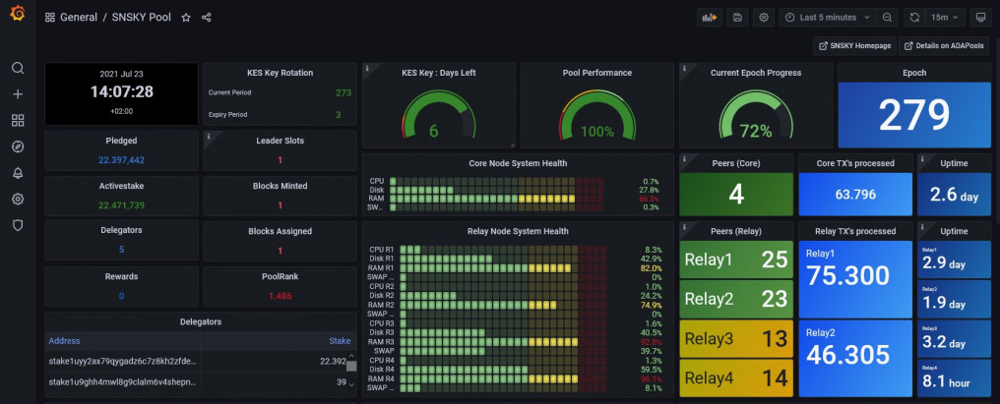

Once your Cardano pool is successfully set up, then comes the most beautiful part - setting up your Dashboard and Alerts!


This documentation brings some of the available information in greater detail and will hopefully help Stake Pool Operators manage their pools more efficiently. This tutorial is for education and learning purposes only!


**Prerequisites:**

- Ubuntu Server 20.04 LTS
- Cardano Block Producer Node up and running
- Cardano Relay Nodes up and running


## 1. Install prometheus node exporter

First, install Prometheus node exporter on the Block Producing and all Relay Nodes:

```shell
$ sudo apt-get install -y prometheus-node-exporter

$ sudo systemctl enable prometheus-node-exporter.service
```

:::note
For Ubuntu 18.04 refer to the following tutorial: [Ubuntu 18.04 Tutorial](https://sanskys.github.io/grafana/)
:::


Update `mainnet-config.json` config files with new hasEKG and has Prometheus ports:
```shell
$ cd $NODE_HOME
$ sed -i config.json -e "s/127.0.0.1/0.0.0.0/g"

On Producer Node open ports 12798 and 9100

$ sudo ufw allow proto tcp from <Monitoring Node IP address> to any port 9100

$ sudo ufw allow proto tcp from <Monitoring Node IP address> to any port 12798

$ sudo ufw reload
```

Restart the nodes:
```shell
$ sudo systemctl restart <your node name e.g. cardano-testnode>
```


## 2. Install Prometheus on the Monitoring Node


Install Prometheus on the Monitoring Node - the Node where the Grafana Server will run. This could be one of the Relay nodes or a separate dedicated node for monitoring.

```shell
$ sudo apt-get install -y prometheus
```


## 3. Install Grafana on Monitoring Node


```shell
$ wget -q -O - https://packages.grafana.com/gpg.key | sudo apt-key add -

$ echo "deb https://packages.grafana.com/oss/deb stable main" > grafana.list
$ sudo mv grafana.list /etc/apt/sources.list.d/grafana.list

$ sudo apt-get update && sudo apt-get install -y grafana
```
Enable services so they start automatically:
```shell
$ sudo systemctl enable grafana-server.service
$ sudo systemctl enable prometheus.service
$ sudo systemctl enable prometheus-node-exporter.service
```
Update `prometheus.yml` located in `/etc/prometheus/prometheus.yml`:

Change the *ip address* in the following command:
```shell
$ cat > prometheus.yml << EOF
global:
  scrape_interval:     15s # By default, scrape targets every 15 seconds.

  # Attach these labels to any time series or alerts when communicating with
  # external systems (federation, remote storage, Alertmanager).
  external_labels:
    monitor: 'codelab-monitor'

# A scrape configuration containing exactly one endpoint to scrape:
# Here it's Prometheus itself.
scrape_configs:
  # The job name is added as a label job=<job_name> to any timeseries scraped from this config.
  - job_name: 'prometheus'

    static_configs:
      - targets: ['localhost:9100']

        labels:
          alias: 'relaynode1'
          type:  'cardano-node'

      - targets: ['<relay node 2 public ip address>:9100']

        labels:
          alias: 'relaynode2'
          type:  'cardano-node'
      - targets: ['<block producer public ip address>:9100']

        labels:
          alias: 'block-producer-node'
          type:  'cardano-node'
     - targets: ['localhost:12798']
        labels:
          alias: 'relaynode1'
          type:  'cardano-node'

     - targets: ['<relay node 2 public ip address>:12798']

        labels:
          alias: 'relaynode2'
          type:  'cardano-node'

     - targets: ['<block producer public ip address>:12798']
        labels:
          alias: 'block-producer-node'
          type:  'cardano-node'

EOF
```
if you have more than two Relay Nodes, add all your Relays as new "targets" in the config above:
```shell
$ sudo mv prometheus.yml /etc/prometheus/prometheus.yml
```
Restart the services:
```shell
$ sudo systemctl restart grafana-server.service
$ sudo systemctl restart prometheus.service
$ sudo systemctl restart prometheus-node-exporter.service
```
Verify that the services are running properly:
```shell
$ sudo systemctl status grafana-server.service prometheus.service prometheus-node-exporter.service
```
On the Monitoring Node, open port 3000 for Grafana:
```shell
$ sudo ufw allow from <your home IP address from where you plan to access Grafana> to any port 3000
```
:::note
Please refer to [Grafana Labs Security](https://grafana.com/docs/grafana/latest/administration/security/) for hardening: e.g. by default the communication with the Grafana server is unencrypted.
:::

## 4. Setting up Grafana Dashboard


On Relay Node, open `http://localhost:3000` or `http://`*your Relay Node ip address*`:3000` in your local browser.

Login with admin / admin

Change password


Click the configuration gear icon, then Add data Source

Select Prometheus

Set Name to "Prometheus"

Set URL to `http://localhost:9090`

Click Save & Test


Download my Dashboard that you see on the top of this page, from the following GitHub link and save the JSON file


[SNSKY Dashboard Example](https://github.com/sanskys/SNSKY/blob/main/SNSKY_Dashboard_v2.json)


in Grafana, Click Create + icon (in left Menu) > Import
Add dashboard by Upload JSON file
Click the Import button.


If you nodes are in several time zones, it is useful to add the Grafana Clock panel
```shell
$ grafana-cli plugins install grafana-clock-panel
```


Installed panels are available immediately in the Dashboards section in your Grafana main menu.

To see a list of installed panels, click the Plugins item in the main menu. Both core panels and installed panels will appear.


## 5. Add Data from Cexplorer to the Dashboard


Cexplorer provides API where we can collect data for our pool. Run following commands to create directory for our pool statistic and script. Metric `adapools_pledged` is missing in cexplorer(a tool what will substitute adapools), so you might see relative data missing on dashboard from SNSKY, mentioned above.

```shell
cd /$NODE_HOME

mkdir -p poolStat

cd poolStat

echo "curl https://js.cexplorer.io/api-static/pool/< YOUR POOL BECH 32 POOL ID >.json 2>/dev/null \\
| jq '.data' | jq 'del(.stats, .url , .img, .updated, .handles, .pool_id, .name, .pool_id_hash)' \\
| tr -d \\\"{},: \\
| awk NF \\
| sed -e 's/^[ \t]*/cexplorer_/' > poolStat.prom" > getstats.sh

chmod +x getstats.sh

./getstats.sh

```
check the content of `poolStat.prom` and it should not contain only numeric values:
```shell
$ nano poolStat.prom
```


Configure `prometheus-node-exporter.service` to grab data from the `poolStat.prom` file:
```shell
$ sudo cp /lib/systemd/system/prometheus-node-exporter.service /lib/systemd/system/prometheus-node-exporter.service_backup

$ sudo nano /lib/systemd/system/prometheus-node-exporter.service
```
Change `ExecStart` line to:
```shell
ExecStart=/usr/bin/prometheus-node-exporter --collector.textfile.directory=< YOUR NODE FULL PATH >/poolStat --collector.textfile
```

Reload daemon and restart services:
```shell
$ sudo systemctl daemon-reload

$ sudo systemctl restart prometheus-node-exporter.service

$ sudo systemctl restart prometheus.service
```


Now you should see in the Dashboard all Cexplorer statistics


Since the statistics will change, lets set cron job to update data from Cexplorer everyday


```shell
$ crontab -e
```

```shell
##############################

#Get data from Cexplorer every day at 06:00

0 6 * * * <YOUR NODE FULL PATH >/poolStat/getstats.sh

##############################
```


Done!


## 6. Set up Grafana Alerting and Email Notifications

Set up SMTP in Grafana:
```shell
$ sudo nano /etc/grafana/grafana.ini
```


Edit the SMTP section:
```shell
#############################

[smtp]
enabled = true
host = smtp.<email server>:465
user = <email user name>
# If the password contains # or ; you have to wrap it with triple quotes. Ex """#password;"""
password = <email password>
from_address = sam@sanskys.de
from_name = Grafana

#############################
```


Log in to Grafana with username and password:


Click on the "Bell" icon on the left sidebar.

Select "Notification channels."


Click on "Add Channel." This will open a form for adding new notification channel.

Give a name to this channel. I am using "Alert"


Select Email from "Type" as we want to send notifications over email.

Check the "Send on all alerts" in case you want email on all alerts.

Select the checkbox of "Include image" in case you want to include the image of the panel as the body in the notification email.

Add the target email in "Email addresses" text area. You can use multiple email address separated by ";"


Click on "Send Test" if you want to verify your settings. This will send a sample email using the SMTP details we configured earlier.

Click on "Save" to add this channel


Create an Alert if Producer Node is not reachable


Please not that Alerts can only be created for "Graph" panels!

Now we create an Alert to get an email if the Producer Node is not reachable


In the "Connected Peers" panel go to Alerts

Define the Rule "Connected Peer Alert" Evaluate every "1m" For "2m"


Condition
```shell
WHEN "last()" OF "query(A, 1m, now)" "HAS NO VALUE"
```


No Data & Error Handling

If no data or all values are null SET STATE TO "No Data"

If execution error or timeout SET STATE TO "Alerting"


Notifications

Send To - Choose your notification channel, which in my case is "Alert"

Message - type in your alert message that should appear in the email


Press on "test Rule" to ensure that the Alert is correct and has no issues.

Now you are done! Stop you Producer Node and you should get an Alert within 4min.

:::note

If everything works, now you should have a smile on your face! And if you wish to support the Tutorial work, you could donate or delegate to my pool - SNSKY

Donation Address
**addr1qyyhd8cpv4gmhr5axerhezhtzldrw4rp9ayf0fc6arnme4cg46du2qg366943uy0dw5yjmna7arfw265lu4r2fjccl4scf7xrw**
SNSKY Pool ID
**075578defd7ee97cbeaa2937e5819099cb3835ac9f9c8b1a2c3a3578**

:::


## 7. Recommended: Disabling Grafana Registrations and Anonymous Access


We should make Grafana a bit more secure.  To do so let's change two settings:
```shell
$ sudo nano /etc/grafana/grafana.ini
```


Locate the following `allow_sign_up` directive under the `[users]` heading and change the line as follows:
```shell
##########

[users] # disable user signup / registration

allow_sign_up = false

##########
```


Next, locate the following enabled directive under the `[auth.anonymous]` heading and change the line as follows:

```shell
[auth.anonymous]

enabled = false
```


Save the file and exit your text editor. To activate the changes, restart Grafana.


```shell
$ sudo systemctl restart grafana-server
```


## 8. Advanced Users: Slot Leader Panel


Once your pool gets big and is regularly minting blocks, it becomes difficult to keep track of all Leader Slots and also to identify the available gaps for pool maintenance. This Slot Leader Panel is quite helpful as it gives a good overview of all scheduled Slots in TimeSeries.


Use `cardano-cli` to query the leadership schedule. Since the result has to interpreted by Grafana, we need to format the query output to a CSV readable syntax.

:::note

The `cardano-cli` query requires additional RAM. Please refer to [query leadership-schedule](https://github.com/IntersectMBO/cardano-node/issues/3673) for more details. I needed 16GB RAM + 8GB SWAP and it took several minutes to query the leadership schedule.

:::

The whole script can be copied from here:

[Slot Leader Script](https://github.com/sanskys/SNSKY/blob/main/SlotLeader/script.sh)


In case the slot.csv file is on a different node, copy it to your Grafana Monitoring node manually. This step could be automated but I don't wish to open extra ports for this so I just copy and paste the content of the slot.csv file.


Next, we add the CSV Plugin to Grafana. Please follow the instructions under the section "Installing on a local Grafana:"


[Grafana CSV Plugin](https://grafana.com/grafana/plugins/marcusolsson-csv-datasource/?tab=installation)


After the installation, in Data Sources now the CSV Plugin should be listed. Configure the CSV Plugin by specifying the location of the slot.csv file. Save & Test and if all steps were followed correctly, you should get the green success message.


The final step is to add the Slot Leader Panel to your dashboard. For that click on the "Add Panel" and "Add New Panel" icons.

Then click on "Query inspector" and and "JSON" buttons.

Delete the existing JSON code and replace it with the following:


[Slot Leader Panel](https://github.com/sanskys/SNSKY/blob/main/SlotLeader/LeaderPanel.json)


Now click on "Apply" and thats it! You should be able to see all your Leader Slots from last 6 Hrs to next 18 Hrs and this time window shifts automatically.


Happy minting!


## 9. Adding crypto exchange rates to your Grafana

It may not be healthy to look into price all day long, but it could be useful to have it in one place on the Grafana dashboard.

Below is an example using Kraken exchange's API for fetching prices. One may elect any alternate API provider for price and adapt the suggestions easily.

Below is the main snippet that will populate data to Prometheus (keeping in line with the folder structure used on this page). It is essential to ensure that `jq` and `curl` are already present on the system.

Let's start by creating `$NODE_HOME/poolStat/prices.sh` with contents as per below:

``` shell
PRICES=$(curl -s https://api.kraken.com/0/public/Ticker?pair=ADAEUR,ADAUSD,XXBTZUSD,XETHZUSD)
echo $PRICES | jq .result.ADAEUR.c | jq .[0] | sed 's/"//g'| sed 's/^/adaeur /' > $NODE_HOME/poolStat/price.prom
echo $PRICES | jq .result.ADAUSD.c | jq .[0] | sed 's/"//g'| sed 's/^/adausd /' >> $NODE_HOME/poolStat/price.prom
echo $PRICES | jq .result.XXBTZUSD.c | jq .[0] | sed 's/"//g'| sed 's/^/btcusd /' >> $NODE_HOME/poolStat/price.prom
echo $PRICES | jq .result.XETHZUSD.c | jq .[0] | sed 's/"//g'| sed 's/^/ethusd /' >> $NODE_HOME/poolStat/price.prom
```

As you can see it is very simple script with self explanatory code and if you need any other currency to be added first just check out `curl -s https://api.kraken.com/0/public/AssetPairs` as it should return all available asset pairs and add your needed pair in the bottom with respective code(what should be quite easy to do).

Now you need to make this script executable:

```
chmod +x $NODE_HOME/poolStat/prices.sh
```

Run `$NODE_HOME/poolStat/prices.sh` at shell and ensure that you see file `$NODE_HOME/poolStat/price.prom` with content similar to below:

```
adaeur 0.502300
adausd 0.531625
btcusd 30187.90000
ethusd 2012.02000
```

Then you should go to your Grafana and check explore and then metrics browser menu and there you should able to see `adaeur`, `adausd` and other metrics what we write to file.

If metrics are there, then you must configure cron to run that script every minute, so you will get fresh data every minute:

```shell
crontab -l 2>/dev/null; echo "* * * * * $NODE_HOME/poolStat/prices.sh") | crontab -
```

Now all is left is to create a graph with prices: it is a rather trivial task and no explanation is necessary.

Cheers!
