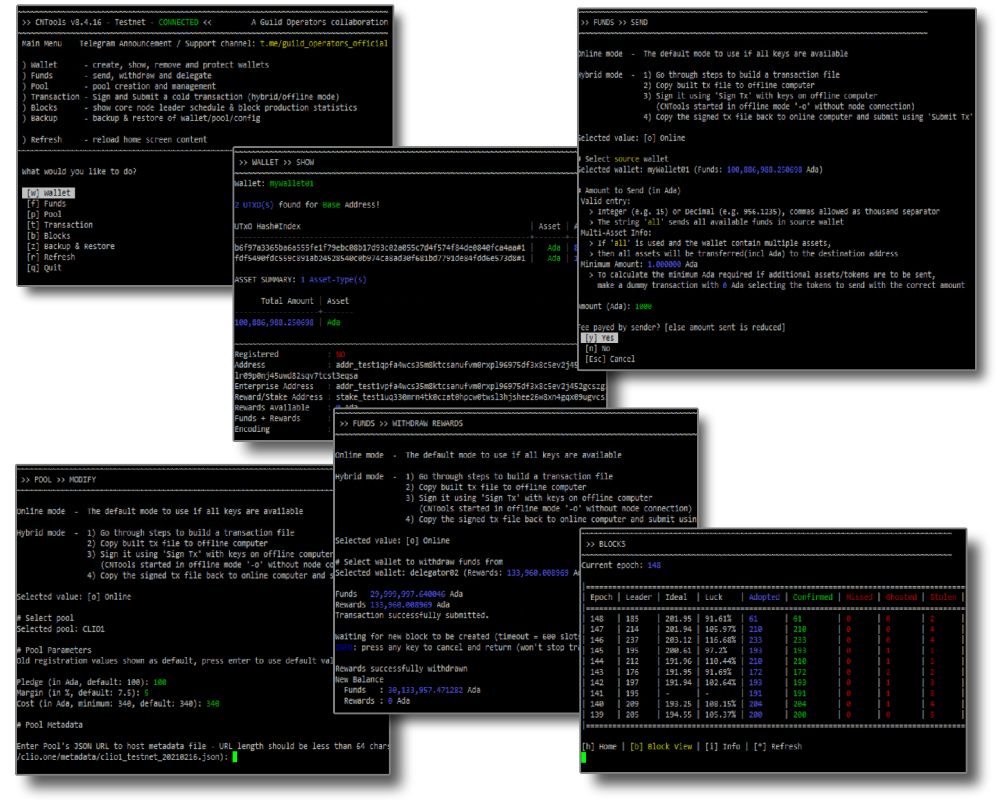
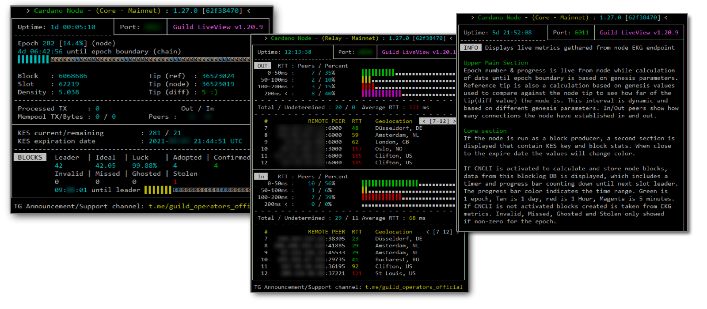

## Guild Operators Suite

The Guild-Operators suite is a set of tools and scripts for setting up, managing, and monitoring Cardano stake pools, as well as managing tokens and keys. It's the outcome of a community collaborative effort by long-time active community members to make common chores for operators easier. We'll try to provide a fast run-through of the tools involved and a high-level overview of procedures to get you started since complete documentation for the suite is hosted [here][guild-website].

### Tools

#### CNTools

CNTools is a swiss army knife for pool operators who want to make routine tasks easier. It's a menu-driven bash GUI application for creating and managing wallets, sending ada and tokens, and just about any pool function. In addition, the tool has been enhanced with new features and improvements since its initial release in July 2020, coinciding with the introduction of the Cardano Shelley MainNet. More information regarding CNTools can be found [here](https://cardano-community.github.io/guild-operators/Scripts/cntools/).  
  

#### gLiveView

Guild LiveView, often known as gLiveView, is a local bash CLI monitoring utility with an easy-to-use interface for monitoring node status. It connects to the locally running node via the specified EKG/Prometheus node endpoints to collect and show node metrics, network information, and other information in real time. The program recognizes whether the node is being used as a relay or a block producer and adjusts the output accordingly. More information regarding gLiveView can be found [here](https://cardano-community.github.io/guild-operators/Scripts/gliveview/).  
  

#### Topology Updater
Topology Updater was built as a workaround to allow stake pool relays to auto-discover and pair with peers on the network. While P2P implementation was put on hold owing to other priorities, this script has become one of the most important tools for avoiding having to manually contact friends and request that individual nodes be included to topology files. More information about the tool may be found [here](https://cardano-community.github.io/guild-operators/Scripts/topologyupdater/).  
  

#### Guild Network and Support for other networks

Guild Network is a brief (60-minute epoch) network that functions similarly to the Cardano testnets but is entirely governed by the community. It's excellent for experimenting with things in the sandbox, as well as testing out viable features before releasing them to other networks. This network is already supported by all of the tools in the repo, including Mainnet, testnets, and staging.  

#### Others..

Other utility scripts on a lesser scale include creating core components from source for particular components, setting up environment pre-requisites, and so on. Starting here, you can read about specifics as you go across the homepage [here][guild-website].  

:::note
    Please ensure to read the disclaimers on guild website before continuing
:::

### Setting Up Pre-Requisites..

For installing OS Packages, dependencies, setting up a [sample directory structure](https://cardano-community.github.io/guild-operators/basics/#folder-structure) used as an example template input (customisable) for guild tools, fetching of configuration, genesis artifacts, downloading tool scripts, etc , you can use the commands below. The script does have quite a few options (you can use `-h` to check any optional components/arguments you'd want to include).  

``` bash
mkdir "$HOME/tmp";cd "$HOME/tmp"
curl -sS -o guild-deploy.sh https://raw.githubusercontent.com/cardano-community/guild-operators/master/scripts/cnode-helper-scripts/guild-deploy.sh
chmod 755 guild-deploy.sh
./guild-deploy.sh -b master -n mainnet -s pdl
. "$HOME"/.bashrc
```

:::note 
    `-s pdl`  
      installs (p)rerequisites for the operating system, 
      (d)ownloads the precompiled binaries 
      and also compiles and installs the IOG fork of (l)ibsodium.

      consider guild-deploy.sh --help for options when you update the system 
      or want to install additional modules
:::

### Build of Node/DBSync components

We assume you'd have already seen the guide [here](docs/get-started/cardano-node/installing-cardano-node.md). There are similar build scripts/instructions available for building different cardano-node, cardano-db-sync, offline-metadata-tools and setting up postgres+postgREST with dbsync) on guild documentations. You can navigate instructions for each of them [here](https://cardano-community.github.io/guild-operators/build/). The instructions will also deploy these as a systemd service, which is recommended to avoid manually managing services.  

### Customise configuration

Now that you've set-up your OS dependencies and built/installed node binaries, it's time for you to customise your configuration, paths, names, etc for your node. You can use [env](https://cardano-community.github.io/guild-operators/Scripts/env/) file to modify these. Each line contains default value, and a simple explanation about what variable means.  

### Contributions/Feedback..

Issue/PRs are welcome on the [github repository][guild-github].  

### Support Requests

We do have the [Koios Discussions telegram channel for support requests][koios-general-tg] , but note that we intend to have support channel only for baseline skillset highlighted on [homepage][guild-website].  

[guild-github]: https://github.com/cardano-community/guild-operators
[guild-website]: https://cardano-community.github.io/guild-operators
[koios-general-tg]: https://t.me/CardanoKoios/1
