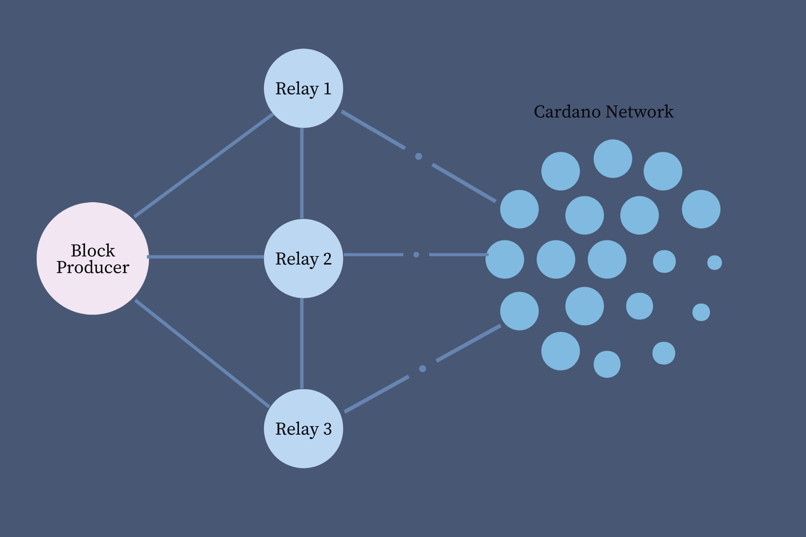
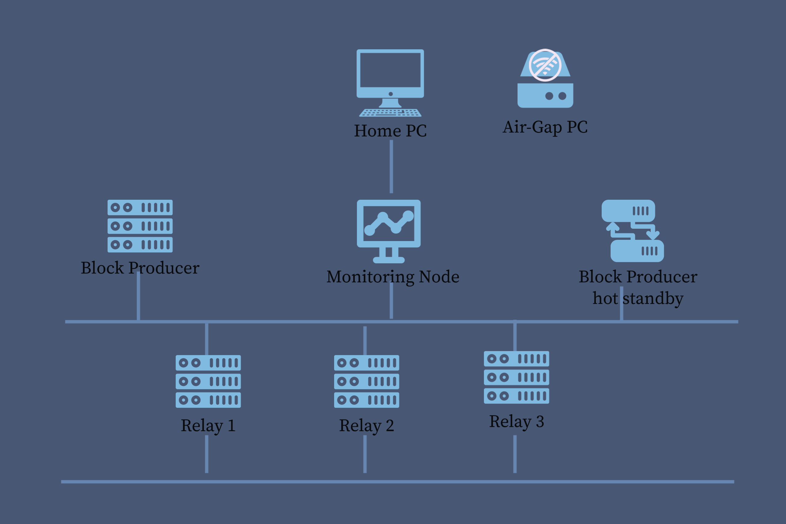

Before we start with the stake pool installation and configuration, it is essential to understand the logical topology of stake pools. Typically every stake pool has one block producer and at least one relay node. To ensure fast propagation of blocks the pool produces, it is recommended to have relays in different geographical locations. To secure the block producer from the internet it should only connect to its own relays, or relays you trust. The relays then connect to the rest of the Cardano network. To minimise the risk of [height battles](https://forum.cardano.org/t/how-to-figure-out-when-pool-wins-slot-battles-or-causes-height-battles/90639), it is recommended to regularly monitor the propagation time of the relays. We will talk more on this topic in our pool monitoring section later.

In the example below, one block producer is connected to three relays and they are connected to other relays of the Cardano network.

For the operation of a stake pool, some additional nodes in the topology might be useful. For example, a back-up node for block producer is helpful in case the main block producer has an issue e.g. during an upgrade. Depending on the number of stake pools that are being managed, a monitoring node can be used to monitor them and generate alarms. Stake pool operators also need a [air-gapped system](/docs/get-started/air-gap) to store the pool cold keys. Some pool operators use a hardware wallet for storing the pool pledge.

A logical topology of all the components, without considering firewalls and other security aspects can be shown as follows.

