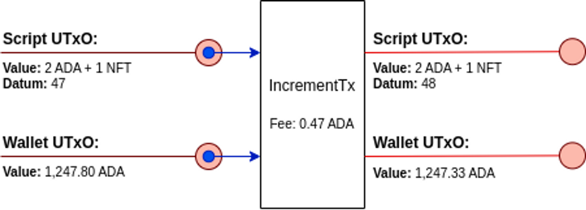

## Introduction

:::info
This article assumes that you are familiar with the EUTxO model and with Cardano transactions at an abstract level (e.g. you can understand the information shown in a blockchain explorer).
:::
:::note
This article is a modernized version of the joinplank [blog post](https://www.joinplank.com/articles/debugging-plutus-an-introduction-to-low-level-cardano-transactions-in-the-alonzo-era) ([conway era CDDL](https://github.com/IntersectMBO/cardano-ledger/blob/c2b7ea777317dd1dfeba576d044be2cbe742d9a8/eras/conway/impl/cddl-files/conway.cddl) specifications instead of Alonzo) and shares a [section](https://aiken-lang.org/language-tour/troubleshooting#cbor-diagnostic) from Aiken documentation
:::

The first thing to know about the specification, is that transactions are defined and serialized using the CBOR format, defined first in [RCF 0749](https://www.rfc-editor.org/rfc/rfc7049) and then updated in [RFC 8949](https://www.rfc-editor.org/rfc/rfc8949). CBOR stands for Concise Binary Object Representation, a data format that can be seen as a “binary JSON”. This binary representation allows for more compact messages at the cost of human readability. Fortunately, CBOR messages can be easily encoded and decoded using any existing [implementation](https://cbor.io/impls.html) of the CBOR protocol in a variety of languages, but also online by using the [CBOR playground](https://cbor.me/). CBOR is all around Cardano, as transactions themselves are encoded using this format, also do the Plutus data inside them, and even complete blocks of transactions are.

## Cardano specification/s

As Cardano has passed through different eras, the specification is splitted into several documents, one for each era, describing incrementally the modifications and additions that each era introduced. For each era there is also as part of the specification a text file that precisely defines the CBOR schema used for blocks and transactions. For this, the CDDL (Concise Data Definition Language) format is used, a notational convention defined in [RFC 8610](https://www.rfc-editor.org/rfc/rfc8610) that is used to describe CBOR data structures.

In this post, we will concentrate on the Conway era specification, the one that introduced all the smart contract functionality through Plutus.

## A simple smart contract

To learn about Conway transactions we will take an example transaction related to a very simple smart contract designed for this purpose. The smart contract is just a single script UTxO that holds an integer in its datum. It admits two operations: increment, to add 1 to the integer, and decrement, tu substract 1 from it. The UTxO also holds in its value an NFT we only use to identify it.

The example transaction we provide is an increment operation. It increments the integer from 47 to 48 in the datum, while preserving the NFT in the value. It can be illustrated the following way:



Here, besides the script input and output, there are also wallet input and output, that are used to pay for the fees and get back the change.

### The raw transaction

The transaction was made in the preprod testnet, and it can be found in the Cardano explorer with hash [8ae88d7ee59eda5a7a95dd66e9cf123a89758f2ec31e73a5c65b4d9cf312f71c](https://explorer.cardano.org/transaction?id=8ae88d7ee59eda5a7a95dd66e9cf123a89758f2ec31e73a5c65b4d9cf312f71c&network=preprod).

As the transaction is in CBOR format, we can decode it using the CBOR playground to find something that looks like this:

```rust
[
  {
    0:
[[h'A1D13B016FD106784482D2B2E1C85330090B3C27464D2163F752AD42730A2867',
 0],

[h'A51F7E6EC66F1DB366F2A7AD63B8041B51B269CEBD5D52A140F6C5B7E069DFB7',
 1]],
    1:
[[h'706EB7C29D9362DD710902977BB645EB97BB76C6246768851E76489F1A',
            [2000000,
{h'725BA16E744ABF2074C951C320FCC92EA0158ED7BB325B092A58245D':
 {h'': 1}}],

h'B034C17CF9EEF7E2D38FFF1EC8956C3A3C9FECE616E1CE03DF5860FEE81ADB1E'],

[h'002D106290A8EAEB46BDC5A5AD92401306263E77FAA00D3E7E60055C0784064433AEAE5D686016D7CA93DB82FD72D83AA67E55511B0AE9C3F8',
            1247328024]],
    2: 473726,
   11:
h'E1D6B63A31FD6FBE2BF9A7403160BEF41A6E03B31776BB6B140BF0C1B19494D4',
   13:
[[h'834E3714ED521A76CCAD0DFECCAB998C25EA068BFE120C2DDCF32D4555F79A6B',
 7]]
  },
  {
    0:
[[h'41BF65F9DBEACE48BDC6ABA5CC9149C16077EE2338A97292414FD0C1BB7D797E',

h'F2F0A179D98C04B51BC1C7A891708ADFEF9EB28818054E28FCA6CF769518E4DD148ED024208CA33F5ED996BD1A0A6AF46E1A941BDD54061EC47CA10A1D8D2C00']],
    3:
[h'5910FE010000332323232323232323232323232323322323232322232232322323253353330093333573466E1CD55CEA803A4000464646666AE68CDC39AAB9D5001480008DD69ABA135573CA004464C6A66AE7007C0780740704DD50009ABA135573CA010464C6A66AE7007006C068064CCCD5CD19B875004480188488880108CCCD5CD19B875005480108C848888C004014CCD54069D73AE357426AAE79401C8CCCD5CD19B8750064800884888800C8CCCD5CD19B875007480008488880088C98D4CD5CE00F80F00E80E00D80D00C9999AB9A3370E6AAE754009200023322123300100300232323232323232323232323333573466E1CD55CEA8052400046666666666444444444424666666666600201601401201000E00C00A00800600466A02E464646666AE68CDC39AAB9D5002480008CC8848CC00400C008C088D5D0A801180E1ABA135744A004464C6A66AE700B00AC0A80A44D55CF280089BAA00135742A01466A02E0306AE854024CCD54069D7280C9ABA150083335501A75CA0326AE85401CCD405C088D5D0A80319A80B99AA812811BAD35742A00A6464646666AE68CDC39AAB9D5002480008CC8848CC00400C008C8C8C8CCCD5CD19B8735573AA004900011991091980080180119A8143AD35742A00460526AE84D5D1280111931A99AB9C03002F02E02D135573CA00226EA8004D5D0A8011919191999AB9A3370E6AAE754009200023322123300100300233502875A6AE854008C0A4D5D09ABA2500223263533573806005E05C05A26AAE7940044DD50009ABA135744A004464C6A66AE700B00AC0A80A44D55CF280089BAA00135742A00866A02EEB8D5D0A80199A80B99AA812BAE200135742A004603E6AE84D5D1280111931A99AB9C028027026025135744A00226AE8940044D5D1280089ABA25001135744A00226AE8940044D5D1280089ABA25001135573CA00226EA8004D5D0A8011919191999AB9A3370EA0029003119091111802002980D1ABA135573CA00646666AE68CDC3A8012400846424444600400A60386AE84D55CF280211999AB9A3370EA0069001119091111800802980C1ABA135573CA00A46666AE68CDC3A8022400046424444600600A6EB8D5D09AAB9E500623263533573804604404204003E03C03A26AAE7540044DD50009ABA135744A004464C6A66AE7007006C06806440684C98D4CD5CE2481035054350001A019135573CA00226EA80044D55CEA80089BAA001137540022464460046EB0004C8004D5405088CCCD55CF80092804919A80418021ABA100230033574400402646464646666AE68CDC39AAB9D5003480008CCC88848CCC00401000C008C8C8C8CCCD5CD19B8735573AA0049000119910919800801801180A9ABA1500233500E014357426AE8940088C98D4CD5CE00C80C00B80B09AAB9E5001137540026AE85400CCCD5401DD728031ABA1500233500A75C6AE84D5D1280111931A99AB9C015014013012135744A00226AAE7940044DD5000899AA800BAE75A224464460046EAC004C8004D5404888C8CCCD55CF80112804119A80399AA80A98031AAB9D5002300535573CA00460086AE8800C0484D5D080088910010910911980080200189119191999AB9A3370EA0029000119091180100198029ABA135573CA00646666AE68CDC3A801240044244002464C6A66AE7004404003C0380344D55CEA80089BAA001232323333573466E1CD55CEA80124000466442466002006004600A6AE854008DD69ABA135744A004464C6A66AE7003803403002C4D55CF280089BAA0012323333573466E1CD55CEA800A400046EB8D5D09AAB9E500223263533573801801601401226EA8004488C8C8CCCD5CD19B87500148010848880048CCCD5CD19B875002480088C84888C00C010C018D5D09AAB9E500423333573466E1D400D20002122200223263533573801E01C01A01801601426AAE7540044DD50009191999AB9A3370EA0029001109100111999AB9A3370EA0049000109100091931A99AB9C00B00A009008007135573A6EA80048C8C8C8C8C8CCCD5CD19B8750014803084888888800C8CCCD5CD19B875002480288488888880108CCCD5CD19B875003480208CC8848888888CC004024020DD71ABA15005375A6AE84D5D1280291999AB9A3370EA00890031199109111111198010048041BAE35742A00E6EB8D5D09ABA2500723333573466E1D40152004233221222222233006009008300C35742A0126EB8D5D09ABA2500923333573466E1D40192002232122222223007008300D357426AAE79402C8CCCD5CD19B875007480008C848888888C014020C038D5D09AAB9E500C23263533573802602402202001E01C01A01801601426AAE7540104D55CF280189AAB9E5002135573CA00226EA80048C8C8C8C8CCCD5CD19B875001480088CCC888488CCC00401401000CDD69ABA15004375A6AE85400CDD69ABA135744A00646666AE68CDC3A80124000464244600400660106AE84D55CF280311931A99AB9C00C00B00A009008135573AA00626AE8940044D55CF280089BAA001232323333573466E1D400520022321223001003375C6AE84D55CF280191999AB9A3370EA004900011909118010019BAE357426AAE7940108C98D4CD5CE00480400380300289AAB9D5001137540022244464646666AE68CDC39AAB9D5002480008CD54028C018D5D0A80118029ABA135744A004464C6A66AE7002402001C0184D55CF280089BAA0014984800524103505431001122123300100300211232300100122330033002002001332323322332232323232332232323232323232323232323232323232332232323232323232323232222232323232323253333500815335333573466E1CCDC3004A400890010170168817099AB9C49011C5374617465206E6F742076616C696420666F7220636C6F73696E672E0002D15335300D0072135001223500122253353330170120023550082220021500715335335738920115496E76616C6964206F75747075742076616C75652E0003315007103313562615335300D00721350012235001222533533301701200235500A222002150091533533573892115496E76616C6964206F75747075742076616C75652E00033150091033135626232323232153353232325335333573466E20044CDC0000A400806A06C2A0042A66A666AE68CDC480899B81001480100D80D45400840D4D4044880044CCD5CD19B883322333355002323350272233350250030010023502200133502622230033002001200122337000029001000A4000603C2400266062A06C002900301A019A8058A8008A99A99AB9C491225374617465206E6F742076616C696420666F72206D696E74696E67207072697A652E000321500110321533533301501032323355301D1200123500122335503A002335530201200123500122335503D00233350012330374800000488CC0E00080048CC0DC0052000001330180020015004500A355009222002150011533533573892115496E76616C6964206F75747075742076616C75652E0003115001103115335333573466E1C030D540208894CD400484D4038894CD4CC06000C008854CD4C0A400484004540CC540C8540BC0C40C05400454CD4CD5CE248115496E76616C6964206F75747075742073746174652E000301500110301533533301300E500135009223500222222222220071030133573892011E546865207072697A65206973206E6F74206265696E67206D696E7465642E0002F13500122335032335503400233503233550340014800940CD40CC54CD4CCD5CD19B8753333500710081337020109001099B800084800884024D540048894CD400484D4028894CD4CC05000C008854CD4C09400484004540A4540A0540940B40B040B44CD5CE248115496E76616C6964206F75747075742073746174652E0002C153353009005130204988854CD40044008884C0912615335333573466E1D4CCCD401440184CDC080324004266E00019200221007355001222533500121350082253353301200300221533530230012100115029150281502502B02A102B133573892115496E76616C6964206F75747075742073746174652E0002A153353007003130204988854CD40044008884C09126153353006002130214988854CD40044008884C09526153353007001213500122350012220021356262350012235002222222222253353301000A00B2135001223500122233355301C12001223500222235008223500522325335335005233500425335333573466E3C0080041081045400C410481048CD4010810494CD4CCD5CD19B8F002001042041150031041133504100A0091009153350032153350022133500223350022335002233500223303200200120442335002204423303200200122204422233500420442225335333573466E1C01800C11C11854CD4CCD5CD19B8700500204704613302500400110461046103F153350012103F103F503800F132635335738921024C660002302222333573466E1C00800409008C8D400488D40088888888888CC03802802C88CCCD40049407094070940708CCD54C0344800540148D4004894CD54CD4CCD5CD19B8F350022200235004220020260251333573466E1CD400888004D40108800409809440944D408000C5407C00C88D400488888888894CD4CCD54C0544800540348D4004894CD4CCD5CD19B8F00200F02E02D135028003150270022135026350012200115024133500E225335002210031001501722233355300A120013500F500E2350012233355300D1200135012501123500122333500123300A4800000488CC02C0080048CC028005200000133004002001223355300712001235001223355024002333500123355300B1200123500122335502800235500D0010012233355500801000200123355300B1200123500122335502800235500C00100133355500300B00200111122233355300412001501F335530071200123500122335502400235500900133355300412001223500222533533355300C1200132335013223335003220020020013500122001123300122533500210251001022235001223300A002005006100313350230040035020001335530071200123500122323355025003300100532001355025225335001135500A003221350022253353300C002008112223300200A004130060030023200135501E221122253350011002221330050023335530071200100500400111212223003004112122230010043200135501B22112253350011501D22133501E300400233553006120010040013200135501A22112225335001135006003221333500900530040023335530071200100500400112350012200112350012200222333573466E3C008004054050448CC004894CD40084004405004C48CD400888CCD400C88008008004D40048800448848CC00400C0088C8C8CCCCCCD5D200191999AB9A3370E6AAE75400D2000233335573EA0064A01C46666AAE7CD5D128021299A9919191999999ABA400323333573466E1CD55CEA801A400046666AAE7D400C940548CCCD55CF9ABA250042533532333333357480024A0304A0304A03046A0326EB400894060044D5D0A802909A80C0008A80B1280B0078071280A0061280992809928099280980609AAB9E5001137540026AE85401484D40440045403C9403C02001C94034014940309403094030940300144D55CF280089BAA001498480048D58984D58988D58984D58988D589848488C00800C44880044D589888CDC0001000990009AA803911299A80088011109A8011119803999804001003000801990009AA8031111299A80088011109A80111299A999AB9A3370E00290000050048999804003803001899980400399A80589199800804001801003001891001091000889100109109119800802001889109198008018010891918008009119801980100100099A89119A8911980119AA80224411C725BA16E744ABF2074C951C320FCC92EA0158ED7BB325B092A58245D00488100481508848CC00400C0088004448848CC00400C0084480041'],
    4: [121([121([47])]), 121([121([48])])],
    5: [[0, 0, 121([]), [1302238, 360901332]]]
  },
  true,
  null
]
```

Quite a mess, right? Don’t let it scare you. Each line here has a meaning, and it is worth to understand it, or at least know where we can find a good explanation for it. Let’s see.

## Transactions in the Conway era

The main reference to understand Cardano transactions are the CDDL specification, where we can find the [transaction definition](https://github.com/IntersectMBO/cardano-ledger/blob/c2b7ea777317dd1dfeba576d044be2cbe742d9a8/eras/conway/impl/cddl-files/conway.cddl#L17):

```rust
transaction =
  [ transaction_body
  , transaction_witness_set
  , bool
  , auxiliary_data / null
  ]
```

Here, we can see that transactions are comprised of four parts. The two main parts of a transaction are its body and its witness set. In this article we focus on these parts, and ignore the other two, just saying that the third one has to do with transaction validity, and the fourth one is where the metadata goes, among other things.

### The transaction body

We can find the schema for the transaction body at [line 130](https://github.com/IntersectMBO/cardano-ledger/blob/c2b7ea777317dd1dfeba576d044be2cbe742d9a8/eras/conway/impl/cddl-files/conway.cddl#L130) of the CDDL specification:

```rust
transaction_body = 
  {   0  : set<transaction_input>         
  ,   1  : [* transaction_output]      
  ,   2  : coin                            
  , ? 3  : slot_no                         
  , ? 4  : certificates                    
  , ? 5  : withdrawals                     
  , ? 7  : auxiliary_data_hash             
  , ? 8  : slot_no                         
  , ? 9  : mint                            
  , ? 11 : script_data_hash                
  , ? 13 : nonempty_set<transaction_input> //the inputs that can be collected if phase-2 script validation fails
  , ? 14 : required_signers                
  , ? 15 : network_id                      
  , ? 16 : transaction_output              
  , ? 17 : coin                            
  , ? 18 : nonempty_set<transaction_input>
  , ? 19 : voting_procedures               
  , ? 20 : proposal_procedures             
  , ? 21 : coin                            
  , ? 22 : positive_coin                   
  }
```

So, the transaction body is a map from integer keys to values of different types. Some of the entries, marked as ‘?’, are optional.

The mandatory parts are the inputs (field 0), the outputs (field 1) and the fee (field 2). In the smart contract example above, also the fields 11 (`script_data_hash`) and 13 (`nonempty_set<transaction_input>` meaning -> collateral) are present, which are always required if the transaction involves script execution.

### Transaction inputs

Transaction inputs are listed in field 0 of the transaction body. A transaction input, you probably know, is a reference to a UTxO (Unspent Transaction Output). In other words, it is the output of a previous transaction that was not spent yet (i.e. used as input) by any other transaction. According to the [CDDL](https://github.com/IntersectMBO/cardano-ledger/blob/c2b7ea777317dd1dfeba576d044be2cbe742d9a8/eras/conway/impl/cddl-files/conway.cddl#L156), a reference to a UTxO is defined by the following pair:

```rust
transaction_input = [ transaction_id : $hash32
                    , index : uint                    ]
```

where transaction_id is the hash of the transaction that generated the UTxO, and index is the index in the list of its outputs (starting from 0, obviously).

In our example, two inputs are present:

```rust
0:
[[h'A1D13B016FD106784482D2B2E1C85330090B3C27464D2163F752AD42730A2867',
 0],

[h'A51F7E6EC66F1DB366F2A7AD63B8041B51B269CEBD5D52A140F6C5B7E069DFB7',
 1]],
```

So, the first input is the UTxO corresponding to the first output of transaction [A1D13B…](https://explorer.cardano.org/transaction?id=a1d13b016fd106784482d2b2e1c85330090b3c27464d2163f752ad42730a2867&network=preprod), and the second one corresponds to the second output of transaction [A51F7E…](https://explorer.cardano.org/transaction?id=a51f7e6ec66f1db366f2a7ad63b8041b51b269cebd5d52a140f6c5b7e069dfb7&network=preprod ). As we will see next, one of them corresponds to the smart contract, and the other one is used to pay for the transaction fees.

#### Inputs Information

To be able to understand and debug our transaction, it is important to know the information about the inputs, not present in the transaction itself. The information is comprised of these three components:

- The address encoding the owner of the input, that for a wallet UTxO it is a pubkey hash and for a script UTxO it is the hash of the validation script.
- The value it holds, a number of ADA and maybe some other assets.
- An optional datum hash, in the case the UTxO encodes some data.

In our example, we can find this information by navigating the Cardano explorer:

**Input ([A1D13B…](https://explorer.cardano.org/transaction?id=A1D13B016FD106784482D2B2E1C85330090B3C27464D2163F752AD42730A2867&network=preprod), 0)**:

- Address: [addr_test1wpht0…](https://preprod.cexplorer.io/address/addr_test1wpht0s5ajd3d6ugfq2thhdj9awtmkakxy3nk3pg7weyf7xs6nm2gz) (a script UTxO)
- Value: 2 ADA and an [unnamed NFT](https://preprod.cexplorer.io/asset/asset17s6927lhfd39y874f3psjfkz7ds444lw6g5gxt)
- Datum hash: 8cf95d… (encodes the integer 47, see section “The Plutus data” below)

**Input ([A51F7E…](https://explorer.cardano.org/transaction?id=a51f7e6ec66f1db366f2a7ad63b8041b51b269cebd5d52a140f6c5b7e069dfb7&network=preprod), 1)**:

- Address: addr_test1qqk3qc… (a wallet UTxO)
- Value: 1,247.80 ADA
- Datum hash: Not present.

From this information, it is clear that the first input is used to pay for the transaction, and the second one is the “smart contract”. Usually, when the off-chain code of a dapp builds a transaction, the inputs used to pay for it are introduced in a last stage called “balancing”. As a wallet may have several UTxOs, selecting which one/s will be used to pay is a complex subject called “coin selection”, something that is extensively discussed in [CIP 2](https://cips.cardano.org/cips/cip2/).

#### The ordering of the inputs

In the CDDL specification it can be seen that the inputs are in a set, not a list. Why a set? Well, Cardano doesn’t allow us to choose how to order the inputs. The ordering we use in the serialized raw transaction is completely ignored. Instead, the specifications assumes that the inputs are ordered lexicographically in the pair (transaction_id, index).

This is important, because in the redeemers we will use indexes to refer to positions in the list of inputs following this ordering criteria. We will talk about this later.

### Transaction outputs

Transaction outputs (field 1) are a bit more complex than inputs, as they are new UTxOs that are being created by the transaction. Their [CDDL](https://github.com/IntersectMBO/cardano-ledger/blob/c2b7ea777317dd1dfeba576d044be2cbe742d9a8/eras/conway/impl/cddl-files/conway.cddl#L165) specification is:

```rust
transaction_output =  [ address  , amount : value  , ? datum_hash : $hash32 ]
```

The components are: the raw value of the address where the UTxO is paid to, the value it will contain and an optional datum hash it can also carry. The datum hash can be used to encode data in the UTxO, and was introduced in Conway to store “state” information for script UTxOs. While not forbidden, datum hashes are rarely used in wallet UTxOs.

In the example we have two outputs:

**Output 0**:

- Raw address: [706EB7...](https://preprod.cexplorer.io/address/addr_test1wpht0s5ajd3d6ugfq2thhdj9awtmkakxy3nk3pg7weyf7xs6nm2gz)
- Value: `[2000000, {h'725BA1...': {h'': 1}}]`
- Datum hash: B034C1... (encodes the integer 48, see section “The Plutus data” below)

**Output 1**:

- Raw address: [002D10...](https://preprod.cexplorer.io/address/addr_test1qqk3qc5s4r4wk34ackj6myjqzvrzv0nhl2sq60n7vqz4cpuyqezr8t4wt45xq9khe2fahqhawtvr4fn724g3kzhfc0uqyagtkd)
- Value: 1247328024

The first one corresponds to the script address where the smart contract lives. The value is a list because it does not contain only ADA but also another asset: An NFT with currency symbol  [725BA1…](https://preprod.cexplorer.io/asset/asset17s6927lhfd39y874f3psjfkz7ds444lw6g5gxt) (aka policy) and an empty token name. You can see how values are specified in [209](https://github.com/IntersectMBO/cardano-ledger/blob/c2b7ea777317dd1dfeba576d044be2cbe742d9a8/eras/conway/impl/cddl-files/conway.cddl#L209) of the CDDL. The datum hash is encoding the new integer value: 48.

The second output is the “change”, the remaining ADA value that goes back to the wallet that paid for the transaction. This output is usually introduced in the balancing stage of the transaction building process.

### The script data hash

Field 11 of the transaction body is the script data hash, also called `ScriptIntegrityHash` in the specification document. This hash encodes information that determines the results of scripts execution otherwise not present in the body. The encoding includes the redeemers and the data, both from the witnesses (see below), but also the protocol parameters that determine the costs and limits for script execution.

Computing this field is a bit complex and all transaction libraries that support Plutus are able to do this for you. However, you must have present that any modification you do to a transaction that may alter the script data hash, requires recomputing and updating the value of this field.

### Collaterals

Transaction validation is divided into two phases, where phase 1 involves all basic checks for transaction correctness, and phase 2 is comprised of the execution of all the involved Plutus scripts. If the validation in phase 2 fails, the transaction is rejected but a penalty must be applied to cover the execution costs (and discourage failing transactions). This is the collateral, a set of inputs that is spent in this case.

Collaterals (field 13) must be wallet UTxOs, can only contain ADA and the included signatures must allow their spending. An interesting observation is that the same inputs can be used as regular inputs and as collateral, because only one of the two sets will be spent.

In our example, the collateral is a single input with 5 ADA, a standard amount for collaterals.

### Required signers

The required signers (field 14) is a set of hashed keys that can be used to require additional signatures besides those required to spend wallet UTxOs. If a key is present but the corresponding signature is not in the witness set, the transaction will fail in phase 1.

The required signers set is also made available to the Plutus script executions through the “script context”. This way, validation scripts can do indirect checks on the presence of signatures, as the script context doesn’t explicitly include them.

Our example doesn’t have required signers, but it is an important component because checking for signatures is a frequent requirement in smart contracts.

### Other relevant body fields

So far we only covered fields 0, 1, 11, 13 and 14 of the transaction body. Of course, there are other important fields. We briefly describe here the ones we find interesting:

- Field 2: The fee paid by this transaction (in Lovelace). It must be enough to cover for the costs related to transaction size and script execution units.
- Fields 3 and 8: The “time to live” (TTL) and the “validity interval start”. Together, they form the ValidityInterval defined in the specification document (Fig. 2). It is the slot range where we expect the transaction to be executed, and phase 1 will fail if it is not the case. If phase 1 succeeds, the interval information is then converted to a POSIX time range and passed to the scripts, allowing for phase 2 checks.
- Field 9: The minted value, all assets that are being minted or burned in the transaction. Minting can be done using pre-Alonzo simple scripts (native scripts) (defined in field 1 of the witness set) or using minting policies (included in field 3 for the witness set). For the latter, redeemers must be specified, and for this a lexicographical ordering in the policy IDs is assumed (see below in section about redeemers).

#### Witness set

Here is the CDDL specification for the [witness set](https://github.com/IntersectMBO/cardano-ledger/blob/c2b7ea777317dd1dfeba576d044be2cbe742d9a8/eras/conway/impl/cddl-files/conway.cddl#L652):

```rust
transaction_witness_set = 
  { ? 0 : nonempty_set<vkeywitness>      
  , ? 1 : nonempty_set<native_script>    
  , ? 2 : nonempty_set<bootstrap_witness>
  , ? 3 : nonempty_set<plutus_v1_script> 
  , ? 4 : nonempty_set<plutus_data>      
  , ? 5 : redeemers                       
  , ? 6 : nonempty_set<plutus_v2_script> 
  , ? 7 : nonempty_set<plutus_v3_script> 
  }
```

You can see that all fields are optional. However, field 0 will be present as it contains the transaction signatures and at least one signature is always required. For Plutus, the most relevant fields are the last three, so we address them in the following subsections.

## Plutus scripts

Field 3 is the list of Plutus scripts, this is, the binaries of the Plutus Core code for all the Plutus scripts that must be executed to validate the transaction, both for consuming script UTxOs and for minting Plutus assets.

Plutus scripts are without doubt the biggest part of Conway transactions and an important source of headache for any engineer trying to develop a meaningful dapp without hitting transaction size limit of 16kB.

For instance, in our example the Plutus script takes up to 4353 bytes, more than 45% of the total transaction size (9666 bytes).

The Babbage era, introduced “reference scripts” [CIP 33](https://cips.cardano.org/cip/CIP-33), a feature that provides a way to use scripts without the need for explicitly including them in transactions. We will leave this discussion for a future article.

### Plutus data

Field 4 is the Plutus data, a list that has the unhashed datums of all datum hashes present in the transaction inputs and outputs. These datums are made available to the Plutus validators through the “script context”, so checks can be made on them.

In the example, the Plutus data is:

```rust
4: [121([121([47])]), 121([121([48])])],
```

The first one corresponds to the datum hash of the script input, and the second one to the datum hash of the script output. In these datums, the integers are wrapped into some other data constructors, but this is just the way we chose to encode them, and has to do with the Haskell data structures we defined for the contract state.

### Redeemers

Field 5 is the list of redeemers. Each redeemer refers to the execution of a Plutus script.

The CDDL specifies that a [redeemer](https://github.com/IntersectMBO/cardano-ledger/blob/c2b7ea777317dd1dfeba576d044be2cbe742d9a8/eras/conway/impl/cddl-files/conway.cddl#L677) is as follows:

```rust
redeemers = 
  [ + [ tag      : redeemer_tag
  , index    : uint .size 4
  , data     : plutus_data 
  , ex_units : ex_units    
  ]
```

So, a redeemer is a 4-uple with the following components:

- tag: It specifies the type of redeemer, and has four possible values. Value 0 is used for spending a script UTxO, value 1 for minting/burning with a Plutus minting policy. Don’t worry about values 2 and 3 as they has to do with staking.

- index: It is an integer with a different meaning depending on the tag. For the spending tag (value 0), the index refers to the position in the inputs list after ordering it lexicographically according to the TxId and TxIdx. For the minting tag (value 1), the index refers to the position in the lexicographically ordered list of policy IDs present in the minting field.

- data: This is arbitrary data that is passed as a parameter to the script. Most times this data is what is actually called the “redeemer”, instead of the complete 4-uple.

- ex_units: The budget for the script execution in memory and CPU units. These numbers are used to compute the fee and must be higher or equal to the actual units used by the script execution. Execution units are computed according to the cost model, part of the protocol parameters of the Cardano blockchain. There is also a limit of the total memory and CPU units that all redeemers of a transaction can use. Also defined in the protocol parameters, Alonzo started with limits of 10.000 million units for CPU, and 10 million units for memory. However it was soon noticed that the memory limit was too low and was later raised to 16 million units. Execution units and their limits are a big issue in Cardano, as they impose important restrictions to smart contracts and developers must pay special attention to on-chain code optimization.

In our example, we have only one redeemer for spending the script UTxO that is the first input according to the lexicographic order:

```rust
5: [[0, 0, 121([]), [1302238, 360901332]]]
```

We use `121([])` as the redeemer data to indicate to the script that we are trying to perform an increment operation. If it was `122([])`, it would be a decrement operation. The script will validate, among other things, that the datum is updated according to the operation. The execution budget is 1302238 memory units and 360901332 CPU units, and was obtained in the balancing stage by doing an off-chain run of the validation.

## Trivia

To end, I propose you to try to answer the following questions. Thinking about them can be an interesting way to improve your understanding of the Cardano specification.

- Is it possible to successfully submit a transaction with no wallet inputs?
- Why it is not possible to successfully submit a transaction without signatures?
- Is it possible to successfully submit a transaction with an empty list of inputs?
- Is it possible to successfully submit a transaction with an empty list of outputs?

Answer True or False to the following assertions:

- Every transaction needs a collateral.
- Every transaction with script inputs needs a collateral.
- No transaction with no script inputs needs a collateral.

## Runtime CBOR Debugging with Aiken

While the previous sections focused on analyzing transactions at the blockchain and understanding what is CBOR and how to interpret it, developers need to debug CBOR data during smart contract development. This section covers techniques for inspecting individual values and data structures as you build and test your contracts.

:::info
You can read more at [Aiken - CBOR diagostic](https://aiken-lang.org/language-tour/troubleshooting#cbor-diagnostic) section.
:::

### CBOR Diagnostics in Aiken

When developing smart contracts with Aiken, compiled programs lose type information and variable names, making runtime inspection challenging. However, Aiken provides the `cbor.diagnostic()` function to inspect values at runtime using CBOR diagnostic notation - a human-readable representation of binary CBOR data.

```rust
use aiken/cbor

pub fn diagnostic(data: Data) -> String
```

CBOR diagnostics use a JSON-like syntax that can represent binary data. For example, the serialized bytes `83010203` appear as `[1, 2, 3]` in diagnostic notation.

### CBOR Diagnostic Syntax Reference

| Type | Examples |
|------|----------|
| Int | `1`, `-14`, `42` |
| ByteArray | `h'FF00'`, `h'666f6f'` |
| List | `[]`, `[1, 2, 3]`, `[_ 1, 2, 3]` |
| Map | `{}`, `{ 1: h'FF', 2: 14 }`, `{_ 1: "AA" }` |
| Tag | `42(1)`, `10(h'ABCD')`, `1280([1, 2])` |

**Tags** are particularly important for custom types on-chain. Aiken uses tag 121 for the first constructor of a data type, 122 for the second, and so forth. The tagged content represents the constructor's fields as a list.

### Practical Examples

Here are examples showing how Aiken values translate to CBOR diagnostics:

```rust
use aiken/cbor

// Basic types
cbor.diagnostic(42) == @"42"
cbor.diagnostic("foo") == @"h'666F6F'"
cbor.diagnostic([1, 2, 3]) == @"[_ 1, 2, 3]"
cbor.diagnostic((1, 2)) == @"[_ 1, 2]"

// Maps from list of tuples
cbor.diagnostic([(1, #"ff")]) == @"{ 1: h'FF' }"

// Option types using tags
cbor.diagnostic(Some(42)) == @"121([_ 42])"  // First constructor
cbor.diagnostic(None) == @"122([])"          // Second constructor
```

### Testing Datum and Redeemer Representations

You can use CBOR diagnostics to verify the exact binary representation of your data structures:

```rust
type MyDatum {
  foo: Int,
  bar: ByteArray
}

test my_datum_representation() {
  let datum = MyDatum { foo: 42, bar: "Hello, World!" }
  cbor.diagnostic(datum) == @"121([42, h'48656c6c6f2c20576f726c6421'])"
}
```

This diagnostic output can then be converted to raw CBOR using tools like [cbor.me](https://cbor.me) for use in transaction building.

### Integration with Transaction Analysis

The diagnostic output from development tools directly corresponds to what you'll see in transaction CBOR:

1. **During development**: Use `cbor.diagnostic()` to inspect your datum/redeemer values
2. **In transactions**: These same values appear in the Plutus data field (field 4 of witness set)
3. **For debugging**: Convert between diagnostic notation and raw CBOR using online tools

This creates a complete debugging workflow from contract development to transaction analysis.


