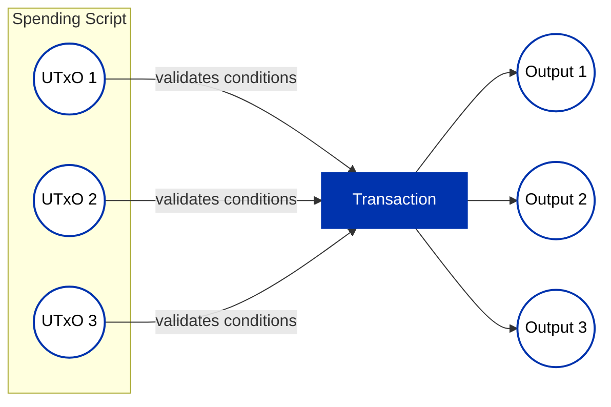
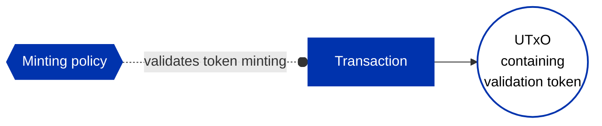
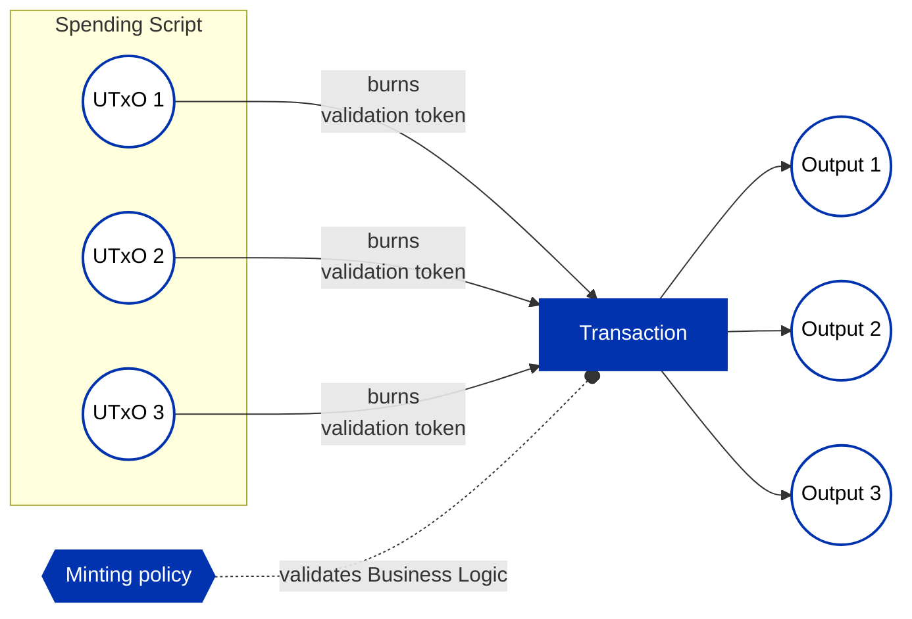

## Introduction

When crafting transactions to process a single script (smart contract) UTxO, enforcing spending
requirements seems straightforward. However, in high-throughput applications, a more efficient
approach is desired – allowing the processing (spending) of these script UTxOs in a "batch."
Unfortunately, invoking the validator script for each input UTxO in a transaction repeats
pre-processing steps, making it less optimal. To overcome this, the technique of "transaction level
validation" is employed.

For a detailed implementation of transaction level validation using staking validators, refer to the
[Stake Validator Design pattern](stake-validators/stake-validator.md). This document outlines the details of
implementing the same pattern via minting policies.

## The Problem

A batch transaction involves multiple input UTxOs at a specific script address, and spending can
only occur when specific conditions apply (i.e., the validator function does not reject the
transaction). In this scenario, the validator script is executed for each UTxO, and the transaction
fails if any of the scripts reject it.

## The Solution

A more efficient way to perform all the validations is by delegating them to a minting script, which
will only be executed once for the entire transaction.

The drawback of this approach is that the minted validation tokens must be included in one of the
outputs, potentially consuming unnecessary block space.

A more desirable solution involves burning the validation tokens instead of minting them in the
batch transaction. However, this requires minting and storing the validation tokens in the input
UTxOs beforehand, allowing for pre-validation steps attached to their creation.

## Conclusion

Transaction level validation can be implemented using minting policies. However, if minting
validation tokens is impractical, the recommended approach is to implement transaction level
validation using a staking validator due to lower ExUnits cost compared to minting policy checks,
based on our experience.

:::note
You can find a sample implementation of a tx level minter written in Aiken in this[repository](https://github.com/keyan-m/aiken-delegation-sample/blob/main/validators/spend-logic.ak).
:::