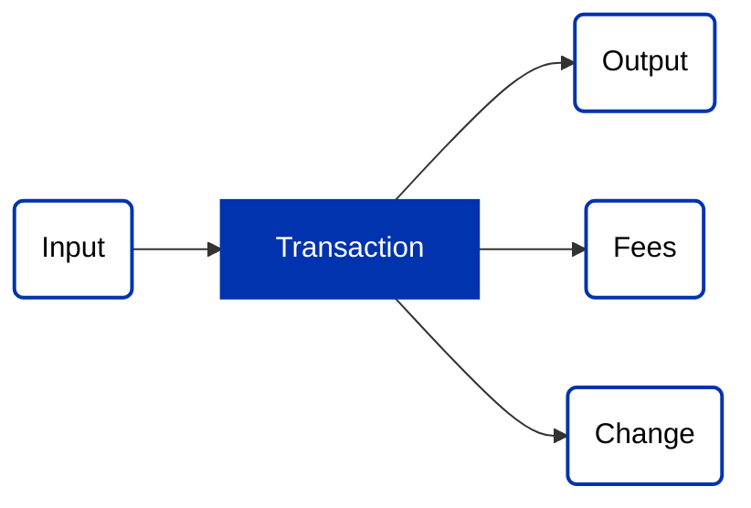
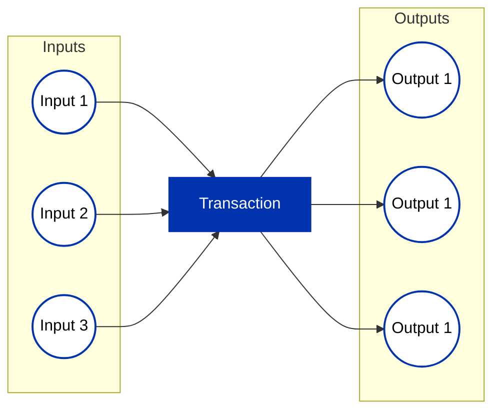

## Introduction

The Redeemer Indexing design pattern leverages the deterministic script evaluation property of the Cardano ledger to achieve substantial performance gains in onchain code. This pattern allows smart contracts to eliminate the need for linear searches and costly on-chain operations by utilizing deterministic indexing in the redeemer, thereby enabling O(1) lookups and drastically reducing validation costs.

## Deterministic Script Evaluation Property

The deterministic script evaluation property, also stated as "script interpreter arguments are fixed", is a property of the Cardano ledger that guarantees that the outcome of Plutus script evaluation in a (phase-1 valid) transaction depends only on the contents of that transaction, and not on when, by who, or in what block that transaction was submitted.

Simply put, all the inputs to Plutus scripts are known during transaction construction.

This property can be leveraged to take advantage of powerful smart contract optimizations. Because all inputs to Plutus scripts are known at the time of transaction construction, a large number of traditionally on-chain operations can be performed off-chain. This ensures that on-chain operations can be minimized to a series of verifications, thereby maintaining the integrity of the transaction.

## Zero On-Chain Linear Search

One of the most potent applications of this pattern is the complete elimination of the need to perform linear search operations on-chain. Normally, to find an input, output, or other transaction component (i.e. a specific token within a value), a linear search is required, these operations can become expensive very quickly due to the heavily constrained smart contract execution budget in blockchains. The Redeemer Indexing design pattern allows us to perform these lookup operations offchain.

In PlutusV3, there is only a single argument to Plutus scripts, namely, the `ScriptContext`.

Roughly the design pattern works as follows:

1. Construct your transaction including everything except the redeemer through which you will provide the index (in the meantime you can provide a dummy redeemer with a bogus index).
2. Search the built transaction to obtain the index of the element that you want your onchain code to have access to.
3. Construct a redeemer that includes the obtained index and add it to the transaction replacing the dummy one.
4. In your onchain code, instead of searching for the element you can access it by using `elemAt` with the index provided by your redeemer, and then you just check that the element satisfies the expected criteria.

For instance, if you want your validator to have access to a specific tx output you first build your transaction then you search the built transaction to obtain the index of the output, and then you add that index to the redeemer. In your onchain code, instead of searching for the element, you can simply get the `elemAt` the index provided by your redeemer and check that it does indeed satisfy the search criteria.

Thus, lookups are reduced to O(1) checks, where the on-chain code simply confirms that the indexed element is as expected.

## List Length Operations

You can also use this design pattern to avoid the need to perform expensive traversals of dynamic data-structures like `Lists` and `Maps` in your onchain code to determine the number of elements they contain. Instead, you can calculate the number of elements offchain, and provide it to the validator via the redeemer, then onchain you only need to check that the length your provided in the redeemer is correct. To perform this check, you apply the builtin `tail` function n times, where n is the `expectedLength` you passed via the redeemer and then you check that the result equals the empty list.

Here is a non-optimized implementation of a length function that calculates and returns the number of elements in a `BuiltinList`.

```rust
builtinListLength :: Integer -> BI.BuiltinList a -> Integer
builtinListLength l =
 go :: Integer -> BI.BuiltinList a -> Integer
 go acc xs =   
   -- matchList is a builtin function that takes a list and branches depending on whether the list is empty or not
   -- it expects the non-empty branch argument to be a function (\x xs -> ..) where x is the head of the list and xs is the tail.
   BI.matchList xs
     -- if the list is empty we return `acc` 
     acc
     -- if the list is non-empty we increase the counter and recurse
     (\_ ys -> go (acc + 1) ys)
```

As an exercise in this design pattern, try to design an optimized version of the length function that accepts as an argument the expected list length (computed offchain and passed to the onchain code via the redeemer) and uses that argument to reduce unnecessary recursion / null checks on the list. (hint: think about how you can replace `matchList`).

### Example 2 - List Length

```rust
import qualified PlutusTx.Builtins as BI
import qualified PlutusTx.Builtins.Internal as BI
import Language.Haskell.TH

-- A template haskell function that generates `n` inlined tail applications ie:
-- $(genInlinedTails 3 'xs)
--
-- compiles into:
--
-- (BI.tail (BI.tail (BI.tail xs)))
--  
genInlinedTails :: Int -> Name -> Q Exp
genInlinedTails n xs = foldr (\_ acc -> [| BI.tail $acc |]) (varE xs) [1..n]

-- Recursively compute the count of elements in a list (the count starts at `acc`)
-- ie: builtinListLength 3 [1,2] == 5 
-- the list has a length of 2 and `acc` is 3, so we have 2 + 3 = 5.
builtinListLength :: Integer -> BI.BuiltinList a -> Integer
builtinListLength acc xs = 
  -- matchList is a builtin function that takes a list and branches depending on whether the list is empty or not
  -- it expects the non-empty branch argument to be a function (\x xs -> ..) where x is the head of the list and xs is the tail.
  BI.matchList xs
    -- if the list is empty we return `acc` 
    acc
    -- if the list is non-empty we increase the counter and recurse
    (\_ ys -> go (acc + 1) ys)

-- An efficient length function that takes as a parameter the expected length and uses that knowledge
-- to avoid unnecessary recursion and checks. 
builtinListLengthFast :: forall a. Integer ->  BI.BuiltinList a -> Integer
builtinListLengthFast n xs = go n 0 xs  
  where 
   go :: Integer -> Integer -> BI.BuiltinList a -> Integer
   go remainingExpected currentCount xs 
    | 30 <= remainingExpected = go (remainingExpected - 30) (currentCount + 30) $(genInlinedTails 30 'xs)
    | 20 <= remainingExpected = go (remainingExpected - 20) (currentCount + 20) $(genInlinedTails 20 'xs)
    | 10 <= remainingExpected = go (remainingExpected - 10) (currentCount + 10) $(genInlinedTails 10 'xs)
    -- with less than 10 elements we revert to chooseList because the overhead of builtinAddInteger, builtinIfThenElse and builtinLessThanEquals
    -- is more inefficient than simply recursing with matchList. Although it may be more efficient to falling back to a function that 
    -- drops multiple elements at a time (3-4) at which point the aforementioned overhead might be compensated for by the reduced number of recursive calls.
    | otherwise = builtinListLength currentCount xs

```

## General Use

More generally, this design pattern can be used to improve performance in any situation where checking the correctness of a result is more efficient than calculating the result.

### Example 1: Enforce that the transaction includes exactly `n` script inputs

Here is a non-optimized implementation of a function that counts the amount of `Spend` redeemers in `txInfoRedeemers`, thus it tells us the total number of spending script executions
in the transaction (this will also be the total number of script inputs in the transaction).

```rust
{-# INLINE countSpendRedeemersSkipFirst #-}
countSpendRedeemersSkipFirst :: BuiltinData -> Integer
countSpendRedeemersSkipFirst b = go (BI.tail $ BI.unsafeDataAsMap b) 0
  where
    go :: BI.BuiltinList (BI.BuiltinPair BI.BuiltinData BI.BuiltinData) -> Integer -> Integer
    go redeemers i = if BI.fst (BI.unsafeDataAsConstr (BI.fst $ BI.head redeemers)) == 1 then go (BI.tail redeemers) (i + 1) else i
```

As an exercise in this design pattern, try to design a variant of this function that takes as an argument the expected number of `Spend` redeemers (computed offchain and passed to the onchain code via the redeemer), and use it to efficiently compute the actual number of `Spend` redeemers (erroring if the actual differs from the expected).

## Singular Input Processing

The foundational concept of smart contract validation in Cardano begins with singular input
processing. In its simplest form, validators, or smart contracts, are designed to validate
transactions that consist of a single input and optionally a single output. The following
illustrates this basic structure:



This straightforward scenario provides a clear validation path, making it relatively simple for the
smart contract to verify and process the transaction.

The code for the validator in this case would be something like this:

```rust
validatorA :: Datum -> Redeemer -> ScriptContext -> Bool
validatorA datum redeemer context =
  let input    = findOwnInput         context
      [output] = getContinuingOutputs context
  in  validateWithInputOutput input output
    where
    findOwnInput :: ScriptContext -> Maybe TxInInfo
    findOwnInput ScriptContext{scriptContextTxInfo=TxInfo{txInfoInputs},                   
                           scriptContextPurpose=Spending txOutRef} =
        find (\TxInInfo{txInInfoOutRef} -> txInInfoOutRef == txOutRef) txInfoInputs
    findOwnInput _ = Nothing
```

Note that `findOwnInput` checks the `TxOutRef` of each input to identify the one currently being validated. In this case, the check (comparing `TxOutRef`) is relatively cheap, even so, the actual search is very expensive since in the worst-case we traverse the entire list of inputs and check each one. Furthermore, often you will want to search for an input / output with more complex criteria ie:

```rust
validatorB :: AssetClass -> BuiltinData -> BuiltinData -> ScriptContext -> Bool
validatorB stateToken _ _ ctx =
  let authInput  = findAuth ctx  
      goodOutput = findOutputWithCriteria ctx
   in validate authInput goodOutput
    where
    findAuth :: ScriptContext -> Maybe TxInInfo
    findAuth ScriptContext{scriptContextTxInfo=TxInfo{txInfoInputs}} =
      find (\TxInInfo{txInOutput} -> assetClassValueOf stateToken (txOutValue txInOutput) == 1) txInfoInputs

    findOutputWithCriteria :: ScriptContext -> Maybe TxInInfo
    findOutputWithCriteria ScriptContext{scriptContextTxInfo=TxInfo{txInfoOutputs}} =
      find (\txOut -> criteria txOut) txInfoOutputs 
```

Using the redeemer indexing design pattern we can avoid needing to make these checks for each input / output, instead we pass the index of the input / output we are looking into the redeemer then we just make our checks for the element at that index:

```rust
validatorA :: AssetClass -> BuiltinData -> Integer -> ScriptContext -> Bool 
validatorA stateToken _ tkIdx ctx =
  assetClassValueOf stateToken (txInInfoResolved (elemAt tkIdx (txInfoInputs (txInfo ctx)))) == 1  
```

This design pattern can complicate the construction of the redeemer in off-chain code because the input index (corresponding to a given UTxO) that you define in the redeemer often will not index the correct UTxO after balancing / coin-selection since new inputs will be added to the transaction. Luckily [lucid-evolution](https://github.com/Anastasia-Labs/lucid-evolution) provides a high-level interface that abstracts all the complexity away and makes writing offchain code for this design pattern extremely simple!

To construct the redeemer for `validatorA` with [lucid-evolution](https://github.com/Anastasia-Labs/lucid-evolution):

```typescript
import { Data } from "@lucid-evolution/plutus";
import {
  Blockfrost,
  Lucid,
  RedeemerBuilder,
  SpendingValidator
} from "@lucid-evolution/lucid";
import { toUnit } from "@lucid-evolution/utils";

const network = "Preview";

const lucid = await Lucid(
    new Blockfrost(
      `https://cardano-preview.blockfrost.io/api/v0`,
      CONFIG.API_KEY
    ),
    network
  );

const api = await window.cardano.nami.enable();
lucid.selectWallet.fromAPI(api);

const validatorA : SpendingValidator = {
      type: "PlutusV2",
      script: validatorACBOR,
    };
const contractAddress = validatorToAddress(network, validator);

//  policy id and asset name in Hex of the state token.
const stateToken = toUnit(STATE_TOKEN_CS, STATE_TOKEN_NAME) 
// Get the UTxO that contains the state token
const authUTxO = await lucid.utxoByUnit(stateTokenId);

const validatorARedeemer: RedeemerBuilder = {
  kind: "selected",
  // the function that constructs the redeemer using inputIndices, the list of indices
  // corresponding to the UTxOs defined as inputs below. 
  makeRedeemer: (inputIndices: bigint[]) => {
    return Data.to(inputIndices[0]);
  },
  // the inputs that are relevant to the construction of the redeemer in this case our
  // redeemer only cares about the index of the input that contains the auth token. 
  inputs: [authUTxO],
};

// Get the UTxO at validatorA that we want to spend
const [utxoAtValidatorA] = await lucid.utxosAt(contractAddress)

// Transaction that uses the redeemer
let tx = await lucid
  .newTx()
  .collectFrom([utxoAtValidatorA], validatorARedeemer)
  .collectFrom([authUTxO])
  .attach.SpendingValidator(validatorA)
  .complete();

// Sign the transaction
const signedTx = await tx.sign.withWallet().complete();
// Submit the transaction
const txHash = await signedTx.submit();
```

For a complete example check the examples included in the current directory.

## Multiple Inputs and Outputs

However, as the need for increased throughput arises, smart contracts may require the ability to
handle multiple inputs and outputs within a single transaction. This batch processing capability can
significantly improve efficiency. Consider the following example:



While this approach enhances throughput, it introduces a challenge for the validator. Determining
how inputs and outputs are paired and the order in which they should be processed becomes complex
and potentially costly.

To avoid unintended consequences, the following vulnerabilities must be considered:

- Multiple satisfaction: a single output (or input) can be paired with multiple inputs, which
  individually satisfies the validator, but in a whole can lead to value being lost (stolen).
- Unaccounted outputs: while the validator functions are executed for all inputs, there are no
  checks that are ocurring implicitly for outputs, hence adding more unforeseen outputs to an
  otherwise valid transaction can lead to unexpected/unwanted behaviour.
- Other vulnerabilities are also possible, of course,
  [here](https://library.mlabs.city/common-plutus-security-vulnerabilities) is a good article to
  most of the uncovered ones.

## UTxO Indices in Redeemer

To address the challenges posed by multiple inputs and outputs, the UTxO Indexer design pattern
introduces the use of UTxO indices within the redeemer. The redeemer is a component of a transaction
that carries additional data required for smart contract validation. In this context, the indices of
script inputs and their corresponding outputs are included within the redeemer.

```rust
data MyRedeemer = MyRedeemer
  { ioIndices :: [(Integer, Integer)] -- [(inputIndex, outputIndex)]
  }

validator :: Datum -> MyRedeemer -> ScriptContext -> Bool
validator datum redeemer context =
  all validateWithIndices indices && allIndicesAccountedFor indices
 where
  indices = ioIndices redeemer
  txInfo  = scriptContextTxInfo context
  inputs  = txInfoInputs  txInfo
  outputs = txInfoOutputs txInfo
  validateWithIndices (inputIndex, outputIndex) =
    let input  = inputs `elemAt` inputIndex
        output = outputs `elemAt` outputIndex
    in  validateWithInputOutput input output
```

By incorporating UTxO indices in the redeemer, the validator gains the ability to more effectively
sort and pair inputs and outputs during the validation process. Additionally, the validator needs to
ensure that no input or output is used more than once, and that indices are not missing.

To achieve this, the implementation to be presented in this repository aims to tackle all the checks
mentioned above, and the pattern is integrated with a transaction level validation pattern
("Transaction level validation for spending validators via stake validators using the withdraw zero
trick" or "Transaction level validation for spending validators via minting policies") to achieve
the best possible throughput.

Also, while the ordering of outputs are preserved (the validator gets them in the same order, in
which the builder of the transaction provided them), the inputs are re-ordered before the validator
receives them. The good news is that this re-ordering is deterministic, it can be taken into account
by the transaction builder before sending the transaction to a node for inclusion in the blockchain.
The inputs are ordered by the id of the UTxO (which consists of the creating transaction hash and the
index of its output) lexicographically, first by transaction hash and then by output index. For the
transaction builder to determine the indices of the inputs, it needs to order them in the same way
before creating the redeemer.

When using this design pattern to index multiple elements in the same data-structure there is a dangerous
footgun that can lead to vulnerabilites. You have to account for the fact that since there redeemer
can contain arbitrary information, a malicious user may attempt to provide duplicate indices in their
redeemer, which if unaccounted for, could trick the smart contract validation logic into believing
all the relevant inputs have been processed and validated against (when in actuality the contract has
processed and validated the same inputs multiple times thus allowing other inputs to be spent without being validated against).

A common way to avoid this potential attack vector is to add checks to your onchain code to enforce that all the
indices provided by the redeemer are unique (ie. there are no duplicates). Another way is to introduce checks
to your onchain code to enforce that the provided indices list is sorted and then instead of using `elemAt` (which
gets the element at the provided index and discards the list of untraversed elements) you use a variant that
keeps the untraversed elements and continues on to find the next element. In this solution you should provide the
relative indices in the redeemer (the number of elements between the current element and the previous element) instead of
providing their absolute indexes.

### Example 3 - Expected Redeemers

```rust
import qualified PlutusTx.Builtins as BI
import qualified PlutusTx.Builtins.Internal as BI
import PlutusTx.Builtins.Internal (BuiltinData)


-- Plinth (formerly PlutusTx) implementation:
{-# INLINE enforceNSpendRedeemersSkipFirst #-}
enforceNSpendRedeemersSkipFirst :: Integer -> BuiltinData -> Bool
enforceNSpendRedeemersSkipFirst n b = isLastSpend (dropN (n - 1) (BI.unsafeDataAsMap b))
  where
    dropN :: Integer -> BI.BuiltinList a -> BI.BuiltinList a
    dropN 0 xs = xs
    dropN i xs = dropN (i - 1) (BI.tail xs)

    isNonSpend :: BuiltinData -> Bool
    isNonSpend red = BI.fst (BI.unsafeDataAsConstr (BI.fst $ BI.unsafeDataAsConstr red)) /= 1

    isLastSpend :: BI.BuiltinList (BI.BuiltinPair BI.BuiltinData BI.BuiltinData) -> Bool
    isLastSpend redeemers =
      let constrPair = BI.fst $ BI.head redeemers
          constrIdx = BI.fst (BI.unsafeDataAsConstr constrPair)
       in if constrIdx == 1
          then go (BI.tail redeemers)
          else False

    go :: BI.BuiltinList (BI.BuiltinPair BI.BuiltinData BI.BuiltinData) -> Bool
    go redeemers =
      if BI.fromOpaque $ BI.null redeemers
        then True
        else isNonSpend (BI.fst $ BI.head redeemers)

-- Plutarch implementation
penforceNSpendRedeemers :: forall {s :: S}. Term s PInteger -> Term s (AssocMap.PMap 'AssocMap.Unsorted PScriptPurpose PRedeemer) -> Term s PBool
penforceNSpendRedeemers n rdmrs =
    let isNonSpend :: Term _ (PAsData PScriptPurpose) -> Term _ PBool
        isNonSpend red = pnot # (pfstBuiltin # (pasConstr # (pforgetData red)) #== 1)
             
        isLastSpend :: Term _ (PBuiltinList (PBuiltinPair (PAsData PScriptPurpose) (PAsData PRedeemer)) :--> PBool)
        isLastSpend = plam $ \redeemers -> 
          let constrPair :: Term s (PAsData PScriptPurpose)
              constrPair = pfstBuiltin # (phead # redeemers)
              constrIdx = pfstBuiltin # (pasConstr # (pforgetData constrPair))
           in pif 
                (constrIdx #== 1) 
                (pelimList (\x _ -> isNonSpend (pfstBuiltin # x)) (pconstant True) (ptail # redeemers))
                perror
     in isLastSpend # (pdropFast # (n - 1) # (pto rdmrs))
```

## Conclusion

The UTxO Indexer design pattern offers a powerful solution to the challenges posed by transactions
with multiple inputs and outputs. By leveraging UTxO indices within the redeemer, smart contracts on
the Cardano blockchain can achieve greater throughput without compromising on the efficiency and
integrity of the validation process. This pattern exemplifies the adaptability and scalability of
smart contract design in the evolving landscape of blockchain technologies.
