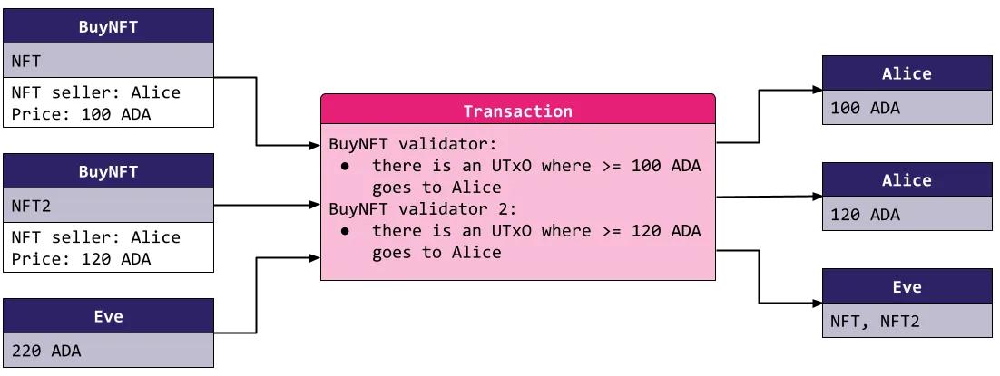
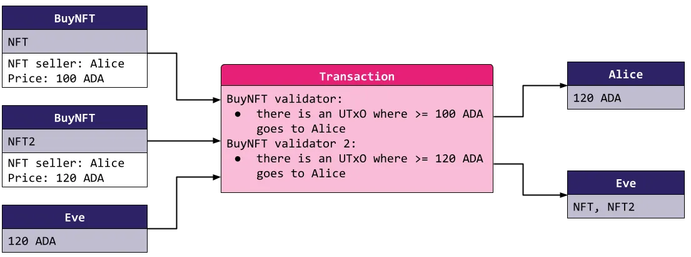
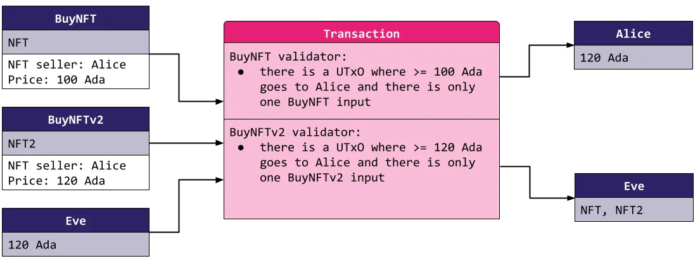
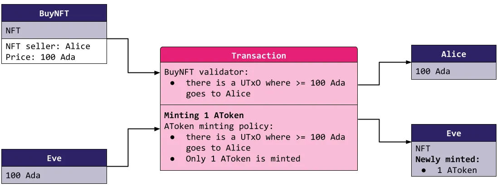
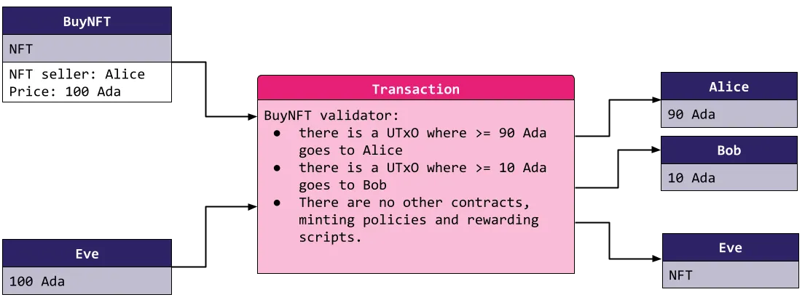
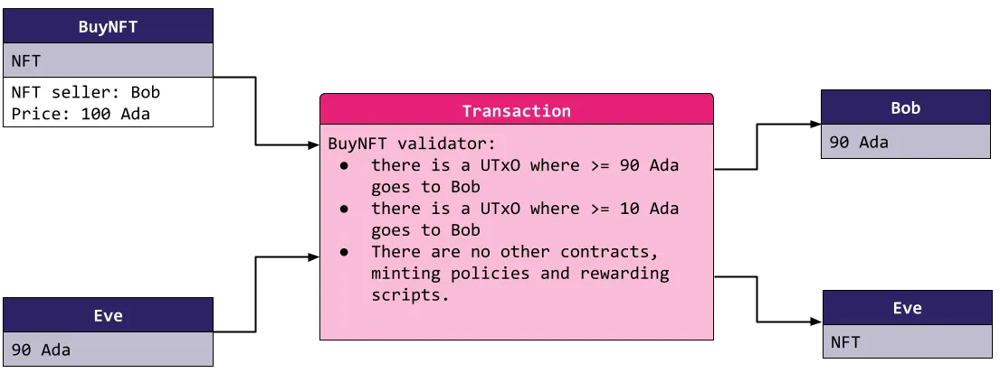
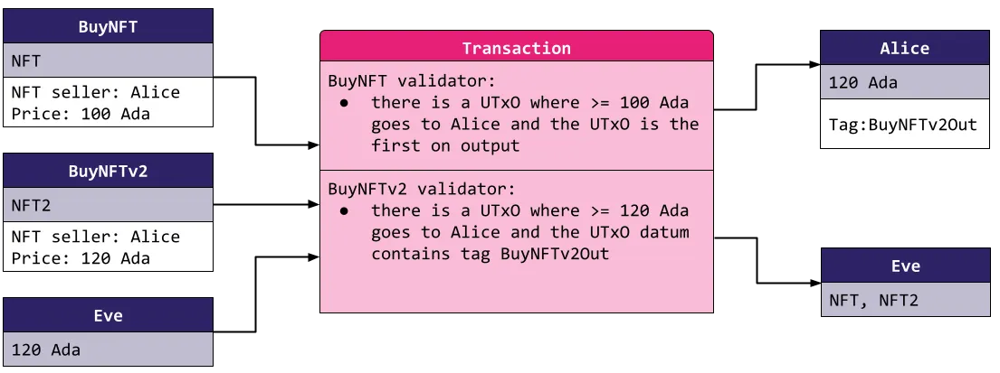

> Following sections can be found also at this [blog](https://medium.com/@invariant0/cardano-vulnerabilities-1-double-satisfaction-219f1bc9665e)

Cardano smart contracts are very different from the ones on Ethereum. To represent its blockchain, Cardano uses the Unspent Transaction Output (UTxO) model. A simplification is that the blockchain is a list of unspent transactions, and the only thing we can do is spend them (though since the Vasil fork, we can also reference inputs without spending them).

A transaction can be seen as a change of some already existing UTxOs into some new UTxOs. Each UTxO has some rules attached to it that detail what transaction can spend it. Cardano blockchain only validates a transaction if it follows rules for every single of its inputs. There are some additional rules imposed by the Cardano blockchain — for example, the sum of Ada on inputs and outputs must match (except for the fees which we will omit for simplicity).

This model is pretty simple to understand if we disregard smart contracts. For usual UTxOs, there are explicit rules on how to spend them. The most common rule is the public-key hash UTxO — the transaction that spends it needs to be signed by a corresponding private key. This can be seen in the next image:

Alice pays Bob 20 ADA so she uses 2 of her UTxOs and signs the transaction.

Cardano brings an extension to this UTxO model in the form of smart contracts. While UTxOs on a public-key hash address can be spent by signing the transaction with the owner’s private key, UTxOs at smart contract addresses can be spent only by transactions that follow rules written in the smart contracts. These rules are called validators and can be written in programming languages such as Plutus, Plutarch, or Aiken. The validator is a pure function — its result depends only on the inputs to the function. The inputs to validators are:

1) Validated transaction — the validator can check anything about the transaction being validated including inputs, outputs, or minted tokens.
2) Datum of the validated UTxO — this is some data attached to the UTxO that validators can use. The datum can represent the address of the owner, the price of the sold NFT, or more complex structures.
3) UTxO redeemer — this is just any data that the spender can attach to the transaction. For example, if the smart contract can perform multiple actions, it’s common to insert the name of the action we want to perform inside the redeemer.
Nothing else comes into the validation process. If we want multiple smart contracts to interact, they all need to be included as inputs for the transaction in which they interact.

Let us introduce a simple smart contract that will be used in all of the following examples — smart contract BuyNFT. The purpose of the contract is to sell an NFT to any buyer who is willing to pay the price to the seller. From this purpose, we see that the datum of the smart contract can be viewed as a pair of:

The seller of the NFT — an address, the contract needs to know who the buyer should pay.
The price to pay — an integer, the contract needs to know how much the buyer should pay.
Having the datum defined as pair of price and seller, we can write a simple validation rule for our smart contract:

At least price ADA went to the address seller.
More formally, the validator of BuyNFT checks that the transaction spending it contains an output UTxO to the address seller with the value of at least price ADA. We will say that a transaction that follows this rule satisfies the contract.

The BuyNFT UtxO can only be spent if 100ADA goes to Alice.

A small detail to notice is that the contract doesn’t force anything on the NFT or what should be done with it. It doesn’t need to, as the only thing that Alice is interested in is getting the money when Eve spends the BuyNFT UTxO. What Eve does with the NFT doesn’t need to be specified in the contract. On the other hand, if Alice creates the BuyNFT contract and doesn’t put any NFT into it, Eve can see that the contract is empty and does not spend the BuyNFT UTxO.

#### The Double Satisfaction

The classic double satisfaction vulnerability stems from using multiple contracts in the same transaction when they do not expect it. Each contract’s validator validates the transaction independently and they all must be satisfied for the transaction to be validated by the blockchain.

Imagine that Alice wants to sell 2 different NFTs, so she creates 2 different BuyNFT contracts. If someone wants to buy both NFTs, Alice would expect them to use the contract this way:

Alice would expect Eve to use multiple BuyNFT UTxOs only if Eve pays for each of them.

However, because each validator validates the transaction independently of the second validator, if Eve pays just 120 ADA, both validators still pass:

Both validators see the same output UTxO with 120 ADA going to Alice so they are satisfied.

So by paying just 120 ADA, Eve could buy both NFTs. We call this vulnerability double satisfaction because Eve satisfies two conditions where she should have satisfied only one.

#### Forbidding multiple script inputs

Bob’s first idea for disallowing such an attack is a simple one. The problem occurs when there are two UTxOs of the same script on the input, and such a situation can be prevented by the smart contract. He adds a new rule into the BuyNFT smart contract:

The inputs of the transaction contain only a single BuyNFT script UTxO
Each BuyNFT validator now checks that no other script with the same validator hash (a hash of the validator’s code contained in the address of the UTxO) is on the input of the transaction. This is great as we no longer can be vulnerable to double satisfaction between two BuyNFT scripts! Alice therefore happily creates her NFT offers.

After a while, the smart contract is updated with a minor change and Alice starts using the new one — BuyNFTv2 . The minor change, however, changed the script hash of the contract, and all the old NFTs that Alice offered are still locked in the original BuyNFT. These two scripts have different hashes, and therefore can be used in the following transaction by Eve:

Eve uses scripts with two different script hashes to perform the double satisfaction attack.

This is where Bob starts to understand that the problem he’s dealing with is more difficult than he originally thought. Not only can an attacker utilize previous versions of the BuyNFT script, but the attacker can also utilize any script that Alice uses. Bob must therefore forbid all but one script among the inputs — now each BuyNFT validator checks that it’s the only script among the inputs, and doesn’t even look at the validator hashes of the other scripts.

This might seem like an overkill, but actually, it’s still not enough.

#### Minting policies & Rewarding scripts

We did not yet mention two other types of smart contracts on Cardano.

- Minting policies — these are validators tied to specific tokens (for example, to an NFT). Anytime these tokens are minted or burned, the validator must verify the transaction.
- Stake validators — validators tied to a staking credential. For now, the most important use case is that such a validator must be successful if relevant staking rewards are withdrawn in a transaction.

The workings of minting policies is very similar to the validators shown in the previous blog, except for a few minor changes (e.g. the minting policies do not contain any datum). We can write complex rules about the transaction. Only transactions fulfilling the rules in a minting policy can mint tokens. For example, Alice makes a minting policy that allows anyone who sends her 100 Ada to mint a single AToken. At the same time, she uses BuyNFT to sell some of her NFTs. The reader should now know exactly where this is going;

Eve exploits the double satisfaction vulnerability, but this time it’s between the script UTxO and the minting policy for AToken.

The same applies to staking scripts — if Alice had a staking credential that allows anyone to withdraw the rewards if the rewards are sent to her address, Eve could withdraw the rewards and buy the NFT with them.

#### Double satisfaction in the same script

Bob’s head now really starts to hurt and so he forbids all the scripts, minting policies and staking withdrawals. He also adds a fee for himself from each NFT sale. New contract rules are:

At least 0.9 *price Ada go to the address of the seller.
At least 0.1* price Ada go to the address of Bob.
There are no smart contracts, minting policies or rewarding scripts in the same transaction.
When Alice now sells an NFT, the transaction looks like this:

Bob gets 10% of the price of each sold NFT.

There is yet another variant of double satisfaction in this script. If Bob decides to sell an NFT, he should get both the fee and the NFT price. However, Eve doesn’t need to pay him the fee, as she can satisfy the condition by just paying him the NFT price.

Eve pays only 90 Ada for the NFT which should cost her 100 Ada.

This is, strictly speaking, not a double satisfaction as the exploit does not satisfy two scripts. But the principle of the attack is so similar that we feel this is the best place to mention it. A simple way to prevent this attack is to compute how much Ada should go to which address by summing the different datum fields, and then comparing the result with how much Ada actually goes there. In this case, we would compute that at least 100 Ada should go to Bob and Eve’s malicious attempt would fail.

#### Remediation

In general, scripts that expect a payment to be made should:

Ban all other scripts from the transaction inputs.
Ban all staking withdrawals.
Ban the minting of all tokens in the transaction.
As you can see, this is very restricting for the scripts. In many cases, we need multiple smart contracts to interact. Some other ways include:

Ordering of the inputs and the outputs. The first input’s validator only checks the first corresponding output, the second only checks the second, etc. This prevents double satisfaction as each script checks its output independently.
TxT pattern — the whole validation logic is offloaded from the input validators to the minting policy of a single token. The double satisfaction is more easily prevented because the minting policy is the single point that validates the whole transaction. It can pair the inputs and outputs in any way necessary. Read more about the TxT pattern here.
Tagging the outputs in some way — this can be done with datums of the output UTxOs or by a mapping of the inputs to the outputs passed via a redeemer.
However, no amount of prevention can ensure safe interaction of multiple scripts that do not know about each other straight away. That’s because each of the scripts can choose a different way to deal with double satisfaction — while a script A can use the ordering of the inputs and the outputs, a script B can use the tagging of outputs. An attacker can then tag the first output and trick both scripts into thinking it’s their output.

Both scripts check double satisfaction differently so they can both be satisfied.

Until a solution is standardized, any interaction between multiple Cardano smart contracts is either forbidden or possibly vulnerable. For now, users can also help prevent double satisfaction themselves by using a unique address for each usage of the script. If Alice did so, Eve could never have exploited the contract as there would never have been two contracts expecting payment to the same address in the first place. This is, however, not always possible in this simple form — for example, when we want to chain an output of a script to be an input into another.

#### Conclusion

If you are currently developing a Cardano smart contract, our recommendation is to forbid any other scripts, minting policies and staking withdrawals in the transaction. However, this prevents any interoperability with other scripts. To prevent double satisfaction in more complex scenarios, a case-by-case solution may need to be thought of. Feel free to reach out to us if that is the case.
