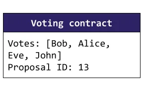
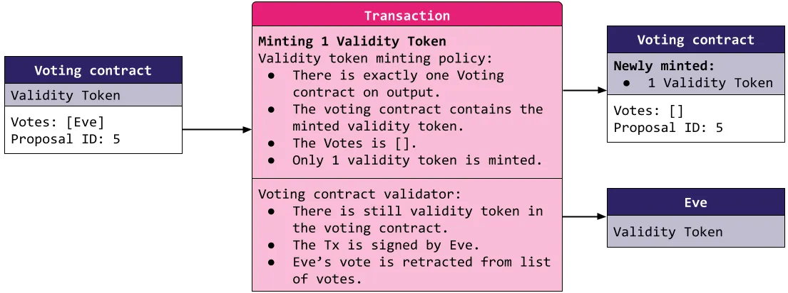

> Following sections can be found also at this [blog](https://medium.com/@invariant0/cardano-vulnerabilities-3-trust-no-utxo-b252650ac2b9)

We’ll go over a vulnerability where an attacker can create a script UTxO in an invalid state and use it for attacks. This vulnerability is common, often easily preventable for small contracts but as contracts grow in complexity, the vulnerability becomes way more difficult to prevent.

The vulnerability is commonly seen in multi-step contracts. As an example, we will show a simple voting contract that a DAO (decentralized autonomous organization) can use.

## Voting example

The protocol is implemented using two contracts — the voting contract and the DAO contract. Let’s break these contracts down.

In the voting contract, everyone votes by signing a transaction where their vote is added to a list kept in the datum. Multiple participants vote on the same proposal across multiple transactions, adding their names one at a time. In the example transaction below, we can see Eve voting for a new proposal by signing the transaction and adding her name to the list.

Eve votes by appending her name to the list in the datum. Note that she must sign the transaction, so no one else can vote as her.

Once enough votes accumulate, the contract can be spent by the DAO contract and the proposal is passed:

A proposal is passed because enough eligible voters voted for it. Each of them had to sign transaction appending their name into the list of votes.

We leave out the parts where the passed proposals are utilized and where the details of the proposals are kept as they are not important for our purposes. Note that we also leave out some other details, such as holding minimum required Ada in each UTxO.

## The vulnerability

Each validator runs only if a UTxO that the validator protects is spent. No validator protects rightful creations of such UTxOs. Anyone can freely create a UTxO with any datum and any value at any address, including script addresses. Therefore, evil Eve who wants her proposal to pass can simply create the following UTxO at the address of the voting contract:

Nothing checks the initial state of the contract, so Eve can just create a UTxO with a maliciously constructed datum without anyone else signing it.

Note that neither Bob, Alice nor John need to be aware of this. On the other hand, the UTxO looks like they all signed the proposal. Eve can immediately spend the UTxO by the DAO contract, thus passing the proposal. Looking at the blockchain history, someone could easily spot this attack. The DAO contract has no access to the whole blockchain history and can not distinguish such a UTxO from a valid one, though.

## Remediation

Assuming multi-step contracts, the validation logic itself cannot verify that all the previous state transitions were correct. That’s because anyone can create a UTxO in a state that is equivalent to a later state of the contract without passing the validations. We need to be somehow able to verify that a given UTxO comes from a chain of valid transitions from a valid initial state.

To generally remediate this vulnerability, we need to be able to verify the initial state of a given contract and that all state transitions were done correctly. Verifying a state transition is simple in the Cardano model by using validators which always check whether the next state can be reached from the previous state.

To verify that the initial state was correct, we use validity tokens — also sometimes called state (thread) tokens. These tokens are minted by a minting policy and we can allow them to be minted only in transactions that create a new valid proposal at the voting address. We can see an example in the following transaction:

A validity token can be minted as we create a voting UTxO in a valid initial state.

Although Eve can still create any voting contract UTxO, she can create one that contains a freshly minted valid minting token only if she sets the list of votes to an empty list. The minting policy of the validity token verifies that the newly-created voting UTxO is in the correct initial state. Next, the voting contract’s validator must check that the validity token stays in the contract. Therefore, the validity token in a contract verifies that the contract was created from some valid initial state.

In the end, the DAO contract can simply reject voting contracts not holding a correct validity token. It should also make sure that the validity token is burned once the proposal is passed.

## Dangers of validity tokens

Once a client implements validity tokens in their protocol, we can try to find ways to steal them from the contract. As mentioned previously, the ownership of a validity token means that it is assumed that it was properly initialized and went only through valid state transitions. If we can find a way to get the validity token from a UTxO, we can fool other contracts again.

In practice, it is often possible to somehow steal the token. It’s especially tricky to prevent it entirely in complex multi-step contracts with multiple different validity tokens. In each step, we need to verify that the validity tokens goes into the intended script outputs. If there is at least one place in the code where this verification contains a mistake, an attacker can use that to steal one of the tokens.

One complex example we have seen in practice was a double satisfaction between the validity token minting policy and a validator’s validation branch. We can demonstrate the idea on a modified version of our DAO contract.

Let’s add the possibility to retract a vote. To do this, the voter must have already voted. Secondly, the voter must sign the retracting transaction.

Note that if there was only one voter, retracting his vote would return the voting contract to the valid initial state — the same one it was in when the proposal was created, thus possibly allowing the mint of a fresh new validation token:

Eve abuses the fact that by retracting her vote she creates a contract in the valid initial state, allowing her to mint an additional validity token. A similar example was seen in one of our audits.

Because both the voting validator and the validity token minting policy expect the validity token to be in the resulting voting UTxO, putting it there satisfies both conditions — as a reader of our series should already know, this is also called a double satisfaction.

The full attack chain Eve uses to get her proposal passed is as follows:

1) Create a valid voting contract and mint a validity token into it.
2) Vote for the proposal.
3) Retract the vote. Using the double satisfaction vulnerability, mint a second validity token and steal the original one by sending it to her address.
4) Create a new voting UTxO where the datum looks like all the voters have already voted for the proposal and put the stolen validity token into it.
5) Pass the proposal. The DAO contract validates as it sees that the UTxO contains a correct validity token and has enough votes to pass.

As an exercise you can try to come up with an additional check to prevent this vulnerability.

## Conclusion

In this blog, we have shown a Cardano vulnerability stemming from the fact that a UTxO can be created by anyone. Cardano developers must think about this when designing their smart contracts and use appropriate mitigation strategies. Validity tokens are used a lot in practice. As stealing them often results in critical severity findings, we put special care into brainstorming complex attacks that lead to stealing such tokens in our work as auditors. Many examples of such attacks can be found in our [public reports’ archive](https://github.com/vacuumlabs/audits). For an open source example, check our [Agora report](https://github.com/vacuumlabs/audits/blob/master/reports/liqwid-agora-v1.pdf), issue AGO-001: Stake state token can be taken away.
