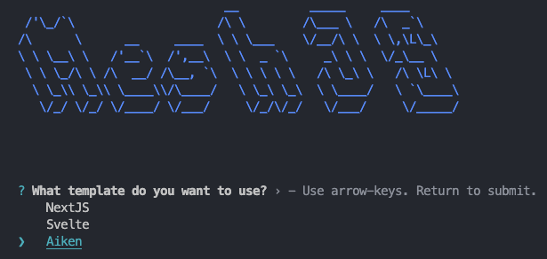
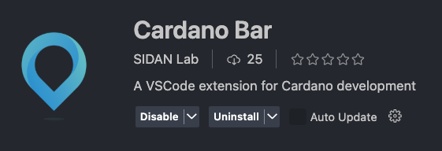
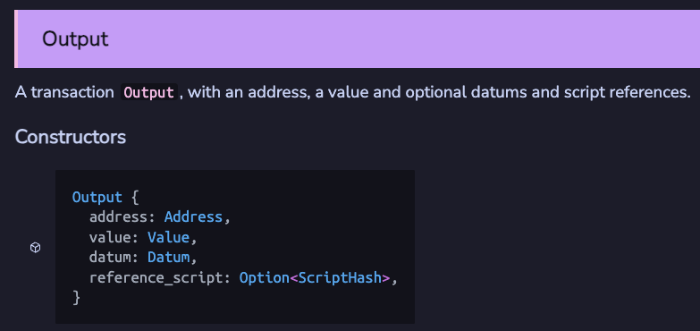
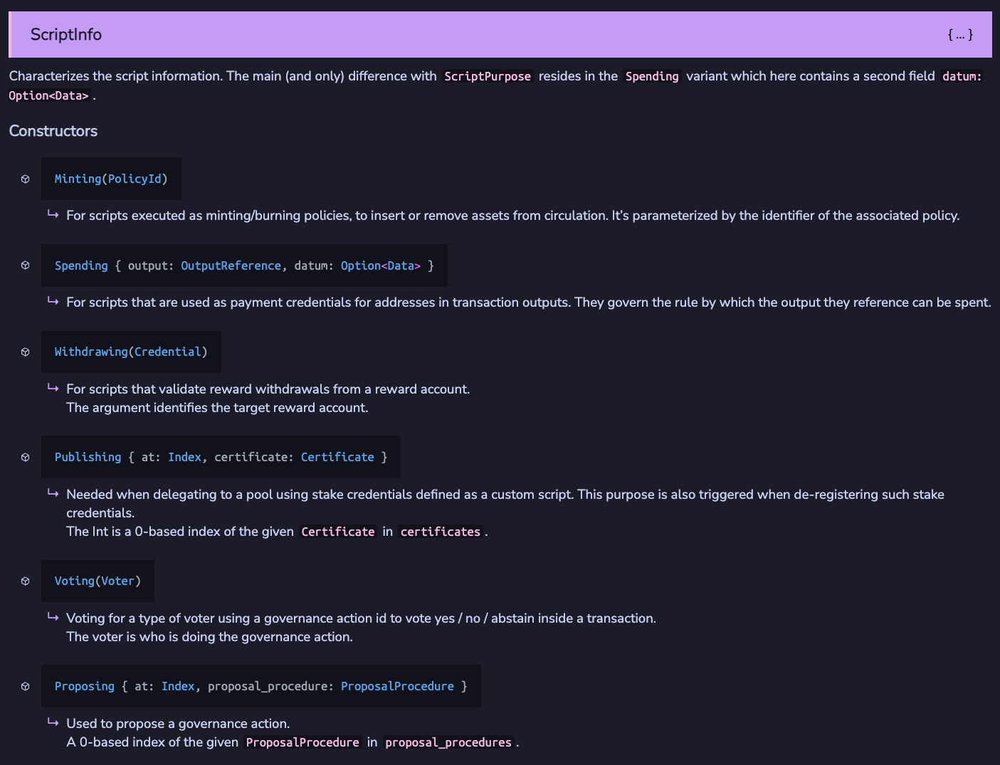

From lesson 3 to lesson 6, we will explore the core concepts of building Aiken smart contracts. Some materials are abstracted from [Andamio's AikenPBL](https://app.andamio.io/course/db22e013578fcead6c2fed5446d61891ad31f3cb4955e88d980107e7).

### Overview

- **Hello Cardano Course**: Explains selected vital concepts of Aiken smart contract development.
- **AikenPBL**: A complete end-to-end project-based learning course covering essential and basic concepts.

Aiken smart contract development is a specialized field. To dive deeper and start a career as a Cardano on-chain developer, we recommend completing both courses.

## System Setup

Before we begin, let's prepare our system for development. We will use Aiken for this course. Follow one of these guides to set up your system:

1. [Aiken Official Installation Guide](https://aiken-lang.org/installation-instructions)
2. [Andamio's AikenPBL Setup Guide](https://app.andamio.io/course/db22e013578fcead6c2fed5446d61891ad31f3cb4955e88d980107e7/101/lesson/1)

### Set Up an Empty Aiken Project

Run the following command to create a new Aiken project using Mesh's template:

```bash
npx meshjs 03-aiken-contracts
```

Select the `Aiken` template when prompted.



After installation, a new folder `03-aiken-contracts` will be created with the following structure:

```
03-aiken-contracts
├── aiken-workspace  // Main Aiken project folder used in lessons
└── mesh             // Folder for equivalent Mesh off-chain code (not used in lessons)
```

### Optional: Install Cardano-Bar

If you use VSCode as your IDE, install the [Cardano-Bar](https://marketplace.visualstudio.com/items/?itemName=sidan-lab.cardano-bar-vscode) extension for code snippets to follow the course more easily.



## Understanding Transaction Context

Cardano contracts are not like traditional smart contracts on other blockchains. They are more like a set of rules governing how transactions are validated. **Validator** is a better term to describe Cardano contracts.

To build Cardano validators, we need to understand how transactions work. Refer to the [Aiken documentation](https://aiken-lang.github.io/stdlib/cardano/transaction.html#Transaction) for details on the `Transaction` structure.


### Inputs & Outputs

All Cardano transactions must have inputs and outputs:

- **Inputs**: UTXOs being spent in the transaction.
- **Outputs**: UTXOs being created in the transaction.

Refer to [Aiken documentation](https://aiken-lang.github.io/stdlib/cardano/transaction.html#Input) for types:




Key concepts:

- An input references an output of a previous transaction, identified by `output_reference`.
- Validators can check:
  - If an input spends from a specific address.
  - If an input spends a specific asset.
  - If an output sends to a specific address.
  - If an output sends a specific asset.
  - If input/output datum contains specific information.

### Reference Inputs

`reference_inputs` in `Transaction` are inputs not spent but referenced in the validator. Useful for reading datum from a UTXO without spending it.

### Mint

`mint` in `Transaction` lists assets being minted or burned. Useful for creating or burning tokens.

### Signatures

`extra_signatories` in `Transaction` lists public key hashes required to sign the transaction. Useful for enforcing specific users to sign.

### Time

`validity_range` in `Transaction` specifies the range of slots the transaction is valid for. Useful for enforcing time locks.

## Types of Scripts

Refer to [Aiken documentation](https://aiken-lang.github.io/stdlib/cardano/script_context.html#ScriptContext) for types of scripts in Cardano. Common types:

- **Minting**
- **Spending**
- **Withdrawing**



### Minting Script

Minting script validation logic is triggered when assets are minted or burned under the script's policy.

Example: `/aiken-workspace/validators/mint.ak`:

```rs
use cardano/assets.{PolicyId}
use cardano/transaction.{Transaction, placeholder}

validator always_succeed {
  mint(_redeemer: Data, _policy_id: PolicyId, _tx: Transaction) {
    True
  }

  else(_) {
    fail @"unsupported purpose"
  }
}

test test_always_succeed_minting_policy() {
  let data = Void
  always_succeed.mint(data, #"", placeholder)
}
```

This script compiles into a script with hash `def68337867cb4f1f95b6b811fedbfcdd7780d10a95cc072077088ea`, also called `policy Id`. It validates transactions minting or burning assets under this policy.

#### Parameters

Upgrade the script to allow minting/burning only when signed by a specific key:

```rs
validator minting_policy(owner_vkey: VerificationKeyHash) {
  mint(_redeemer: Data, _policy_id: PolicyId, tx: Transaction) {
    key_signed(tx.extra_signatories, owner_vkey)
  }

  else(_) {
    fail @"unsupported purpose"
  }
}
```

- `owner_vkey`: Public key hash of the owner allowed to mint/burn assets.
- Use `key_signed` from [vodka](https://github.com/sidan-lab/vodka) for validation.

#### Redeemer

Extend the policy to include a redeemer specifying the transaction action (minting or burning):

```rs
pub type MyRedeemer {
  MintToken
  BurnToken
}

validator minting_policy(
  owner_vkey: VerificationKeyHash,
  minting_deadline: Int,
) {
  mint(redeemer: MyRedeemer, policy_id: PolicyId, tx: Transaction) {
    when redeemer is {
      MintToken -> {
        let before_deadline = valid_before(tx.validity_range, minting_deadline)
        let is_owner_signed = key_signed(tx.extra_signatories, owner_vkey)
        before_deadline? && is_owner_signed?
      }
      BurnToken -> check_policy_only_burn(tx.mint, policy_id)
    }
  }

  else(_) {
    fail @"unsupported purpose"
  }
}
```

### Spending Script

Spending script validation is triggered when a UTXO is spent in the transaction.

Example: `/aiken-workspace/validators/spend.ak`:

```rs
pub type Datum {
  oracle_nft: PolicyId,
}

validator hello_world {
  spend(
    datum_opt: Option<Datum>,
    _redeemer: Data,
    _input: OutputReference,
    tx: Transaction,
  ) {
    when datum_opt is {
      Some(datum) ->
        when inputs_with_policy(tx.reference_inputs, datum.oracle_nft) is {
          [_ref_input] -> True
          _ -> False
        }
      None -> False
    }
  }

  else(_) {
    fail @"unsupported purpose"
  }
}
```

#### Datum

- `Datum`: Data attached to UTXOs at script addresses.
- Common design pattern: Use an oracle NFT (state thread token) to ensure UTXO uniqueness.

### Withdrawing Script

Withdrawal script validation is triggered when withdrawing from a reward account.

Example: `/aiken-workspace/validators/withdraw.ak`:

```rs
use aiken/crypto.{VerificationKeyHash}
use cardano/address.{Credential, Script}
use cardano/certificate.{Certificate}
use cardano/transaction.{Transaction, placeholder}

validator always_succeed(_key_hash: VerificationKeyHash) {
  withdraw(_redeemer: Data, _credential: Credential, _tx: Transaction) {
    True
  }

  publish(_redeemer: Data, _certificate: Certificate, _tx: Transaction) {
    True
  }

  else(_) {
    fail @"unsupported purpose"
  }
}

test test_always_succeed_withdrawal_policy() {
  let data = Void
  always_succeed.withdraw("", data, Script(#""), placeholder)
}
```

#### Handling Publishing

All withdrawal scripts must be registered on-chain before they can be used. This is done by publishing a registration certificate with the script hash as the stake credential. The publishing of the script is also validated by the `publish` function in the withdrawal script, which is triggered whenever the current withdrawal script is being registered or deregistered.

#### When withdrawal script is used?

For most Cardano users, we would just use a normal payment key to stake and withdraw rewards. However, it is very popular for Cardano DApps to build withdrawal scripts to enhance the efficiency of validation. We will cover this trick in [lesson 5](./05-avoid-redundant-validation).
