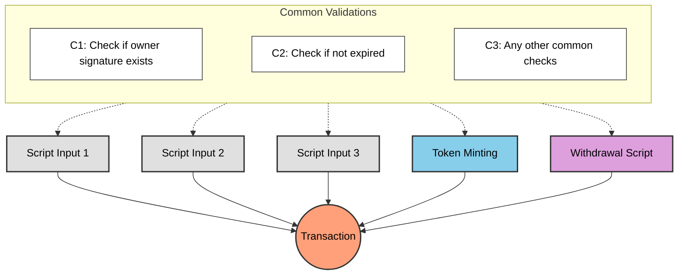
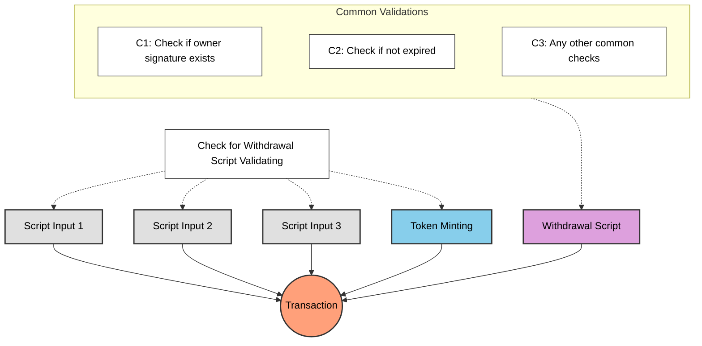

Do you have a question about the previous lessons - why have we performed even minting and state update in spending validators with withdrawal script? We know that every time we spend a UTxO from a spending validator would trigger checks, why can't I validate the counter update in the spending validator directly?

## A Transaction with Multiple Script Validation

Imagine there is a complex transaction that involves multiple script validations. For example, a transaction that mints tokens, unlocking multiple script UTxOs, and withdraws funds. Each of these actions may require its own set of checks and validations.



If we enforced all the common checks in each of the scripts, we would end up with redundant validations that are executed multiple times, leading to inefficiencies and increased transaction costs.

## How can we do better?

We can avoid redundant validations by centralizing the common checks in a single script, which is executed only once. This way, we can ensure that all the necessary validations are performed without duplicating the logic across multiple scripts.



In the architecture above, we have a single `WithdrawalCheck` script that performs the common validations. This script is executed once, and it checks the conditions for all the other scripts involved in the transaction.

## Example: Continue from Lesson 4

Let's assume we have all the common logics checked in the lesson 4's withdrawal script. Rather than copy pasting all checks from withdrawal script to the spending and minting validators, we can do this instead to avoid redundant validations:

### Spending

```aiken
use aiken/crypto.{ScriptHash}
use cardano/transaction.{OutputReference, Transaction}
use cocktail.{withdrawal_script_validated}

validator spending_logics_delegated(
  delegated_withdrawal_script_hash: ScriptHash,
) {
  spend(
    _datum_opt: Option<Data>,
    _redeemer: Data,
    _input: OutputReference,
    tx: Transaction,
  ) {
    withdrawal_script_validated(
      tx.withdrawals,
      delegated_withdrawal_script_hash,
    )
  }

  else(_) {
    fail @"unsupported purpose"
  }
}
```

### Minting

```aiken
use aiken/crypto.{ScriptHash}
use cardano/assets.{PolicyId}
use cardano/transaction.{Transaction}
use cocktail.{withdrawal_script_validated}

validator minting_logics_delegated(
  delegated_withdrawal_script_hash: ScriptHash,
) {
  mint(_redeemer: Data, _policy_id: PolicyId, tx: Transaction) {
    withdrawal_script_validated(
      tx.withdrawals,
      delegated_withdrawal_script_hash,
    )
  }

  else(_) {
    fail @"unsupported purpose"
  }
}
```

## Why delegate to withdrawal script?

You might notice that we are delegating the validation to the withdrawal script. This is a common pattern in Cardano smart contracts, where a withdrawal script is used to perform common validations for multiple scripts.

However, validation delegation can happen in different ways. For example, you can delegate all checks to a spending or minting validator as well, why would we prefer withdrawal script most of the time?

### Clean trigger

Recall that spending validation is triggered when a UTxO is spent, and minting validation is triggered when a token is minted. By delegating to a withdrawal script, we can ensure that the common validations are performed only once, regardless of how many scripts are involved in the transaction.

And the withdrawal script can be triggered by withdrawing 0 lovelace, aka the community call it [`withdraw 0 trick`](https://aiken-lang.org/fundamentals/common-design-patterns#forwarding-validation--other-withdrawal-tricks). It is a clean way to trigger the validation without affecting the transaction's logic or state.

## Simplified Explanation

### Why Avoid Redundant Validation?

When multiple scripts are involved in a transaction, repeating the same checks in each script leads to inefficiencies and higher costs. Instead, centralizing common checks in a single script ensures that validations are performed only once, saving resources and simplifying logic.

### Centralized Validation

By using a single script, such as a withdrawal script, we can delegate common checks to it. This script acts as a central validator for all other scripts in the transaction.

### Example Flow

Imagine a transaction with multiple scripts:

- **Minting Script**: Handles token creation.
- **Spending Script**: Manages UTxO spending.
- **Withdrawal Script**: Performs common checks.

Instead of duplicating checks in each script, the withdrawal script validates all common conditions, ensuring efficiency.

### Delegation in Practice

Here’s how delegation works:

- **Spending Validator**: Delegates validation to the withdrawal script.
- **Minting Validator**: Also delegates validation to the withdrawal script.

This approach reduces redundancy and keeps the logic clean and maintainable.

### Clean Trigger with Withdrawal Script

The withdrawal script can be triggered using the `withdraw 0 trick`, which allows validation without affecting the transaction state. This method is widely used for its simplicity and effectiveness.

### Key Benefits

- **Efficiency**: Reduces redundant checks.
- **Cost-Effective**: Lowers transaction fees.
- **Maintainability**: Simplifies script logic.

By following this pattern, developers can create smarter and more efficient Cardano contracts.
