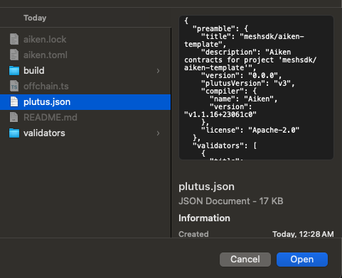

In this lesson, we will explore how to interpret the blueprint generated from onchain code development and translate it into offchain code. This blueprint serves as a bridge between the onchain and offchain worlds, enabling seamless interaction with smart contracts.

## What is a Blueprint?

A blueprint is a standardized JSON file introduced by [CIP57](https://cips.cardano.org/cip/CIP-57). It is the ultimate output of Cardano smart contract development and contains essential information about the contract. Regardless of the development method, the blueprint includes:

- **`preamble`**: Meta-information about the contract.
- **`validators`**: Named validators with type definitions and compiled code.
- **`definitions`**: A registry of reusable definitions across the specification.

### Generating a Blueprint

To generate a blueprint using Aiken, follow these steps:

1. Build your contracts by running:

```sh
aiken build
```

2. Locate the blueprint in the `plutus.json` file at the root of your project.

## Understanding the Blueprint

### `preamble`

The `preamble` section contains meta-information about the contract, such as its name, description, version, and Plutus version. The Plutus version is particularly important for preparing offchain code.

Example:

```json
{
  "preamble": {
    "title": "meshsdk/aiken-template",
    "description": "Aiken contracts for project 'meshsdk/aiken-template'",
    "version": "0.0.0",
    "plutusVersion": "v3", // Key information for offchain code
    "compiler": {
      "name": "Aiken",
      "version": "v1.1.16+23061c0"
    },
    "license": "Apache-2.0"
  }
}
```

### `validators`

The `validators` section includes type information for `datum`, `redeemer`, and `parameters`, along with the compiled validator code. These definitions may reference reusable types in the `definitions` section.

Example:

```json
{
  "title": "spend.spending_logics_delegated.spend",
  "datum": {
    "title": "_datum_opt",
    "schema": {
      "$ref": "#/definitions/Data"
    }
  },
  "redeemer": {
    "title": "_redeemer",
    "schema": {
      "$ref": "#/definitions/Data"
    }
  },
  "parameters": [
    {
      "title": "delegated_withdrawal_script_hash",
      "schema": {
        "$ref": "#/definitions/aiken~1crypto~1ScriptHash"
      }
    }
  ],
  "compiledCode": "58ac010100229800aba2aba1aba0aab9faab9eaab9dab9a9bae0024888888896600264646644b30013370e900118039baa001899914c004c03400a601a601c0052259800800c528456600266ebc00cc02cc03c00629462660040046020002805100d2444660020026eacc040c044c044c044c044c044c044c034dd518080048c020dd500099ba548008cc028dd4802a5eb822c8030c024004c024c028004c024004c010dd5004c52689b2b200401",
  "hash": "9c9666ddc12fc42f0151cd029c150c7d410ede9fe3885c248c8c26a0"
}
```

Notice the `spend.spending_logics_delegated.else` compiles to the same hash as the `spend.spending_logics_delegated.spend` function. This is because the `else` branch is not executed in this case, but it is still part of the validator code. So when we are building multiple purposes validators, they will compile to the same hash, i.e. same script, which can be utilitized in certain architectures.

```json
{
  "title": "spend.spending_logics_delegated.else",
  "redeemer": {
    "schema": {}
  },
  "parameters": [
    {
      "title": "delegated_withdrawal_script_hash",
      "schema": {
        "$ref": "#/definitions/aiken~1crypto~1ScriptHash"
      }
    }
  ],
  "compiledCode": "58ac010100229800aba2aba1aba0aab9faab9eaab9dab9a9bae0024888888896600264646644b30013370e900118039baa001899914c004c03400a601a601c0052259800800c528456600266ebc00cc02cc03c00629462660040046020002805100d2444660020026eacc040c044c044c044c044c044c044c034dd518080048c020dd500099ba548008cc028dd4802a5eb822c8030c024004c024c028004c024004c010dd5004c52689b2b200401",
  "hash": "9c9666ddc12fc42f0151cd029c150c7d410ede9fe3885c248c8c26a0"
}
```

### `definitions`

The `definitions` section provides reusable type definitions referenced in the `validators` section. This is where you can find schemas for types used in the contract.

Example:

```json
{
  "definitions": {
    "Data": {
      "title": "Data",
      "description": "Any Plutus data."
    },
    "aiken/crypto/ScriptHash": {
      "title": "ScriptHash",
      "dataType": "bytes"
    },
    "cardano/assets/PolicyId": {
      "title": "PolicyId",
      "dataType": "bytes"
    },
    "withdraw/MyRedeemer": {
      "title": "MyRedeemer",
      "anyOf": [
        {
          "title": "ContinueCounting",
          "dataType": "constructor",
          "index": 0,
          "fields": []
        },
        {
          "title": "StopCounting",
          "dataType": "constructor",
          "index": 1,
          "fields": []
        }
      ]
    }
  }
}
```

## Automating Offchain Code Generation

Translating the blueprint into offchain code manually can be time-consuming. Fortunately, the Mesh community has developed a tool in the [`Cardano Bar VSCode Extension`](https://marketplace.visualstudio.com/items/?itemName=sidan-lab.cardano-bar-vscode) to automate this process.

In Mesh community, we have developed a tool in [`Cardano Bar VSCode Extension`](https://marketplace.visualstudio.com/items/?itemName=sidan-lab.cardano-bar-vscode) that can automate this process. By running the following below steps, you can generate the offchain code that corresponds to the blueprint:

1. Create a new TypeScript file, e.g., `offchain.ts`.
2. Open the command palette in VSCode (Ctrl+Shift+P or Cmd+Shift+P).
3. Type `Parse blueprint to Typescript - Mesh` and select it.


4. Select the `plutus.json` file that contains the blueprint.


The generated `offchain.ts` file will include all necessary functions to interact with the onchain code, such as spending, minting, and querying the contract. For more details, refer to the [Mesh SDK documentation](https://meshjs.dev/apis/utilities/blueprints).

## Conclusion

Understanding and interpreting the blueprint is a vital skill for Cardano developers. With tools like the Mesh `Blueprint` class, you can streamline the process and focus on building robust applications.
