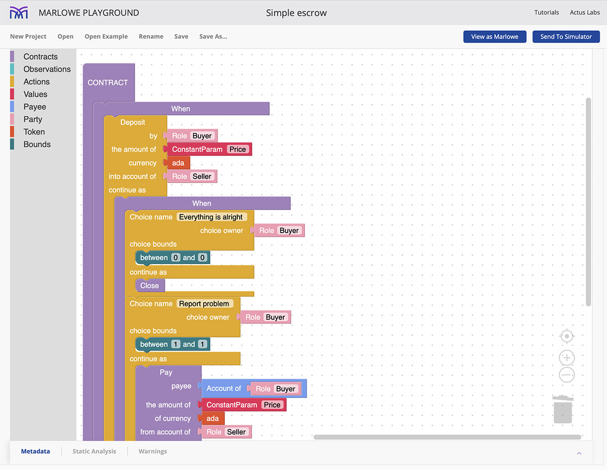

---
id: marlowe
title: Marlowe
sidebar_label: Marlowe
description: Marlowe
image: ./img/og-developer-portal.png
--- 

## Get started with Marlowe 
Marlowe is the domain-specific language (DSL) that allows users to build blockchain applications tailored to financial contracts.

Take a look at the [Marlowe Tutorial](https://alpha.marlowe.iohkdev.io/doc/marlowe/tutorials/index.html) if you want to learn Marlowe from the beginning or dive straight into the [Marlowe Playground](https://alpha.marlowe.iohkdev.io/): 

Talk to others about [Marlowe on the Cardano Forum](https://forum.cardano.org/c/developers/cardano-marlowe/149) or if you prefer Telegram there is a dedicated [Marlowe Telegram Group](https://t.me/IOHK_Marlowe).

## The Marlowe platform
With the Marlowe DSL you gain huge efficiencies because you can get much better security, much better certainty, much better [guarantees of termination](https://en.wikipedia.org/wiki/Halting_problem), and correctness of behavior compared to a [Turing-complete](https://en.wikipedia.org/wiki/Turing_completeness) language.

The design guarantees the following:
- Contracts are finite. No recursion or loops.
- Contracts will terminate. Timeout on all actions.
- Contracts have a defined lifetime. 
- No assets retained on close. 
- Conservation of value.

## Marlowe Playground 
The Marlowe Playground is an easy-to-use, visual, and modular plug-and-play smart contract builder and simulator. Watch this 4 minute long tour of the Marlowe Playground: build, simulate and analyse Marlowe contracts.
<iframe width="100%" height="325" src="https://www.youtube.com/embed/axP-jYQ_6lo" frameborder="0" allow="accelerometer; autoplay; clipboard-write; encrypted-media; gyroscope; picture-in-picture fullscreen"></iframe>

## Presentations
- [Blockchain Essentials](https://www.youtube.com/watch?v=yi8-xaoTQT4)
- [Domain-specific languages](https://www.youtube.com/watch?v=T4W19TdJHMw)
- [Financial contracts](https://www.youtube.com/watch?v=1HRaRVyj2BI)
- [Onto blockchain](https://www.youtube.com/watch?v=dhcmKmAZslc)
- [Escrow onto blockchain](https://www.youtube.com/watch?v=ADMCMDQK7Yo)
- [Marlowe in full](https://www.youtube.com/watch?v=Ro8iBh7V7oc)

## Further Tutorials
- [A first contract](https://www.youtube.com/watch?v=es4qpcHxr0I)
- [Elaborating the contract](https://www.youtube.com/watch?v=DS_ebkGwmXw)
- [Choices and observations](https://www.youtube.com/watch?v=25fnB7C8mPE)
- [Writing Marlowe contracts in JavaScript](https://www.youtube.com/watch?v=6tkZ3hlYZ7k)
- [Using Haskell in the playground](https://www.youtube.com/watch?v=S0crHs-wTAc)
- [Using JavaScript in the playground](https://www.youtube.com/watch?v=Oeuyy5AAQ3o)
- [Building Marlowe directly in the playground](https://www.youtube.com/watch?v=9lHkCq0H4pw)
- [Building contracts in Blockly](https://www.youtube.com/watch?v=9SKB5MfA_L8)
- [Simulation in the playground](https://www.youtube.com/watch?v=3aFoN2wg9oc)
- [Oracles in the playground](https://www.youtube.com/watch?v=LsTQEPMxyIU)
- [Analysis in the playground](https://www.youtube.com/watch?v=VmoUAifui38)
- [ACTUS labs](https://www.youtube.com/watch?v=6PPWFZEfkks)

