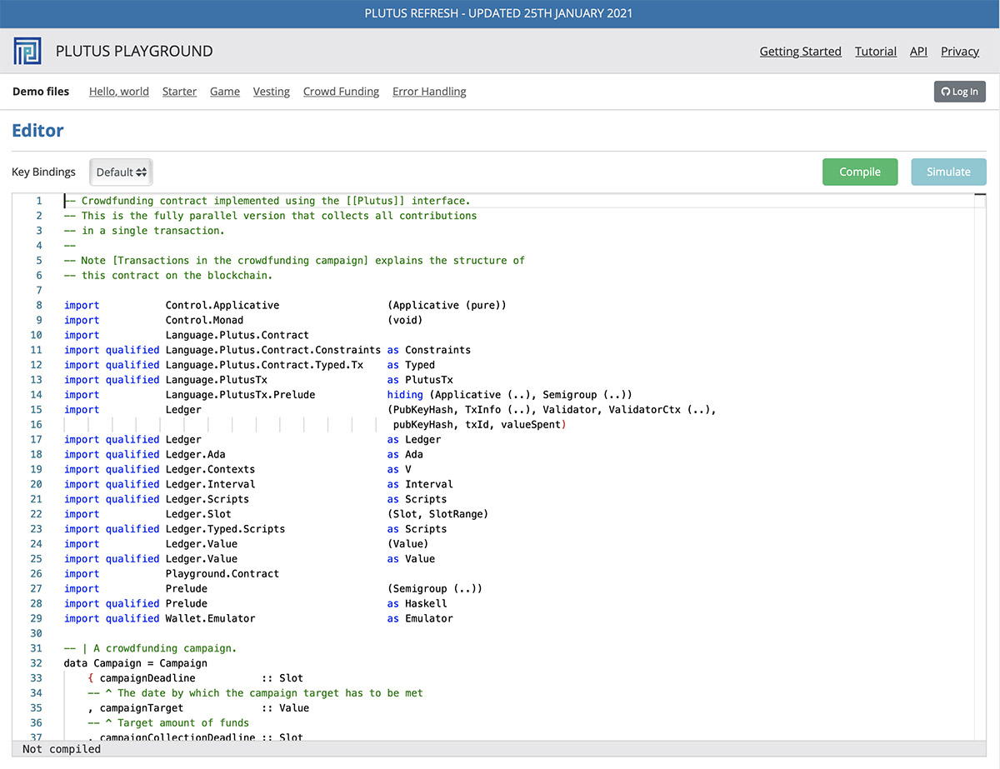

---
id: plutus
title: Plutus
sidebar_label: Plutus
description: Plutus
image: ../img/og-developer-portal.png
--- 

## Get started with Plutus 
Plutus is the smart contract platform of the Cardano blockchain. It allows you to write applications that interact with the Cardano blockchain.

Take a look at the [Plutus Tutorials](https://plutus-apps.readthedocs.io/en/latest/plutus/tutorials/index.html) if you want to learn Plutus from the beginning. If you don't know Haskell yet, consider [starting with Haskell](#get-started-with-haskell).

[Follow Chris Moreton's content updates](https://plutus-pioneer-program.readthedocs.io/en/latest/plutus_pioneer_program.html). With a high effort he transcribes the lectures of the Plutus Pioneer Program. 

Talk to others about [Plutus on the Cardano Forum](https://forum.cardano.org/c/developers/cardano-plutus/148) or if you prefer Discord 
head to the the [IOG Technical Discord](https://discord.com/invite/w6TwW9bGA6).

## The Plutus platform
In this Video Michael Peyton-Jones starts by walking us through working with Plutus. Plutus allows all programming to be done from a single Haskell library. This lets users build secure applications, forge new assets, and create smart contracts in a predictable, deterministic environment with the highest level of assurance. Furthemore, developers don’t have to run a full Cardano node to test their work. 

Jann Müller then takes us through the Plutus Application Platform, where assets can be built and launched. He also demonstrates how tokens can be transferred using a smart contract. With Plutus you can:

- Forge new tokens in a lightweight environment
- Build smart contracts
- Support basic multi-sig scripts

<iframe width="100%" height="325" src="https://www.youtube.com/embed/usMPt8KpBeI" frameborder="0" allow="accelerometer; autoplay; clipboard-write; encrypted-media; gyroscope; picture-in-picture fullscreen"></iframe>

## Plutus Playground
The Plutus Playground is a code editor and simulator in one.

There is a written tutorial on [how to compile and test a Plutus App](https://plutus-apps.readthedocs.io/en/latest/plutus/tutorials/plutus-playground.html) or you can watch this video tutorial:
<iframe width="100%" height="325" src="https://www.youtube.com/embed/DhRS-JvoCw8" frameborder="0" allow="accelerometer; autoplay; clipboard-write; encrypted-media; gyroscope; picture-in-picture fullscreen"></iframe>

## Further Tutorials

See [Plutus Tutorials](https://plutus-apps.readthedocs.io/en/latest/plutus/tutorials/index.html). Examples:

- [Writing a basic Plutus app in the Plutus Playground](https://plutus-apps.readthedocs.io/en/latest/plutus/tutorials/basic-apps.html)
- [Using Plutus Tx](https://plutus-apps.readthedocs.io/en/latest/plutus/tutorials/plutus-tx.html)
- [Writing basic validator scripts](https://plutus-apps.readthedocs.io/en/latest/plutus/tutorials/basic-validators.html)
- [Writing basic minting policies](https://plutus-apps.readthedocs.io/en/latest/plutus/tutorials/basic-minting-policies.html)

Note there are older tutorials hosted at the subdomain https://plutus.readthedocs.io but the newer docs are at https://plutus-apps.readthedocs.io

## How-to guides

See [How-to guides](https://plutus-apps.readthedocs.io/en/latest/plutus/howtos/index.html)

- [How to export scripts, datums and redeemers](https://plutus-apps.readthedocs.io/en/latest/plutus/howtos/exporting-a-script.html)
- [How to write a scalable Plutus app](https://plutus-apps.readthedocs.io/en/latest/plutus/howtos/writing-a-scalable-app.html)
- [How to handle blockchain events](https://plutus-apps.readthedocs.io/en/latest/plutus/howtos/handling-blockchain-events.html)
- [How to analyse the cost and size of Plutus scripts](https://plutus-apps.readthedocs.io/en/latest/plutus/howtos/analysing-scripts.html)

## Get started with Haskell
Haskell is the programming language for Plutus contracts. If you are looking for the best guide to Haskell and unsure where to start, we recommend you check out the book or website [Learn You a Haskell for Great Good](http://learnyouahaskell.com/introduction) by Miran Lipovača. 

Learning Haskell is made easy with this illustrated guide, one of the most engaging ways to learn this fascinating programming language.

Another great learning resource is the online course [Haskell and Crypto Mongolia 2020](https://www.youtube.com/watch?v=ctfZ6DwFiPg&list=PLJ3w5xyG4JWmBVIigNBytJhvSSfZZzfTm&index=4) lectured by [Andres Löh](https://kosmikus.org/), co-founder of the Well-Typed consultancy and [Dr. Lars Brünjes](https://iohk.io/en/team/lars-brunjes), Education Director at IOHK. The course is the suggested *starting point* for Plutus Pioneers at the beginning of the [Plutus Pioneer Program](#get-started-with-the-plutus-pioneer-program). It's a 10-week, 40 hours/week deep dive into Haskell and Cryptocurrencies.

If you are coming from a Python background, there is an informative project [py2hs](https://github.com/cffls/py2hs) that explains essential Haskell concepts using Python.

## Get started with the Plutus pioneer program
The Plutus pioneer program was created in order to recruit and train developers in Plutus for the Cardano ecosystem. By entering the program, you will become part of a group with early access to a set of courses that teach you the core principles of how to code in both Haskell and Plutus. It will be highly interactive, with weekly videos, exercises, and Q&A sessions and exclusive access to the creators and key experts in the language. 

**This course is not for coding beginners.** You do not need to be an expert in formal methods, but programming experience and a general aptitude for logical and mathematical thinking are highly advisable. We recommend to [get started with Haskell](#get-started-with-haskell) before taking the course.

Prior knowledge of Haskell or functional programming is also recommended, as Plutus is heavily based on Haskell and includes advanced features like Template Haskell, type-level programming, and effect systems.
- [Apply for the Plutus Pioneer Program](https://testnets.cardano.org/en/plutus-pioneer-program/)

You can also check out the book "Plutus - Learning a smart-contract language" that follows the 3rd iteration of the Plutus pioneer programm and contains all code examples from the course. The book is availabe at this repository: https://github.com/LukaKurnjek/plutus-pioneer-program.
