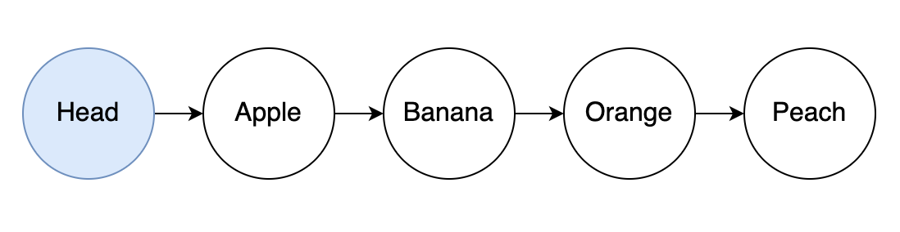
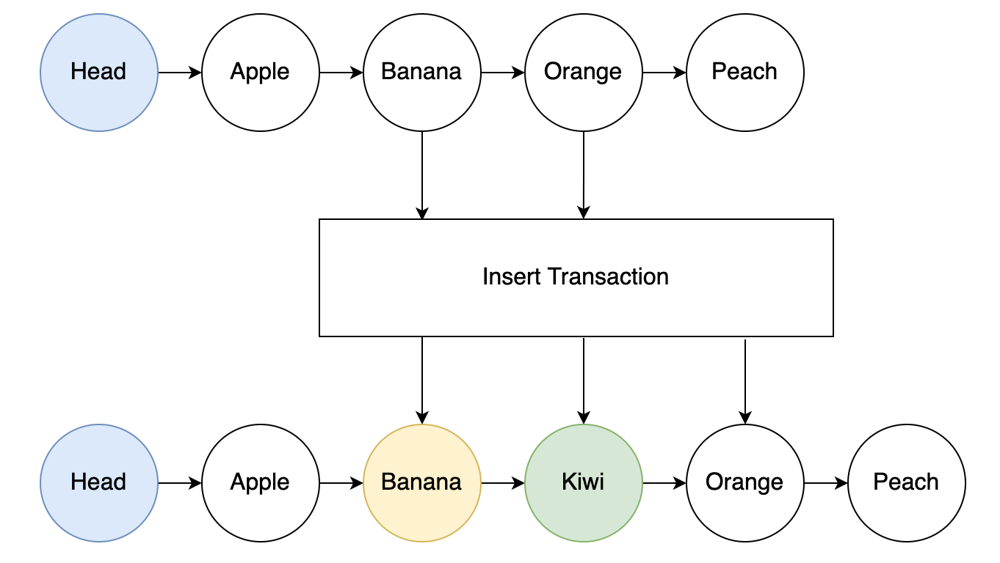
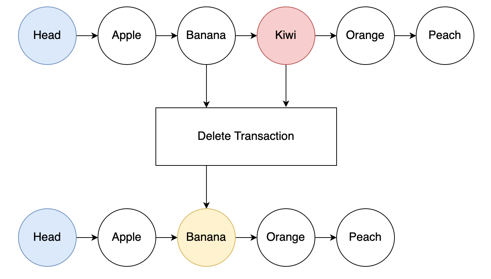

## Introduction

Linked list structures leverage the EUTXO model to enhancing scalability and throughput significantly. By linking multiple UTXOs together through a series of minting policies and validators, it can improve the user experience interacting with smart contract concurrently.

:::info 
The github repository introducing these data structures can be found [here](https://github.com/Anastasia-Labs/aiken-linked-list).
:::

## Documentation

### Linked List

The Aiken Linked List is an on-chain, sorted linked list solution designed for blockchain environments, specifically utilizing NFTs (Non-Fungible Tokens) and datums. It provides a structured and efficient way to store and manipulate a list of key/value pairs on-chain.



#### Entry Structure

Each entry in the list comprises:

- **NFT**: A unique identifier for each entry.
- **EntryDatum**: A data structure containing the key/value pair, a reference to the entry's NFT, and a pointer to the next NFT in the list.

#### EntryDatum Definition

```aiken
data EntryDatum = EntryDatum {
  key :: BuiltinByteString,
  value :: Maybe SomeValue,
  nft :: NFT,
  next :: Maybe NFT
}
```

- **key**: A unique identifier for the entry.
- **value**: The value associated with the key. It can be Nothing for the head entry.
- **nft**: The NFT representing the entry.
- **next**: The NFT of the next entry in the list, or Nothing for the last entry.

#### Operations

##### Inserting an Entry



Insertion involves:

- **Inputs**: Two adjacent list entries.
- **Outputs**:
  - The first input entry, modified to point to the new entry.
  - The newly inserted entry, pointing to the second input entry.
  - The second input entry, unchanged.

Validation Rules

- Keys must maintain the order: a < b < c, where a is the lowest, b is the new key, and c is the highest.
- The pointers must be correctly updated to maintain list integrity.

##### Removing an Entry



To remove an entry:

- **Inputs**: The entry to remove and its preceding entry.
- **Output**: The preceding entry is modified to point to what the removed entry was pointing to.

#### Utilizing NFTs as Pointers

NFTs serve as robust and unique pointers within the list. Their uniqueness is ensured by a specific minting policy related to the list's head NFT.

#### Key Considerations

- **Efficiency**: As on-chain lookups are inefficient, off-chain structures are recommended for this purpose.
- **Datum Hashes**: Not suitable for pointers due to the complexity of updates and security concerns.
- **Security**: The integrity of the list is maintained through careful minting policies and entry validation.

#### Advanced Features

- **[Forwarding Minting Policy](https://github.com/Plutonomicon/plutonomicon/blob/main/forwarding1.md)**: A feature of Plutus to control NFT minting dynamically.
- **List Head**: Utilizes an empty head entry for validating insertions at the start of the list.
- **End-of-List Insertions**: Handled by ensuring the last entry points to Nothing.

### Aiken Linked List implementation

The Aiken Linked List implementation provides several functions to create and manipulate Linked List. Below is a brief overview of each function:

- `init`: Constructs the Linked List head
- `deinit`: Destructs the Linked List
- `insert`: Inserts a node into the linked list
- `remove`: Removes a node from the linked list

## Validator Logic

For a complete example, including tests and further explanations, reger to the provided sample validator:

```aiken
use aiken/bytearray
use aiken/dict
use aiken/interval.{Finite, Interval, IntervalBound, is_entirely_before}
use aiken/list
use aiken/transaction.{
  InlineDatum, Input, Mint, NoDatum, Output, OutputReference, ScriptContext,
  Transaction, TransactionId,
}
use aiken/transaction/credential.{Address}
use aiken/transaction/value
use linkedlist/constants.{origin_node_token_name}
use linkedlist/linked_list.{deinit, init, insert, remove}
use linkedlist/types.{
  Config, Deinit, Empty, Init, Insert, Key, NodeAction, Remove, SetNode,
}
use linkedlist/utils

validator {
  fn mint_validator(cfg: Config, redeemer: NodeAction, ctx: ScriptContext) {
    let (common, inputs, outputs, sigs, vrange) = utils.make_common(ctx)
    when redeemer is {
      Init -> {
        expect
          list.any(
            inputs,
            fn(input) { cfg.init_utxo == input.output_reference },
          )
        init(common)
      }
      Deinit -> deinit(common)
      Insert { key_to_insert, covering_node } -> {
        expect is_entirely_before(vrange, cfg.deadline)
        expect list.any(sigs, fn(sig) { sig == key_to_insert })
        insert(common, key_to_insert, covering_node)
      }
      Remove { key_to_remove, covering_node } -> {
        expect is_entirely_before(vrange, cfg.deadline)
        remove(common, vrange, cfg, outputs, sigs, key_to_remove, covering_node)
      }
    }
  }
}

test mint_validator_init() {
  let own_cs = #"746fa3ba2daded6ab9ccc1e39d3835aa1dfcb9b5a54acc2ebe6b79a4"
  let init_output_ref =
    OutputReference {
      transaction_id: TransactionId {
        hash: #"2c6dbc95c1e96349c4131a9d19b029362542b31ffd2340ea85dd8f28e271ff6d",
      },
      output_index: 1,
    }
  let config =
    Config {
      init_utxo: init_output_ref,
      deadline: 86_400_000,
      penalty_address: Address(credential.ScriptCredential("P"), None),
    }
  let redeemer = Init
  let minted_value = value.add(value.zero(), own_cs, origin_node_token_name, 1)
  let head_output =
    Output {
      address: Address(credential.ScriptCredential("B"), None),
      value: value.add(
        minted_value,
        value.ada_policy_id,
        value.ada_asset_name,
        4_000_000,
      ),
      datum: InlineDatum(SetNode { key: Empty, next: Empty }),
      reference_script: None,
    }
  let context =
    ScriptContext {
      purpose: Mint(own_cs),
      transaction: Transaction {
        inputs: [
          Input {
            output_reference: init_output_ref,
            output: Output {
              address: Address(credential.ScriptCredential("C"), None),
              value: value.from_lovelace(4_000_000),
              datum: NoDatum,
              reference_script: None,
            },
          },
        ],
        reference_inputs: [],
        outputs: [head_output],
        fee: value.zero(),
        mint: value.to_minted_value(minted_value),
        certificates: [],
        withdrawals: dict.new(),
        validity_range: interval.everything(),
        extra_signatories: [],
        redeemers: dict.new(),
        datums: dict.new(),
        id: TransactionId {
          hash: #"2c6dbc95c1e96349c4131a9d19b029362542b31ffd2340ea85dd8f28e271ff6d",
        },
      },
    }

  mint_validator(config, redeemer, context)
}

test mint_validator_deinit() {
  let own_cs = #"746fa3ba2daded6ab9ccc1e39d3835aa1dfcb9b5a54acc2ebe6b79a4"
  let init_output_ref =
    OutputReference {
      transaction_id: TransactionId {
        hash: #"2c6dbc95c1e96349c4131a9d19b029362542b31ffd2340ea85dd8f28e271ff6d",
      },
      output_index: 1,
    }
  let config =
    Config {
      init_utxo: init_output_ref,
      deadline: 86_400_000,
      penalty_address: Address(credential.ScriptCredential("P"), None),
    }
  let redeemer = Deinit
  let own_cs_value = value.add(value.zero(), own_cs, origin_node_token_name, -1)
  let burn_value = value.add(value.zero(), own_cs, origin_node_token_name, -1)
  let in_output =
    Output {
      address: Address(credential.ScriptCredential("B"), None),
      value: value.add(
        own_cs_value,
        value.ada_policy_id,
        value.ada_asset_name,
        4_000_000,
      ),
      datum: InlineDatum(SetNode { key: Empty, next: Empty }),
      reference_script: None,
    }
  let context =
    ScriptContext {
      purpose: Mint(own_cs),
      transaction: Transaction {
        inputs: [Input { output_reference: init_output_ref, output: in_output }],
        reference_inputs: [],
        outputs: [],
        fee: value.zero(),
        mint: value.to_minted_value(burn_value),
        certificates: [],
        withdrawals: dict.new(),
        validity_range: interval.everything(),
        extra_signatories: [],
        redeemers: dict.new(),
        datums: dict.new(),
        id: TransactionId {
          hash: #"2c6dbc95c1e96349c4131a9d19b029362542b31ffd2340ea85dd8f28e271ff6d",
        },
      },
    }

  mint_validator(config, redeemer, context)
}

test mint_validator_deinit_fails_on_non_empty() fail {
  let own_cs = #"746fa3ba2daded6ab9ccc1e39d3835aa1dfcb9b5a54acc2ebe6b79a4"
  let init_output_ref =
    OutputReference {
      transaction_id: TransactionId {
        hash: #"2c6dbc95c1e96349c4131a9d19b029362542b31ffd2340ea85dd8f28e271ff6d",
      },
      output_index: 1,
    }
  let config =
    Config {
      init_utxo: init_output_ref,
      deadline: 86_400_000,
      penalty_address: Address(credential.ScriptCredential("P"), None),
    }
  let user2_pkh =
    bytearray.from_string(
      @"e18d73505be6420225ed2a42c8e975e4c6f9148ab38e951ea2572e54",
    )
  let user2_tn = "FSNe18d73505be6420225ed2a42c8e975e4c6f9148ab38e951ea2572e54"
  let remove_output_ref =
    OutputReference {
      transaction_id: TransactionId { hash: #"" },
      output_index: 1,
    }
  let remove_node =
    SetNode { key: Key { key: user2_pkh }, next: Key { key: user2_pkh } }
  let user2_value = value.add(value.zero(), own_cs, user2_tn, 1)
  let remove_node_output =
    Output {
      address: Address(credential.ScriptCredential("I"), None),
      value: value.add(
        user2_value,
        value.ada_policy_id,
        value.ada_asset_name,
        9_000_000,
      ),
      datum: InlineDatum(remove_node),
      reference_script: None,
    }
  let burn_value = value.add(value.zero(), own_cs, origin_node_token_name, -1)
  let redeemer = Deinit
  let context =
    ScriptContext {
      purpose: Mint(own_cs),
      transaction: Transaction {
        inputs: [
          Input {
            output_reference: remove_output_ref,
            output: remove_node_output,
          },
        ],
        reference_inputs: [],
        outputs: [],
        fee: value.zero(),
        mint: value.to_minted_value(burn_value),
        certificates: [],
        withdrawals: dict.new(),
        validity_range: interval.everything(),
        extra_signatories: [],
        redeemers: dict.new(),
        datums: dict.new(),
        id: TransactionId {
          hash: #"2c6dbc95c1e96349c4131a9d19b029362542b31ffd2340ea85dd8f28e271ff6d",
        },
      },
    }
  mint_validator(config, redeemer, context)
}

test mint_validator_insert() {
  let own_cs = #"746fa3ba2daded6ab9ccc1e39d3835aa1dfcb9b5a54acc2ebe6b79a4"
  let init_output_ref =
    OutputReference {
      transaction_id: TransactionId {
        hash: #"2c6dbc95c1e96349c4131a9d19b029362542b31ffd2340ea85dd8f28e271ff6d",
      },
      output_index: 1,
    }
  let config =
    Config {
      init_utxo: init_output_ref,
      deadline: 86_400_000,
      penalty_address: Address(credential.ScriptCredential("P"), None),
    }
  let user1_pkh =
    bytearray.from_string(
      @"a65ca58a4e9c755fa830173d2a5caed458ac0c73f97db7faae2e7e3b",
    )
  let covering_tn =
    "FSNa65ca58a4e9c755fa830173d2a5caed458ac0c73f97db7faae2e7e3b"
  let user2_pkh =
    bytearray.from_string(
      @"e18d73505be6420225ed2a42c8e975e4c6f9148ab38e951ea2572e54",
    )
  let insert_tn = "FSNe18d73505be6420225ed2a42c8e975e4c6f9148ab38e951ea2572e54"
  let covering_minted_value = value.add(value.zero(), own_cs, covering_tn, 1)
  let covering_node_value =
    value.add(
      covering_minted_value,
      value.ada_policy_id,
      value.ada_asset_name,
      9_000_000,
    )
  let covering_node = SetNode { key: Key { key: user1_pkh }, next: Empty }
  let covering_output =
    Output {
      address: Address(credential.ScriptCredential("I"), None),
      value: covering_node_value,
      datum: InlineDatum(covering_node),
      reference_script: None,
    }
  let covering_output_ref =
    OutputReference {
      transaction_id: TransactionId { hash: #"" },
      output_index: 1,
    }
  let out_prev_node =
    SetNode { key: covering_node.key, next: Key { key: user2_pkh } }

  let out_prev_node_output =
    Output {
      address: Address(credential.ScriptCredential("I"), None),
      value: covering_node_value,
      datum: InlineDatum(out_prev_node),
      reference_script: None,
    }
  let out_node =
    SetNode { key: Key { key: user2_pkh }, next: covering_node.next }
  let insert_minted_value = value.add(value.zero(), own_cs, insert_tn, 1)
  let out_node_output =
    Output {
      address: Address(credential.ScriptCredential("I"), None),
      value: value.add(
        insert_minted_value,
        value.ada_policy_id,
        value.ada_asset_name,
        9_000_000,
      ),
      datum: InlineDatum(out_node),
      reference_script: None,
    }
  let redeemer = Insert { key_to_insert: user2_pkh, covering_node }
  let insert_timerange =
    Interval {
      lower_bound: IntervalBound {
        bound_type: Finite(1000),
        is_inclusive: False,
      },
      upper_bound: IntervalBound {
        bound_type: Finite(2000),
        is_inclusive: False,
      },
    }
  let context =
    ScriptContext {
      purpose: Mint(own_cs),
      transaction: Transaction {
        inputs: [
          Input {
            output_reference: covering_output_ref,
            output: covering_output,
          },
        ],
        reference_inputs: [],
        outputs: [out_prev_node_output, out_node_output],
        fee: value.zero(),
        mint: value.to_minted_value(insert_minted_value),
        certificates: [],
        withdrawals: dict.new(),
        validity_range: insert_timerange,
        extra_signatories: [user2_pkh],
        redeemers: dict.new(),
        datums: dict.new(),
        id: TransactionId {
          hash: #"2c6dbc95c1e96349c4131a9d19b029362542b31ffd2340ea85dd8f28e271ff6d",
        },
      },
    }
  mint_validator(config, redeemer, context)
}

test mint_validator_remove() {
  let own_cs = #"746fa3ba2daded6ab9ccc1e39d3835aa1dfcb9b5a54acc2ebe6b79a4"
  let init_output_ref =
    OutputReference {
      transaction_id: TransactionId {
        hash: #"2c6dbc95c1e96349c4131a9d19b029362542b31ffd2340ea85dd8f28e271ff6d",
      },
      output_index: 1,
    }
  let config =
    Config {
      init_utxo: init_output_ref,
      deadline: 86_400_000,
      penalty_address: Address(credential.ScriptCredential("P"), None),
    }
  let user1_pkh =
    bytearray.from_string(
      @"a65ca58a4e9c755fa830173d2a5caed458ac0c73f97db7faae2e7e3b",
    )
  let covering_tn =
    "FSNa65ca58a4e9c755fa830173d2a5caed458ac0c73f97db7faae2e7e3b"
  let user2_pkh =
    bytearray.from_string(
      @"e18d73505be6420225ed2a42c8e975e4c6f9148ab38e951ea2572e54",
    )
  let user2_tn = "FSNe18d73505be6420225ed2a42c8e975e4c6f9148ab38e951ea2572e54"
  let covering_minted_value = value.add(value.zero(), own_cs, covering_tn, 1)
  let covering_node_value =
    value.add(
      covering_minted_value,
      value.ada_policy_id,
      value.ada_asset_name,
      9_000_000,
    )
  let covering_node =
    SetNode { key: Key { key: user1_pkh }, next: Key { key: user2_pkh } }
  let covering_output =
    Output {
      address: Address(credential.ScriptCredential("I"), None),
      value: covering_node_value,
      datum: InlineDatum(covering_node),
      reference_script: None,
    }
  let covering_output_ref =
    OutputReference {
      transaction_id: TransactionId { hash: #"" },
      output_index: 1,
    }
  let remove_output_ref =
    OutputReference {
      transaction_id: TransactionId { hash: #"" },
      output_index: 1,
    }
  let remove_node = SetNode { key: Key { key: user2_pkh }, next: Empty }
  let user2_value = value.add(value.zero(), own_cs, user2_tn, 1)
  let remove_node_output =
    Output {
      address: Address(credential.ScriptCredential("I"), None),
      value: value.add(
        user2_value,
        value.ada_policy_id,
        value.ada_asset_name,
        9_000_000,
      ),
      datum: InlineDatum(remove_node),
      reference_script: None,
    }
  let output_node = SetNode { key: covering_node.key, next: remove_node.next }
  let out_node_output =
    Output {
      address: Address(credential.ScriptCredential("I"), None),
      value: covering_node_value,
      datum: InlineDatum(output_node),
      reference_script: None,
    }
  let remove_burn_value = value.add(value.zero(), own_cs, user2_tn, -1)
  let cover_node = SetNode { key: Key { key: user1_pkh }, next: Empty }
  let redeemer = Remove { key_to_remove: user2_pkh, covering_node: cover_node }
  let remove_timerange =
    Interval {
      lower_bound: IntervalBound {
        bound_type: Finite(1000),
        is_inclusive: False,
      },
      upper_bound: IntervalBound {
        bound_type: Finite(2000),
        is_inclusive: False,
      },
    }
  let context =
    ScriptContext {
      purpose: Mint(own_cs),
      transaction: Transaction {
        inputs: [
          Input {
            output_reference: remove_output_ref,
            output: remove_node_output,
          },
          Input {
            output_reference: covering_output_ref,
            output: covering_output,
          },
        ],
        reference_inputs: [],
        outputs: [out_node_output],
        fee: value.zero(),
        mint: value.to_minted_value(remove_burn_value),
        certificates: [],
        withdrawals: dict.new(),
        validity_range: remove_timerange,
        extra_signatories: [user2_pkh],
        redeemers: dict.new(),
        datums: dict.new(),
        id: TransactionId {
          hash: #"2c6dbc95c1e96349c4131a9d19b029362542b31ffd2340ea85dd8f28e271ff6d",
        },
      },
    }
  mint_validator(config, redeemer, context)
}
```

### Library

#### Constants

```aiken
pub const origin_node_token_name = "FSN"

pub const set_node_prefix = "FSN"
```

#### Linked List

```aiken
use aiken/bytearray
use aiken/interval.{Interval}
use aiken/list
use aiken/transaction.{Output}
use aiken/transaction/value.{lovelace_of}
use linkedlist/constants
use linkedlist/types.{Common, Config, Empty, POSIXTime, PubKeyHash, SetNode}
use linkedlist/utils

pub fn init(common: Common) -> Bool {
  let must_spend_nodes = list.length(common.node_inputs) == 0
  let must_exactly_one_node_output = list.length(common.node_outputs) == 1
  let must_mint_correctly =
    utils.validate_mint(
      common.mint,
      common.own_cs,
      constants.origin_node_token_name,
      1,
    )
  must_spend_nodes? && must_exactly_one_node_output? && must_mint_correctly?
}

pub fn deinit(common: Common) -> Bool {
  expect [head_node] = common.node_inputs
  expect Empty = head_node.node.next
  let must_not_produce_node_output = list.length(common.node_outputs) == 0
  let must_burn_correctly =
    utils.validate_mint(
      common.mint,
      common.own_cs,
      constants.origin_node_token_name,
      -1,
    )
  must_not_produce_node_output? && must_burn_correctly?
}

pub fn insert(common: Common, insert_key: PubKeyHash, node: SetNode) -> Bool {
  let must_cover_inserting_key = utils.cover_key(node, insert_key)
  expect [covering_node] = common.node_inputs
  let prev_node_datum = utils.as_predecessor_of(node, insert_key)
  let node_datum = utils.as_successor_of(insert_key, node)
  let must_has_datum_in_output =
    list.any(
      common.node_outputs,
      fn(node_pair) { node_datum == node_pair.node },
    )
  let must_correct_node_output =
    list.any(
      common.node_outputs,
      fn(node_pair) {
        covering_node.val == node_pair.val && prev_node_datum == node_pair.node
      },
    )

  let must_mint_correct =
    utils.validate_mint(
      common.mint,
      common.own_cs,
      bytearray.concat(constants.origin_node_token_name, insert_key),
      1,
    )
  must_cover_inserting_key? && must_has_datum_in_output? && must_correct_node_output? && must_mint_correct?
}

pub fn remove(
  common: Common,
  range: Interval<POSIXTime>,
  disc_config: Config,
  outs: List<Output>,
  sigs: List<PubKeyHash>,
  remove_key: PubKeyHash,
  node: SetNode,
) -> Bool {
  let must_cover_remove_key = utils.cover_key(node, remove_key)
  let prev_node_datum = utils.as_predecessor_of(node, remove_key)
  let node_datum = utils.as_successor_of(remove_key, node)
  let must_spend_two_nodes = list.length(common.node_inputs) == 2
  expect Some(stay_node) =
    list.find(common.node_inputs, fn(input) { prev_node_datum == input.node })
  expect Some(remove_node) =
    list.find(common.node_inputs, fn(input) { node_datum == input.node })
  let remove_token_name =
    bytearray.concat(constants.origin_node_token_name, remove_key)
  let must_correct_node_output =
    list.any(
      common.node_outputs,
      fn(node_pair) { stay_node.val == node_pair.val && node == node_pair.node },
    )
  let must_mint_correct =
    utils.validate_mint(common.mint, common.own_cs, remove_token_name, -1)
  let must_sign_by_user = list.has(sigs, remove_key)
  let own_input_lovelace = lovelace_of(remove_node.val)
  let own_input_fee = utils.div_ceil(own_input_lovelace, 4)
  let disc_deadline = disc_config.deadline
  let must_satisfy_removal_broke_phase_rules =
    if interval.is_entirely_before(range, disc_deadline) {
      True
    } else {
      list.any(
        outs,
        fn(out) {
          out.address == disc_config.penalty_address && own_input_fee < lovelace_of(
            out.value,
          )
        },
      )
    }
  must_cover_remove_key? && must_spend_two_nodes? && must_correct_node_output? && must_mint_correct? && must_sign_by_user? && must_satisfy_removal_broke_phase_rules?
}
```

#### Types

```aiken
use aiken/hash.{Blake2b_224, Hash}
use aiken/transaction.{OutputReference}
use aiken/transaction/credential.{Address, VerificationKey}
use aiken/transaction/value.{AssetName, PolicyId, Value}

/// A number of milliseconds since 00:00:00 UTC on 1 January 1970.
pub type POSIXTime =
  Int

pub type AssetClass {
  policy_id: PolicyId,
  asset_name: AssetName,
}

pub type PubKeyHash =
  Hash<Blake2b_224, VerificationKey>

pub type Config {
  init_utxo: OutputReference,
  deadline: POSIXTime,
  penalty_address: Address,
}

pub type NodeKey {
  Key { key: PubKeyHash }
  Empty
}

pub type SetNode {
  key: NodeKey,
  next: NodeKey,
}

pub type NodePair {
  val: Value,
  node: SetNode,
}

pub type Common {
  own_cs: PolicyId,
  mint: Value,
  node_inputs: List<NodePair>,
  node_outputs: List<NodePair>,
}

pub type NodeAction {
  Init
  Deinit
  Insert { key_to_insert: PubKeyHash, covering_node: SetNode }
  Remove { key_to_remove: PubKeyHash, covering_node: SetNode }
}
```

### Utilities

```aiken
use aiken/bytearray
use aiken/dict.{has_key}
use aiken/interval.{Interval}
use aiken/list
use aiken/transaction.{
  InlineDatum, Input, Mint, Output, ScriptContext, Transaction,
}
use aiken/transaction/value.{
  AssetName, PolicyId, Value, flatten, from_minted_value, to_dict, tokens,
}
use linkedlist/constants.{set_node_prefix}
use linkedlist/types.{
  Common, Empty, Key, NodePair, POSIXTime, PubKeyHash, SetNode,
}

pub fn validate_mint(
  mints: Value,
  expected_minting_policy: ByteArray,
  expected_minting_name: ByteArray,
  expected_minting_amt: Int,
) -> Bool {
  let mints_policy = dict.to_list(value.tokens(mints, expected_minting_policy))
  mints_policy == [(expected_minting_name, expected_minting_amt)]
}

pub fn cover_key(node: SetNode, insert_key: PubKeyHash) -> Bool {
  let less_than_key =
    when node.key is {
      Empty -> True
      Key(key) -> bytearray.compare(key, insert_key) == Less
    }
  let more_than_key =
    when node.next is {
      Empty -> True
      Key(key) -> bytearray.compare(key, insert_key) == Greater
    }
  less_than_key? && more_than_key?
}

pub fn as_predecessor_of(node: SetNode, next_key: PubKeyHash) -> SetNode {
  SetNode { key: node.key, next: Key(next_key) }
}

pub fn as_successor_of(prev_key: PubKeyHash, node: SetNode) -> SetNode {
  SetNode { key: Key(prev_key), next: node.next }
}

pub fn div_ceil(a, b: Int) -> Int {
  let div = a / b
  let rem = a % b
  when rem is {
    0 -> div
    _ -> div + 1
  }
}

pub fn make_common(
  ctx: ScriptContext,
) -> (Common, List<Input>, List<Output>, List<PubKeyHash>, Interval<POSIXTime>) {
  expect ScriptContext {
    transaction: Transaction {
      inputs,
      outputs,
      mint,
      validity_range,
      extra_signatories,
      ..
    },
    purpose: Mint(own_cs),
  } = ctx
  let in_outputs = get_outputs(inputs)
  let from_node_val = only_at_node_val(in_outputs, own_cs)
  let to_node_val = only_at_node_val(outputs, own_cs)
  expect Some(head) = list.head(list.concat(from_node_val, to_node_val))
  let Output { address: node_address, .. } = head
  expect
    from_node_val
      |> list.concat(to_node_val)
      |> list.reduce(
           True,
           fn(acc, cur_node) {
             let Output { address: cur_address, .. } = cur_node
             and {
               cur_address == node_address,
               acc,
             }
           },
         )
  let node_inputs = list.map(from_node_val, node_input_utxo_datum_unsafe)
  let node_outputs =
    list.map(to_node_val, fn(node) { parse_node_output_utxo(own_cs, node) })
  let common =
    Common { own_cs, mint: from_minted_value(mint), node_inputs, node_outputs }
  (common, inputs, outputs, extra_signatories, validity_range)
}

// Checks if a Currency Symbol is held within a Value
pub fn has_data_cs(cs: PolicyId, value: Value) -> Bool {
  value
    |> to_dict()
    |> has_key(cs)
}

pub fn get_outputs(inputs: List<Input>) -> List<Output> {
  list.map(
    inputs,
    fn(input) {
      let Input { output, .. } = input
      output
    },
  )
}

pub fn only_at_node_val(outputs: List<Output>, cs: PolicyId) -> List<Output> {
  outputs
    |> list.filter(
         fn(output) {
           let Output { value, .. } = output
           has_data_cs(cs, value)
         },
       )
}

pub fn node_input_utxo_datum_unsafe(output: Output) -> NodePair {
  expect Output { value, datum: InlineDatum(raw_node), .. } = output
  expect node: SetNode = raw_node
  NodePair { val: value, node }
}

pub fn parse_node_output_utxo(cs: PolicyId, output: Output) -> NodePair {
  expect Output { value, datum: InlineDatum(raw_node), .. } = output
  expect node: SetNode = raw_node
  expect [(tn, amount)] =
    value
      |> tokens(cs)
      |> dict.to_list()
  expect amount == 1
  let node_key = parse_node_key(tn)
  let datum_key =
    when node.key is {
      Empty -> None
      Key(key) -> Some(key)
    }
  expect node_key == datum_key
  expect list.length(flatten(value)) == 2
  expect valid_node(node)
  expect find_cs_by_token_prefix(value, set_node_prefix) == [cs]
  NodePair { val: value, node }
}

pub fn parse_node_key(tn: AssetName) -> Option<ByteArray> {
  let prefix_length = bytearray.length(set_node_prefix)
  let tn_length = bytearray.length(tn)
  let key = bytearray.drop(tn, prefix_length)
  expect set_node_prefix == bytearray.take(tn, prefix_length)
  when prefix_length < tn_length is {
    True -> Some(key)
    False -> None
  }
}

pub fn valid_node(node: SetNode) -> Bool {
  when node.key is {
    Empty -> True
    Key(node_key) ->
      when node.next is {
        Empty -> True
        Key(next_key) -> bytearray.compare(node_key, next_key) == Less
      }
  }
}

pub fn find_cs_by_token_prefix(
  value: Value,
  prefix: ByteArray,
) -> List<PolicyId> {
  value
    |> flatten
    |> list.filter_map(
         fn(input: (PolicyId, ByteArray, Int)) -> Option<PolicyId> {
           let (cs, tn, _amt) = input
           if is_prefix_of(prefix, tn) {
             Some(cs)
           } else {
             None
           }
         },
       )
}

pub fn is_prefix_of(prefix: ByteArray, src: ByteArray) -> Bool {
  let prefix_length = bytearray.length(prefix)
  let src_length = bytearray.length(src)
  when prefix_length <= src_length is {
    True -> bytearray.take(src, prefix_length) == prefix
    False -> False
  }
}
```

## Case study

Linked list can be leveraged in smart contract applications where the order of inputs is not crucial, and multiple users can interact with the contracts simultaneously. For example, consider a decentralized voting system where users can cast their votes concurrently. A linked list data structure can be employed to store and manage the votes efficiently. Each user's vote can be represented as a node in the linked list, containing relevant information such as the user's address and their chosen candidate.

## Acknowledgments

This documentation and the implementation of the Aiken Linked List draw inspiration from an original idea presented in the Plutonomicon. We acknowledge the innovative concepts and approaches outlined in their work, specifically regarding associative data structures on blockchain platforms.

For further details on the foundational ideas and their context, please refer to the Plutonomicon's overview of associative data structures: [Plutonomicon's Associative Data Structures Overview](https://github.com/Plutonomicon/plutonomicon/blob/main/assoc.md#overview).

We express our gratitude to the creators and contributors of the Plutonomicon for their pioneering work in this area, which has significantly influenced the development of our Aiken Linked List.
