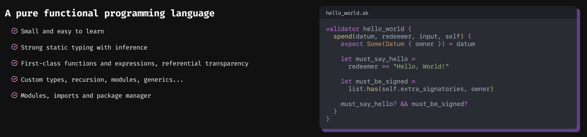
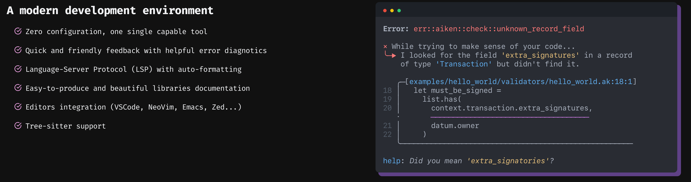
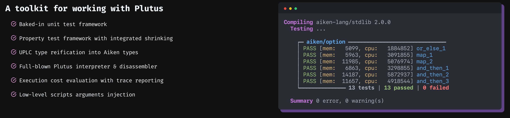

**Aiken** is a modern smart contract platform for Cardano, a pure functional programming language that's small, easy to learn, and built for robustness. This means
that most of the time, the compiler is smart enough to determine the type of something
without requiring user annotation. Writing smart contracts should be easy and safe. With Aiken, you can get started in minutes, not days, and rapidly build confidence that your on-chain code does what's intended.

## A Language Built for Smart Contracts

Aiken brings strong static typing with inference, first-class functions, custom types, and modules. The language compiles directly to **Untyped Plutus Core (UPLC)**, Cardano's native smart contract execution format, giving you full access to the blockchain's capabilities. Its syntax resembles other modern languages like Rust, Elm and Gleam, but Aiken is specifically designed for smart contract development and natively supports the mental model required on Cardano.

:::tip Purpose-Built for Smart Contracts
Unlike many other languages adapted for blockchain use, Aiken was designed from the ground up for smart contract development. This focused approach means every feature serves the goal of writing secure, auditable on-chain code.
:::

## Modern Development Experience

The platform provides a **single toolchain with minimal configuration** that handles everything from compilation to testing. You get quick, friendly feedback with helpful error diagnostics that actually make sense, plus Language Server Protocol support for autocompletion and real-time error checking in VS Code, Zed, Vim/Neovim, and Emacs.

The built-in testing framework supports both unit tests and property-based testing. Execution cost evaluation and trace reporting help you optimize your contracts before deployment.

## Understanding the Architecture

:::note Haskell Not Required
A common misconception is that Cardano smart contracts must be written in Haskell. The reality is that Cardano's virtual machine executes **Untyped Plutus Core (UPLC)**, and Aiken compiles straight to UPLC, just like Plinth or Plutarch which are written in Haskell. Haskell is just one of several ways to "generate" UPLC, not a requirement.
:::

**Aiken focuses exclusively on on-chain validator scripts.** These define the logic that validates Cardano transactions. For off-chain stuff like building transactions, wallet integration, and UIs, you'll use other tools from the Cardano ecosystem.



## Getting Started

Install Aiken using `aikup`, the official installer and version manager:

import Tabs from '@theme/Tabs';
import TabItem from '@theme/TabItem';

<Tabs
defaultValue="npm"
values={[
{label: 'npm', value: 'npm'},
{label: 'Homebrew', value: 'brew'},
{label: 'Manual', value: 'manual'},
]}>
<TabItem value="npm">

```bash title="Install via npm"
npm install -g @aiken-lang/aikup
```

  </TabItem>
  <TabItem value="brew">

```bash title="Install via Homebrew"
brew install aiken-lang/tap/aikup
```

  </TabItem>
  <TabItem value="manual">

```bash title="Manual installation"
# Download and run the installer script
curl -sSfL https://install.aiken-lang.org | bash
```

  </TabItem>
</Tabs>




## Next Steps

Visit **[aiken-lang.org](https://aiken-lang.org)** for the complete language guide, tutorials, and API documentation. The **[GitHub repository](https://github.com/aiken-lang/aiken)** contains examples and a highly active community.

Continue the journey and join the welcoming community on [TxPipe's Discord](https://discord.com/invite/RgHzxh92WH) for further support and guidance.

### Educational Resources

#### Aiken Smart Contract Development Course

| Course    | Name                          | Video                                                                                                         |
| --------- | ----------------------------- | ------------------------------------------------------------------------------------------------------------- |
| **1/15**  | Intro Orientation             | [Watch Video →](https://www.youtube.com/watch?v=N-JmswJuQRU&list=PLCuyQuWCJVQ1Zz9ySRMH_J6EymxhnZ0Hu&index=1)  |
| **2/15**  | Installation and Setup        | [Watch Video →](https://www.youtube.com/watch?v=5p8r6KE3rWE&list=PLCuyQuWCJVQ1Zz9ySRMH_J6EymxhnZ0Hu&index=2)  |
| **3/15**  | First Validator               | [Watch Video →](https://www.youtube.com/watch?v=-bP00YVbv8w&list=PLCuyQuWCJVQ1Zz9ySRMH_J6EymxhnZ0Hu&index=3)  |
| **4/15**  | Marketplace Setup             | [Watch Video →](https://www.youtube.com/watch?v=DXlqeTSOAA8&list=PLCuyQuWCJVQ1Zz9ySRMH_J6EymxhnZ0Hu&index=4)  |
| **5/15**  | Datums and Redeemers          | [Watch Video →](https://www.youtube.com/watch?v=QQdk5JWZ8l4&list=PLCuyQuWCJVQ1Zz9ySRMH_J6EymxhnZ0Hu&index=5)  |
| **6/15**  | Delist Redeemer               | [Watch Video →](https://www.youtube.com/watch?v=niFiov4kz0s&list=PLCuyQuWCJVQ1Zz9ySRMH_J6EymxhnZ0Hu&index=6)  |
| **7/15**  | Buy Redeemer                  | [Watch Video →](https://www.youtube.com/watch?v=Is8VFfrF3Kc&list=PLCuyQuWCJVQ1Zz9ySRMH_J6EymxhnZ0Hu&index=7)  |
| **8/15**  | Edit Redeemer                 | [Watch Video →](https://www.youtube.com/watch?v=1namBsoysYM&list=PLCuyQuWCJVQ1Zz9ySRMH_J6EymxhnZ0Hu&index=8)  |
| **9/15**  | Unit Tests                    | [Watch Video →](https://www.youtube.com/watch?v=DMobhNH4HOs&list=PLCuyQuWCJVQ1Zz9ySRMH_J6EymxhnZ0Hu&index=9)  |
| **10/15** | Testing - Buy                 | [Watch Video →](https://www.youtube.com/watch?v=mKNRXrXWXiM&list=PLCuyQuWCJVQ1Zz9ySRMH_J6EymxhnZ0Hu&index=10) |
| **11/15** | Testing Library               | [Watch Video →](https://www.youtube.com/watch?v=JlxOluOFCCE&list=PLCuyQuWCJVQ1Zz9ySRMH_J6EymxhnZ0Hu&index=11) |
| **12/15** | Testing - Edit                | [Watch Video →](https://www.youtube.com/watch?v=_yKhqCkyvCg&list=PLCuyQuWCJVQ1Zz9ySRMH_J6EymxhnZ0Hu&index=12) |
| **13/15** | Testing - Testing Tracing     | [Watch Video →](https://www.youtube.com/watch?v=k-wW1IGvb1Y&list=PLCuyQuWCJVQ1Zz9ySRMH_J6EymxhnZ0Hu&index=13) |
| **14/15** | Project - Transaction Counter | [Watch Video →](https://www.youtube.com/watch?v=rjj4bs65imA&list=PLNnM9sJabyj44xUjXtsbMHsgs-XtyH-JR&index=2)  |
| **15/15** | Project - Fractionalized NFT  | [Watch Video →](https://www.youtube.com/watch?v=GiKnbrKHDkg&list=PLNnM9sJabyj44xUjXtsbMHsgs-XtyH-JR&index=1)  |

#### Project Based Learning with Andamio

Continue with Aiken Project Based Learning that takes you from beginner to advanced Cardano smart contract development concepts.

| Course                                                                                                | Name                                                    | Video                                                        |
| ----------------------------------------------------------------------------------------------------- | ------------------------------------------------------- | ------------------------------------------------------------ |
| [**101**](https://app.andamio.io/course/db22e013578fcead6c2fed5446d61891ad31f3cb4955e88d980107e7/101) | Getting Started with Aiken                              | [Watch Video →](https://www.youtube.com/watch?v=4YRr8rAbFhU) |
| [**102**](https://app.andamio.io/course/db22e013578fcead6c2fed5446d61891ad31f3cb4955e88d980107e7/102) | Writing Your First Smart Contract                       | [Watch Video →](https://www.youtube.com/watch?v=LUNfi3-ep0I) |
| [**103**](https://app.andamio.io/course/db22e013578fcead6c2fed5446d61891ad31f3cb4955e88d980107e7/103) | Running Tests with Mock Transaction                     | [Watch Video →](https://www.youtube.com/watch?v=XpvuLxeWIiI) |
| [**201**](https://app.andamio.io/course/db22e013578fcead6c2fed5446d61891ad31f3cb4955e88d980107e7/201) | Writing Smart Contracts with Validation Logic           | [Watch Video →](https://www.youtube.com/watch?v=Yi0vIqLV49w) |
| [**202**](https://app.andamio.io/course/db22e013578fcead6c2fed5446d61891ad31f3cb4955e88d980107e7/202) | Writing Smart Contracts with Validation Logic on Inputs | [Watch Video →](https://www.youtube.com/watch?v=SVhl5nJ_g74) |
| [**300**](https://app.andamio.io/course/db22e013578fcead6c2fed5446d61891ad31f3cb4955e88d980107e7/300) | Blueprint - Compile Scripts for DApp                    | [Watch Video →](https://www.youtube.com/watch?v=I8h2Wjc9CQM) |
| [**301**](https://app.andamio.io/course/db22e013578fcead6c2fed5446d61891ad31f3cb4955e88d980107e7/301) | Architecture for your Decentralized Application         | [Watch Video →](https://www.youtube.com/watch?v=I8h2Wjc9CQM) |
| [**302**](https://app.andamio.io/course/db22e013578fcead6c2fed5446d61891ad31f3cb4955e88d980107e7/302) | Bad Contract Examples                                   | [Watch Video →](https://www.youtube.com/watch?v=JgIhzix7rMo) |

#### I Can Aiken (Book)

**[I Can Aiken](https://book.io/book/i-can-aiken/)** is an open-source developer’s guide to writing secure, modern blockchain scripts on Cardano using the Aiken language.  
Written by John Greene, the book is designed to be approachable for new developers while still offering depth for advanced readers.

The book covers essential topics like:

- Fundamentals of Aiken
- Writing secure validator scripts
- Common smart contract patterns
- Vulnerabilities and design pitfalls to avoid
- Practical examples you can reuse and adapt

The project is open source and available in the [Cardano Academy GitHub repository](https://github.com/cardano-foundation/cardano-academy/tree/main/books).  
This makes it easy for the community to contribute improvements and for educators to integrate it into courses and workshops.

#### Danolearn

Visit [Danolearn](https://danolearn.com/en/course/cardano-smart-contract-development-with-aiken-language-1366) for an interactive learning experience.

#### Blogs

- [Piefayth`s Blog](https://piefayth.github.io/blog/pages/aiken1/)

### Examples

- Visit [Awesome Aiken](https://github.com/aiken-lang/awesome-aiken#readme) repository to find a curated list of open-source projects using Aiken.
- For advanced design patterns, check out the [Aiken Design Patterns](https://github.com/aiken-lang/aiken-design-patterns) repository.

## Development Workflow

:::note Development Steps

1. **Write your validator**: Define types and validation logic in `.ak` files
2. **Build**: Run `aiken build` to generate `plutus.json` with compiled scripts
3. **Use off-chain**: Import the compiled scripts in your off-chain application
4. **Parameterize if needed**: Apply parameters to scripts before deployment

:::

## Common Utilities/Helpers

:::tip Reusable Patterns
These functions create reusable validation logic for common operations. These utility functions eliminate repetitive code and provide safe, tested implementations for common validator operations:
:::

- To discover a list of utility libraries providing functions to streamline common operations, visit [Aiken Package Registry](https://packages.aiken-lang.org/).
- A great library of reusable functions to simplify your dev workflows which gives you a access to common use cases to be imported into your Aiken project. Definitely check out [Vodka](https://github.com/sidan-lab/vodka).

## Testing in Aiken

:::tip Testing in Aiken
Aiken provides first-class support for both unit tests and property-based [tests](https://aiken-lang.org/language-tour/tests). Tests run on the same virtual machine as your on-chain code and report CPU/memory costs, making them effective benchmarks. Tests must return `True` to pass.
:::

### Debugging

- [Gastronomy](https://sundae.fi/products/gastronomy), is an advanced tool that lets you step through Cardano smart contract code, line-by-line.
- [Aiken Playground](https://play.aiken-lang.org/) is an online environment where developers can test and experiment with Aiken functions and smart contracts without needing to install software on their local device.
