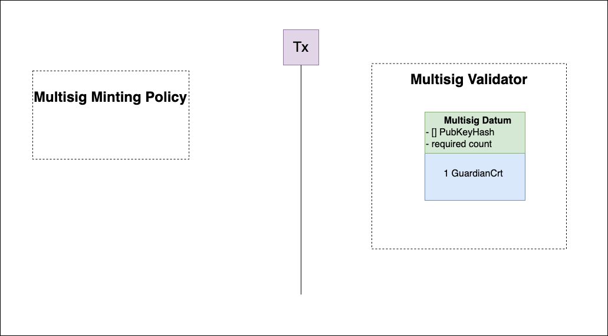
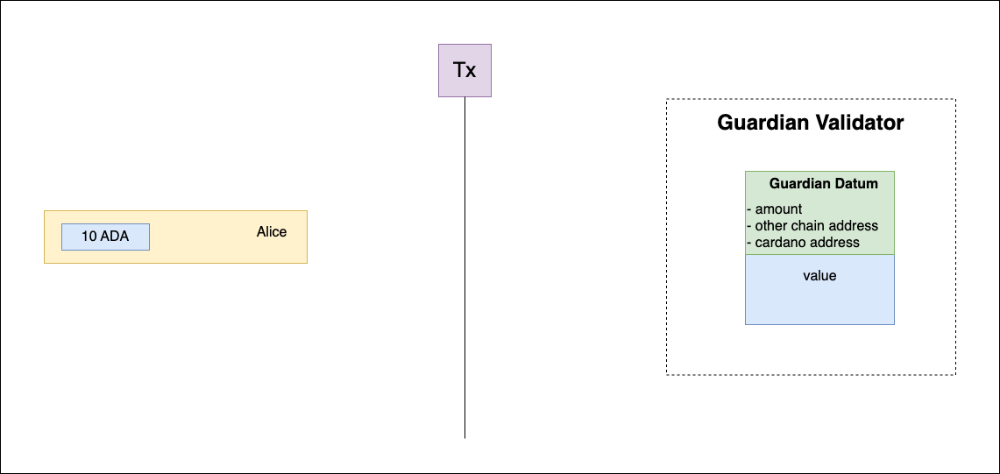

## Introduction

In the ever-evolving landscape of blockchain technology, interoperability has emerged as a critical feature, enabling disparate blockchain networks to communicate and share information seamlessly. Bridge contracts play a pivotal role in this domain, facilitating the secure and efficient transfer of assets and data across different blockchain ecosystems. This educational resource delves into the concept of bridge contracts, offering developers insights into their implementation and integration within decentralized applications (DApps).

:::info
The source code for these dApps can be found [here](https://github.com/Anastasia-Labs/bridge-template).
:::

## Understanding Bridge Contracts

Bridge contracts are smart contracts designed to connect two or more blockchain networks, allowing them to interact with each other. This interaction can involve the transfer of cryptocurrencies, tokenized assets, or arbitrary data, making it possible for DApps to leverage the unique strengths of multiple blockchains.

### Key Features

- **Interoperability**: Enables DApps to function across different blockchain platforms, broadening their usability and reach.

- **Asset Transfer**: Facilitates the movement of digital assets, such as tokens or cryptocurrencies, between blockchains.

- **Data Sharing**: Allows for the exchange of information between networks, which can be critical for applications that rely on cross-chain data.

### Flows

The following documentation describes the sequence of operations for bridge contracts that facilitate the wrapping and unwrapping of tokens between the Cardano blockchain and another blockchain, referred to as the X-chain. Two diagrams illustrate the processes of "minting wrapped tokens" and "burning wrapped tokens," representing cross-chain interactions.

#### Minting Wrapped Tokens

The minting process involves wrapping a token from the X-chain to the Cardano blockchain.

```mermaid
sequenceDiagram
    participant User
    participant XWallet as X Wallet
    participant BridgeNode as Bridge Node
    participant CContract as Cardano Contract
    participant XContract as X Contract
    participant CardanoWallet as Cardano Wallet

    User->>XWallet: Request to wrap token T
    XWallet->>BridgeNode: Initiate wrapping of token T
    BridgeNode->>XContract: Verify token T
    XContract->>BridgeNode: Validation success
    BridgeNode->>CContract: Mint wrap-T token
    CContract->>CardanoWallet: Deposit wrap-T token
    CardanoWallet->>User: Wrap-T token received

```

Process Description:

1. The User initiates a request to wrap a specific amount of token T using their X Wallet.

2. The X Wallet sends the request to the Bridge Node.

3. The Bridge Node communicates with the X Contract to verify the token T.

4. Upon successful validation, the X Contract notifies the Bridge Node.

5. The Bridge Node then instructs the Cardano Contract to mint the equivalent wrap-T token.

6. The Cardano Contract deposits the wrap-T token into the User's Cardano Wallet.

7. The User receives the wrap-T token in their Cardano Wallet, completing the wrapping process.

#### Burning Wrapped Tokens

The burning process involves unwrapping a wrapped token from the Cardano blockchain back to the original token on the X-chain.

```mermaid
sequenceDiagram
    participant User
    participant CardanoWallet as Cardano Wallet
    participant BridgeNode as Bridge Node
    participant CContract as Cardano Contract
    participant XContract as X Contract
    participant XWallet as X Wallet

    User->>CardanoWallet: Request to burn wrap-T token
    CardanoWallet->>BridgeNode: Initiate burning of wrap-T token
    BridgeNode->>CContract: Verify wrap-T token
    CContract->>BridgeNode: Validation success
    BridgeNode->>XContract: Burn wrap-T token
    XContract->>XWallet: Unwrap to token T
    XWallet->>User: Token T received

```

Process Description:

1. The User requests to burn a specific amount of wrap-T token using their Cardano Wallet.

2. The Cardano Wallet sends the burn request to the Bridge Node.

3. The Bridge Node verifies the wrap-T token with the Cardano Contract.

4. Upon successful validation, the Cardano Contract confirms with the Bridge Node.

5. The Bridge Node then instructs the X Contract to burn the wrap-T token.
6. The X Contract unwraps the burned token to the original token T and sends it to the User's X Wallet.

7. The User receives the original token T in their X Wallet, completing the unwrapping process

## Cardano side contracts

### GuardianValidator Contract

The `GuardianValidator` contract serves as a crucial checkpoint in the transaction process. It receives and assesses requests, determining their eligibility based on specific criteria.

- **Request Reception**: Accepts transaction requests for processing.
- **Certificate Verification**: Upon fulfillment of a request, it verifies if the transaction holds the required certificate, ensuring compliance with set standards and protocols.

### MultiSigMintPolicy Contract

The `MultiSigMintPolicy` contract is pivotal in managing the minting aspect of multisignature transactions. It is responsible for issuing minting certificates, which are essential for transactions involving the multisig Validator.

- **Certificate Issuance for Minting**: Generates certificates required for minting operations, facilitating the approval process in multisignature setups.
- **Key and Signature Management**: Manages keys and monitors the count of required signatures, ensuring that all minting actions are collectively authorized.

### MultiSigValidator Contract

The `MultiSigValidator` contract plays a key role in ensuring the integrity of transactions originating from the `GuardianValidator`. It verifies that all transactions have the necessary number of signatures before proceeding.

- **Signature Verification**: Checks that each request has an adequate number of valid signatures to meet the threshold for execution.
- **Transaction Authentication**: Guarantees that only fully authorized transactions are executed, maintaining security and trust in the multisig process.

### WrapMintPolicy Contract

The `WrapMintPolicy` contract is tasked with the controlled minting and burning of tokens in response to requests validated by the `GuardianValidator`.

- **Token Lifecycle Management**: Oversees the minting (creation) and burning (destruction) of tokens as dictated by validated requests.
- **Alignment with Guardian Requests**: Ensures all mint and burn actions are in strict accordance with the parameters defined in the guardian validator requests.

Each contract within this system contributes to a secure, efficient, and compliant framework for handling complex multisignature transactions on the Cardano blockchain, reinforcing the robustness and flexibility of blockchain operations.

## Transactions

### Deploy multisig validator

This step involves the initialization of the multisig validator. It includes minting Multisig Certification tokens and transferring them to the multisig validator address. Alongside the tokens, a datum is sent containing a list of public key hashes of the validators and the required number of signatures to authorize a multisig transaction.

### User request

Users initiate requests to the guardian validator. These requests include a datum that specifies the number of tokens to be wrapped or burned, the target address on the other blockchain, and the user's own Cardano address. This process is the primary interface for users to interact with the multisig system for cross-chain transactions.

### Multisig fulfill

In this phase, the multisig system aggregates requests from the guardian validator. It utilizes the certification tokens in the multisig validator to mint or burn bridge tokens as specified in the user requests. This step ensures that the user's cross-chain transaction requests are processed and fulfilled accurately.

These operations are not merely transactions but represent the establishment of a cohesive and interconnected blockchain environment where assets and data move fluidly, unlocking new possibilities in the realm of DApps. The `GuardianValidator`, `MultiSigMintPolicy`, and `WrapMintPolicy` contracts, each play a distinct and critical role in ensuring these cross-chain interactions are performed without compromising the integrity and security of the networks involved.

For developers and users alike, the understanding and application of bridge contracts will be instrumental in crafting DApps that are not just bound to a single blockchain but are truly global and universally accessible.
