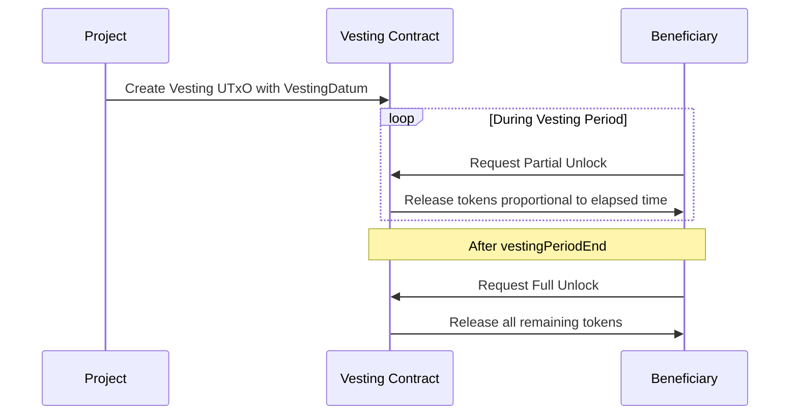

## Introduction

Linear Vesting contract aims at providing a reliable mechanism for releasing Cardano Native Tokens gradually over a specified timeframe, with customization options to fit different requirements.

With so many projects launching on Cardano, many a times, there arises a requirement of vesting a project's own tokens to either their core team or supporters of the project. Vesting assets to beneficiary in proportion to the elapsed time, i.e. Linear Vesting is a very straightforward and common preference. While there definitely exist more complex vesting requirements, we hope that the contract here will help those looking for something simple for their use case. Or serve as a reference for those who want to build more elaborate arrangements.

:::info
The source code for these dApps can be found [here](https://github.com/Anastasia-Labs/linear-vesting).
:::

## Key Features

### Script

```hs
pvalidateVestingScript :: Term s (PVestingDatum :--> PVestingRedeemer :--> PScriptContext :--> PUnit)
```

The linear vesting validator is not a parameterized one. All its customization needs are fulfilled by the datum (`VestingDatum`) of the locked UTxO.

### VestingDatum

This data structure holds the details of the vesting arrangement, including the beneficiary's address, the asset class of the tokens being vested, the total quantity of tokens, the start and end of the vesting period, the earliest point at which tokens can be unlocked, and the total number of installments.

```rust
data VestingDatum = VestingDatum
  { beneficiary :: Address
  , vestingAsset :: AssetClass
  , totalVestingQty :: Integer
  , vestingPeriodStart :: Integer
  , vestingPeriodEnd :: Integer
  , firstUnlockPossibleAfter :: Integer
  , totalInstallments :: Integer
  }
```

### VestingRedeemer

A single UTxO at the validator address corresponds to a single vesting arrangement. There can be multiple such UTxOs present there to facilitate multiple vestings. A single vesting UTxO can however only release tokens of a single Fungible Token, specified by `vestingAsset` field.

After `firstUnlockPossibleAfter` and before `vestingPeriodEnd`, beneficiary can claim the vested asset in proportion to the time that has passed after `vestingPeriodStart`. The remaining assets needs to be sent back to the validator address with the original datum intact otherwise the validation will fail. This spending tx requires `PartialUnlock` redeemer.

```rust
data VestingRedeemer
  = PartialUnlock
  | FullUnlock
```

After the `vestingPeriodEnd`, beneficiary can claim the entire remaining balance at the UTxO using `FullUnlock` redeemer.



:::warning
An important thing to note about the validator is that it only allows one script input to be spent in a single tx. Allowing more than one script input to be spent within it, could result in a critical vulnerability in the form of [Double Satisfaction Attack](https://plutus.readthedocs.io/en/latest/reference/writing-scripts/common-weaknesses/double-satisfaction.html?highlight=double#unique-outputs) by spending two vesting UTxOs with the exact datum.
:::

## Offchain Implementation

You can find the entire offchain implementation complimenting this dApp [here](https://github.com/Anastasia-Labs/linear-vesting-offchain).
