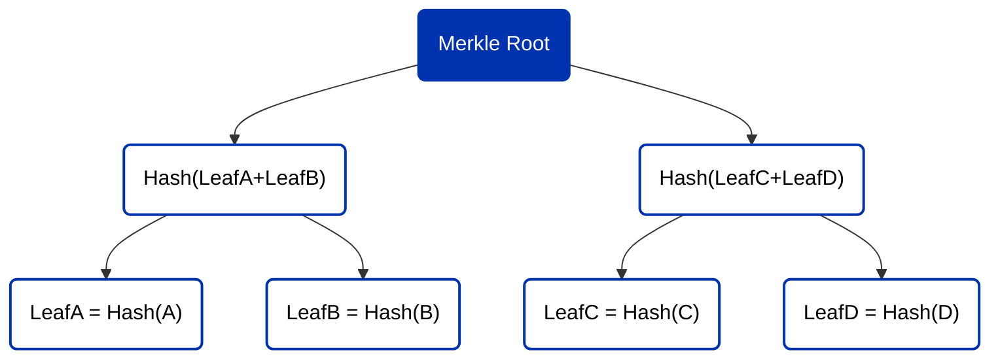

## Introduction

Welcome to the definitive guide on leveraging Plutarch Merkle Trees within the Cardano smart contract ecosystem. This comprehensive documentation is designed to equip developers with the knowledge and tools necessary to integrate the robust and efficient data structure of Merkle Trees into their decentralized applications (DApps) using Plutarch, thereby enhancing data integrity and verification processes.

Merkle Trees are a cornerstone of cryptographic and computer science, offering a secure and efficient method to summarize and verify large datasets. Named after Ralph Merkle, this data structure is particularly beneficial in distributed systems like blockchains for its ability to ensure data integrity through cryptographic hashes.

:::info
The source code for these dApps can be found [here](https://github.com/Anastasia-Labs/plutarch-merkle-tree).
:::

### Basic concept

A Merkle tree is a type of binary tree, consisting of nodes. Here's how it's structured:

- **Leaf Nodes**: These are the bottom-most nodes in the tree and contain hashed data. The data could be transactions (as in blockchain), files, or any data chunks.
- **Non-Leaf (Intermediate) Nodes**: These nodes store a cryptographic hash of the combined data of their child nodes.
- **Root Node**: The single node at the top of the tree contains a hash formed by its child nodes, ultimately representing the hashes of all lower levels.
- **Hash Function**: A critical component, usually a cryptographic hash function like SHA-256, that transforms input data into a fixed-size, unique hash.

### Construction

- **Hashing the Data**: First, each piece of data at the leaf level is hashed.

- **Pairing and Hashing Upwards**: These hashes are then paired and concatenated, and the resultant string is hashed again. This process continues until you reach the single hash at the top - the root hash.

- **Tree Structure**: This process creates a tree-like structure where each parent node is a hash of its children, providing a secure and efficient means of verifying the contents of the tree.

### Features

- **Efficiency in Verification**: To verify any single data chunk's integrity, you don't need to download the entire tree. You only need the hashes of the nodes along the path from your data chunk to the root.

- **Tamper-Proof**: Any change in a leaf node (data) will result in a completely different root hash through a cascading effect of changes in the intermediate hashes. This makes it easy to detect alterations.

- **Concurrency Friendly**: Multiple branches of the tree can be processed simultaneously, making Merkle trees highly efficient for parallel processing.

### Example

Consider a Merkle tree with four leaf nodes (A, B, C, D).



1. Each of A, B, C, and D is hashed: Hash(A), Hash(B), Hash(C), Hash(D).
2. The hashes of A and B are combined and hashed: Hash(Hash(A) + Hash(B)). Similarly for C and D.
3. The hash results from step 2 are combined and hashed to give the Merkle root.

The Merkle root is a digest of all the data in the leaf nodes.

## Plutarch Merkle Tree implementation

### Prerequisites

Before leveraging the Plutarch Merkle Tree library, ensure you're equipped with:

- Basic understanding of Haskell and Plutus.

- Cardano node and Plutus development environment setup.

- Familiarity with Plutarch, an extension of Plutus, designed for more efficient on-chain code.

### Installation

To integrate the Plutarch Merkle Tree library into your project, start by creating a `cabal.project` file, as this file is not automatically generated during the cabal init process. Then, proceed by including the following:

```filename="cabal.project"
source-repository-package
  type: git
  location: git://github.com/Anastasia-Labs/plutarch-merkle-tree.git
```

Then in the your `[name of your project].cabal` file include the repository under the build-depends section

```filename="[name of your project].cabal" {3}
build-depends:
    base ^>= 4.11.1.0
  , plutarch-merkle-tree
```

### Functions

The Plutarch Merkle Tree implementation provides several functions to create and manipulate Merkle Trees. Below is a brief overview of each function:

-`fromList`: Constructs a Merkle Tree from a list of serialized data.

```haskell
fromList :: [BuiltinByteString] -> MerkleTree
```

- Input: A list of serialized data elements, each as a BuiltinByteString.
- Output: A MerkleTree constructed from the input list. Each element in the list becomes a leaf in the Merkle Tree.
- Description: This function constructs a Merkle Tree from a given list of byte strings. It's efficient for bulk initialization but can be computationally expensive, especially on-chain.

-`toList`: Deconstructs a Merkle Tree back into a list of elements.

```rust
toList :: MerkleTree -> [BuiltinByteString]
```

- Input: A MerkleTree.
- Output: A list of BuiltinByteString elements extracted from the Merkle Tree.
- Description: Deconstructs a Merkle Tree back into its constituent byte strings, effectively reversing the fromList operation.

-`rootHash`: Retrieves the root hash of a Merkle Tree.

```rust
rootHash :: MerkleTree -> Hash
```

- Input: A MerkleTree.
- Output: The Hash at the root of the Merkle Tree.
- Description: Retrieves the root hash of the Merkle Tree, which represents the combined hash of all elements in the tree.

-`isNull`: Checks if a Merkle Tree is empty.

```rust
isNull :: MerkleTree -> Bool
```

- Input: A MerkleTree.
- Output: A Boolean value; True if the tree is empty, otherwise False.
- Description: Checks whether the Merkle Tree is empty, i.e., it doesn't contain any nodes.

-`size`: Returns the number of leaf nodes in a Merkle Tree.

```rust
size :: MerkleTree -> Integer
```

- Input: A MerkleTree.
- Output: An Integer representing the number of leaf nodes in the Merkle Tree.
- Description: Returns the total count of leaf nodes in the Merkle Tree, which corresponds to the number of elements it contains.

-`mkProof`: Generates a proof of membership for an element in the Merkle Tree.

```rust
mkProof :: BuiltinByteString -> MerkleTree -> Maybe Proof
```

- Input: A BuiltinByteString representing the element for which to generate a proof, and a MerkleTree.
- Output: A Maybe Proof, which is Just Proof if the element is in the tree, otherwise Nothing.
- Description: Generates a membership proof for an element in the Merkle Tree. The proof can be used to verify the element's inclusion in the tree without needing the entire tree.

-`member`: Verifies if an element is part of a Merkle Tree using a proof.

```rust
member :: BuiltinByteString -> Hash -> Proof -> Bool
```

- Input: A BuiltinByteString representing the element to check, a Hash representing the root hash of the Merkle Tree, and a Proof.
- Output: A Boolean value; True if the proof verifies the element's inclusion in the tree, otherwise False.
- Description: Verifies whether an element is part of a Merkle Tree using the tree's root hash and a proof of membership. This function allows for efficient verification with minimal data.

-`hash`: Computes a SHA-256 hash of a given byte string.

```rust
hash :: BuiltinByteString -> Hash
```

- Input: A BuiltinByteString representing the data to hash.
- Output: A Hash which is the SHA-256 hash of the input data.
- Description: Computes a SHA-256 hash of the input byte string. This is a fundamental operation in building and verifying Merkle Trees.

-`combineHash`: Combines two hashes into a new one.

```rust
combineHash :: Hash -> Hash -> Hash
```

- Input: Two Hash values representing the hashes to combine.
- Output: A new Hash derived from combining the input hashes.
- Description: Combines two hash values into a single new hash. This operation is used internally to construct non-leaf nodes in the Merkle Tree.

-`addLeaf`: Adds a new leaf to the Merkle Tree.

```rust
addLeaf :: BuiltinByteString -> MerkleTree -> MerkleTree
```

- Input: A BuiltinByteString representing the new data to add as a leaf, and the MerkleTree to which the leaf will be added.
- Output: A new MerkleTree that includes the added leaf.
- Description: Adds a new leaf to the Merkle Tree. This operation allows for dynamic expansion of the tree by adding new elements.

### Utilizing Plutarch Merkle Trees

#### Step 1: Constructing a Merkle Tree

Begin by creating a Merkle Tree from your dataset. This is achieved using the fromList function, which takes a list of data items (typically strings or bytes) and organizes them into a Merkle Tree structure:

```rust
import Plutus.MerkleTree (fromList)

myData :: [String]
myData = ["data1", "data2", "data3", "data4"]

myMerkleTree = fromList myData
```

#### Step 2: Generating Merkle Proofs

To verify an item's presence within the tree, generate a cryptographic proof with mkProof. This proof is essential for the verification process:

```rust
import Plutus.MerkleTree (mkProof)
import Data.Maybe (fromJust)

myProof = fromJust $ mkProof "data1" myMerkleTree
```

:::warning
Caution: Ensure the item exists within the tree before using fromJust to avoid runtime errors.
:::

#### Step 3: Verifying Data Integrity

With the proof in hand, you can assert the item's presence using the member function. This involves checking the item against the tree's root hash:

```rust
import Plutus.MerkleTree (member, rootHash)

isValid = member "data1" (rootHash myMerkleTree) myProof
```

#### Step 4: Plutarch Integration

Transitioning to on-chain validation with Plutarch involves converting data and proofs to Plutarch-compatible types and utilizing pmember for verification:

```rust
import Plutarch.MerkleTree (pmember)
import Plutarch (pconstant, pdata, (#$), (#))

pmyProof = pdata $ pconstant myProof

pIsValid = pmember # pdata (pconstant "data1") # pdata (pconstant $ rootHash myMerkleTree) # pmyProof
```

### Best Practices and Considerations

- **Data Pre-Hashing**: Maintain data confidentiality and integrity by pre-hashing data before tree insertion.

- **Optimization**: Balance the tree's depth and breadth to optimize verification speed and minimize on-chain costs.

- **Robust Error Handling**: Implement comprehensive error handling, especially for proof generation, to enhance contract reliability.
