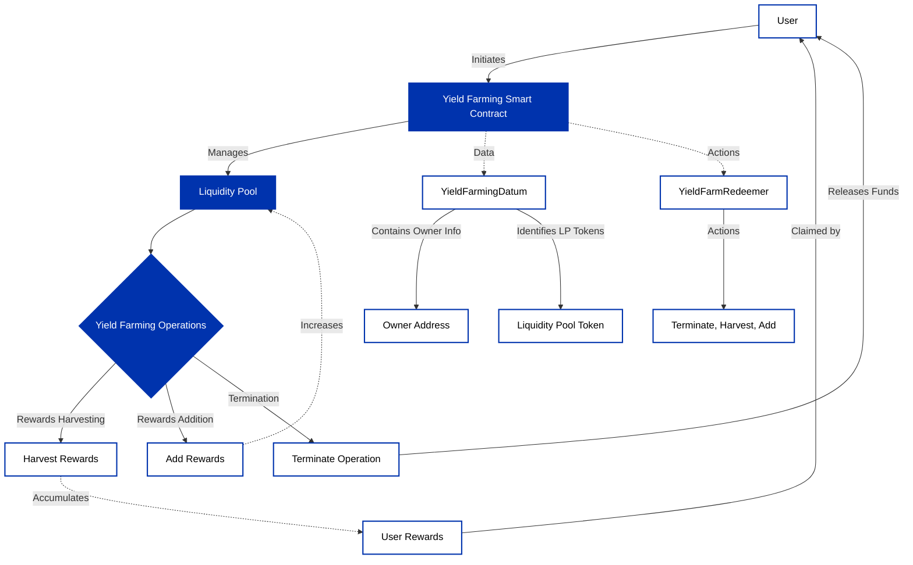

## Introduction

Yield farming is a financial strategy in the world of decentralized finance (DeFi) that allows cryptocurrency holders to earn passive income through their assets. This guide will provide you with an understanding of yield farming and its implementation.

:::info
The source code for these dApps can be found [here](https://github.com/Anastasia-Labs/yieldfarming).
:::

## Understanding Yield Farming

At its core, yield farming is about maximizing returns. Users, known as liquidity providers (LPs), lend their assets to DeFi protocols and earn rewards in return. These rewards can be in the form of transaction fees or new tokens, and they often yield attractive annual percentage rates (APR) or annual percentage yields (APY).

## Core Concepts of Yield Farming

### Decentralized Finance (DeFi)

- **Definition**: DeFi is a blockchain-based form of finance that does not rely on central financial intermediaries. Instead, it utilizes smart contracts on blockchains.

- **Goal**: To recreate and improve upon traditional financial systems in a decentralized and open-access manner.
  Liquidity Provision

- **LPs Role**: Liquidity providers contribute their assets to liquidity pools.

- **Purpose**: These pools facilitate a marketplace for lending, borrowing, or exchanging tokens.

- **Rewards**: LPs earn fees or additional tokens in exchange for their services.

### Smart Contracts and Liquidity Pools

- **Smart Contracts**: These are automated, self-enforcing contracts with the terms directly written into code.

- **Liquidity Pools**: Collections of funds locked in smart contracts, contributing to the market's liquidity.

### Staking and Pooling

- **Staking**: Depositing tokens into a pool to receive liquidity tokens or proof of stake.

- **Pooling**: Participation in a collective fund used for trading on the platform, contributing to market efficiency.

### Risks and Considerations

While yield farming on Cardano can be rewarding, it's important to understand the associated risks:

- **Smart Contract Risk**: The reliance on smart contracts means that any bugs can lead to the loss of staked assets.

- **Impermanent Loss**: The volatility of the cryptocurrency market can affect the value of staked assets, leading to potential losses.

- **Market Risk**: Fluctuations in market prices can significantly impact the expected returns from yield farming.

## Yield Farming Implementation on Cardano

### Functionalities of the Yield Farming Module

- `pvalidateYieldFarmW`:

The wrapper function that serves as the validator for yield farming operations. It ensures that all yield farming actions are compliant with the smart contract's rules.

- `pterminateYieldFarming`:

This function allows for the termination of yield farming activities, ensuring that users can cease operations securely and retrieve their staked assets.

- `paddYieldFarmRewards`:

Adds more rewards to the yield farming pool.

### Data Types

- `YieldFarmingDatum`

```rust
data YieldFarmingDatum = YieldFarmingDatum
  { owner :: Address
  , lpCS :: CurrencySymbol
  , lpTN :: TokenName
  }
```

A data type that encapsulates the information related to a yield farming operation, including the owner's address and the liquidity pool's currency symbol and token name.

- `YieldFarmRedeemer`:

```rust
data YieldFarmRedeemer
  = Terminate
  | HarvestRewards {ownIndex :: Integer}
  | AddRewards {ownIndex :: Integer, authIndex :: Integer}
```

Represents the actions that can be taken within a yield farming smart contract, such as terminating the farming operation, harvesting rewards, or adding rewards.


