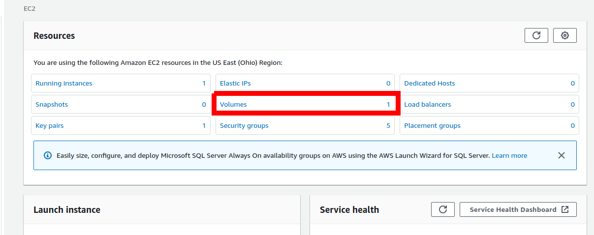
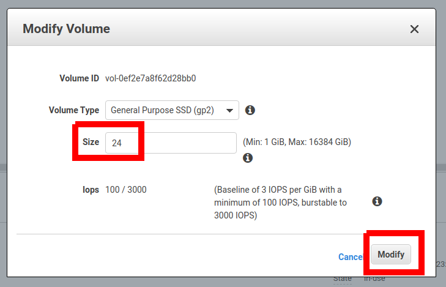
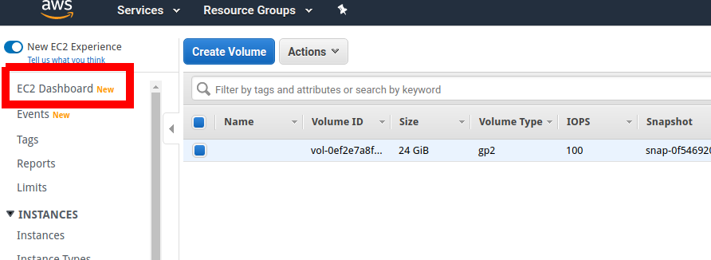
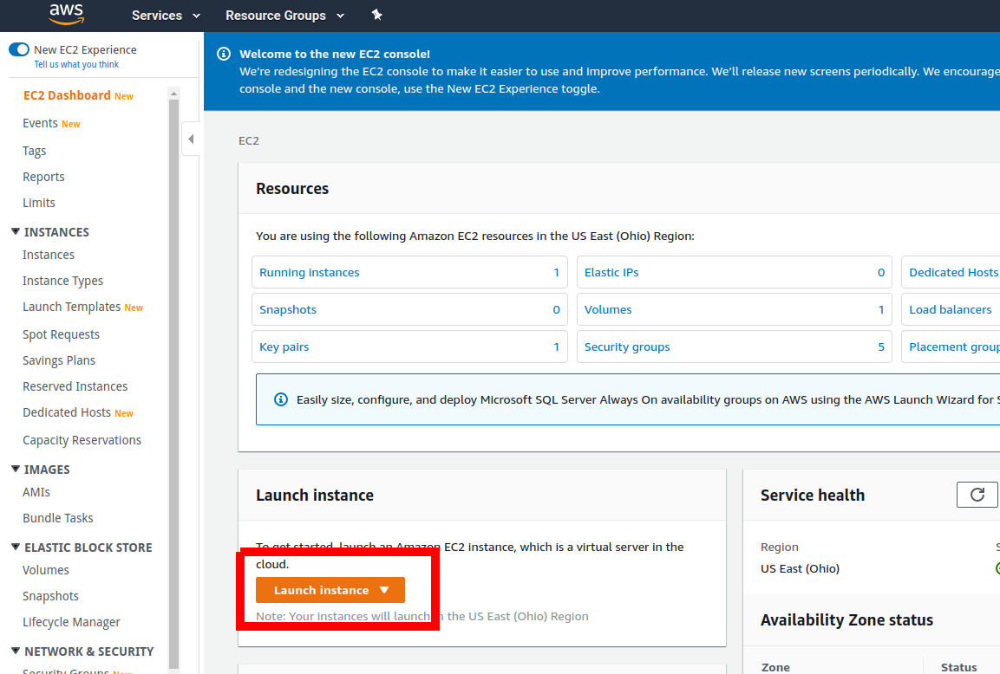
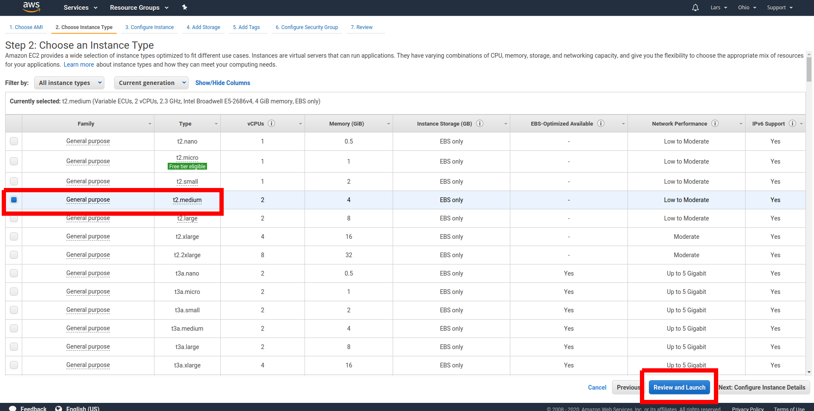
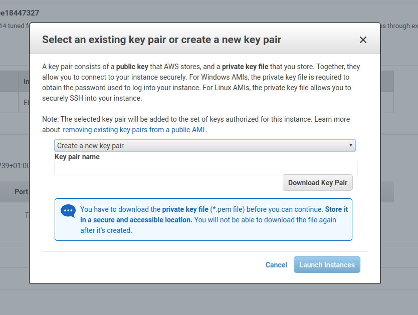
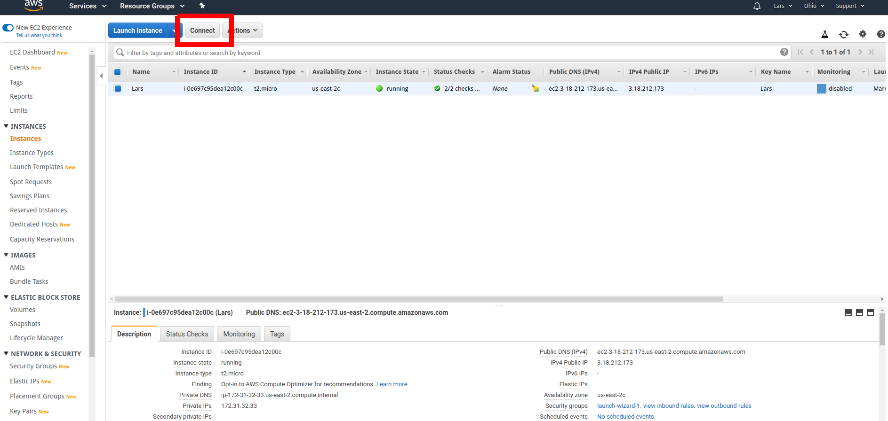
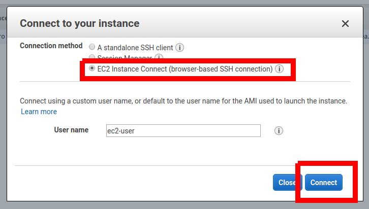

---
id: setup-a-server-on-aws-written
title: Setup a Linux server on AWS
sidebar_label: Setup a Linux server on AWS
description: "Stake pool course: Learn how to setup Linux server on AWS."
image: ../img/og/og-developer-portal.png
--- 

If you do not have access to a computer running Linux \(or VirtualBox\), you can use Amazon Web Services \(AWS\) to create a cloud-based virtual machine running Linux for free. To do so, please follow the steps below:

* Go to [Amazon Web Services \(AWS\)](https://aws.amazon.com/) and create a \(free\) account if you do not have one already.
* Go to the _AWS Management Console_.
* Go to the _EC2 Dashboard_.

* If you already have a running instance, go to step 9.
* We must first make sure to get enough harddrive space \(at least 24GB\). Click on _Volumes_.

* Under _Actions_, select _Modify Volume_.

* In the _Modify Volume_ dialog, select a size of 24 and click _Modify_, then confirm in the next dialog.

* Go back to the _EC2 Dashboard_.

* Go to _Launch Instance_.

* As Amazon Machine Image, choose _Amazon Linux 2 \(HVM\), SSD Volume Type_, 64-bit \(x86\).

* As Instance Type, choose _t2.medium_, then click _Review and Launch_ and finally _Launch_ on the next screen.

* Create a key pair \(or use an existing one\).

* _Connect_ to your instance.

* You can use the _EC2 Instance Connect_ connection method.

Congratulations! You have now access to a machine running Linux.

:::tip questions or suggestions?

If you have any questions and suggestions while taking the lessons please feel free to [ask in the Cardano forum](https://forum.cardano.org/c/staking-delegation/setup-a-stake-pool/158) and we will respond as soon as possible. 

:::