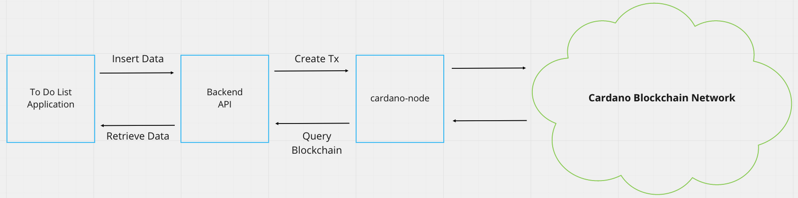

import Tabs from '@theme/Tabs';
import TabItem from '@theme/TabItem';

:::note
This guide assumes that you have a basic understanding of `cardano-wallet` and `cardano-cli`, how to use it and that you have installed it into your system. Otherwise, we recommend reading [Installing cardano-node](docs/get-started/cardano-node/installing-cardano-node.md), [Running cardano-node](docs/get-started/cardano-node/running-cardano.md), and [Exploring Cardano Wallets](../integrate-cardano/creating-wallet-faucet) guides first.

This guide also assumes that you have `cardano-node` and `cardano-wallet` running in the background and connected to one of the `testnet` networks.
:::

## Overview 

This article will explore how we can utilize the **Transaction Metadata** feature of the **Cardano** blockchain. More specifically, how we can insert and retrieve metadata that we have stored in the blockchain for a decentralized application using **Transaction Metadata**.

## Use case

Let's imagine a decentralized **To-Do List Application** that stores and retrieve its metadata not from centralized servers or storage but instead from the **Cardano blockchain**. First, let's check the diagram below to see how something like this could theoretically work:



:::important
The diagram is heavily simplified and is not recommended to deploy in production.
:::

Here, we see a **front-end** application the user interacts with and is responsible for inserting and retrieving the metadata to/from the **back-end** server. The **back-end** server is responsible for communicating to the `cardano-node` by creating **transactions** and querying the blockchain for the **metadata** information required by the **front-end**.

The **front-end** application is not necessarily tied to the specific **back-end** API and could switch to another API as long as it ultimately communicates to the **Cardano** network.

How do you actually create **transaction metadata** in the **Cardano** blockchain, you ask? We'll let's get our hands dirty!

## Setup

To create a transaction metadata using the `cardano-cli`, you must first create a **payment key-pair** and a **wallet address** if you haven't already.

** Create Payment Keys **

```bash
cardano-cli address key-gen \
--verification-key-file payment.vkey \
--signing-key-file payment.skey
```

** Create Wallet Address **

```bash
cardano-cli address build \
--payment-verification-key-file payment.vkey \
--out-file payment.addr \
--testnet-magic 1097911063
```

Now that you have a **wallet address**, you can now request some `tAda` funds from the [Testnet Faucet](../../docs/integrate-cardano/testnet-faucet). 

Once you have some funds, we can now create the sample metadata that we want to store into the blockchain.

We start by creating a `metadata.json` file with the following content:

```json
{
    "1337": {
        "name": "hello world",
        "completed": 0
    }
}
```

:::note

Based on our theoretical **To-Do List** application, this `JSON` shape could be a way to insert / update entries into our list. We choose an arbitrary number (`1337`) as the key; we are basically saying that all metadata that will be inserted with that key is related to the **To-Do List** application data. Although we don't have control over what will be inserted with that metadata key since **Cardano** is an open platform.

:::

Now that we have our `JSON` data, we can create a transaction and embed the metadata into the transaction. Ultimately storing it into the **Cardano** blockchain forever.

## Query UTXO

The next step is to query the available **UTXO** from our **wallet address**:

```bash
cardano-cli query utxo --testnet-magic 1097911063 --address $(cat payment.addr)
```

You should see something like this:

```
                           TxHash                                 TxIx        Amount
--------------------------------------------------------------------------------------
dfb99f8f103e56a856e04e087255dbaf402f3801acb71a6baf423a1054d3ccd5     0        1749651926 lovelace
```

Here we can see that our **wallet address** contains some spendable `lovelace` with the `TxHash: dfb99f8f103e56a856e04e087255dbaf402f3801acb71a6baf423a1054d3ccd5` and `TxIndex: 0`. We can then use it to pay for the transaction fee when we store our data on the blockchain.

## Submit to blockchain

Next, we create a draft transaction with the metadata embedded into it using the `TxHash` and `TxIndex` result from our last query.

```bash {2}
cardano-cli transaction build-raw \
--tx-in dfb99f8f103e56a856e04e087255dbaf402f3801acb71a6baf423a1054d3ccd5#0 \
--tx-out $(cat payment.addr)+0 \
--metadata-json-file metadata.json \
--fee 0 \
--out-file tx.draft
```

Then we calculate the transaction fee like so:

```bash
cardano-cli transaction calculate-min-fee \
--tx-body-file tx.draft \
--tx-in-count 1 \
--tx-out-count 1 \
--witness-count 1 \
--byron-witness-count 0 \
--testnet-magic 1097911063 \
--protocol-params-file protocol.json
```

You should see something like this:

```bash
171793 Lovelace
```

With that, We build the final transaction with the total amount of our wallet minus the calculated fee as the total output amount. `1749651926 - 171793 = 1749480133`

```bash {3}
cardano-cli transaction build-raw \
--tx-in dfb99f8f103e56a856e04e087255dbaf402f3801acb71a6baf423a1054d3ccd5#0 \
--tx-out $(cat payment.addr)+1749480133 \
--metadata-json-file metadata.json \
--fee 171793 \
--out-file tx.draft
```

We then sign the transaction using our **payment signing key**:

```bash
cardano-cli transaction sign \             
--tx-body-file tx.draft \
--signing-key-file payment.skey \
--testnet-magic 1097911063 \
--out-file tx.signed 
```

Finally, we submit the signed transaction to the blockchain:


```bash
cardano-cli transaction submit \
--tx-file tx.signed \    
--testnet-magic 1097911063
```

Congratulations, you are now able to submit **Cardano** transactions with metadata embedded into them. 🎉🎉🎉

Up next, we discuss how to retrieve metadata that we have stored in the **Cardano** blockchain. **@TODO**
